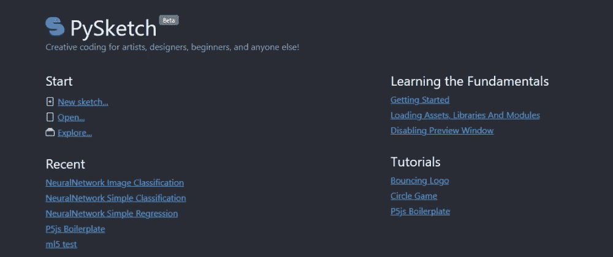
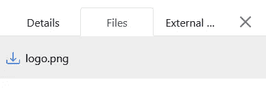

# PySketch 初看:有趣的 Python！

> 原文：<https://betterprogramming.pub/pysketch-python-coding-for-fun-dc13732db502>

## 艺术家、设计师、初学者和其他人的创造性编码



[PySketch.com](https://pysketch.com)是一个 Python web 编辑器，旨在为任何喜欢创造性编码的人提供社交编码体验。您可以通过访问 HTML5 和 JavaScript 库来构建有趣的项目、游戏和图形，或者探索其他优秀开发人员的其他 Python 项目，从而在 web 上提高或展示您的 Python 技能。它可以在所有主要的移动和桌面浏览器上运行，你可以和你的朋友分享你的项目和游戏，或者把它们嵌入到你的博客中给你的读者。

如果你是一个 Python 爱好者，你会感觉像在家里一样，享受 pysketch 的所有 HTML5 特性。

查看 pysketch 中著名的 flappy bird 游戏:

[](https://pysketch.com/flappy-bird) [## 拍打鸟

### 经典的 Flappy 鸟游戏。

pysketch.com](https://pysketch.com/flappy-bird) 

# **入门:弹跳 Logo**

我们将通过做一个覆盖要点的跳跃标志草图来学习基础知识。这是最著名的屏幕保护程序，在这里开发它会很有趣。这是最终的草图，请随意使用代码:

[](https://pysketch.com/bouncing-logo) [## 弹跳标志

### 弹跳标志动画。

pysketch.com](https://pysketch.com/bouncing-logo) 

让我们仔细看看代码:

```
from browser import document, window
from browser.html import CANVAS, IMG
from random import randint
```

`*Document*`和`*window*`模块等同于它们的 JavaScript 版本。这些用于访问 JavaScript 属性、全局变量等。
`browser.html`是一个 HTML 标签的包装器模块。它允许我们在 Python 中轻松地创建和操作 dom 元素。对于所有其他标签和示例，请检查此处的。

## **Dom API**

```
canvas = CANVAS(width=width, height=height)
document.body <= canvasctx = canvas.getContext(‘2d’)
```

这里，我们创建一个 canvas 元素，并将其添加到 HTML 页面的主体中。`**ctx**`是我们进行绘图操作的画布的上下文。我们不会详细讨论 canvas API，但是你可以在这里得到更多信息。

## **加载资产**

文件是异步加载的，这意味着图像在下一行不可用，需要一些时间来加载。所以我们在这里设置了一个`onload`回调。一旦加载了徽标，我们的应用程序将开始循环。我们稍后将讨论循环部分。

```
logo = IMG(src ='logo.png')
logo.onload = lambda e: loop(0)
```

PySketch 为能够在草图中使用的资产提供云托管。转到草图详细信息->文件选项卡，并为您的草图上传您的资产。

草图资源可以通过它们的文件名来加载，如上面的代码片段所示。



## **绘图功能**

```
def draw():
   global x, y, x_speed, y_speed
   … does calculations here
   ctx.drawImage(logo, x, y)
```

这是我们绘制和更新里面东西的主要函数。它通过考虑速度来计算新位置，并在画布上下文中呈现徽标。请阅读对最终草图的在线评论，以了解在上下文中绘图的想法。

## **主循环**

```
def loop(t):
   draw()
   window.requestAnimationFrame(loop)
```

这是大多数图形应用的核心。它指的是程序的整体流程，并保持无限循环，直到手动停止。浏览器内置了`[**requestAnimationFrame**](https://developer.mozilla.org/en-US/docs/Web/API/window/requestAnimationFrame)`功能。它的目的是在浏览器上运行流畅的动画，而不会阻塞页面。

## **浏览器是如何运行 Python 的？**

几个令人印象深刻的项目将 Python 带入浏览器，比如 [Brython](https://brython.info) 、 [Transcrypt](https://transcrypt.org/) 、 [Skulpt](https://skulpt.org/) 、 [Pyodide](https://github.com/iodide-project/pyodide) 。PySketch 使用 Brython 在浏览器中将 Python 编译成 JavaScript。如果你想了解更多，你可以看看这篇关于技术和比较的文章。

# **结论**

我们看到了如何使用 PySketch 在浏览器中直接实现基于 Python 的应用程序。如果你熟悉 JavaScript 和 web 开发，你会喜欢用 Python 开发应用和游戏。

毫无疑问，在速度、可用性和可维护性方面，JavaScript 是不可替代的，但很高兴知道还有其他方式来享受 HTML5。

如需更多示例和教程，请访问[pysketch.com](https://pysketch.com)