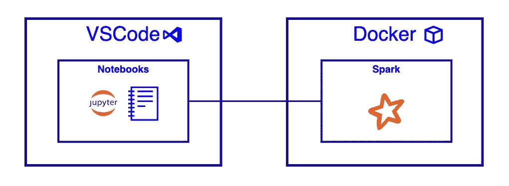
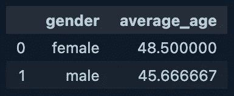

# PySpark 开发变得简单

> 原文：<https://betterprogramming.pub/pyspark-development-made-simple-9449a893ab17>

## 使用 VS 代码、Jupyter 笔记本和 Docker

作者图片

几周前，我在寻找一个描述如何在 Mac 上用 Jupyter 笔记本和 PySpark 使用 VS 代码的教程的圣杯。令人惊讶的是，我什么也没找到。好吧，没有一个通过了我的“像我五岁一样解释”测试。

这篇文章是一个痛苦的周六下午的成果。

# 阻力最小的路径:回复救援

这些天来，我几乎没有时间玩新技术。当我这么做的时候，我希望它尽可能的没有痛苦。最重要的是，我希望它是有趣的——否则，何苦呢？

此外，没有什么比浪费您的空闲时间来配置开发环境更糟糕的了。只是很痛苦。

## Jupyter 笔记本 VS 代码

我是快速开发的复制器的忠实粉丝——例如，评估一个新的框架，分析数据，数据修复，等等。

在这些情况下，我不想配置一个新的项目，并陷入琐碎的设置复杂性。我只需要一个便笺簿来研究出一些代码。

Jupyter Notebooks 是一个位于 REPL 的系统，旨在对数据进行分析、可视化和协作。他们也是伟大的便签簿。

## 什么是 REPL？

> 读取-评估-打印循环(REPL)，也称为交互式顶层或语言外壳，是一个简单的交互式[计算机编程](https://en.wikipedia.org/wiki/Computer_programming)环境，接受单个用户输入，执行它们，并将结果返回给用户；在 REPL 环境中编写的程序是分段执行的。
> [维基百科](https://en.wikipedia.org/wiki/Read%E2%80%93eval%E2%80%93print_loop)

Visual Studio 代码对[笔记本](https://code.visualstudio.com/blogs/2021/11/08/custom-notebooks)有原生支持，包括 Jupyter。

# 设置

## 先决条件

*   安装 Docker
    *如果你使用的是 Mac，由于许可限制无法安装 Docker Desktop，请查看*[*Colima*](https://github.com/abiosoft/colima)*。*
*   安装 VS 代码

## VS 代码开发容器

1.  为您的项目创建新目录。
2.  使用下面的代码在项目目录的根目录下创建一个 Docker 文件。在撰写本文时，当前的 PySpark 版本是 3.3.0。我会检查这里的[以确保您使用的是最新版本。](https://pypi.org/project/pyspark/)

3.创建名为`.devcontainer`的目录。

4.在`.devcontainer`目录中，添加以下 JSON 配置。

5.在 VS 代码的左下角，点击打开远程窗口按钮→在容器中打开。

*点击* [*此处*](https://code.visualstudio.com/docs/remote/remote-overview) *了解更多关于 VS 代码内远程开发的信息。*

VS 代码将重新启动 IDE 并连接到 VS 代码开发容器——从步骤 2 中定义的 Docker 映像实例化。

这就是设置。

# 开发您的第一个 PySpark 应用程序

## 创建笔记本

1.  在项目目录中创建一个扩展名为. ipynb 的新文件。
2.  打开文件——您应该会看到 VS 代码笔记本体验。

## 测试数据

1.  在根目录中，添加一个名为 data 的新文件夹。
2.  在数据目录中，创建一个名为`users.csv`的新 CSV 文件，并添加以下数据:

## 示例:火花应用

本节假设您已经安装了 Docker，配置了 VS 代码开发容器，并创建了一个空笔记本。

好吧，让我们一个细胞一个细胞地分解。

1.  导入库:第一个单元格导入 PySpark 和 Pandas Python 库。
2.  连接到 Spark:第二个单元格是我们定义连接到 Spark 的地方。因为我们是在本地模式下运行，所以不需要担心连接字符串。
3.  将 CSV 读入一个临时视图:在第三个单元中，我们将一个 CSV 文件从本地文件系统读入 Spark——CSV 包含测试数据。
    第二步创建一个名为‘users’的临时视图——这允许我们使用普通的旧 SQL 查询该表。
4.  查询:在最后一个单元格中，我们定义了一个 SQL 查询，它将按性别返回所有用户的平均年龄。函数调用 toPandas()，将 Spark 数据帧转换为 Panda 的数据帧——允许我们使用 VS Code 的数据帧渲染。

5.单击顶部的全部运行，执行笔记本中的所有单元格。如果可以的话，您应该会看到一个两行的数据帧——如上图所示。

# 最后的想法

在 Jupyter 笔记本和 Docker 上使用 Visual Studio 代码是开始使用 PySpark 的简单方法。

如果你有任何改进上述开发工作流程的建议，请在评论中告诉我。

我希望你觉得这很有趣。

山药山药建筑师。

如果你喜欢阅读这样的故事，并想支持我成为一名作家，可以考虑[注册成为一名媒体会员](https://medium.com/@yam-yam-architect/membership)。每月 5 美元，你可以无限制地阅读媒体上的故事。如果你用我的链接注册，我会赚一点佣金。

 [## 通过我的推荐链接加入 Medium-yam yam architect

### 阅读 yam yam architect(以及媒体上成千上万的其他作者)的每一个故事。您的会员费直接…

medium.com](https://medium.com/@yam-yam-architect/membership)