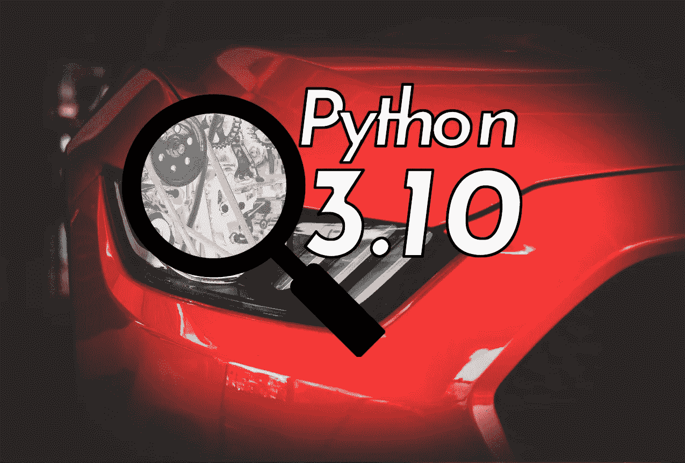
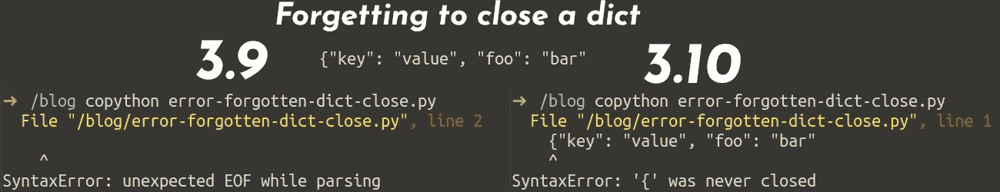
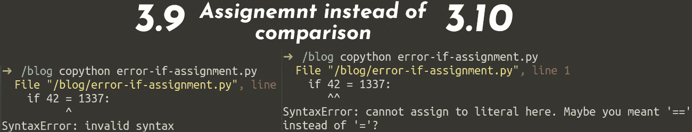

# Python 3.10 发布。知道什么是新的，是否值得更换

> 原文：<https://betterprogramming.pub/python-3-10-is-released-know-whats-new-and-if-it-s-worth-the-switch-19c7a5738f7c>

## 类型注释、结构模式匹配、更好的错误消息和性能方面的改进



照片由来自 pexels 的 Vraj Shah [和来自 pexels](https://www.pexels.com/de-de/foto/rotes-autokopflicht-638479/) 的 Mike [拍摄，由 Martin Thoma 编辑](https://www.pexels.com/de-de/foto/graustufenfotografie-des-automotors-190574/)

Python 3.10 [根据](https://www.python.org/downloads/release/python-3100/) [PEP 619](https://www.python.org/dev/peps/pep-0619/) 于 2021 年 10 月 4 日发布。让我们看看等待我们的是什么。

# 键入注释

我绝对喜欢类型注释。从 Python 3.6 开始，它们超级有用。如果你还没有使用它们，我强烈推荐你阅读我的介绍。

Python 3.10 又对它们进行了改进！让我们看看如何

## TypeGuards:条件类型收缩

PEP 647 引入了一个新的 TypeGuard 注释。它是通过 [typing_extensions](https://pypi.org/project/typing-extensions/) 反向移植的。

```
from typing_extensions import TypeGuard  # Before Python 3.10
from typing import TypeGuard             # With Python 3.10
```

如果没有 TypeGuards，您不会发现这有什么问题:

但是有了 TypeGuard，你可以看到:

```
typeguard.py:17: error: TypedDict "User" has no key "x"Found 1 error in 1 file (checked 1 source file)
```

整洁！现在你可以去掉几个`cast`和`assert`电话或者像`# type: ignore`这样的评论。

## 语法糖:允许将联合类型写成 X | Y ✨

[可读性计数](https://www.python.org/dev/peps/pep-0020/)。文档是我如此喜欢类型注释的原因。 [PEP 604](https://www.python.org/dev/peps/pep-0604/) 允许你使用更简洁、更易读的语法:

## 参数规范变量:装饰者的类型注释

非平凡的装饰者一旦写出来就很难理解。编写类型注释相当困难。 [PEP 612](https://www.python.org/dev/peps/pep-0612/) 介绍`typing.ParamSpec`和`typing.Concatenate`。

PEP 已经为此树立了一个好榜样。假设您编写了一个装饰器`add_logging`，它在被装饰的函数被调用之前执行了`log_to_database`。该函数可以有任何参数—函数的执行不应改变。你会如何诠释？

对于参数规范变量，您可以这样做:

还可以用 decorators 添加或移除参数。现在你可以添加适当的类型了！随便看看 [PEP 612](https://www.python.org/dev/peps/pep-0612/) 。

## 显式类型别名

[PEP 613](https://www.python.org/dev/peps/pep-0613/) 介绍`typing.TypeAlias`。这有助于类型检查器区分创建常数的模块级赋值和实际类型别名:

```
StrCache: TypeAlias = 'Cache[str]'  # a type alias
LOG_PREFIX = 'LOG[DEBUG]'  # a module constant
```

这有助于`mypy`给出更好的错误信息。

# 结构模式匹配

结构模式匹配是这么大的一个新特性，被多个 PEP 覆盖: [PEP 634](https://www.python.org/dev/peps/pep-0634/) (规范) [PEP 635](https://www.python.org/dev/peps/pep-0635/) (原理) [PEP 636](https://www.python.org/dev/peps/pep-0636/) (教程)！

教程中的一个例子很好地解释了这一点:

```
match command.split():
    case ["quit"]:
        print("Goodbye!")
        quit_game()
    case ["look"]:
        current_room.describe()
    case ["get", obj]:
        character.get(obj, current_room)
    case ["go", direction]:
        current_room = current_room.neighbor(direction)
    # The rest of your commands go here
```

如你所见，新的关键词是`match`和`case`。比赛之后的部分才是被评价的。在这种情况下，`command.spit()`返回一个字符串列表。结构模式匹配之前的等效代码是:

```
val : List[str] = command.split()if val == ["quit"]:
    print("Goodbye!")
    quit_game()
elif val == ["look"]:
    current_room.describe()
elif len(val) == 2 and val[0] == "get":
    obj = val[1]
    character.get(obj, current_room)
elif len(val) == 2 and val[0] == "go":
    direction = val[1]
    current_room = current_room.neighbor(direction)
```

如你所见，第一个例子更容易阅读。还有很多其他的例子——我推荐浏览一下[这个教程](https://www.python.org/dev/peps/pep-0636/)！

# 更好的错误消息

Python 3.10 改进了一些错误消息。这里只是两个例子，但还有更多:



我使用了[彩色 Python shell 脚本](https://stackoverflow.com/a/59507107/562769)来突出显示。在终端，我使用 ZSH 和日晒深色主题。

# 表演

比较性能总是很难。这很大程度上取决于你的工作量和你到底对什么感兴趣。一个明显的部分是启动时间。该解释器的启动速度比 Python 3.8 大约快 10%。此外，Django 模板的渲染也改进了不少。

Python 3.10 将比 3.9 和 3.8 更快:

参见[官方速度对比](https://speed.python.org/comparison/)了解所有基准。

# 如何获得 Python 3.10

作为一名开发人员，我喜欢使用`[pyenv](https://github.com/pyenv/pyenv)`来获得我需要的 Python 版本:

```
pyenv install 3.10.0
pyenv local 3.10.0
```

如果您想在生产环境中使用它，您会对 [Docker](https://hub.docker.com/_/python) 感兴趣。基本映像是`3.10`，但是当你在 YAML ⚠️中写这个的时候要小心`3.10`可能会被解释为浮点并被转换为`3.1`。写`"3.10"`在 YAML。并且可能更具体，例如`3.10-slim-bullseye`。

对了: [PyPy 目前在 3.7](https://www.pypy.org/download.html)AWS Lambda 在 3.9 。

# 3.10 之前发生了什么？

很多人还没有使用 Python 3.9。因此，您可能会对 Python 3.9 甚至 Python 3.8 中引入的其他变化感兴趣:

[](https://python.plainenglish.io/killer-features-by-python-version-c84ca12dba8) [## Python 版本的黑仔要素

### 了解当您支持旧的 Python 版本时，您错过了什么:Python 2.7 到 3.5、3.6、3.7、3.8 和 3.9

python .平原英语. io](https://python.plainenglish.io/killer-features-by-python-version-c84ca12dba8) 

# 摘要

Python 3.10 太棒了！它有…

*   大大改进了类型注释
*   结构模式匹配
*   更好的错误消息
*   更好的性能

有关完整列表，请参见[Python 3.10 中的新特性](https://docs.python.org/3.10/whatsnew/3.10.html)。