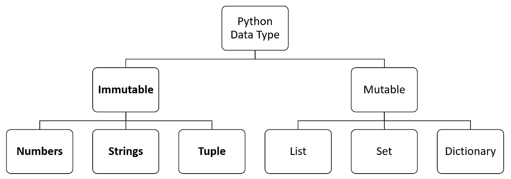

# 蟒蛇:一种喜爱物体的蛇

> 原文：<https://betterprogramming.pub/python-a-snake-that-loves-objects-e3c566a45cf5>

## 面向对象编程中对象的解释


照片由[莎伦·麦卡琴](https://unsplash.com/@sharonmccutcheon?utm_source=unsplash&utm_medium=referral&utm_content=creditCopyText)在 [Unsplash](https://unsplash.com/search/photos/python?utm_source=unsplash&utm_medium=referral&utm_content=creditCopyText) 拍摄

在 Python 中几乎所有的东西都是对象！在这篇文章中，我们将讨论这些物体。

第一，什么是对象？根据 webopedia 的说法，对象是“一个自包含的实体，由数据和操作数据的过程组成”。为了与现实世界的对象进行比较，以咖啡机为例:它有代表数据的材料(即咖啡豆)，它有代表处理数据的程序的功能(即研磨咖啡豆)。变量、类实例、函数、方法和许多其他东西都是 Python 中的对象。

现在让我们深入了解一下 Python 语言是如何将一切都视为对象的。

# id 和类型

Python 中的每个对象都有一个 **id** 、一个**类型**和一个**值**。

一个对象的 id 就是它的身份——它在内存中的地址。根据 [geeksforgeeks](https://www.geeksforgeeks.org/id-function-python/) ，“这个身份在这个对象的生命周期中必须是唯一的和不变的”*。*换句话说，当一个对象被创建时，它得到一个标识，或者内存中的一个地址，而当该对象被删除时，它就失去了这个标识。对于从来没有和低级语言打过交道的程序员来说，这个概念可能很新，但事实是，电脑里的一切都存储在机器内存的某个地方。可以使用函数 *id()* 检索对象的 id。

让我们以一个值为 9 的整数 *a* 为例。

```
>>> a = 9
>>> id(a)
10105344
```

在这种情况下，变量`a`的 id 是`10105344`。当然，这取决于您的机器和 Python 解释器保存变量的位置。

一个对象的类型是，嗯…它的类型。要检查一个对象的类型，我们可以将它传递给 `*type()*`函数。让我们看看我们的`a`变量:

```
>>> type(a)
<class 'int'>
```

这里我们看到函数并没有像预期的那样只是返回`int`，而是`class ‘int’`。在 Python 中，不像 C 或其他编程语言那样有内置的数据类型。类型实际上是类，每个变量都是相应类的一个实例。所以在我们的例子中，`a` 是`int`类的一个实例。

# 可变对象



Python 中有两种主要类型的对象:可变的和不可变的

Python 中的可变对象是可以修改的对象。例如，列表、集合和字典是可变的。让我们看看这意味着什么:

我们创建了第一个 int 列表`l1`，然后将`l1`分配给新列表`l2`。然后我们给`l1`添加了一个元素。现在`l1`应该看起来像`[1, 2, 3, 4]`。但是`l2`呢？当我们打印它时，我们看到它也被更新了，尽管我们在修改`l1`之前将`l1` 赋给了`l2`。我们在第二行做的叫做**混叠**。我们创建了一个名为`l2`的`l1`别名，但是这两个名称指向同一个对象。我们可以通过使用前面提到的`id()`函数或者`is`操作符来验证这一点:

`l1`和`l2`具有相同的身份——它们指向同一个对象。

> **注意:****`is`运算符与`==`运算符不同。前者评估两个名字是否指向内存中的**相同对象**，后者评估它们是否具有**相同值**。**

**如果我们想在不修改原始列表的情况下复制一个列表，我们需要**克隆**它。这可以通过切片方法来实现:**

**克隆成功了，现在`l2`引用了不同于`l1`的对象，因为它们的 id 不同。**

# **不可变对象**

**数字、字符串和元组是 Python 中不可变的对象。这意味着它们不能就地修改。让我们以 int 为例:**

**我们现在看到，如果`a`等于`b`并且我们修改了`a`，`b`将保持不变。这就是不可改变的意义。**

# **Python 如何区别对待可变和不可变对象**

**我们已经看到，在赋值之后，你不能修改不可变的对象，但是你*可以*对可变的对象这样做。**

**那么引擎盖下发生了什么呢？以我们的列表`l1`和`l2`为例，Python 将重新分配列表中的所有元素，向其中添加一个新元素。这在内存和时间方面效率不高。另一方面，不可变对象更快，因为每次我们试图修改它时，整个对象不会被重新分配——Python 只会用更新后的值创建一个新对象。**

# **参数如何传递给函数，这对可变和不可变对象意味着什么**

**Python 在内存中存储变量的方式很有趣。对于熟悉 C 编程语言的人来说，它的工作方式有点像**指针**。Python 中的变量存储它们引用的对象的地址(或者 id)。**

**也就是说，一个**参数**通过**引用**传递给一个函数。这意味着我们实际上并没有将*对象*传递给函数，而是将*引用*传递给它们。一般来说，函数是这样工作的:它有一个名字，要么带参数，要么不带，执行一组语句，然后退出。因此，当我们向它传递参数时，它会根据参数所引用的对象的可变性显示不同的行为。**

**如果我们将一个可变对象传递给一个函数，并在函数块内部修改它的值，那么这个对象的新值就可以从函数的作用域之外访问。举例说明:**

**在将它传递给我们的函数`foo(),`之后，我们打印出`*l1*` ，函数`foo(),`在它后面附加了一个数字，然后我们看到更新后的列表。**

**现在，如果我们用一个不可变的对象来尝试，对函数内部参数的修改将不能从其作用域之外访问**

**我们可以看到字符串`s1`在函数内部被修改了，但是在`foo()`的作用域之外仍然保存旧值。**

# **其他棘手的对象魔术和异常**

## **预先分配的整数范围**

**我们说过字符串是不可变的，两个值相同的变量指向同一个对象。事实上，情况并不总是如此。让我们来看一个例子:**

**等等……什么？在两种情况下`a`和`b`具有相同的值——为什么在第二种情况下它们不是同一个对象？原因很简单:当一条指令运行时，已经有一个分配的 int 数组，范围从-5(由 Python 源代码中的宏`NSMALLNEGINTS`定义)到 257 ( `NSMALLPOSINTS`)。Python 中最常用的 int 就在这个范围内，所以解释器已经在一开始就分配了它们。在这些范围内创建对象不需要实际创建对象。这就是为什么该范围内的所有整数和字符(字符只是数字)实际上是同一个对象，并且条件`a` *为* `b`评估为真。空格字符的 ASCII 值不在该范围内，为`a`和`b`创建新对象，它们不指向同一个对象。让我们用 int 值来看看这个:**

**这里的`a`和`b`具有相同的值，但是它们不是同一个对象，因为它们不在 Python 提供的 int 数组中——真有趣！**

## **a += b 和 a = a + b 的区别**

**从编程的角度来看，我们可以认为使用操作`a += b`和`a = a + b`是相同的。但是在引擎盖下，它们是非常不同的操作。+=符号被称为**复合赋值运算符**。它既对变量赋值又对变量进行操作，所以它做我们称之为**的原地加法**。因为 Python 中的一切都是对象，都源于一个类，所以这些操作符实际上是它们所使用的数据的类的方法。+=依次调用方法`__iadd__`，如果不起作用，它将尝试使用`__add__`来代替。这可能导致依赖于实现的意外行为。+运算符只调用`__add__`。在这两种情况下，根据它们操作的对象，我们可以看到新对象的创建或现有对象的修改。**

## **元组突变**

**还记得我们说过元组是不可变的吗？这是真的，但是如果它们包含可变对象，我们可以改变这些对象的值。让我们举个例子:**

**我们成功修改了元组！我们通过修改它的一个可变值来做到这一点，这个可变值也在其别名中进行了更新。但是我们需要小心——始终确保放入集合和字典中的元组只包含不可变类型。**

# **来源**

 **[## 什么是面向对象编程？网络百科定义

### 一种程序设计类型，其中程序员不仅定义数据结构的数据类型，而且定义数据结构的类型

www.webopedia.com](https://www.webopedia.com/TERM/O/object_oriented_programming_OOP.html)** **[](https://www.geeksforgeeks.org/id-function-python/) [## Python - GeeksforGeeks 中的 id()函数

### 简介 id()是 Python 中的一个内置函数。语法:id(object)正如我们所看到的，该函数接受单个…

www.geeksforgeeks.org](https://www.geeksforgeeks.org/id-function-python/) [](https://www.geeksforgeeks.org/python-type-function/) [## Python | type()函数- GeeksforGeeks

### type()方法返回作为参数传递的变量(对象)的类类型。type()函数主要用于…

www.geeksforgeeks.org](https://www.geeksforgeeks.org/python-type-function/) [](http://radar.oreilly.com/2014/10/python-tuples-immutable-but-potentially-changing.html) [## Python 元组:不可变但可能变化

### Python 元组有一个令人惊讶的特性:它们是不可变的，但是它们的值可能会改变。这可能发生在元组…

radar.oreilly.com](http://radar.oreilly.com/2014/10/python-tuples-immutable-but-potentially-changing.html)  [## 2.4 可变数据

### 创建模块化程序的一个强有力的技术是合并可能随时间改变状态的数据。在这个…

composingprograms.com](http://composingprograms.com/pages/24-mutable-data.html#sequence-objects) [](http://www.openbookproject.net/thinkcs/python/english2e/ch09.html#objects-and-values) [## 9.列表——如何像计算机科学家一样思考:学习 Python 第二版文档

### 列表是一组有序的值，每个值由一个索引标识。组成列表的值是…

www.openbookproject.net](http://www.openbookproject.net/thinkcs/python/english2e/ch09.html#objects-and-values)  [## 3.数据模型- Python 2.7.16 文档

### 这些表示机器级别的双精度浮点数。你受底层机器的支配…

docs.python.org](https://docs.python.org/2/reference/datamodel.html)  [## 深蹲

### 内置类型的对象，如(数字、字符串和元组等。)都是不可变的。内置类型的对象，如(列表、集合和…

www.deephobbying.com](http://www.deephobbying.com/basicsofpython/tuple%20and%20list/) [](https://learnandlearn.com/python-programming/python-how-to/python-function-arguments-mutable-and-immutable) [## Python 可变和不可变函数参数

### Python 编译器处理函数参数的方式与其他流行的编程语言略有不同，如 C、C++和…

learnandlearn.com](https://learnandlearn.com/python-programming/python-how-to/python-function-arguments-mutable-and-immutable) [](https://stackoverflow.com/questions/2347265/why-does-behave-unexpectedly-on-lists?noredirect=1&lq=1) [## 为什么+=在列表中表现异常？

### python 中的+=操作符似乎意外地在列表上操作。有人能告诉我这是怎么回事吗？

stackoverflow.com](https://stackoverflow.com/questions/2347265/why-does-behave-unexpectedly-on-lists?noredirect=1&lq=1)**