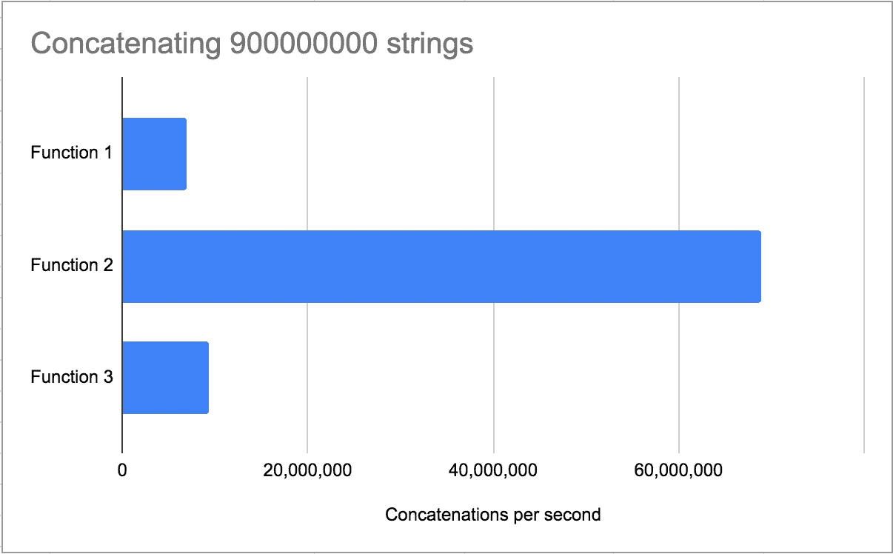

# Python 和字符串串联

> 原文：<https://betterprogramming.pub/python-and-string-concatenation-31772a10fed>

## 在 Python 中连接字符串最有效的方法是什么？


雅各布·科普斯在 [Unsplash](https://unsplash.com/s/photos/symmetry?utm_source=unsplash&utm_medium=referral&utm_content=creditCopyText) 上拍摄的照片

Python 是我最早学习的语言之一。当时，我被告知将一系列字符串连接成一个字符串的方法是这样做的:

使用+=连接字符串列表中的所有元素。

过了一会儿，人们就知道了`.join`函数的奇妙之处，它极大地简化并减少了使用的行数。使用`.join`,我们可以编写如下代码:

调用`join()`上所有元素的字符串列表。

2018 年末，我在里斯本与一家公司的一个非常有才华的工程团队一起工作，这家公司正在经历一个大的增长阶段。代码库相当旧，有相当数量的“锤打”代码，所以当公司开始成长时，许多以前不存在的问题开始出现。

在那些日子里，工程师们共同努力找出如何改进我们系统的旧部分是很常见的。有一天，他们正在研究一个操作，该操作将一个正则表达式应用于一个字符串，并将所有结果元素连接在一起。当操作面对一个很大的字符串时，它需要几分钟才能完成，而它应该需要几秒钟。

乍一看，导致这个问题的最明显的一段代码是使用`+=`操作符将列表的所有元素连接在一起。

## +=有什么问题？

Python 医生说:

> 串联不可变序列总是会产生一个新的对象。这意味着通过重复连接构建序列将在总序列长度上具有二次运行时间成本。

因为字符串是不可变的，无论何时你将一个字符串连接到另一个字符串，它都会创建一个新的字符串。随着字符串变得越来越大，需要复制更多的数据来创建这些更大的字符串。

# Python 3

以前的文章(检查参考资料)已经探讨了获取字符串列表并将所有元素连接在一起的问题。这些内容是不久前用 Python 2 编写的，所以我很好奇它与 Python 3 的最新版本(目前是 3.7.5)有什么不同。

## 测试设置

我们将探索 Python 中连接字符串的三种不同方式:

*   使用`+=`操作符
*   使用`.join`功能
*   使用`StringIO`

我使用的列表有 900M 个不同大小的元素，由这个 1.01 GB [文本文件中的文本组成。](http://mattmahoney.net/dc/textdata.html)

测试是在 2014 年 15 英寸的 Macbook Pro 上进行的，配备了 2,2 GHz 的英特尔酷睿 i7 和 16 GB 的内存。

下面是针对上述每种可能性运行的函数:

使用`+=`操作符

使用`.join`功能

使用`StringIO`

## 结果

```
 Runtime(ms)   Concatenations per second  
 ------------ ------------- --------------------------- 
  Function 1      130.99            6,870,753  
  Function 2       13.07           68,859,985    
  function 3       96.01            9,374,024
```



我们可以看到目前最好的函数是使用`.join`的函数，这与 Python 2 非常相似。

对我来说，令人惊讶的结果是看到`StringIO`和`+=`表现几乎一样。我预计它的性能至少会提高一倍，因为在 Python 3 文档中，它和`.join`一起被引用，作为连接`str`对象的一种方式。

# 特别感谢

感谢当时 Unbabel 工程团队的成员，他们让我从他们身上学到了很多东西。

# 参考

[](https://waymoot.org/home/python_string/) [## Python 中高效的字符串连接

### 对在 Python 编程语言中构建长字符串的几种方法的性能进行评估，可以帮助我们更好地理解

waymoot.org](https://waymoot.org/home/python_string/) [](https://blog.mclemon.io/python-efficient-string-concatenation-in-python-2016-edition) [## Python 中的 Python 高效字符串串联(2016 版)

### 读完 Philip Guo 在 CPython VM 上的精彩系列讲座后，我发现自己在看…

blog.mclemon.io](https://blog.mclemon.io/python-efficient-string-concatenation-in-python-2016-edition)