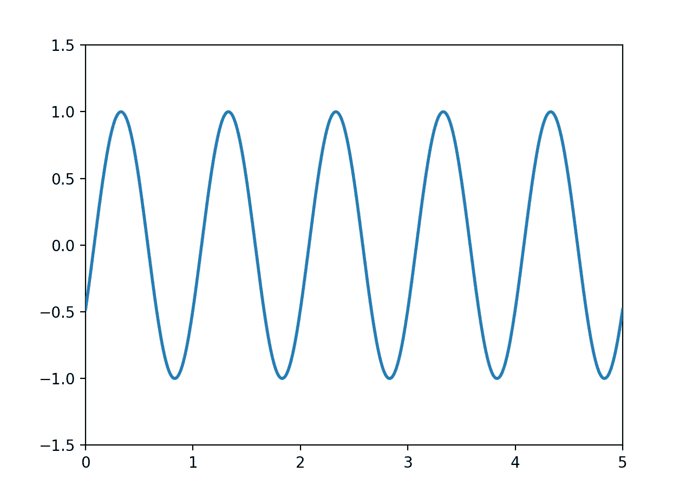
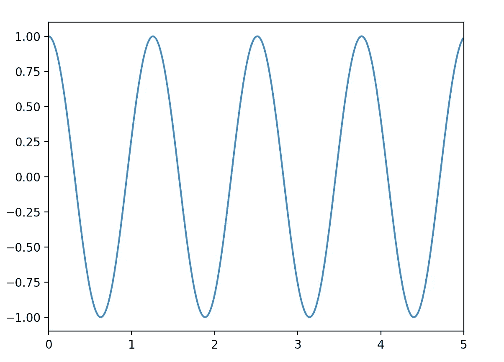
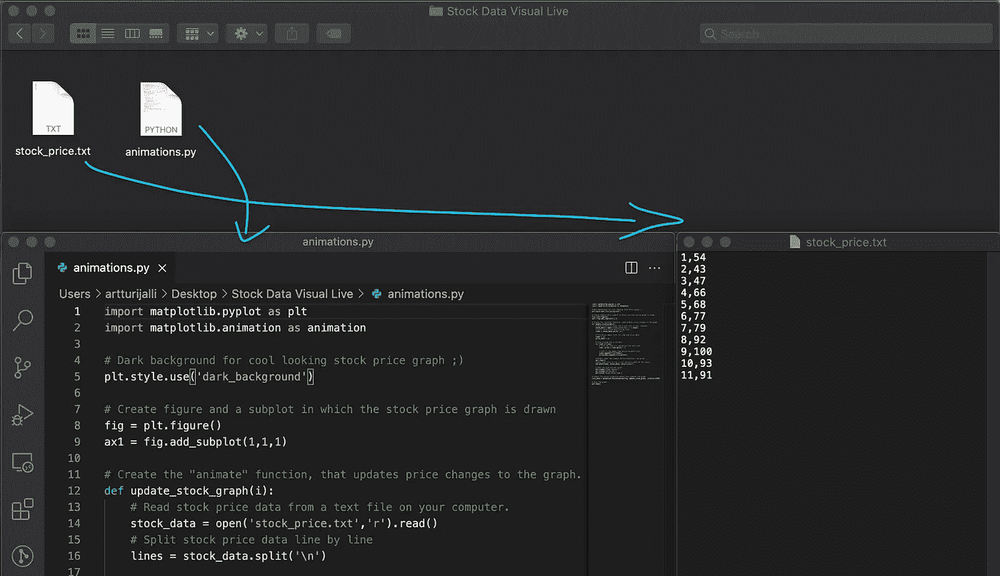
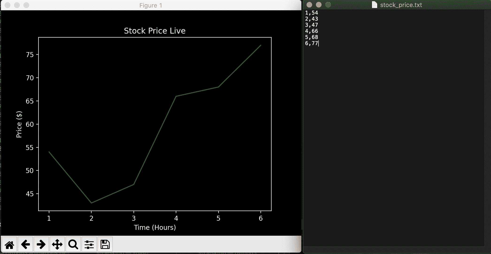

# 使用 Matplotlib 的 Python 动画

> 原文：<https://betterprogramming.pub/python-animations-with-matplotlib-e8e8037f4df7>

## 通过了解如何制作图形动画，充分利用您的模拟。



在 Python 中，绘制图形很简单——可以使用像 [Matplotlib](https://matplotlib.org/) 这样强大的库。但是当你运行模拟时，基本的绘图可能并不总是足够的。您可能希望展示一个动画来帮助您理解状态如何随时间变化。

幸运的是，创建动画就像用 Matplotlib 创建情节一样简单。

在本指南中，您将学习:

*   如何创建一个基本的 Matplotlib 绘图？
*   如何使用 Matplotlib 创建一个基本的动画情节？
*   如何创建一个实时更新的股价图？

# Matplotlib

[Matplotlib](https://matplotlib.org/) 是 Python 中常用的可视化库。您可以绘制交互式图表、直方图、条形图等。

## 如何安装 Matplotlib

安装 Matplotlib 很简单。只需打开您的终端并运行:

```
pip install matplotlib
```

## Numpy

此外，如果您没有 [numpy](https://numpy.org/) ，请安装它，以便您可以遵循本指南中的示例:

```
pip install numpy
```

# 如何用 Matplotlib 绘图

尽管本教程是关于 Matplotlib 中的动画，但首先让我们创建一个简单的正弦波静态图:

输出:



基本正弦波

# 如何用 Matplotlib 制作动画

要用 Matplotlib 创建动画，你需要使用 Matplotlib 的`animation`框架的`FuncAnimation`类。

例如，让我们创建一个正弦波动画:

输出:


使用 Matplotlib 的动画正弦波

然后让我们更详细地浏览一下上面的代码，以便更好地理解动画是如何与 Matplotlib 一起工作的。

## 第 1–3 行

您可以在这里添加所需的库。尤其是可以用来为你制作动画的`FuncAnimation`类。

## 第 5–7 行

在这里，首先为动画人物创建一个空窗口。然后创建一个空的`line`对象。这个`line`后来被修改成动画。

## 第 9–11 行

这里您创建了一个`init()`函数来设置动画的初始状态。

## 第 13–17 行

然后创建一个`animate()`函数。这就是产生正弦波的函数。它将帧数`i`作为其参数，然后创建一个根据帧数偏移的正弦波(帧数越大，波偏移越多)。最后，它返回更新后的`line`对象。现在`animation`框架根据`line`的变化更新图表。

## 第 19 行

这一行代码将所有这些放在一起，并创建实际的动画对象。简单来说:

*   从`init()`定义的初始状态开始，通过重复调用`animate()`函数，将动画渲染到人物`fig`
*   渲染到“一轮动画”的帧数为`200`。
*   两帧之间的延迟是`20`毫秒(`1000ms / 20ms = 50 FPS`)。
*   (`blit=True`确保只绘制图形的变化部分，以提高效率)

## 第 22 行

你猜对了——这一行显示的是动画。

# 如何将 Matplotlib 动画导出到视频文件

在前面的例子中，您看到了一个很好的正弦波动画。但是如果你想导出并保存这个动画呢？当然，你可以截图，但是当你想导出更多的动画时，这不是很有效。

要将 Matplotlib 动画保存到视频文件，只需使用动画的`save()`方法。

要将余弦波动画导出为`Animation.mp4`，只需注释掉前面示例代码中的第 20 行:

```
# cosine_animation.save("Animation.mp4")
```

请注意，根据动画大小，可能需要一段时间才能成功导出动画。在导出完成之前，您不会看到 Matplotlib 动画，所以不要混淆。

恭喜你！现在你知道如何使用 Matplotlib 创建一个基本的动画。您还知道如何将动画导出为视频文件。

现在我们来看看 Matplotlib 中动画的一个有用的应用。

# 使用 Matplotlib 更新实时数据图

您可以使用 Matplotlib 中的`animation`框架创建图表的实时更新。

例如，让我们创建一个实时股票价格更新图。

为此，您需要创建一个文本文件来更新股票价格。将其命名为`stock_price.txt`,放在 Python 文件旁边:



股票价格和动画文件需要在同一个文件夹中。

接下来，我们来看看代码。简而言之，它定期读取包含股票价格和“时间戳”的文本文件当添加一个新的时间-价格数据点时，图表会根据您之前学习的动画逻辑进行更新。

## 结果

运行上述代码的结果是，您可以更新您的`stock_price.txt`文件，并看到价格实时更新到图表中。



股价图会随着价格的变化而更新

# 结论

Matplotlib 是 Python 常用的可视化库。除了静态图之外，您还可以用它创建简单的动画，例如制作正弦波动画或创建实时股价图。

感谢阅读。我希望你今天学到了新东西。编码快乐！

# 你可能也喜欢

[](/10-useful-python-snippets-to-code-like-a-pro-e3d9a34e6145) [## 10 个有用的 Python 片段，让你像专业人士一样编写代码

### 我每天使用的有用的提示和技巧

better 编程. pub](/10-useful-python-snippets-to-code-like-a-pro-e3d9a34e6145)