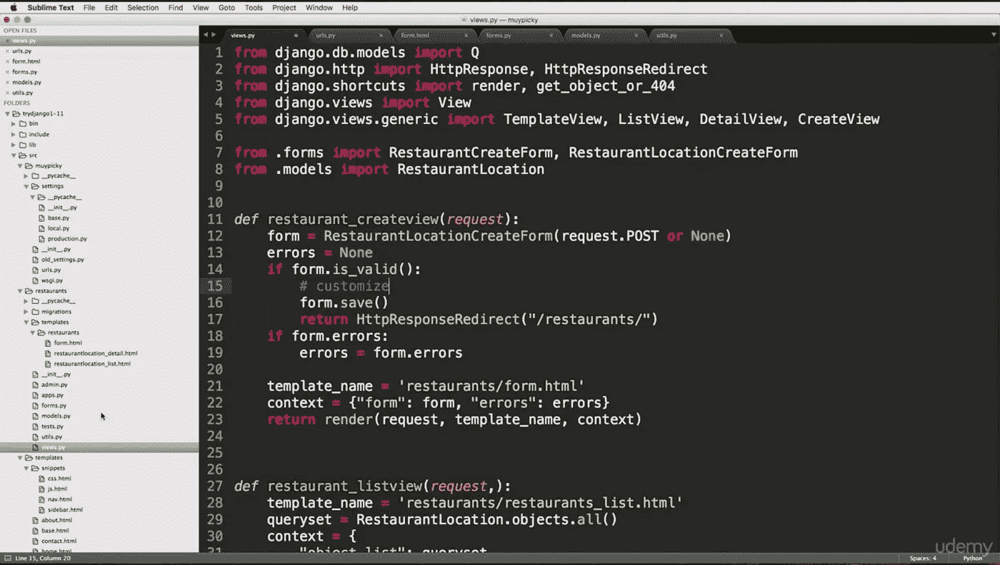
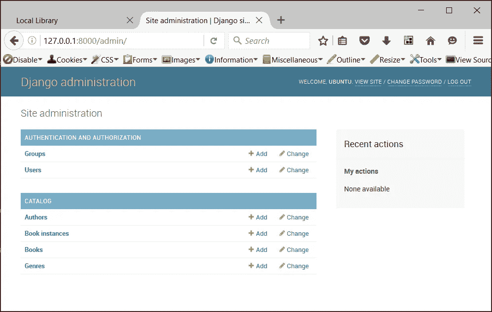

# Python 后端:Flask 对 Django

> 原文：<https://betterprogramming.pub/python-backends-flask-versus-django-5de314fa70ff>

## 你的下一个项目适合做什么？


杰佛森·桑多斯在 [Unsplash](https://unsplash.com/search/photos/programmer?utm_source=unsplash&utm_medium=referral&utm_content=creditCopyText) 上拍摄的照片

你想用 Python 开发一个网站吗？那么你可能听说过[姜戈](https://www.djangoproject.com/foundation/)和[烧瓶](http://flask.pocoo.org/docs/0.12/foreword/)。这两个是 Python 最流行的 web 框架(当然还有更多)。现在的问题是你用哪一个？

这篇文章旨在提供一个简单的介绍，介绍这两个框架是如何工作的，它们的相似之处和不同之处，以及在选择它们时应该考虑的一些要点。

# 一.快速介绍

基于 Python 的主要应用程序是使用命令行界面创建的，运行在命令提示符或 shell 脚本上。当然，人们想用 Python 做更多的事情，而不仅仅是自动化任务和管理工作流。他们很快就需要 web 框架。

## 姜戈



Django 是一个 Python web 框架，适合有时间限制的完美主义者。Django 提供了一个全功能的模型-视图-控制器框架。它的开发基于一种“包含电池的方法”，这使得开发者能够在没有第三方库和工具的情况下创建网站。Django 于 2005 年 7 月 15 日首次发布，由 Django 软件基金会(DSF[)开发和管理。它是免费和开源的，有更多的版本发布。](https://www.djangoproject.com/foundation/)

## 瓶


Flask 是一个 Python 微框架，基于一次做一件事，并且做好这件事。随着 2010 年 4 月 1 日的第一次发布，Flask 是由奥地利开发者阿明·罗纳彻开发的。正如其[文档转发](http://flask.pocoo.org/docs/0.12/foreword/#what-does-micro-mean)中所述，*微框架*中的*微*暗示 Flask 旨在保持其轻量级的简单性和仍然可扩展的用途。Flask 的真正强大之处在于它的灵活性。

# 二。比较和对比，弗拉斯克对姜戈

下面是 Django 和 Flask 的深入比较，使用的因素如下:

*   流行度:用法和用例
*   入门:文档和导航简易性
*   模板引擎和系统
*   路由系统
*   用户灵活性
*   管理系统的可用性
*   发展速度

## 流行度:用法和用例

几个顶级网站都用 Django 和 Flask。来自 GitHub 和其他网站的统计数据显示 Django 比 Flask 更受欢迎。这种流行仅仅是因为开发人员使用 Django 的健壮特性来快速构建和部署复杂的 web 应用程序。同样，开发人员使用 Flask 来加速使用固定内容的网站的开发。一些由 Django (Bitbucket，Eventbrite， [Instagram](https://instagram-engineering.com/web-service-efficiency-at-instagram-with-python-4976d078e366) ，Pinterest，等等)和 Flask (LinkedIn，网飞，Twilio，优步)支持的知名项目积极使用这些框架。

## 用户灵活性

这两个框架最大的区别之一是灵活性。

Django 的*电池内置*概念帮助开发者在没有第三方库和工具的情况下创建各种网络应用。然而，Django 缺少对所提供的模块进行修改的选项。因此，开发人员使用内置特性创建 web 应用程序。这意味着如果开发人员想为 Django 已经提供的功能使用不同的库，这并不容易。

相反，Flask 使用其可扩展的 web 框架来支持使用各种 web 开发库和工具灵活开发 web 应用程序。这使得更有经验的开发人员可以自由地对他们熟悉的库和数据库进行即插即用。

你不必拘泥于框架强迫你使用的东西。相反，您可以转向自己熟悉的技术组件。

## 文档和导航方便

Flask 提供了大量的文档，包括部署、安装、快速入门说明和详细的教程。使用 Python 的包管理器，用 pip 安装 Flask 很容易。

```
*$ pip install flask*
```

上面的 pip 命令安装 Flask 及其基本包。在 Flask 上运行代码非常简单(例如，显示“Hi Welcome”)。它只需要创建 Flask 类的一个实例，然后是一个显示“Hi Welcome”字符串的路由。

```
from flask import Flask
app = Flask(__name__)@app.route("/")
    def hi_welcome():
        return "Hi Welcome"if __name__ == "__main__":
    app.run()
```

Django 的[文档](https://docs.djangoproject.com/)比 Flask 的要广泛得多，由于其复杂性，这是意料之中的。Django 也可以使用 pip 快速安装。

```
*$ pip install Django*
```

在 Django 中运行代码需要使用一个内置命令来创建项目，另一个命令用于创建应用程序。它的启动命令很方便，因为它采用了现成的目录结构。

## 路由系统

对于任何 web 应用程序或网站来说，路由系统都是必不可少的，它创建 URL 并决定加载 URL 时显示的内容。

Flask 采用了一个简单、轻量级的 web 框架，路由由一个`route()`装饰器完成。使用上面的“Hello World”示例，第一行是一个装饰器。Decorators 是一个函数，它将一个可调用的(一个类)作为参数，在返回它之前进行修改。使用的字符串也告诉 Flask 哪个 URL 触发了它的功能。例如，使用/(http://127.0.0.1:5000/\)，这将在使用浏览器访问 Flask 时加载第一个页面。

对于 Django，它应用了一种内置电池的方法，这使得开发人员更容易完成基本的 web 开发任务，如数据库模式迁移、URL 路由和用户认证。在 Django 中，定制 web 应用程序也可以体验到过程加速，因为它提供了一个引导工具、内置模板引擎和 ORM 系统。使用运行内置的`djangoadmin startproject`命令时创建的`urls.py`文件处理路由。要定义一个路由，需要从 Django 导入 URL 方法并创建一个实例，指定每个参数(关键字参数、现有的 URL 模块和 regex 字符串)。默认情况下，管理站点的内置 Django URL 位于`urls.py`文件中。它告诉 Django 从哪里加载 URL 以及指定的模块。

## 管理系统的可用性



Django 使用一个遵循对象关系映射器(ORM)目录结构的管理系统和一个数据库系统。当使用 Django 进行开发时，它增加了无所不包的体验，因为多个项目具有相同的目录结构。

Flask 缺少这些特性，可能需要您安装自定义模块来使用 ORM，这对开发人员来说是可选的。这些选项包括与 MongoDB、SQLAlchemy、SQLite 等一起使用。如您所见，这是灵活性和易用性之间的权衡。Django 提供了建立网站所需的大部分技术组件。Flask 更纯粹地只是框架，允许最终用户做出更多的决定。

## 发展速度

众所周知，Django 框架为复杂的 web 应用程序提供了快速的开发速度。因为它提供了完整的特性，所以它提供了实现的所有必要工具。

Flask 的简单性允许有经验的开发人员在短时间内完成较小的应用程序。Django 框架的一个显著优势是活跃社区的可用性，该社区旨在帮助解决方案来扩展您的应用程序，或者通过有用的内容使您的工作变得更容易。Flask 社区目前还没有这么大，所以找到有用的信息并不容易。

## 模板引擎和系统

所有 web 应用程序都有一个支持用户交互的前端(用户界面)。由于 web 应用程序不是静态的，它们采用不同的方法来动态生成 HTML。Django 和 Flask 提供了令人兴奋的模板引擎。

Flask 是使用 [Jinja2](http://jinja.pocoo.org/) 模板引擎开发的。它是一个现代的、设计友好的模板，允许开发人员在集成沙盒环境的帮助下模拟动态 web 应用程序。Jinja2 模板包含变量和标签。Flask 模板的另一个关键特征是模板继承。下面是一些常用的 Jinja2 语法的例子:

```
*comments: {# … #}**variables: {{ … }}**statements: * (Similar to normal programming, Jinja2 statements find usage in a variety of cases, like if-else statements, imports, loops, and macros).
```

Django 使用内置的模板引擎，这使得开发人员可以毫不费力地定义 web 应用程序面向用户的层。此外，开发人员可以使用 Django 模板语言(DTL)来编写创建自定义用户界面开发的模板。Django 中的模板语法包括:

```
*single-line comments: {# … #}**multi-line comments:  … **filters on variables: {{ variable|filter }}**tags: **variables: {{ … }}*
```

jinja2 模板从 Django 模板语言中获得灵感，因此有相似的语法。Django 模板具有模板继承的特性，更多信息可以在 Django 模板[官方文档](https://docs.djangoproject.com/en/1.11/ref/templates/language/)中看到。

# 结论

要开始使用 Flask 和 Django 框架，需要对基础知识有更深入的理解。每个框架的区别和好处取决于您希望实现什么样的项目。主要对比包括:

***烧瓶*** 提供了灵活性、简单性和细粒度控制。Flask 不固执己见，让你决定如何实现应用程序。

Django 为您的 web 应用程序开发提供了管理面板、数据库界面、目录结构和 ORM 的全方位体验。

我们希望这能帮助你对你选择的框架做出明确的决定。

祝你未来的项目好运！