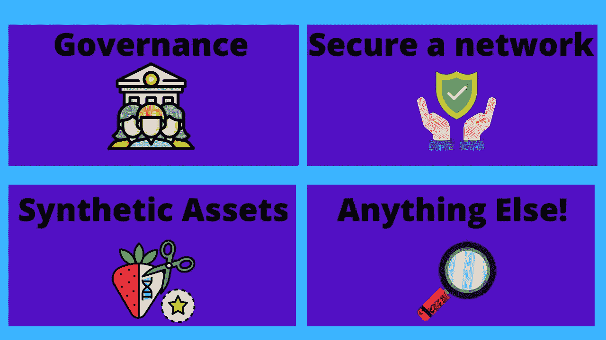

# Python 区块链令牌部署教程—创建 ERC20

> 原文：<https://betterprogramming.pub/python-blockchain-token-deployment-tutorial-create-an-erc20-77a5fd2e1a58>

## 使用 Brownie、Python 和 Solidity 创建一个可以在区块链上查看、购买和出售的令牌


作者照片。

以太坊和区块链生态系统作为一个整体通过使用 [ERC20](https://www.investopedia.com/news/what-erc20-and-what-does-it-mean-ethereum/) 代币进行交易。任何人都可以创建代币，并将其用作加密货币。在本教程中，我们将使用 Python、 [Brownie](https://eth-brownie.readthedocs.io/en/stable/) 和 [Solidity](https://docs.soliditylang.org/en/v0.8.4/) 部署 ERC20 令牌。对于本教程，您不需要对这些非常熟悉。

# 什么是 ERC20？什么是以太币？

ERC20 的意思是“以太坊征求意见稿 20。”[征求意见](https://en.wikipedia.org/wiki/Request_for_Comments)是社会团体对想法进行同行评议的一种方式。以太坊通过让人们创造想法并让其他人对其进行评论来改善生态系统。这些与[以太坊改进方案](https://eips.ethereum.org/) (EIPs)略有不同。这两个是有区别的，但是你有时会听到它们互换使用。

当人们提到 ERC20 时，他们指的是由 [Fabian Vogelsteller](mailto:fabian@ethereum.org) 和 [Vitalik Buterin](mailto:vitalik.buterin@ethereum.org) 创建的第 20 届以太坊征求意见稿。

这个征求意见稿提出了一种在以太坊平台上创建“令牌”的方法——一种所有令牌都要遵循的标准，这样平台和工程师就可以轻松使用它们，而无需重复工作。

想象一下，如果每个代币都有自己的功能，可以将代币从一个钱包转移到另一个钱包。这将使得围绕这些令牌构建协议变得非常困难。考虑可互换的零件，但要考虑坚固的功能。

这些 ERC20s 中的每一个都遵循相同的模式，并且具有基本上做相同事情的相同功能列表。其中一些是:

*   `transfer`:在主人之间转移代币。
*   `balanceOf`:如何查看一个地址有多少 token。
*   `transferFrom`:允许非所有者将代币从一个地址转移到另一个地址。
*   `approve`:批准一个合同调用`transferFrom`函数。

最简单的形式是，它们是一份记录区块链上每个地址拥有多少价值单位的合同。他们使用`mappings`来使这成为可能。

## 有没有 TL；博士？

是的。ERC20 是代表令牌的智能合约。

## 有哪些例子？

ERC20 令牌的一些示例有 LINK、、和 DAI。您会注意到，一些令牌(如 LINK 令牌)实际上是 ERC20 的更高级形式。特别是 LINK 是一个 ERC677，它增加了一些额外的功能来处理[神谕](/what-is-a-blockchain-oracle-f5ccab8dbd72)，但它仍然向后兼容 ERC20s，并拥有它们所有的功能。

另一个流行的令牌标准是 [ERC777](https://eips.ethereum.org/EIPS/eip-777) ，它在 ERC20 的基础上做了一些很好的生活质量改进，并且也向后兼容 ERC20。

## 为什么要做 ERC20s？

ERC20s 是做什么的？他们的目的是什么？



来自 Canva 的剪贴画图像。

ERC20s 可用于许多不同的原因。这里有一些最受欢迎的。

## 1.管理

治理令牌是允许用户投票并持有协议未来股份的令牌。治理令牌的一些例子是 UNI、AAVE 和 CRV。令牌可以被“标桩”到平台中，并用于投票和提出新的方向供协议听取。

## 2.保护网络

通常，一个网络或协议有多个区块链，协议的安全性整体上不应该依赖于单一的底层区块链。协议通常需要与对协议更有意义的底层资产进行交易。它将资产从与网络无关的其他资产的市场波动中分离出来。

如果是基础链，那么如果基础市场波动变得更糟，网络的安全性可能会降低。

## 3.合成资产和稳定资产

如果你有某种[价格反馈](https://data.chain.link/)，你可以很容易地用某种抵押支持制造合成资产。这是一个接触和交易不在区块链生态系统中的资产的好方法。这正是 [Synthetix](https://synthetix.exchange/) 协议的工作方式，将 [Chainlink 价格馈送](https://data.chain.link/)与 SNX 持有的抵押品结合起来，让 [DeFi](https://www.coindesk.com/what-is-defi) (分散融资)投资者接触到传统的金融世界。

同样意义上的稳定资产也是合成资产，只不过它们代表的是像美元这样的“稳定”资产。[系绳](https://tether.to/)、[、](https://www.circle.com/en/usdc)和[戴](https://makerdao.com/)都是稳定绳的例子。

## 4.还有别的吗！

当你想出为什么要制作一个 ERC20 代币时，创造力是你唯一的限制。我们已经看到了使用 ERC20s 作为基础抵押资产的协议，给予奖励作为使用协议的激励([参见 yield farming](https://blog.chain.link/defi-yield-farming-explained/) )，围绕代币创造经济，等等。

# 如何创建 ERC20

ERC20 教程

让我们从克隆这个样本库并安装 eth-brownie 开始。我们假设您已经安装了 Python。Brownie 是一个 Python 框架，致力于简化智能合约的部署。

```
git clone [https://github.com/PatrickAlphaC/erc20-brownie](https://github.com/PatrickAlphaC/erc20-brownie)
cd erc20-brownie
pip install eth-brownie
```

我们在`contracts`文件夹中有两份合同:

1.  `[EasyToken.sol](https://github.com/PatrickAlphaC/erc20-brownie/blob/main/contracts/EasyToken.sol)`
2.  `[TokenERC20.sol](https://github.com/PatrickAlphaC/erc20-brownie/blob/main/contracts/TokenERC20.sol)`

`TokenERC20`是我们如何自己编写整个合同的一个例子，因为我们所要做的就是确保我们实现了正确的功能。

或者，更简单的方法是使用 [OpenZeppelin](https://openzeppelin.com/contracts/) 包。这抽象掉了大部分功能，允许我们使用 Solidity 的继承来让我们的契约“继承”我们需要实现的所有功能！我们所要做的就是给令牌一个名称、符号和初始供应。

## EasyToken.sol

在本例中，我们将令牌命名为`EasyToken`，符号为`EzT`，初始供应量为 100 万。你可能会问为什么它不是`1000000000000000000000000`的初始供应。好吧，实性对小数不起作用，所以我们实际上指定了 18 个额外的零作为小数，这样我们就可以和令牌的小数部分进行交互。

创建令牌合同后，我们可以创建一个脚本来将其部署到区块链:

```
from brownie import accounts, config, EasyToken, EasyToken
from scripts.helpful_scripts import get_accountdef main():
    account = get_account()
    erc20 = EasyToken.deploy({"from": account})
```

Brownie 允许我们从契约本身中提取契约，我们只需调用主契约中的函数:

```
EasyToken.deploy({"from": account})
```

这会把它部署到区块链·布朗尼连接的任何东西上。您会注意到，对于每个事务，我们还需要有一个与之相关联的`account`。我们从我们的`get_account`函数中得到我们的`account`。我们可以暂时忽略这一点。

## 部署到区块链

这个包默认设置为部署到一个本地 ganache 区块链上。如果您想了解更多关于本地工作的信息，可以阅读自述文件。如果你想成为全职 Solidity 开发人员，我建议你这么做！与本地区块链一起工作比一直在测试网上测试要快得多！

我们将向您展示如何部署到 Kovan Testnet，因为这将使您能够“看到”Etherscan 上的令牌。您需要两个环境变量:

```
export WEB3_INFURA_PROJECT_ID='aaa5aa5a5a5a55555aaa555a5a5555a`# export PRIVATE_KEY='asdfasdfasdfasdfasdfasdfasdfas'
```

您的`WEB3_INFURA_PROJECT_ID`是来自 [Infura](https://infura.io/) 的项目 ID。Infura 是我们连接到区块链的一种方式，有一个免费层供我们使用。您还需要将您的`PRIVATE_KEY`设置为一个环境变量。您可以从您的[元掩码](https://metamask.io/)中获取您的私钥。如果您没有 MetaMask，您可以在此视频中了解如何下载和设置它:

设置元掩码

您可以通过从 MetaMask 导出私钥并在开头添加一个`0x`来获得它。你可以在[这篇博文](https://www.twilio.com/blog/2017/01/how-to-set-environment-variables.html)中了解更多关于环境变量以及如何设置它们的信息。

一旦你设置了你的环境变量，你也会想要得到一些 [Testnet Kovan ETH](https://faucet.kovan.network/) 。然后您可以运行`deploy`脚本:

```
brownie run scripts/2_deploy_easy_token.sol
```

您将会看到这样的输出:

```
Running 'scripts/2_deploy_easy_token.py::main'...
Transaction sent: 0x223af315917c07956243ed0915a3b142a5697ad6e497adeae3e3ad886f37b37a
  Gas price: 3.0 gwei   Gas limit: 792680   Nonce: 3653
  EasyToken.constructor confirmed - Block: 24760550   Gas used: 720619 (90.91%)
  EasyToken deployed at: 0x8922C8e8534e10A0B42c072eA0e94A80Cb2E0985
```

然后，我们可以获取该地址并将其放入 [Kovan Etherscan](https://kovan.etherscan.io/address/0x8922C8e8534e10A0B42c072eA0e94A80Cb2E0985) ，您将在那里看到您的令牌！

您最不想做的事情就是获取该地址并将其添加到元掩码中。你可以点击元掩码中的“添加令牌”按钮，进入`custom token`，在 Kovan 网络上添加你的合同地址，你应该会在那里看到你的令牌。

恭喜你！您已经部署了您的第一个 ERC20 令牌！