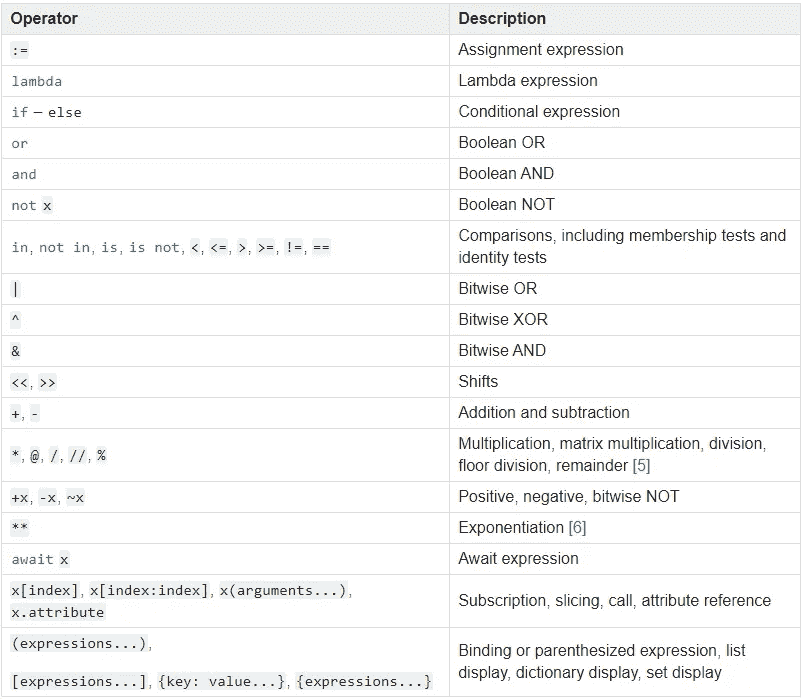
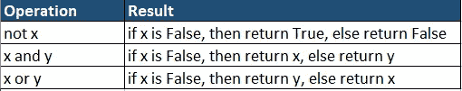

# Python Bool 类型:引擎盖下发生了什么

> 原文：<https://betterprogramming.pub/python-bool-type-what-goes-on-under-the-hood-260e42aea655>

## 超越真假对 bool 类型有更深入的理解


照片由[凯尔头](https://unsplash.com/@kyleunderscorehead?utm_source=medium&utm_medium=referral)在 [Unsplash](https://unsplash.com?utm_source=medium&utm_medium=referral) 上拍摄

在本文中，您将对 Python bool 类型、其工作原理以及如何在您的 Python 应用程序中有效地使用它有一个全面的了解。让我们开始吧。

# 1.布尔类型

在 Python 中，`bool`数据类型用来表示布尔值— `True`和`False`。

如你所知，在 Python 中一切都是对象。这意味着整数、浮点数、字符串、列表、元组等。都是它们各自类的对象。例如，整数是类`int`的对象，浮点是类`float`的对象，列表是类`list`的对象。

同样，布尔值`True`和`False`也是类`bool`的对象。内置的`type()`函数可以用来学习对象的数据类型。从下面的代码中可以看出，`True`和`False`是 bool 类型，表示类`bool`的对象。

```
>>> print(type(True))
**<class 'bool'>**>>> print(type(False))
**<class 'bool'>**
```

比较值时，布尔值通常用于`if`和`while`语句中。

```
>>> 10 > 100
**False**>>> 10 == 10
**True**>>> x, y = 10, 11
>>> if x == y:
...     print("x is equal to y")
... else:
...     print("x is not equal to y")
...
**x is not equal to y**
```

`bool`类型是`int`的子类。因此，它展示了`int`的所有特性。换句话说，我们可以对布尔值进行数学运算和其他特殊运算。另外，请注意`*True*` *和* `*False*` *分别表现为整数 1 和 0。*

```
>>> int(True)
**1**
>>> int(False)
**0**>>> True == 1
**True** 
>>> False == 0
**True**
>>> True > 0
**True**
>>> False < 1
**True**>>> True + True + True
**3**
>>> True + True + 1
**3**
>>> True * 3 + False 
**3**
>>> False + False + 3
**3**
```

关于真值及其计算方式的知识对于理解 bool 类型及其运算至关重要。

# 2.真值

Python 中的每个对象都有其真值。这些真值在计算布尔表达式时很有用。*但问题是一个对象什么时候返回* `*True*` *或者* `*False*` *？*

一般来说，所有非零数字和非空序列类型和集合都返回`True`。类似地，所有值为零的数字和空序列以及包括`None`在内的集合都返回`False`。

简而言之，除了下面列出的几个返回`False`的对象之外，几乎所有的对象都返回`True`:

*   `None`和`False`。
*   值为零的数字:`0` (int)、`0.0` (float)、`0j` (complex)、`Decimal(0)` (Decimal)、`Fraction(0,1)` (Fraction)。
*   空序列类型和集合:`'’`(字符串)、`()`(元组)、`[]`(列表)、`{}`(字典)、`set()`(集合)、`range(0)`。
*   实现`__bool__()`或`__len__()`的自定义类——返回`False`或`zero`的方法。

## 内部是如何评估真值的？

这是来自官方文档的定义

> 一个对象返回`True`，除非它的类实现了返回`False`的`__bool__()`方法或返回零的`__len__()`方法。

让我们试着用两个例子来理解这一点。

**例 1:** 这里，`x`是引用值 10 的整数对象。在执行`if x`的过程中，Python 知道它必须评估`x`的真值。这里`x`是`int`类的对象，`int`类实现`__bool__()`方法。由于 10 是非零值，`__bool__()` 返回`True`，并打印`'I am inside if'`。

***什么是 __bool__()？*** 真值测试时调用的特殊方法或神奇函数之一。当调用内置函数`bool()`时，也会调用它。根据前面提到的规则，该方法返回`True`或`False`。

```
x = 10
if x:
    print('I am inside if')
else:
    print('I am inside else')
```

**例二:**此处，`y`为空列表。在执行`if y`的过程中，Python 会计算 y 的真值。这里`y`是`list`类的一个对象，`list`类实现`__len__()`方法。如前所述，对于空序列类型，如列表，`__len__()`，返回`False`并打印`'I am inside else'`。

```
y = 10if y:
    print('I am inside if')
else:
    print('I am inside else')
```

***什么是 __len__()？*** 这也是调用内置函数`len()`时调用的特殊方法或神奇函数之一。当对象是空序列类型或集合时，该方法返回`True`或`False`。

因此，简而言之，在真值评估期间，首先在对象上调用`__bool__()`方法。如果没有定义`__bool__()`方法，则调用`__len__()`方法。如果没有为该类定义这两者，那么它将为其所有实例返回`True`。

# 3.bool()方法

bool 方法`bool()`接受一个参数`x`并返回其真值 `True`或`False`。有些类实现了`__bool__()`，有些实现了`__len__()`。所以不用逐个检查，可以用`bool()`。当我们使用 bool 时，Python 首先自动调用`__bool__()`方法。如果`__bool__()`未定义，则调用`__len__()`方法。如果没有为该类定义这两者，那么它将为其所有实例返回`True`。

# 4.布尔运算符和优先级

布尔运算符有:**`and``or``not`。**

**布尔运算符以及其他运算符的优先级如下所示。该列表按照优先级的升序排列，即优先级最低的在顶部，优先级最高的在底部。从列表中可以看出，布尔运算符的优先级如下:`not`、`and`、`or` ( `not`优先级较高， `or`优先级最低)。**

****

**来源:[https://docs . python . org/3/reference/expressions . html # operator-precedence](https://docs.python.org/3/reference/expressions.html#operator-precedence)**

# **5.短路**

**在 Python 中，布尔运算符`and`和`or`的工作方式不同，使用了一种叫做短路的技术。下表总结了`and`和`or`的短路操作符。注意，`or`操作符和许多其他操作符一样，返回`0`或`False`为假，返回`1`或`True`为真。**

***注意* `*and*` *和* `*or*` *运算符不返回* `*True*` *或* `*False*` *。而是两者都返回* `*x*` *或者* `*y*` *。这是短路。***

****

**作者图片**

**让我们看一些例子来更好地理解短路操作。如你所见，布尔运算符`and`和`or`不返回`True`或`False`。相反，它们都返回第一个操作数(x)或第二个操作数(y)。**

```
>>> x, y, z = 10, 20, 0
>>> not z
**True**>>> not x
**False**>>> x and y
**20**>>> x and z
**0**>>> x or y
**10**>>> x or z
**10**
```

# **结论**

**在本文中，您已经非常详细地了解了布尔运算符。您必须了解在 python 对象的真值测试过程中幕后发生了什么。您还学习了`bool()`方法、运算符优先级和短路操作。**

# **进一步阅读**

*   **[6 个有趣的事实你不太熟悉 Python Int 数据类型](https://medium.com/towards-artificial-intelligence/6-interesting-facts-you-are-less-familiar-with-python-int-data-type-86ebb378a2e2)**
*   **[6 个有趣的事实你不太熟悉 Python 浮点数据类型](https://medium.com/towards-artificial-intelligence/6-interesting-facts-you-are-less-familiar-with-python-float-data-type-ce118727016b)**
*   **W [作为一名 Python 开发者，你为什么应该理解十进制数据类型](https://medium.com/towards-artificial-intelligence/why-should-you-understand-decimal-data-type-as-a-python-developer-1bf078c97ab7)**
*   **[理解 Python 中的引用计数](https://towardsdatascience.com/understanding-reference-counting-in-python-3894b71b5611)**
*   **[Python 中的实习优化技术](https://towardsdatascience.com/optimization-in-python-interning-805be5e9fd3e)**
*   **[Python 中的窥视孔优化技术](https://levelup.gitconnected.com/optimization-in-python-peephole-e9dc84cc184d)**

**我希望你喜欢阅读这篇文章。如果你喜欢我的文章并想订阅 Medium，你可以在这里这样做:**

**[](https://chetanambi.medium.com) [## Chetan Ambi -介质

### 阅读 Chetan Ambi 在媒体上的文章。数据科学|机器学习| Python。参观 https://pythonsimplified.com/…

chetanambi.medium.com](https://chetanambi.medium.com)** 

# **参考**

**[1].[https://docs.python.org/3/library/stdtypes.html](https://docs.python.org/3/library/stdtypes.html)**

**[2].[https://www.python.org/dev/peps/pep-0285/](https://www.python.org/dev/peps/pep-0285/)**