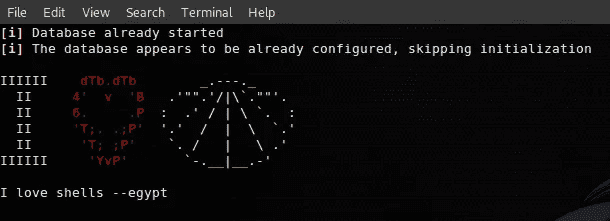
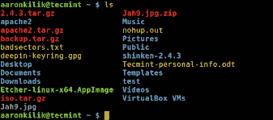
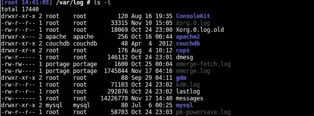

# 使用 Python Click 创建您的第一个 CLI 应用程序

> 原文：<https://betterprogramming.pub/python-click-building-your-first-command-line-interface-application-6947d5319ef7>

## 用 Python 构建命令行界面的简单指南



[*Metasploit*](https://www.metasploit.com/) *欢迎壳*

终点站的生活是甜蜜的。它可以快速启动任务，让多任务处理变得非常简单，并允许您保留那些原本会被花哨但不必要的 GUI 使用的资源。

想想看，每当您想要跟踪文件中的更改时，都必须加载一个图形界面版本控制工具——这是多么浪费时间啊。这就是我们对应用程序命令行界面的需求。当您渴望为您或您的团队使用的应用程序创建一个 CLI 时，您当然可以通过构建一个来实现它！

在本文中，我们将探索用于创建命令行界面的 [Python Click](https://pypi.org/project/click/) 。我们将熟悉 Click 最有用的功能，并在游戏中看到它们。要做到这一点，我们必须通过创建一个媒体文件转换器 CLI 应用程序来弄脏我们的手——一点脏东西没有坏处！

如果你想直接进入完整的项目，这里的代码是[。](https://github.com/hogum/audioConvertor)

在 Python click 教程的第一部分，我们介绍了一个与 click 没有直接关系的通用但非常酷的命令行界面特性。如果你要创建你的第一个 CLI 应用程序，你会发现这个有点用。但是对于直接潜水，直接进入部分 [**将点击带入画面**](https://medium.com/p/6947d5319ef7#90a9) 。

# 那么，为什么是命令行库呢？

Click 是一个 Python 库。从头开始创建自己的 CLI 是可能的。看一下这个提示:

```
$ >>> Make the world go round?
       A little [default]
       Yes
       No
```

这是一个简单的提示，要求用户从三个可用选项中进行选择。我们可以简单地使用下面的命令:

```
user_choice = input('Make the world go round?\n' +
      'A little [default]\n' + 'Yes\n' + 'No\n')
```

就像那样，我们可以在命令行与用户交互。我们大胆地希望用户能从可用的选择中给我们一个回应——这可能不会发生。这就把我们带到了解析用户输入的问题。

我们必须为回复“旋转它”或类似“我不确定”的更花哨的用户做好准备。

通过使用该条件进行循环，我们限制用户只能从三个选项中选择一个。应该可以了。

但是…请记住，如果用户没有指定任何内容，我们希望“一点点”成为我们的默认选项。我们稍微调整了一下代码来适应这一点。我们最终应该得到如下结果:

注意到解析单个用户输入需要多少耐心，这可能会减少兴奋感。大部分的努力都花在了处理不喜欢遵循指示的用户的附带情况上。

如果应用程序可以指出他们输入的错误，而不是重复同一行，那就更好了——这是另一个考虑因素。

对于一个完整的 CLI 应用程序来说，这是可能的——解析每个提示，给出描述性的错误消息，给用户频繁的反馈(我们讨厌猜测——还记得上次你使用 [***dd***](https://en.wikipedia.org/wiki/Dd_(Unix)) )。重要的是，当我们将要做一些看起来很傻的事情时，我们应该被问及我们是否确定。

我们正在弄脏我们的手。我们应该专注于功能交付。命令行库就是用来消除这种痛苦的，这样我们就可以专注于酷的部分。记住，污垢不会伤害人——只要它只是一点点污垢！


扎克·卡多夫在 [Unsplash](https://unsplash.com?utm_source=medium&utm_medium=referral) 上拍摄的照片

# 跳转到自变量向量(Argv)

在旋转世界的例子中，我们使用`input` 与用户*进行交互。*然而，让用户在启动应用程序时直接输入更有意义。

要运行我们目前拥有的，我们将使用:

```
>>> python spin_world_v2.pyMake the world go round?
 A little [default]
 Yes
 No: #    *User gives input*
```

用户必须等待应用程序运行，以给出他们想要的输入。我们认为表现良好的脚本是:

```
>>> python spin_world_v2.py 'a little'# *Then the world spins. Of course, a little*
```

这样，我们就不必等待输入提示来询问用户是否希望世界旋转。我们用`argv` 来做这件事。我们要不要再修改一下我们的第一个剧本？

运行该脚本会产生以下结果:

```
**Option 1 - Known argument**
>>> python spin_world_v2.py 'a little'

# *Output* [spin_world_v3.py 'a little'] # *Our argv list* Spinning this thing a little **Option 2 - Unknown argument**
>>> python spin_world_v2.py 'some more'# *Output* [spin_world_v3.py 'a little'] # *Our argv list* Use with: a little yes, or no. Cool?
```

我们已经创建了一个命令行脚本。当要求用户在启动应用程序时提供参数时，所有命令行应用程序都使用 argv 概念。现在，当我们看到相同的概念时，它肯定会点击，但是使用点击库。

# **界面选项**

我们一直使用外壳`*ls*`*。通过查看，我们可以学到一些关于接口的技巧。*

在终端窗口中运行`*ls*` :

```
ls
```



ls 上首页目录[ [*来源*](https://www.tecmint.com/)

*这是一个简单的工具。我们可以在不引起争论的情况下使用它，并且很高兴。*

*但是争论的使用会让我们更快乐吗？让我们看看。*

```
 *ls -l*
```

**

*运行 ls -l [ [源](https://www.tecmint.com/)*

*这里，我们通过请求细节使工具变得有点嘈杂。它向我们抛出了文件权限、所有者、组、大小、时间和名称。成功了！在这种情况下，`-l`是一个选项。让我们看看关于它的使用的文档:*

```
*>>> ls --help
Usage: ls [OPTION]... [FILE]...# *Run this to see the complete [OPTIONS] list**
```

*我们看到`ls` 只有两个参数——选项和可选路径。我们可以通过摆弄列出的选项来改变我们在文件和子目录中获得的信息的味道。*

# *界面命令*

*`ls` 有选项。然而，我们*可以*说它没有命令。命令的用途是对 CLI 的相关选项进行分组。*

```
*tool command --option*
```

*我们可以在数百个命令中拥有数百个选项。为什么不把所有东西都放在一个选项列表中呢？这就像在你的房子里放满了陷阱，这样那些陷阱崇拜者就可以来拜访你了！应用程序的维护会很困难，用户会发现很难处理更复杂的功能。*

*让我们回到我们的世界旋转的例子，看看一些很酷的命令。*

*世界的旋转在我们的掌控之中。也许我们可以指定*何时发生*旋转？我们的脚本可以有一个界面命令，允许我们设置旋转发生的时间。*

```
*python spin_world_v3.py time 0900 1700*
```

*在这里，我们设置我们希望世界旋转的时间间隔。从早上 9 点(0900 小时，因为那是我们吃早餐的时间)到下午 5 点(1700 小时，我们应该下班了)。由于现在是工作时间，我们可能希望世界在此期间比平时转得更快。*

*因此，我们给我们的应用程序一个 *spin* 命令，在这里我们可以指定旋转速度。*

```
*python spin_world_v3.py time 0900 1700 --speed 1500m/h*
```

*这让我们对 CLI 命令的概念有了简单的了解。*

# *将点击带入画面*

*我们已经了解了命令行工具是如何工作的，以及创建命令行界面的基础知识。*

*现在，让我们创建我们的媒体转换器 CLI 应用程序。我们的应用程序应该允许我们将媒体文件转换成我们选择的格式。我们经常使用视频到音频的转换工具——如果能有一个我们自己可以调整的工具，那将是令人兴奋的。*

## ***应用程序设置***

*我们的目录结构将如下所示:*

```
*| audioConvertor |-convertor
    |- __init__.py
    |- utils
      |- __init__.py
 **|- cli.py**|- tests
    |- __init__.py- setup.py*
```

*我们在文件`cli.py`中创建应用程序的接口。*

## ***添加使用选项***

*要转换一个文件，我们需要知道它的位置。所以我们需要允许用户告诉我们的应用程序从哪里获取这个文件。我们通过创建一个简单的脚本来开始构建我们的应用程序。*

*我们给用户一个选项`--input_directory`来指定转换哪个文件*。我们可以如下运行脚本:**

```
*$ python cli.py --input_directory Videos/musicVideo.mp4# *Output*
Videos/musicVideo.mp4*
```

*我们的脚本回显用户指定的文件。有用！*

*我们的用户如何知道如何与应用程序交互？一个简短的帮助菜单很有魅力。用点击*，*我们就能轻松免费地得到这个。让我们运行以下命令来检查一下:*

```
*$ python cli.py --help# *Output*Usage: cli.py [OPTIONS]audioConvertor is a command-line tool that helps convert video files to audio file formats.example: python cli.py -i input/file/path -o output/pathOptions:
  -i, --input_directory TEXT  Location of the media file to be converted
  --help                      Show this message and exit.*
```

*注意方便性*。* `-i` 也可以和`--input_directory` *互换使用。*帮助示例说输出路径也是必要的。*

```
*example: python cli.py -i input/file/path -o output/path*
```

*我们可以通过在脚本中添加以下几行来实现这一点:*

*添加的行标有`++`。添加一个选项就像调用`@click.option` 并将我们的字符串传递给修饰函数一样简单。记得按照创造的顺序把你的选择传给`main`。*

## ****解析用户选项****

*在我们试图转换文件之前确认它的存在是一种好的习惯。我们可以这样做:*

*如果用户提供了一个不存在的媒体文件，脚本现在应该会终止。但是有了 Click，解析和验证就由我们来处理了。下面的代码片段与我们刚才所做的一样:*

*奇迹发生在第六行。通过给 Click 的 options 命令提供`type` 参数，我们可以告诉 Click 确保用户给出的 as `--input_directory` 作为路径，并且它存在。*

*Click 给了我们大量的参数用于选项中。随着我们的进步，我们将会看到更多这样的例子。*

## ***添加命令***

*为了方便用户，使用命令将允许我们隔离应用程序的不同特性。这也使得添加新选项变得更加容易。例如，我们有两个选项——将它们嵌套在描述它们做什么的命令中是有意义的。*

```
*python cli.py convert -i input/file/path -o output/path*
```

*我们希望将我们的选项捆绑在一个`convert`命令中，这样我们的应用程序就可以像图中所示的那样使用。除了转换，我们还希望我们的应用程序做什么？如果我们可以播放我们转换的歌曲，那就太好了。因此，如果我们像下面这样使用它，我们的扬声器应该会弹出一些东西:*

```
*python cli.py play --playlist path/to/audio*
```

*我们知道我们希望我们的应用程序如何工作。我们开始吧。*

## ****分组命令****

*我们做的第一件事是将命令`play`和`convert`添加到我们的应用程序中。*

*让我们看一下这个脚本。*

*我们有三个功能:——`main`、`load_files`和`load_audio`。功能`main` 是通过用`@click.group` *修饰来帮助我们用 Click 将两个命令分组。这是我们的第一步。**

*之后，注意添加一个命令是多么容易——我们调用`@main.command` ,然后指定我们认为会让我们高兴的选项。*

*有这样一句话:*

```
*@click.pass_context*
```

*每当我们想要使用 command 中指定的参数，但是在不同的函数中，我们传递它的上下文。这是通过将它存储在 click *上下文对象*字典中来实现的。看看我们在第 21 行做了什么:*

```
*ctx.obj[‘VERBOSE’] = verbose*
```

*这允许我们通过传入`ctx` *来使用 click decorator 访问任何其他函数中`VERBOSE`的值。*(记得用第 52 行的`obj`参数调用 main)。例如:*

```
*def load_files(ctx, input_directory, output):
    """
        :   Convert video file input to audio.
    """
    if ctx.obj.get('VERBOSE'):
        # *shout a lot*
    else:
       #  *convert quietly**
```

*我们也为我们的命令选项引入了一些新的参数。以下是他们帮助我们实现的目标:*

*   *`required`:必输项。*
*   *`multiple`:允许用户添加多个参数，如 convert-*I*video _ 1-*I*video _ 2。*
*   *`nargs` *:* 几乎相同的一个 *s 倍数例如*convert-*I*video _ 1 video _ 2 video _ 3*

*在我们的例子中，`nargs`将帮助我们指定多个输入文件。*

*   *`is_flag`:不需要参数的布尔选项`。*

## ****转换—选项****

*让我们列出运行 convert 命令的函数`(*load_files*)`的所有 decorators。*

*这是我们 CLI 中一个命令的选项列表。现在让我们开始处理从用户那里收到的参数。为了便于维护，我们将把所有的处理功能隔离到一个新文件中，在一个名为`Convertor`的类中。*

```
*| audioConvertor|-convertor
    |- __init__.py
    |- utils
      |- __init__.py
 |- cli.py
 **|- formats.py**|- tests
    |- __init__.py- setup.py*
```

*既然我们的重点是 CLI，就不在`Convertor` 类上纠缠了。但是我努力把它很好地记录下来，所以不要担心。*

*让我们将这些行添加到我们的`cli.py`的顶部:*

```
*import click
from formats import Convertor # +convertor_instance = Convertor() # +*
```

*处理用户输入*

*让我们用上面的选项在我们的界面上摆弄一下:*

```
*$ python3 convertor/cli.py convert -i /root/Videos/# *Output*
/root/Videos/ is a directory. --recursive Needed for a directory*
```

*让我们将应用指向一个文件，并尝试再次转换它:*

```
*python3 convertor/cli.py convert -i Videos/snoring_noises.aviInput specified as file name.
.
Conversion Complete
saved: snoring_noises.mp3*
```

*应用程序应该提示我们安装`[ffmpeg](https://pypi.org/project/ffmpeg-python/)` *，*这是我们应该使用的媒体转换器库。越来越令人兴奋了！*

*接下来，让我们允许用户通过运行以下命令一次转换多个视频文件:*

```
*python3 convertor/cli.py convert -i /root/Videos/* -o /root/converted_music*
```

*这个命令应该为我们将视频文件夹中的所有视频文件转换成音频，并将输出保存到目录`converted_music`。将以下代码添加到`load_files`函数中应该可以做到这一点:*

*++在“加载文件”函数中*

## ****播放—选项****

*播放命令装饰了`load_audio`功能:*

*该应用程序现在应该允许我们加载我们选择的播放列表。*

# ***链接命令***

*每当我们想要转换一个文件然后播放它的音频，我们的 CLI 应用程序限制我们单独运行*转换*和*播放*命令。这已经足够好了，但是如果我们能像下面这样使用接口不是更好吗？*

```
*python convertor/cli.py ***convert*** -*i* my_video_file.mp4 ***play****
```

*为了一次使用多个命令，我们将`chain`参数传递给多命令:*

```
*[@click](http://twitter.com/click).group(invoke_without_command=True, chain=True)*
```

*这只是第一步。我们先援引`convert` 。当我们稍后运行`play` 时，需要知道我们转换后的文件的位置。对于每次成功的转换，我们的界面应该知道保存文件的路径。*

```
*ctx.obj[‘PLAYLIST’] = convertor_instance.get_file_save_path()*
```

*我们添加了`PLAYLIST`键作为所有子命令都可以访问的上下文。`get_file_save_path` 就是做这个的函数。在`load_files` 功能中的两个地方添加上述行:*

# *一些额外考虑*

## *单个和多个文件转换*

*为了区分单个和多个文件输入，一个改进是允许用户设置一个递归选项。在处理过程中,`recursive` 标志会告诉我们是转换一个文件还是多个文件。*

*此外，为了检查输入是否是一个目录，我们递归遍历它的所有子目录，找到任何匹配视频格式的有效文件。*

```
*if os.path.isfile(input_directory) and not recursive:
    # *convert single file* else:
# *convert multiple files**
```

*这就解决了我们的问题。我们甚至可以使用通配符`*`递归匹配输入文件:*

```
*python convertor/cli.py ***convert*** -*i* Videos/snoring*.mp4 ***play****
```

## *可选参数*

*如果我们尝试运行上述命令，我们可能会得到如下输出:*

```
*python convertor/cli.py ***convert*** -*i* Videos/snoring*.mp4 ***play***Usage: cli.py play [OPTIONS]
Try "cli.py play --help" for help.Error: Missing option "--playlist" / "-p".*
```

*这意味着`playlist` 是一个必需的参数。要使其可选，需要设置为`False` ，如下所示:*

```
*[@click](http://twitter.com/click).option('--playlist', '-p', required=**False**, type=click.Path(exists=True),
              help="Folder containing audio files to be played")*
```

# ***结论***

*就这样了，伙计们。*

*我们现在已经熟悉了命令行界面，并学习了如何使用 Click *将应用程序连接到终端。*希望这篇 Python 点击教程已经帮助你收获了一些令人兴奋的有用的东西。记住你可以在 GitHub repo[上浏览整个项目。](https://github.com/hogum/audioConvertor)*

*你太棒了。让您的下一个 CLI 更好。*