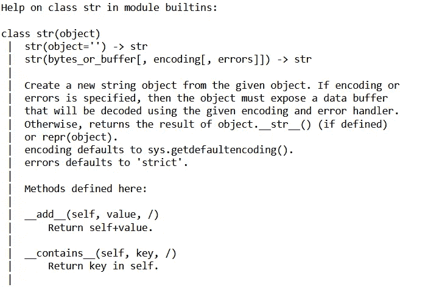

# Python 的核心语法及其背后的魔力！

> 原文：<https://betterprogramming.pub/python-core-syntax-and-the-magic-behind-them-3c912985b87c>

## 你有没有想过如何在 Python 中运行两个数字或字符串相加( `**+**` **)这样的操作，并得到合理的结果？**在这篇文章中，我们将进一步了解答案。


Sergi Viladesau 在 [Unsplash](https://unsplash.com?utm_source=medium&utm_medium=referral) 上拍摄的照片

# Python 核心语法

在 Python 中，我们可以运行类似于`1+2`或`'a' + 'b'`的操作，分别得到`3`和`ab`的结果。或者我们可以在不同的数据结构(List、Dictionary、Tuple 和 Set)上调用类似`len()`的函数，并获得元素总数，如下面的代码块所示。

```
# creating objects of different data types for demo
l1 = [1, 2, 5]d1 = {"one": 1, "two":2}t1 = (1, 2, 3)s1 = {1, "two"}​[len(i) for i in [l1, d1, t1, s1]]>> [3, 2, 3, 2]
```

这些是 Python 核心语法的一些例子。其他一些常见的 Python 核心语法类型有:

*   常见的代数表达式如`+`、`-`、`*`。
*   用于比较的常用运算符，例如`==`、`<`、`in`。
*   内置功能，例如`len()`、`str()`。
*   反射，例如`type()`、`isinstance()`等。

# 神奇的方法

> Python 能够理解这些核心语法的原因是，每当 Python 接收到一个核心语法时，它就能够将它与负责该特定语法的特定方法联系起来。

例如，当我们调用类似于`1+2`的东西时，在幕后，Python 调用一个叫做`__add__()`的方法或者当我们调用`len()`时，Python 调用`__len__()`方法。这种方法被称为*魔法方法*或特殊用途方法。查看下面的代码块进行演示。

```
result1 = 'a' + 'b'print(f"Summing up a, b with `+` = {result1}")result2 = 'a'.__add__('b')print(f"Summing up a, b with `__add__()` = {result2}")>> Summing up a, b with `+` = ab
>> Summing up a, b with `__add__()` = ab
```

注意，我们是如何使用点符号来使用神奇的函数`__add__()`的。这是因为`__add__()`是一个私有方法，它已经在`string`类中实现了，而【】类是我们对象的类类型:`a`。我们还可以在`a`上应用`dir()`函数来检查其他已经实现的方法。

```
print(f"Class of `a` is = {'a'.__class__}")print("\nAll the methods available in `a`: ")print(dir('a'.__class__))>> Class of `a` is = <class 'str'>>> All the methods available in `a`: 
['__add__', '__class__', '__contains__', '__delattr__', '__dir__', '__doc__', '__eq__', '__format__', '__ge__', '__getattribute__', '__getitem__', '__getnewargs__', '__gt__', '__hash__', '__init__', '__init_subclass__', '__iter__', '__le__', '__len__', '__lt__', '__mod__', '__mul__', '__ne__', '__new__', '__reduce__', '__reduce_ex__', '__repr__', '__rmod__', '__rmul__', '__setattr__', '__sizeof__', '__str__', '__subclasshook__', 'capitalize', 'casefold', 'center', 'count', 'encode', 'endswith', 'expandtabs', 'find', 'format', 'format_map', 'index', 'isalnum', 'isalpha', 'isascii', 'isdecimal', 'isdigit', 'isidentifier', 'islower', 'isnumeric', 'isprintable', 'isspace', 'istitle', 'isupper', 'join', 'ljust', 'lower', 'lstrip', 'maketrans', 'partition', 'removeprefix', 'removesuffix', 'replace', 'rfind', 'rindex', 'rjust', 'rpartition', 'rsplit', 'rstrip', 'split', 'splitlines', 'startswith', 'strip', 'swapcase', 'title', 'translate', 'upper', 'zfill']
```

# 在自定义类中实现神奇的方法

上面的演示展示了 Python 如何在核心语法上正常工作，魔术方法需要由操作中涉及的对象的类来交付。这也为我们在自定义类中实现神奇的方法提供了机会。

⚠️:如果你需要快速复习 Python 类，可以看看我写的关于 Python 类的文章:

[](https://towardsdatascience.com/oop-in-python-understanding-a-class-bcc088e595c6) [## Python 中的 OOP 理解一个类

### 理解 Python 类的基本组件。

towardsdatascience.com](https://towardsdatascience.com/oop-in-python-understanding-a-class-bcc088e595c6) 

例如，假设我们为一家运输汽车的卡车公司工作。为了快速检查他们上车的总重量，我们将实现`__add__()`方法。当然，这有点矫枉过正，但是将简单的事情复杂化是学习基础知识的好方法！

```
>> Total weight of mustang and prius: 6542
```

🛑注意，核心语法只在同一对象类型的范围内工作——这意味着你可以运行`'a' + 'b'`并得到一个结果，但是调用`'a' + 5`会导致一个错误。它们的操作类似，但是有一个内置的检查来确保用相同的数据类型调用操作。检查下面的代码块:

```
try: 'a' + 5except Exception as e: print(e)try: mustang + 10except Exception as e: print(e)>> can only concatenate str (not "int") to str
>> 'int' object has no attribute 'weight'
```

此外，请注意在运行相同的方法时，我们的自定义类实例与 string 对象产生的错误差异。这告诉我们，在实现这样的特殊方法时，我们还应该实现一个检查，以确保传递的对象的数据类型是预期的类型，否则会引发异常。

# 其他方法

我们已经看到了如何通过使用`dir()`函数来查看一个类的实现方法。我们还可以使用`help()`函数来查看方法的实现，前提是该类的文档可用。例如，要查看一个字符串对象的内置方法，我们可以运行这个:`help('a'.__class__)`。

运行这个命令会打印出所有的方法，占用很多空间，所以我添加了一个只有几个方法的截图。



图片来源:作者

在本文中，我们了解了 python 的核心语法。我们讨论了一些常见的核心语法，并讨论了它们相应的神奇方法。但是 Python 中已经实现了更多神奇的方法。查看来自 Python.org 的特殊方法参考页面,获取特殊方法的详细列表

感谢阅读这篇文章。希望你觉得有用。

如果您选择 Python 作为工具，那么您可能会喜欢我的另一篇关于理解 Python 异常的文章:

[](https://towardsdatascience.com/python-exceptions-what-why-and-how-44661cad3cd4) [## Python 异常——什么、为什么和如何？

### 理解 Python 中异常的工作方式以及如何正确使用它们。

towardsdatascience.com](https://towardsdatascience.com/python-exceptions-what-why-and-how-44661cad3cd4)