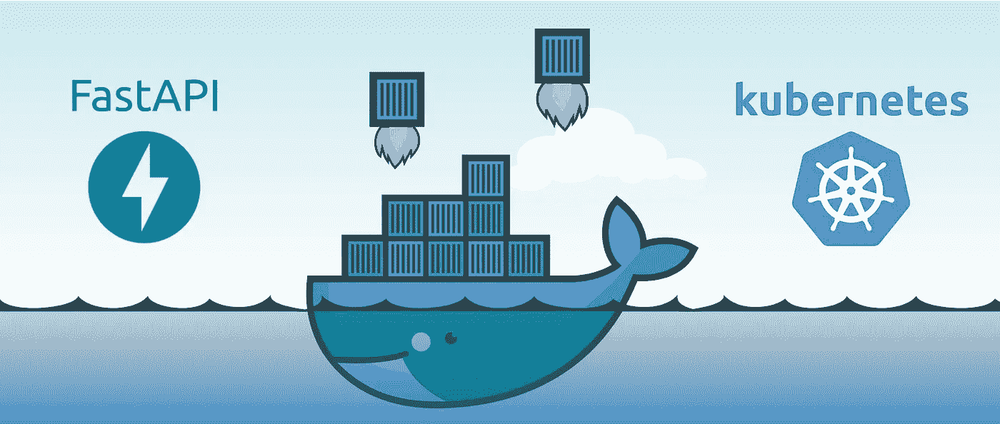
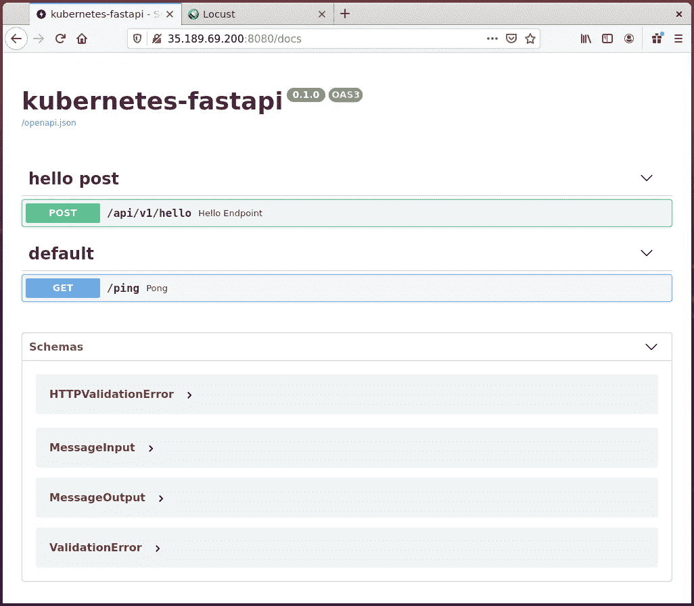
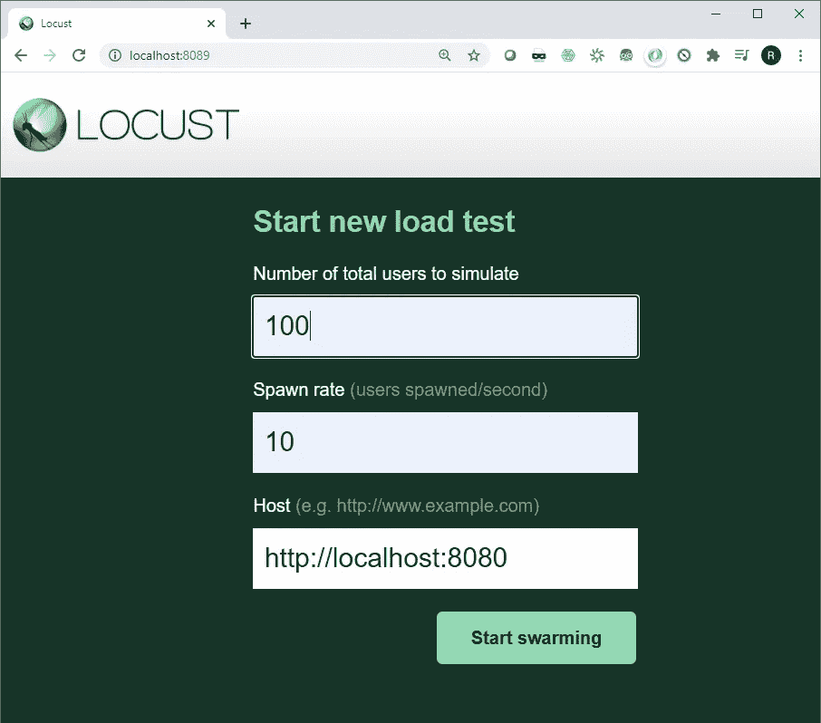
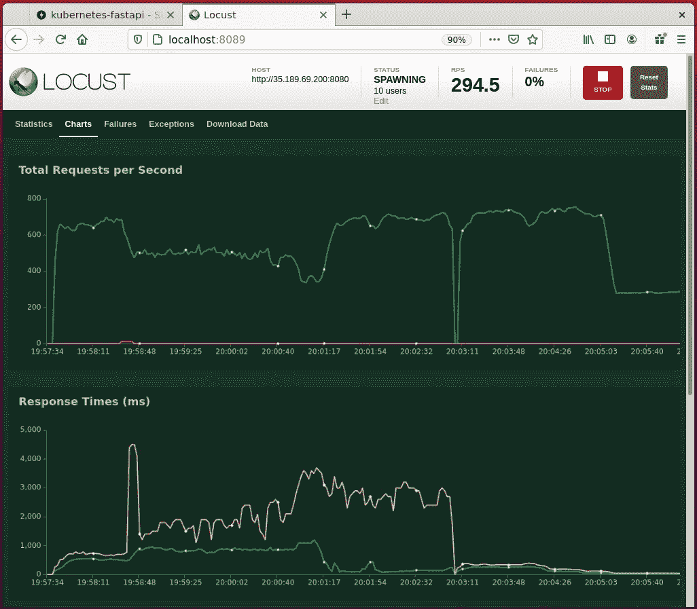

# 使用 Docker 和 Kubernetes 部署 Python API

> 原文：<https://betterprogramming.pub/python-fastapi-kubernetes-gcp-296e0dc3abb6>

## 自动扩展计算密集型工作负载，以跟上不断变化的需求



图片来源:作者

Kubernetes 允许您跨集群部署多容器应用程序——无论是在您自己的机器上还是在云中。API 是应用程序的网关，是用户(甚至其他服务)可以用来与之交互的接口。然而，构建一个 API 并不是一件难事。有了 [FastAPI](https://fastapi.tiangolo.com/) 你可以在几分钟内拥有一个工作系统，并且在你打包部署的每个阶段调试和测试都很简单。

在本文中，我们将介绍:

1.  使用 FastAPI 在 Python 中构建一个兼容 [OpenAPI](https://www.openapis.org/) 的接口
2.  将 API 打包到一个 [Docker](https://www.docker.com/) 容器中
3.  部署到本地 [Kubernetes](https://kubernetes.io/) 集群
4.  使用[蝗虫](https://locust.io/)进行负载测试
5.  使用 [Google Cloud Kubernetes 引擎](https://cloud.google.com/kubernetes-engine)部署到云(GKE)

# 快速入门

如果您只想快速启动并运行，可以克隆配套的存储库，并按照说明部署到本地 Kubernetes 集群或 Google cloud:

[](https://github.com/4OH4/kubernetes-fastapi) [## 4OH4/kubernetes-fastapi

### Kubernetes 中的准系统 Python FastAPI 基于 FastAPI-AWS-lambda-example(MIT License):运行(独立)…

github.com](https://github.com/4OH4/kubernetes-fastapi) 

如果您需要本地集群进行开发，请遵循 `[minikube](https://minikube.sigs.k8s.io/docs/start/)`的[设置说明。](https://minikube.sigs.k8s.io/docs/start/)

# 介绍

API 是你的代码的接口，无论它是一个推荐新内容的光滑的新人工智能模型，还是一个在网络上爬行寻找答案的长期运行的数据处理服务。API 使得你的代码可以被访问，这样你就可以和全世界分享它。如果您使用一个处理样板代码的框架，那么在 Python 中部署 API 是很容易的。

在本文中，我们将服务打包到 Docker 容器中。这创建了一个方便的包，它包含了运行我们的代码所需的所有依赖项。它也是一个方便的构建块，我们可以用它来进行水平扩展:如果需求增加，部署更多的容器映像副本。我们使用 Kubernetes 来管理流程编排——随着需求的变化自动调整部署。

然而，容器不是唯一的选择:功能即服务(Function-as-a-service，FaaS)是一种流行的途径，特别适合从云服务提供 API。事实上，本文的灵感来自于另一篇关于将 API 部署到 Amazon Web Services (AWS) Lambda 函数的文章:

[](https://iwpnd.pw/articles/2020-01/deploy-fastapi-to-aws-lambda) [## 如何使用 AWS SAM 将 fastAPI 持续部署到 AWS Lambda

### 我上一篇关于 fastAPI 的文章应该是一篇关于如何在预算范围内部署 fastAPI 的文章，但是…

iwpnd.pw](https://iwpnd.pw/articles/2020-01/deploy-fastapi-to-aws-lambda) 

“功能即服务”是无服务器模式的一部分，它让您专注于编写实现您的需求的代码，而服务提供商则解决如何部署和扩展的问题。它是容器使用之上的一个抽象层。如果你的代码非常标准(例如，纯 Python ),并且预计在几秒钟(或几分钟)内完成执行，那么它是值得考虑的。

我在本文中使用的例子在 FaaS 模型中可以很好地工作，但是出于几个原因，我没有选择走这条路。在构建作为本文基础的系统时，我们希望能够在内部系统和云系统之间轻松切换。不依赖于任何特定的云提供商也是有利的；我在下面使用了 Google Kubernetes 引擎，但是 API 代码也可以在 Amazon Elastic Kubernetes 服务上很好地工作。

# 构建 API

我们使用 Python 包 FastAPI 作为构建 API 的框架。主要特点:

*   它是异步的，所以可以处理多个并发请求；
*   它是 OpenAPI 兼容的，所以很容易记录和与 API 交互——比如使用包含的 UI(见下面的截图)。
*   它基于 [pydantic](https://pydantic-docs.helpmanual.io/) ，因此您可以使用标准 Python 数据类型指定输入和输出数据结构——无需额外的语法或标记语言。



记录 API 端点的 UI (SwaggerUI)的屏幕截图，甚至可以让您测试每个端点。

代码库包含以下主要文件:

```
kubernetes-fastapi/
├── Dockerfile
├── api.yaml
├── autoscale.yaml
├── locustfile.py
├── requirements.txt
├── Dockerfile
└── service/
    ├── main.py
    └── api/
        ├── api_v1/
        │  ├── api.py
        │  └── endpoints/
        │      └── hello.py
        └── core/
            ├── config.py
            ├── logic/
            │   └── business_logic.py
            └── models/
                └── input.py
                └── output.py
```

为您的目的定制 API:

更新`models/`中的输入和输出数据结构。`input.py`和`output.py`文件包含定义 API 输入和响应的字段和数据类型的类。下面是`output.py` —每个字段都有一个变量名、类型(`int`、`float`、`str`等)。)和一段描述。

每个端点后面的处理在`endpoints/`文件夹中定义——这是`hello.py`。它接收`MessageInput` 类型并返回一个`MessageOutput`:

例如，我们运行一个计算来找出一个随机数的最大质因数。结果和元数据连同格式化的字符串消息一起返回给调用者。

该计算通常需要 1-100 毫秒来完成，并且通过迭代来解决。虽然与远程服务器通信的时间并不多，但这是一项计算密集型任务，因此该过程受 CPU 限制(与 IO 限制相反)。FastAPI 使用`async`操作来并行处理多个请求——这通常可以很好地扩展，因为操作通常是 IO 绑定的，这意味着要花费时间等待其他操作完成。在等待时，控制权会移交给另一个线程，以便它可以完成自己的工作。对于 CPU 受限的操作，这种情况不会发生，因此吞吐量会低很多(参见下面关于负载测试的部分)。

其他文件:

*   `[main.py](https://github.com/4OH4/kubernetes-fastapi/blob/main/service/main.py)`初始化 API，我们还为测试目的定义了一个`ping`端点。
*   `Dockerfile`定义容器图像的内容并加载任何依赖项(在`requirements.txt`中定义)。
*   `api.yml`描述了 Kubernetes 的部署。
*   `autoscale.yml`描述了一个 Kubernetes `HorizontalPodAutoscaler`，它告诉 Kubernetes 如何根据 CPU 的使用情况来扩展应用程序的部署。
*   `locustfile.py`描述了 Locust 进行负载测试的配置(见下文)。

在下面的阶段中，我们将 API 上传到公共云，并使端点可公开访问。从网络安全的角度来看，示例 API 的风险相对较低，因为它不接受用户输入，也不包含敏感信息。也就是说，没有什么可以阻止第三方访问它或向它发送大量请求。虽然超出了本文的范围，但是如果您正在构建一个用于生产的定制服务，您应该考虑[输入验证](https://fastapi.tiangolo.com/tutorial/query-params-str-validations/)和[认证](https://fastapi.tiangolo.com/tutorial/security/)。

# 本地测试

在部署 API 之前，最好使用本地 Python 环境进行一些调试测试。首先，使用存储库中的`requirements.txt`文件安装依赖项:

```
$ pip install -r requirements.txt
```

然后使用`uvicorn`启动一个本地 web 服务器:

```
$ uvicorn service.main:app --host 0.0.0.0 --port 8080 --reload
```

当应用程序启动时，控制台应该显示许多消息。然后导航到[http://localhost:8080/docs](http://localhost:8080/docs)来探索使用 Swagger UI 界面的 API。您可以使用“尝试”按钮锻炼`/hello`和`/ping`端点。

`/hello`端点以问候和计算随机整数的最大质因数的结果作为响应。您应该会看到类似以下内容的响应正文:

```
{
  "message1": "Hello, world!",
  "message2": "The largest prime factor of 1462370954730 is 398311\. Calculation took 0.006 seconds.",
  "n": 1462370954730,
  "largest_prime_factor": 398311,
  "elapsed_time": 0.0057561397552490234
}
```

`--reload`参数告诉`uvicorn`监控源代码，并在发生更改时重新加载 API 这样您就可以继续工作并更新代码，并立即在浏览器中测试结果。按 Ctrl-C 退出。

如果安装了 cURL，也可以直接从命令行调用 API:

```
$ curl -H ‘Content-Type: application/json’ -d {} localhost:8080/api/v1/hello{"message1":"Hello, world!","message2":"The largest prime factor of 1927651733935 is 991080583\. Calculation took 0.011 seconds.","n":19276517 ....
```

# 在本地 Docker 容器中运行

下一步是将 API 打包到 Docker 容器中，在本地测试，然后推送到 [Docker Hub](https://hub.docker.com/) 。在这里的例子中，我使用我的 Docker Hub ID`4oh4.`构建和推送，您需要用您自己的 ID 替换它。或者，您可以跳过这个构建阶段，使用原始映像(未修改的)。要构建 Docker 映像:

```
$ docker build -t 4oh4/kubernetes-fastapi:1.0.0 .
```

要运行容器:

```
$ docker run -p 8080:8080 --name kubernetes-fastapi 4oh4/kubernetes-fastapi:1.0.0
```

如果您跳过了 build 命令，现在将从 Docker Hub 中提取映像。和以前一样，导航到[http://localhost:8080/docs](http://localhost:8080/docs)来探索使用 Swagger UI 接口的 API。按 Ctrl-C 退出。

如果您修改了 API 并构建了自己的容器，将映像推送到 Docker Hub(记住将`4oh4`改为您的 ID):

```
$ docker push 4oh4/kubernetes-fastapi:1.0.0
```

默认情况下，新映像创建为私有映像。与其处理认证，不如导航到 [Docker Hub](https://hub.docker.com/) ，登录，找到您的新图像，并使其可公开访问。

# 蝗虫负载试验

我们可以使用 Python 包 Locust 来模拟对 API 的大量并发请求。GitHub 存储库在`locustfile.py`中包含一个测试配置，告诉`locust`如何与 API 通信。安装软件包并从命令行运行它:

```
$ pip install locust
$ locust[2021-01-24 16:21:29,188] INFO/locust.main: Starting web interface at [http://0.0.0.0:8089](http://0.0.0.0:8089) (accepting connections from all network interfaces)
```

导航至 [http://localhost:8089](http://localhost:8089) 查看网络界面，并初始化测试——如果不在本地运行，自定义主机名:



点击开始，几秒钟后，蝗虫将开始击中 API 与流量从一个池的模拟用户。选择图表选项卡以可视化性能指标:



使用刺槐进行模拟负载测试期间的性能结果。该 API 部署在 Kubernetes 集群上，具有多种自动缩放和配置设置，因为并发用户的数量增加到了 250。

**练习:**尝试禁用计算密集型计算，并观察对响应时间和吞吐量的影响(注释掉`endpoints/hello.py`中的函数调用并返回固定值)。

# 部署到 Kubernetes 集群

现在，我们的 API 在 Docker 容器中工作，我们将把我们的应用程序部署到一个 Kubernetes 集群中。Kubernetes 将管理多个容器的编排，以便计算资源的提供与需求相匹配。我们将使用基于 CPU 使用的自动缩放策略，以便在负载增加的情况下部署更多的容器来服务 API 请求。

本节要求访问 Kubernetes 集群。我们中的大多数人家里都没有计算集群，但是可以使用`minikube`或类似工具在您的本地机器上建立一个单节点集群。[安装说明](https://minikube.sigs.k8s.io/docs/start/)可在文档中找到。或者，云提供商的受管 Kubernetes 集群也可以工作——关于部署到 Google Kubernetes 引擎的详细说明见下文。无论您选择哪条路线，我们都将使用`kubectl`工具来建立我们的集群。

我们部署的核心在`api.yaml`中描述。此配置文件包含:

*   Kubernetes 部署—描述要使用的 Docker 映像、所需资源和要公开的端口。
*   Kubernetes 服务——这描述了如何将部署呈现给外部世界，在这种情况下，是通过一个在多个(潜在的)容器之间分配流量的负载平衡器。

使用`kubectl`应用配置，检查 pod 是否启动并运行，然后列出服务以查找外部 IP 地址:

```
$ kubectl apply -f api.yamlservice/kf-api-svc configured
deployment.apps/kf-api configured$ kubectl get pods
NAME                      READY   STATUS    RESTARTS   AGE
kf-api-65d656b8c9-ppn7j   1/1     Running   0          4m$ kubectl get svc kf-api-svc
NAME         TYPE           CLUSTER-IP       EXTERNAL-IP   PORT(S)          AGE
kf-api-svc   LoadBalancer   10.105.177.140   <pending>     8080:32578/TCP   5m
```

由于我正在使用`minikube`，外部 IP 尚未分配—请使用`tunnel`命令将其连接起来:

```
minikube tunnel
```

从另一个终端(因为前面的命令仍在另一个终端中运行)，再次列出服务:

```
$ kubectl get svc kf-api-svc
NAME         TYPE           CLUSTER-IP       EXTERNAL-IP   PORT(S)          AGE
kf-api-svc   LoadBalancer   10.105.177.140   10.105.177.140     8080:32578/TCP  6m
```

外部 IP 现在公开了(它实际上与集群 IP 相同)。现在，您可以在 web 浏览器中导航到该地址，端口 8080，并且应该会看到熟悉的 Swagger UI。在我的例子中，它是[http://10 . 105 . 177 . 140:8080/docs，](http://10.105.177.140:8080/docs,)尽管您需要将 IP 地址替换为系统分配的地址。

目前，我们有一个 Docker 容器的副本运行在集群上，这很好，但是集群的真正力量来自于大规模运行。当然，如果您只在`minikube`上运行单节点集群，您将看不到扩展的好处。应用`HorizontalPodAutoscaler`策略并检查缩放的结果:

```
$ kubectl apply -f autoscale.yaml
horizontalpodautoscaler.autoscaling/kf-api-hpa configured$ kubectl get hpa
NAME        REFERENCE          TARGETS   MINPODS  MAXPODS  REPLICAS   AGE
kf-api-hpa  Deployment/kf-api  42%/50%   1        10       1          10m
```

此配置文件中的关键行告诉 Kubernetes 通过将 CPU 利用率保持在 50%来扩展 1 到 10 个副本的部署:

```
 minReplicas: 1 
  maxReplicas: 10 
  targetCPUUtilizationPercentage: 50
```

如果你愿意，现在可以用 Locust 重复负载测试(只需用集群外部 IP 替换`localhost`)。

完成测试后，取下部署、服务和自动缩放器:

```
kubectl delete deployment kf-api
kubectl delete svc kf-api-svc
kubectl delete hpa kf-api-hpa
```

# 部署到谷歌云

最后，我们将部署到基于云的 Kubernetes 集群。本地和云部署的部署过程实际上非常相似——我们只需要配置`kubectl`与集群通信。在本节中，我们将在 Google Cloud 上提供一个三节点集群，并在其上部署我们的 API。有关更多信息，请参考[文档](https://cloud.google.com/kubernetes-engine/docs/quickstart):

## 要求

*   一个 Google Cloud 帐户，可以启用计费，也可以剩余足够的免费点数。如果您没有让集群运行很长时间，这应该会产生大约 1-2 美元的费用。
*   GCP 上的一个活动项目—通过[控制台](https://console.cloud.google.com/)创建一个。
*   安装了 Google Cloud SDK—[在此下载](https://cloud.google.com/sdk/docs/install)。

首先，确保您的项目启用了 GCP Kubernetes 引擎，无论是在[这个页面](https://console.cloud.google.com/apis/library/container.googleapis.com)还是通过使用以下命令:

```
gcloud services enable container.googleapis.com
```

然后安装`gcloud kubectl`组件并用您的项目 ID 和默认区域配置`gcloud`:

```
gcloud components install kubectl

gcloud config set project my-project-id
gcloud config set compute/zone europe-west2-a
```

将`my-project-id`替换为项目的 ID——而不是名称。您可以在仪表板页面的项目信息框中找到该 ID。我住在英国伦敦附近，所以选择了`europe-west2-a`作为我的首选地区。选择哪个区域并不重要，尽管在这里指定区域可以省去以后输入的麻烦。

接下来，在 GCP 上创建一个三节点 Kubernetes 集群，并配置`kubectl`通过获取所需的凭证与它对话:

```
$ gcloud container clusters create my-cluster-name --num-nodes=3Creating cluster my-cluser-name in europe-west2-a... Cluster is being health-checked (master is healthy)...done.
...$ gcloud container clusters get-credentials my-cluster-nameFetching cluster endpoint and auth data.
kubeconfig entry generated for my-cluser-name.
```

这里`my-cluster-name`可以是你选择的任何东西。最后，部署应用程序和服务，应用自动伸缩策略，并检查结果:

```
$ kubectl apply -f api.yaml
service/kf-api-svc created
deployment.apps/kf-api created$ kubectl apply -f autoscale.yaml
horizontalpodautoscaler.autoscaling/kf-api-hpa created$ kubectl get svc kf-api-svc
NAME         TYPE           CLUSTER-IP       EXTERNAL-IP     PORT(S)          AGE
kf-api-svc   LoadBalancer   10.103.246.129   34.89.100.187   8080:31382/TCP   2m1s$ kubectl get hpa
NAME         REFERENCE           TARGETS   MINPODS   MAXPODS   REPLICAS   AGE
kf-api-hpa   Deployment/kf-api   2%/50%    1         10        1          2m20s
```

因为一切看起来都很好，所以继续使用 Locust 应用一些加载，使用集群外部 IP(端口 8080)作为目标。作为响应，您应该会看到 CPU 利用率和副本数量都有所增加:

```
$ kubectl get hpa
NAME     REFERENCE           TARGETS   MINPODS   MAXPODS   REPLICAS   AGE
kf-api   Deployment/kf-api   94%/50%   1         10        8          5m54s
```

完成后，记得关闭部署并删除集群:

```
$ kubectl delete deployment kf-api
$ kubectl delete svc kf-api-svc
$ kubectl delete hpa kf-api-hpa$ gcloud container clusters delete my-clutser-name
```

值得在谷歌云控制台中检查所有资源是否都已停止——否则你可能会收到一份意想不到的账单。安全的选择是从项目设置中完全删除项目。

# 摘要

在本文中，我们用 Python 构建了一个简单的 API，并在部署到 Kubernetes 集群(本地和云中)之前对其进行了本地测试(用本地 Python 和通过 Docker)。希望您已经看到了像`kubectl`和`gcloud`这样的工具如何模糊了在本地开发机器和集群/云资源之间的界限，使得在两者之间转移变得容易。我期待在回复部分看到您的评论和问题。

# 参考

*   [如何使用 AWS SAM 将 fastAPI 持续部署到 AWS Lambda](https://iwpnd.pw/articles/2020-01/deploy-fastapi-to-aws-lambda)
*   [FastAPI](https://fastapi.tiangolo.com/)
*   [谷歌云 Kubernetes 引擎 API](https://console.cloud.google.com/apis/library/container.googleapis.com)