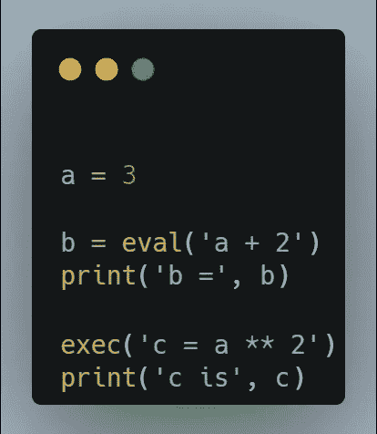
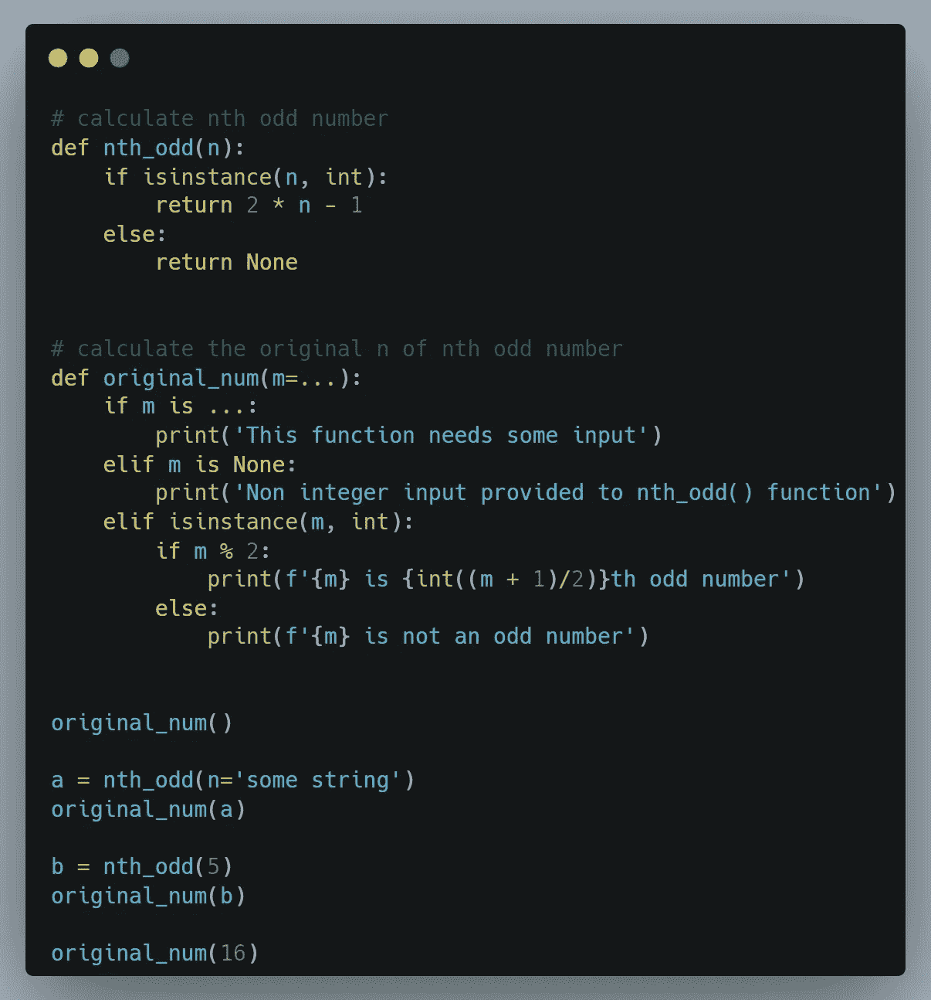

# 我甚至不知道存在的 5 个 Python 特性

> 原文：<https://betterprogramming.pub/python-features-that-i-was-unaware-even-existed-8465a50a6378>

## 3.“int”的分隔符


[杰基·罗宾森](https://unsplash.com/@jackrobinson989?utm_source=medium&utm_medium=referral)在 [Unsplash](https://unsplash.com?utm_source=medium&utm_medium=referral) 上拍照

我刚刚发现了一个新爱好:悠闲地阅读 Python 文档。当你为了娱乐而阅读任何东西时，你经常会注意到你可能忽略的有趣的细节。所以，下面是我发现的一些有趣的事实。你能用 Python 实现吗？

# 1.功能属性

您可以像为类和对象设置特性一样为函数设置特性。

在第 10 行和第 11 行，分别设置了属性“optional return”和“is awesome”。后来，在第 19 行和第 20 行，我们对这些属性进行了外部调用。代码的输出将是:

```
Final answer is 219
Show calculations --> 13
Is my function awesome --> Yes, my function is awesome
```

当您不想在每次运行函数时使用 return 语句显式返回一个变量，但仍希望能够恢复作为中间变量发送的变量时，这很有用。另外，请注意，属性可以在函数声明的内部或外部设置。

# 2.For-else 循环

Python 中的 for 循环可以添加 else 子句。只有在执行期间循环体中没有 break 语句，else 子句才会被激活。

请记住，else 是在 for 级别而不是 if 级别插入的。这个中没有一个元素的长度小于 3。因此，break 语句永远不会被使用。因此，在 for 循环完成后，else 子句将被激活，打印上面显示的输出。

有人可能会说，这可以通过记录 break 语句是否在不同的变量中找到来实现。此外，它可能会让您之后的读者更容易理解代码。获得相同结果的等效方法如下:

# 3.“int”的分隔符

现在，这是我个人的一个`favourite.Integers`比如 10000000 和 100000000(它们真的是不同的数字吗？)在视觉上很难区分。Python 将在上下文中将逗号视为许多整数的元组，因此我们不能像在英语中那样使用它们。

Python 对此有一个非常实用的解决方案:我们可以使用下划线作为分隔符，使代码更具可读性。因此，`1_000_000`将被认为是单个 int。

# 4.eval()和 exec()

Python 能够动态读取字符串，并将其视为一行代码。`eval()`和`exec()`函数(分别用于计算表达式和执行语句)就是用来做这件事的。



在第 3 行，`eval ()`函数将输入字符串作为 Python 表达式读取，对其求值，并将结果赋给变量‘b’。

第 6 行`exec()`函数将输入字符串作为 Python 语句读取并执行。

您还可以将动态构造的字符串传递给这些函数。例如，您可以创建 1000 个名为 x_0，x_1，…，x_999 的变量，而无需在代码中手动编写这些变量声明。这似乎是一个完全没有意义的特性，但事实并非如此。

> *在更广泛的编程环境中，不仅仅是 Python，eval/exec 的使用非常强大，因为它允许您编写动态代码，使用运行时可用的信息来解决甚至无法在编译时表达的问题。[……]exec 实际上是嵌入在 Python 中的 Python 解释器，因此如果您有一个特别难解决的问题，您可以解决它的方法之一是编写一个程序来*编写一个程序来解决它*，然后使用 exec 运行第二个程序。*

你可以阅读史蒂文·达普拉诺的这篇美丽的解释。

# 5.省略

椭圆或“…”是 Python 内置常数，类似于 None、True 或 False 等内置常数。它可以多种方式使用，包括但不限于:

## **5.1 未成文代码的占位符**

与 pass 一样，当代码没有完全编写好，但语法准确性需要通配符时，省略号可以用作通配符。


## **5.2“无”的替代方案。**

如果您想指示一个空的输入或返回值，通常选择 None。但是，在有些情况下，没有一个是预期的输入或函数返回值。在这种情况下，椭圆充当占位符。



`nth_odd()`函数计算给定 n 的第 n 个奇数。`original_num()`函数从第 n 个奇数计算原始数 n。

这里，`None`不能使用，因为它是`original_num()`功能的预期输入之一。它们被用作 m 参数的默认占位符。代码的输出如下所示:

```
This function needs some input
Non integer input provided to nth_odd() function
9 is 5th odd number
16 is not an odd number
```

## **5.3 NumPy 中的数组切片**

NumPy 使用省略号来分割数组。下面的代码显示了拆分 NumPy 数组的两种等效方法。

因此，'…'表示需要多少':'就有多少。

## **省略号布尔型**

与 None(布尔值为 False)不同，省略号布尔值被视为 True。

你可以在 [GitHub](https://github.com/rishavnathpati) 上关注我，在 [Linkedin](https://www.linkedin.com/in/rishav-n-67223bb9/) 上联系我。你也可以在这里阅读一些更强大的 Python 命令行程序