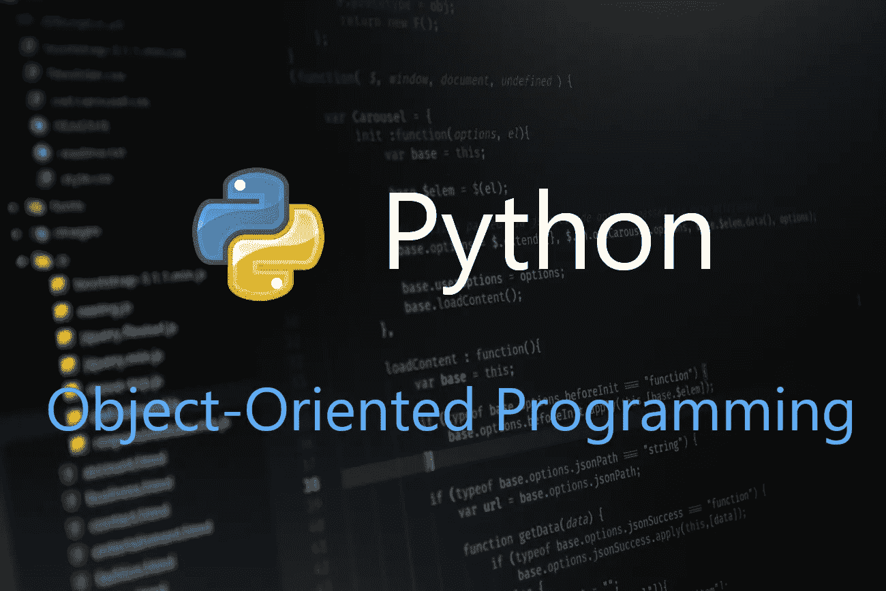

# 面向初学者的 Python 面向对象编程

> 原文：<https://betterprogramming.pub/python-for-beginners-object-oriented-programming-3b231bb3dd49>

## 封装、继承、多态和抽象



通过 Unsplash 的原始图像

```
1\. What is Object-Oriented Programming? 
2\. Classes and Objects 
3\. Parametrized Constructor 
4\. Static Fields 
5\. Nested Class 
6\. Key principles of OOP 
7\. Encapsulation 
8\. Inheritance 
9\. Abstraction 
10\. Polymorphism
```

# 面向对象编程

面向对象编程(OOP)是一种通过使用对象来表示数据和功能来编写程序的方法。这种类型的对象编程使得相互通信和交换数据变得很容易。开发人员也可以轻松地重用代码。

像 Python 这样的语言支持面向对象和函数式编程，为开发人员提供了在不同环境中工作的必要工具。要探索 Python 中的函数编程，请参考这篇[文章](https://towardsdatascience.com/python-for-beginners-functions-2e4534f0ae9d)。

# 类别和对象

类用于创建我们自己的数据类型，它们充当创建对象的蓝图。要创建一个类，我们需要使用`class`关键字。在面向对象编程中，类是包含所有变量和方法实现的蓝图。

简单来说，类是房子的蓝图，变量和方法就像房子里的房间和墙壁。看一下代码:

python 中的简单类

这里，`House`是类的名字，墙是里面的变量。`__init__`是我们已经`self`过的类的构造函数。`self`代表正在创建的类的当前对象。我们也可以使用`def`关键字在类中创建方法。看一看:

python 中的一个简单类，包含变量和方法

这里，`bedroom`是`House`类中的一个方法。同样在方法中，我们可以有内部方法和变量。现在我们已经创建了一个类，是时候学习如何创建该类的一个对象了。看一看:

创建类对象和访问类中的字段

这里我们使用了类名来创建对象，并通过该对象来访问该类中的字段。

# 参数化构造函数

在前面的例子中，我们已经创建了`House`类并硬编码了变量值。通过使用参数化的构造函数，我们可以将动态值赋给变量，并将动态输入传递给类中的方法。

参数化构造函数只不过是一个标准的构造函数，但是具有相同的输入。我们可以在构造函数中传递任意多的输入。看一看:

具有参数化类的类

和之前的课差不多，唯一的区别就是输入。在这里，我们将输入分配给类中的变量，使其成为动态的。现在，让我们看看如何创建这个类的对象。

用参数化构造函数创建类对象。

# 静态字段

在上面的例子中，我们已经使用 self-object 创建了变量，所以这些变量被称为实例变量。这意味着对于每个对象，这些值可能不相同。

我们可以在类级别创建变量，这些变量被称为静态变量。我们可以给变量赋值，除非我们试图改变它，否则它将保持不变。看一看:

python 类中的静态变量

这里，`a`是`MyClass`中的静态变量。我们可以通过对象访问静态变量，也可以直接从类名中访问。看一看:

访问静态变量

# 嵌套类

在 Python 中，我们可以像在 Java 和 Kotlin 中一样创建内部类。嵌套类的创建类似于外部类。看一下代码:

嵌套类

我们创建了一个内部的`BaseMent`,带有一个构造函数参数传递区域字段。我们需要外部类的对象来创建内部类的对象。现在，让我们看看如何创建它们:

内部类的对象创建

# 面向对象的关键原则

面向对象编程有四个关键原则。

1.  包装
2.  遗产
3.  抽象
4.  多态性

这四个原则不仅存在于 Python 中，也存在于任何支持面向对象编程的编程语言中。在本文的下一部分，我们将详细探讨它们。

# 包装

封装是在称为对象的单个单元中保护类的数据和功能的过程。这种机制通常用于保护一个对象的数据不受其他对象的影响。这是任何支持面向对象编程的编程语言的基本原则之一。

我们可以通过将类中的变量标记为私有来保护它们。我们需要添加两个下划线作为前缀来使变量私有。一旦我们将一个变量设为私有，我们就不能直接从该类的对象中访问它们。现在，让我们看看如何创建私有变量:

在类中创建私有变量

在上面的例子中，`wall`是私有变量。一旦一个变量被声明为私有变量，访问这些变量的唯一方法就是通过名称篡改。在名称管理过程中，带有两个前导下划线和一个尾随下划线的标识符在文本上被替换为`_classname__identifier` ，其中 class-name 是当前类的名称，identifier 是私有变量。

名称篡改以访问私有变量

为了在 Python 中实现正确的封装，我们需要使用 setters 和 getters，如下所示:

使用 setters 和 getters 实现正确的封装

# 遗产

继承是面向对象编程中的一个强大特性。它是创建可以从另一个类(父类/基类)派生或继承属性和方法的类的过程。

有了这个特性，我们可以轻松地表示现实世界的关系。代码的可重用性将会很简单。它具有强大的传递性——意味着当类 B 从类 A 继承时，那么从类 B 继承的类将自动从类 A 继承。

Python 中的继承

在这个例子中，`Vehicle`是父类，其中有`maxSpeed`和那个`Vehicle`的发布年份。`Bus` & `Car` 是从父车辆类派生出来的两个类。

`startEngine` & `stopEngine` 是父类中的函数。因为`Bus`和`Car` 是`Vehicle`的两个子类，所以它们可以访问那些方法。这就是我们如何通过继承实现代码的可重用性。

# 抽象

OOP 中的抽象是通过只显示方法签名来隐藏方法的实际实现的过程。在 Python 中，我们可以使用 ABC(抽象类)或者抽象方法来实现抽象。

*   `ABC`是 Python 中`abc`模块的一个类。如果我们用`ABC`扩展任何类并包含任何抽象方法，那么从这个类继承的类将必须强制实现那些抽象方法。
*   当我们用`abstractmethod`关键字注释任何方法时，那么它就是 Python 中的一个抽象方法(它不会有任何方法实现)。如果父类有`abstractmethod`并且不是从抽象类继承的，那么实现`abstractmethod` 是可选的。

Python 中的抽象

这里，`Vehicle`是从`ABC`类继承的父类。它有一个抽象方法`drive`。`Car`是从`Vehicle`继承的另一个类，所以它必须实现`drive`方法。

# 多态性

多态性意味着采取各种形式的能力。在面向对象程序设计中，表单可以被认为是行为。在 Python 中，一个对象通过多态性基于数据和输入具有不同类型的行为。方法重写也是一种多态性。

简单地说，多态性使用一个单一的实体，如方法或对象，来表示不同的行为。让我们来看一个示例代码:

Python 中的多态性

在上面的例子中，`+`操作符充当两个整数之间的加法和字符串之间的连接。这就是 Python 中多态的工作方式。

# 奖金

要了解更多关于 Python 的知识，从基础到高级，请阅读以下文章:

*   [“Python 初学者—基础知识”](https://medium.com/android-dev-hacks/python-for-beginners-basics-7ac6247bb4f4)
*   [《Python 初学者——函数》](https://towardsdatascience.com/python-for-beginners-functions-2e4534f0ae9d)

希望你学到有用的东西，感谢阅读。