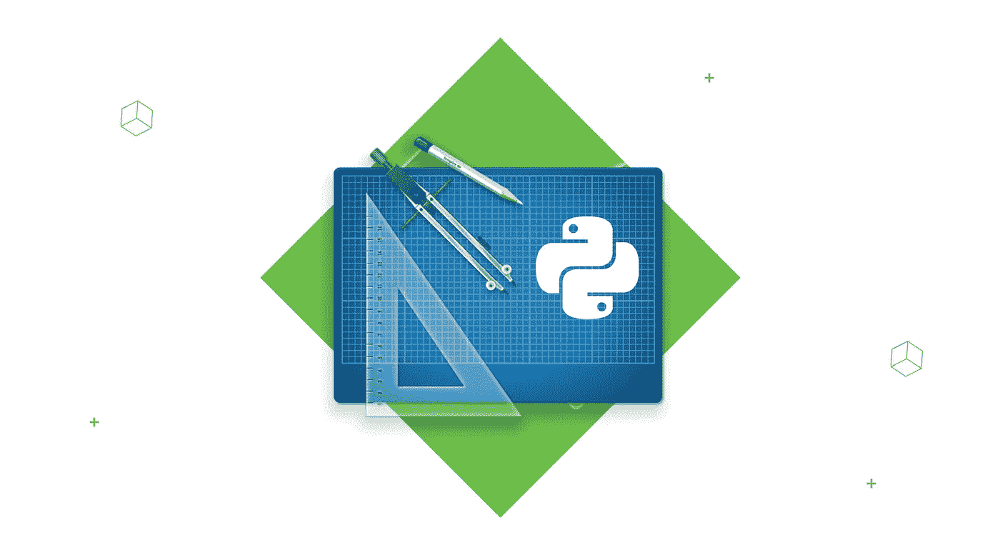
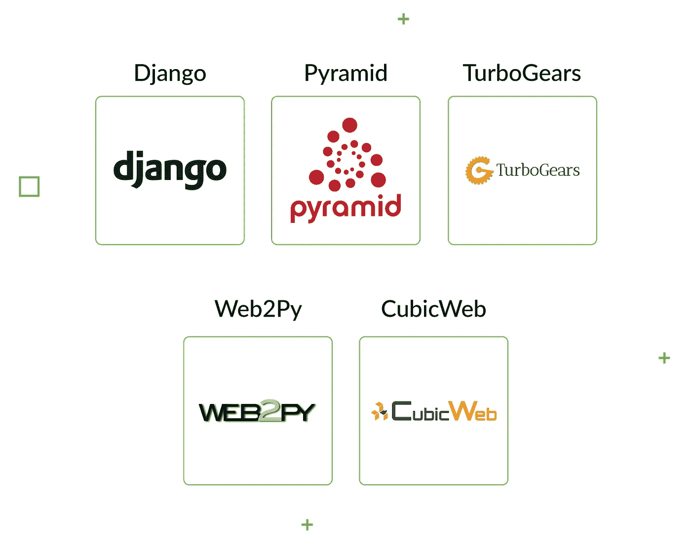
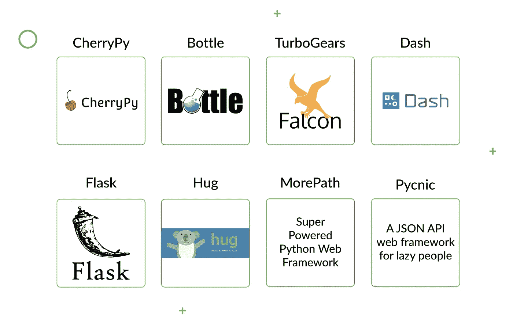
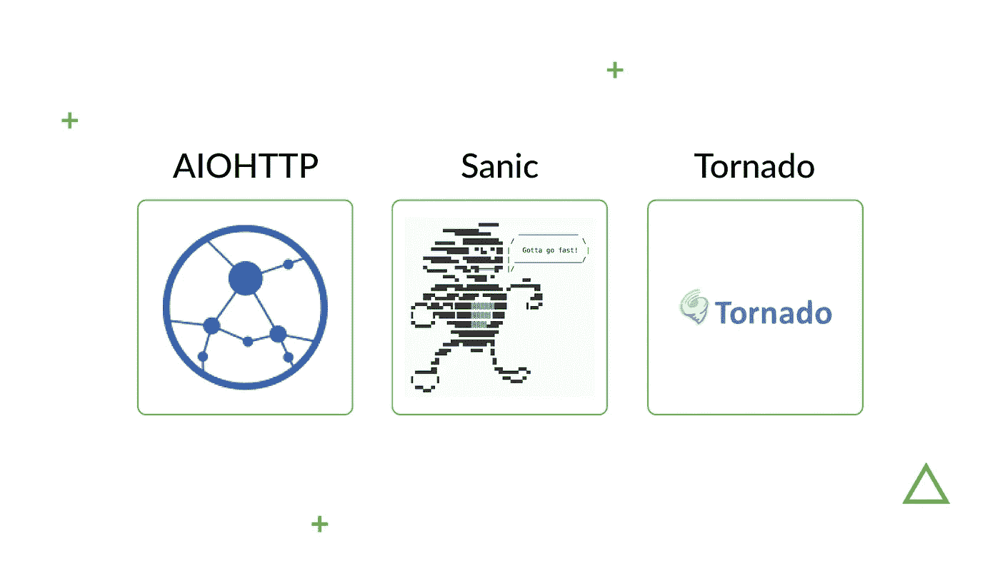

# Python 框架比较:如何选择最适合 Web 开发的框架

> 原文：<https://betterprogramming.pub/python-frameworks-comparison-how-to-choose-the-best-for-web-development-9603107ec905>

Python 因其简单的语法、丰富的库、开发能力和测试自动化而成为许多程序员和科技公司的选择。它适合开发各种项目，从[金融&银行解决方案](https://djangostars.com/industries/fintech/)到[旅游&预订平台](https://djangostars.com/industries/travel-booking/)。

就复杂程度而言，它可以让你的项目从零到一百，无论是功能有限的简单网站、API，还是包含机器学习算法的复杂解决方案。有许多框架可以帮助完成这项任务。

所有 Python 框架都可以分为三大类:全栈、微和异步。

*   **全栈框架**预装了构建应用所需的一切。这包括 MVC(模型-视图-控制器)架构、ORM(对象-关系映射)技术、模板引擎和路由器。全栈框架可用于开发任何类型的应用程序，但更常见的是用于更大的项目。
*   微框架提供了开发应用程序的基本要素，只涉及最少的编码。它们可能缺少表单验证或数据库抽象层等功能，但可以用您需要的数据库或模板引擎进行扩展。一些微框架可以轻松扩展为全栈解决方案。
*   异步编码的概念并不新鲜，但是没有多少异步框架**支持它。根据这个概念，应用程序不需要执行任务:一个任务可以在前一个任务完成之前开始运行。Python 异步框架使用 asyncio 库，可以处理大量并发连接。**

我们将给出这三个框架中哪一个适合使用的建议，它们的优缺点，特性，何时使用它们的例子，以及方便的比较表。

# 最佳全栈框架

让我们首先处理全栈框架，尽管它们对于一个小的应用程序来说可能是多余的，但是它们适用于更广泛的项目。

# 姜戈

[官网](https://www.djangoproject.com/)|[PyPi](https://pypi.org/project/Django/)|[GitHub](https://github.com/django/django)|[堆栈溢出](https://stackoverflow.com/questions/tagged/django)

Django 是一个高级框架，致力于使开发过程更加高效和快速。更准确地说， [Django 的设计哲学](https://docs.djangoproject.com/en/2.1/misc/design-philosophies/)为你节省时间和金钱，它的许多原则——比如干燥和快速开发——鼓励开发者最小化代码和减少冗余。

**应用领域** : Web 开发

**框架特点**:

*   数据库版本控制
*   模板引擎
*   对象关系映射器(ORM)
*   URL 路由
*   支持 web 服务器
*   各种各样的现成库
*   支持身份验证
*   支持国际化

## 使用 Django 的好处

**附带电池座右铭—节省您的时间**

您不需要编写基本功能的代码，因为它是预先打包好的，可以在您启动项目时轻松导入。这些软件包是由专业开发人员开发的，所以你不需要花时间来确保它们正常工作。其中一些包包括认证、Google sitemap 认证和会话管理。

**强大的社区和良好的文档**

从初学者到专业人士，Django 团结了一个坚实的、有帮助的社区，积极致力于稳定和改进框架，并互相帮助。除此之外，Django 还提供了完整的文档，因此更容易理解各种特性。

**可扩展性**

许多项目的基本特征是可伸缩性。尤其是如果你是一家不知道自己能够或将要增长多少的初创公司，Django 提供的功能可以让你创建一个小项目，并根据需要进行扩展。如果你的 web 应用程序经历了一个井喷式的增长，你可以处理更多的用户请求和更大的数据量。

**管理面板**

Django 有一个管理界面，所以您可以使用基本的 CRUD 操作来管理数据。这是一个开箱即用的解决方案，因此您可以立即开始您的项目，而不必对此功能进行编码。

## Django 框架的缺点:

*   Django 不是创建实时应用程序的首选框架，因为它不支持 WebSockets。
*   因为它预先打包了现成的特性和库，所以它看起来很庞大，好像只有一种做事方式。

**项目实例**:

*   [insta gram](https://www.instagram.com/)——一款流行的分享照片和视频内容的社交媒体应用
*   [Spotify](https://www.spotify.com/)——一个音乐分发平台，帮助用户根据自己的喜好发现新的艺术家

# 金字塔

[官网](https://trypyramid.com/)|[PyPi](https://pypi.org/project/pyramid/)|[GitHub](https://github.com/Pylons/pyramid)|[堆栈溢出](https://stackoverflow.com/questions/tagged/pyramid)

如果你是极简主义的粉丝，金字塔框架是一个不错的选择。该框架适合任何规模的项目，并为创建复杂的应用程序或扩展小型应用程序提供了许多功能。

**应用领域**:网页开发

**特点**:

*   包中资产位置的说明
*   谓词和呈现器的使用
*   URL 生成

## 使用金字塔的好处

**灵活且易于定制**

这个框架中的任何组件，比如模板引擎或数据库，都可以换成另一个。您还可以为同一个应用程序使用多个组件(例如两种 URL 映射方法)，或者连接到两个完全不同的(按类型)数据库。

**轻松使用 Ajax 请求**

多亏了 XHR 视图和装饰器，可以很容易地将 Ajax 请求发送到您想要的地方。就开发而言，这是一个相当简单的过程。

**支持 SQLAlchemy**

如果您的项目是基于 SQL 的，SQLAlchemy 是一个强大的数据库，它允许您创建复杂的查询并保持理智。

## 金字塔的缺点:

*   你需要花一些时间准备工具
*   您需要更多的金字塔经验，以适当地自定义它
*   对于简单的应用程序，SQLAlchemy 可能没有什么帮助

**项目实例**:

*   Charte . ca——一个在线图表编辑器，适合非技术用户
*   [易博客网络](https://www.easyblognetworks.com/)——托管和维护提供商
*   一个开发网络应用的环境

# 涡轮齿轮

[官网](http://www.turbogears.org/)|[PyPi](https://pypi.python.org/pypi/TurboGears2/2.3.11)|[GitHub](https://github.com/TurboGears/tg2/)|[堆栈溢出](https://stackoverflow.com/questions/tagged/turbogears)

TurboGears 是一个开源框架，用于快速开发数据驱动的 web 应用。如果你想开发一个需要数据库连接的应用，这是一个很好的选择，因为 TurboGears 支持 SQLAlchemy、石根、WebOb 和 Repoze 等工具。

**应用领域** : Web 开发

**特色**:

*   水平数据分区
*   与 MochiKit JavaScript 库集成
*   功能装饰者
*   支持多个数据库
*   支持 MVC 架构
*   ToscaWidgets
*   粘贴脚本模板
*   FormEncode 的验证支持

## 使用涡轮齿轮的优点

**多才多艺**

尽管它是一个微框架，但 Turbogears 很容易扩展为全栈解决方案。您可以轻松地组装一个原型，然后将其扩展为一个复杂的、完全成熟的应用程序。

**内置可插拔应用的可扩展性**

您可以创建自己的插件模块来替换或扩展框架中的现有模块。他们都将完全处于你的控制之下。

## 涡轮齿轮框架的缺点:

您可能会对以任何方式扩展框架的自由感到不知所措。

**项目实例**:

*   Apache Allura——一个管理代码库的在线平台，最初由 SourceForge 开发
*   销售雨伞的电子商务平台

# Web2Py

[官网](http://www.web2py.com/)|[PyPi](https://pypi.python.org/pypi/web2py)|[GitHub](https://github.com/web2py)|[堆栈溢出](https://stackoverflow.com/questions/tagged/web2py)

Web2Py 是一个可扩展的框架，具有基于 Web 的 IDE(集成开发环境)。Web2Py 有一个售票系统，每当出现错误时就给用户出票。

**应用领域**:网页开发

**特点**:

*   向后兼容性
*   基于角色的访问控制
*   内置数据安全性
*   对 MVC 架构的支持
*   多协议可读性
*   支持国际化

## 使用 Web2Py 的优点

**灵活、强大、可扩展**

对于复杂的应用程序，以及简单的、初学者友好的应用程序，Web2py 都是一个很好的选择。它有足够的特性用于高效开发，但也可以与外部库集成。

**可长期维护**

从另一个团队获取源代码并继续维护应用程序是很容易的。另外，如果代码相当旧，它仍然可以在最新版本的框架上运行。

**社区支持**

Web2Py 有一个很好的社区，你可以在那里找到帮助来掌握框架或者解决更复杂的任务。你甚至可以直接从该框架的作者马西莫·迪·皮埃罗那里得到答案。

## Web2Py 的缺点:

*   不灵活的插件系统
*   管理数据模型加载系统的困难
*   非正统的设计模式
*   不支持 Python 3

**项目实例**:

*   [IMSA](https://www.imsa.edu/) —伊利诺伊数学和科学院
*   [iTel Networks](http://itel.com/) —面向企业的云服务
*   [Showcase Workshop](https://showcaseworkshop.com/) —移动内容营销平台

# 立方体网络

[官网](https://cubicweb.readthedocs.io/en/latest/#)|[PyPi](https://pypi.org/project/cubicweb/)|[GitHub](https://github.com/search?q=cubicweb)|[堆栈溢出](https://stackoverflow.com/search?q=cubicweb)

CubicWeb 是一个由应用数据模型驱动的语义 Web 框架。这个框架使用可以通过 web 服务器、数据库和配置文件连接在一起的多维数据集，而不是模型或视图。

**应用领域** : Web 开发

**特色**:

*   多数据库支持
*   资源描述框架(RDF)支持
*   Mercurial 和 Subversion 后端存储
*   可重用组件
*   网络本体语言(OWL)
*   通过选择+查看机制半自动生成文本、JSON、XML 或 XHTML

## 使用 CubicWeb 的优点

**可重复使用的立方体**

像 Django 和其他一些 Python 框架一样，CubicWeb 鼓励开发人员重用组件(在本例中，这些组件被称为立方体)。多次使用多维数据集，而不是每次都从头开始编写代码，可以节省大量时间。

**RQL 查询**

RQL，或关系查询语言，旨在为查询关系提供清晰的语法，为您提供一种操作数据仓库和浏览关系或属性的简单方法。

## 立方网的缺点:

过多的功能可能会增加某些项目的难度。

**项目实例**:

[全栈架构对照表](https://docs.google.com/document/d/1txSZ7cZcITCypZo6cxAxY6S6tQewIb-JBfB-H-TX1YY/edit?usp=sharing)

# 最佳微框架

如果您有一个小型或中型项目，这里是我们的首选微框架。

# 樱桃派

[官网](https://cherrypy.org/)|[PyPi](https://pypi.python.org/pypi/CherryPy)|[GitHub](https://github.com/cherrypy/cherrypy)|[堆栈溢出](https://stackoverflow.com/questions/tagged/cherrypy)

CherryPy 是一个极简框架，是开发数据访问或模板技术的好选择。它速度快，使用简单，并提供多种开箱即用的解决方案来处理几乎任何类型的项目，从最简单到最苛刻的项目。

**应用领域** : Web 开发

**特点**:

*   内置插件系统
*   内置的覆盖、测试和分析支持
*   一个符合 HTTP/1.1 的 WSGI 线程池 web 服务器
*   支持多个并发 HTTP 服务器
*   配置系统

## 使用 CherryPy 的优点

**生产就绪型服务器**

如果你不想使用 gunicorn，CherryPy 有一个生产就绪的 WSGI 服务器可以替代使用。您也可以同时使用它们。

**调度员模式**

CherryPy 为代码提供了更多的组织，并支持 dispatcher 模式的各种功能。

## CherryPy 的缺点:

严重缺乏文档。这对初学者来说是一个很大的缺点，当你必须找出一个需要的特性时，它可能会在项目进行到一半时引起问题。

**项目实例**:

*   HelloSponsor —展会管理和赞助的数字化解决方案
*   [Aktion Mensch](http://aktion-mensch.de/) —德国彩票平台
*   求职搜索引擎

# 瓶子

[官网](https://bottlepy.org/) | [PyPi](https://pypi.python.org/pypi/bottle/0.12.13) ， [GitHub](https://github.com/bottlepy/bottle) ，[堆栈溢出](https://stackoverflow.com/questions/tagged/bottle)

Bottle 是一个用于创建 API 和简单应用程序的微框架。你可以用它来开发原型或个人应用。

使用 Bottle，所有的开发都发生在一个单独的 bottle.py 文件中，这既是优点也是缺点。在一个文件中工作或共享它会容易得多，但也会变得混乱。

**应用领域** : Web 开发

**特色**:

*   支持外部模板引擎
*   内置的 HTTP 服务器
*   对 WSGI 的支持
*   URL 参数支持
*   不同数据库的插件支持。

## 使用瓶子的优点——灵活性

该框架几乎拥有支持小型网站所需的一切(包括路由和模板)，并且可以用插件来实现。

## 瓶子的缺点:

*   仅适用于小型 web 应用程序
*   一个小社区
*   有限的文档和示例
*   仅依赖于 Python 标准库

**项目实例**:

*   CleverClicks —一家提供搜索引擎优化、内容和点击付费营销的数字机构
*   [Total Recall VR](http://totalrecallvr.com/) —一个记录通话和记录音频的系统
*   [玛氏招聘](http://marsrecruitment.com.au/) —澳大利亚招聘公司

# 猎鹰

[官网](https://falconframework.org/)|[PyPi](https://pypi.org/project/falcon/)|[GitHub](https://github.com/falconry/falcon)|[堆栈溢出](https://stackoverflow.com/questions/tagged/falcon)

Falcon 是开发 REST APIs 的好选择。它允许你用简洁的设计来构建应用程序，并且不需要你加载大量的依赖来构建 HTTP APIs。

**应用领域** : Web API 开发

**特点**:

*   Cython 支持
*   可扩展且高度优化的代码库
*   惯用的 HTTP 错误响应
*   REST 启发的资源类
*   直观路由
*   通过 WSGI 助手和模拟进行单元测试
*   前期异常处理

## 使用猎鹰的优点

**为 REST APIs 构建**

该框架用于开发 REST APIs，并帮助开发人员做出某些设计选择，而这在更通用的框架中是不可能的。

**轻量级，最小依赖性**

Falcon 只使用标准库 six 和 mimeparse。这使得它非常轻便。

## 猎鹰的缺点:

*   范围有限
*   极少依赖的极简方法使得 Falcon 固执己见(你应该只构建 REST APIs)

**项目实例**:

*   五星公司 —一家营销和客户忠诚度自动化公司，为当地企业提供服务
*   [Vokal](https://www.vokal.io/) —一家网页设计、开发和移动开发机构

# 破折号

[破折号](https://plot.ly/products/dash/)|[PyPi](https://pypi.python.org/pypi/dash)|[GitHub](https://github.com/plotly/dash/)|[堆栈溢出](https://stackoverflow.com/questions/tagged/plotly-dash)

Dash 是构建分析型 web 应用程序的好选择，尤其是如果您的项目基于数据科学，而您对 web 开发的机制不感兴趣。Dash 应用运行在 Flask 上，使用 HTTP 请求与 JSON 包通信，前端组件用 React 渲染。Flask 也用于扩展 Dash 的功能。

**应用领域**:分析型网络应用开发

**特点**:

*   错误处理(Dash 部署服务器)
*   高度定制化
*   LDAP 集成(Dash 部署服务器)
*   插件支持
*   用于绑定 UI 控件的简单界面，包括下拉菜单、图表和滑块
*   URL 路由(Dash 部署服务器)

## 使用破折号的好处

**无状态后端**

Dash 允许您创建无状态的 web 服务，因此很容易扩展一个应用程序可以服务的用户数量。这是通过创建更多的工作进程来实现的，因此请求可以发送到任何一个可用的工作进程。几个工人可以服务许多会话。

**仪表板组件**

Dash 使用 [React.js](https://facebook.github.io/react/) 来渲染组件，并包括一个[插件系统](https://plot.ly/dash/plugins)，你可以使用 React 创建自己的 Dash 组件。

**多用户状态**

Dash 支持多用户访问在此框架下开发的应用。这意味着多个用户可以有独立的会话。

## 破折号的缺点:

*   您可能需要比 Dash 默认组件更复杂的组件
*   您必须从 React 移植组件或编写自己的组件
*   您可能会遇到结构问题，因为您必须为每个输出单独编写每个函数的代码

**项目实例**:

*   [巨大的火球](https://great-balls-of-fire.herokuapp.com/) —展示 1988 年至 2017 年火球数据的美国宇航局应用程序
*   [寻找大脚怪](https://bigfoot-sightings-dash.herokuapp.com/)——一款展示大脚怪目击事件的应用

# 瓶

[官网](http://flask.pocoo.org/)|[PyPi](https://pypi.org/project/Flask/)|[GitHub](https://github.com/pallets/flask)|[堆栈溢出](https://stackoverflow.com/questions/tagged/flask)

Flask 是一个 WSGI 框架，可以让你从一个简单的应用程序到一个复杂的平台。它让开发人员可以自由选择使用什么库和工具。为此，Flask 的社区开发了许多扩展。

**应用领域** : Web 开发

**特点**:

*   内置快速调试器
*   HTTP 请求处理
*   内置的开发服务器
*   Jinja2 模板
*   RESTful 请求分派
*   支持插入任何 ORM
*   支持安全 cookies 来建立客户端会话
*   基于 Unicode 的
*   单元测试支持
*   符合 WSGI 1.0

## 使用烧瓶的好处

**简约直白**

使用 Flask 时，很容易理解哪些进程在运行。一旦你学会了如何使用它，即使有更新和新的实现出现，你也很难失去这项技能。

**轻松打造快速原型**

Flask 提供了构建 web 应用原型所需的所有工具，开箱即用。用框架中预打包的组件构建应用程序也很容易。

## 烧瓶的缺点:

需要很高的编程专业知识。如果你对编程不是很感兴趣，也不想详细考虑东西是如何工作的，那么学习如何使用 Flask 可能太难了。使用对你隐藏大部分本质细节的框架可能会更好。

**项目实例**:

*   rain ist——一个个性化财务规划的在线平台
*   [网飞](https://www.netflix.com/) —世界领先的在线电视网络之一
*   Lyft——一款拼车手机应用

# 紧抱

[官网](https://www.hug.rest/)|[PyPi](https://pypi.org/project/hug/)|[GitHub](https://github.com/hugapi/hug)|[堆栈溢出](https://stackoverflow.com/questions/tagged/hug)

Hug 是一个用于在 Python3 上开发 API 的 API 微框架，构建时考虑了最小的资源消耗。它是为了通过 CLI 或 HTTP 在本地进行快速而简单的开发而设计的。

**应用领域** : Web API 开发

**特点**:

*   注释驱动的验证
*   遵循“一次编写，随处使用”的理念
*   内置版本管理
*   支持自动文档

## 使用拥抱的好处

**简化 API 开发**

有了 Hug，你可以一次创建一个 API，在任何你想用的地方使用它。它还提供了多个接口，这使得开发 API 更加简单。

**自动文档生成器**

Hug 具有自动生成带有 docstrings 和 types 注释的 API 文档的功能，节省了您自己编写的时间。

## 拥抱的缺点:

它会在预处理请求时产生问题，尤其是当您需要从流中获取指定的参数时。

**项目实例**:

[Owlin](https://stackshare.io/owlin/owlin) —金融专业人士分析新闻的工具

# 更多路径

[官网](https://morepath.readthedocs.io/)|[PyPi](https://pypi.org/project/morepath/)|[GitHub](https://github.com/morepath/morepath)

MorePath 是一个模型驱动的框架，具有最小的设置足迹。它的主要焦点是可扩展性和可重用代码。MorePath 还允许创建 REST web 服务。

应用领域:模型驱动的 web 开发

**特点**:

*   通用视图和用户界面
*   超链接生成
*   宁静的建筑
*   路由到模型
*   一种通用的扩展和覆盖机制

## 使用 MorePath 的优点

**综合文档**

MorePath 有一个详细的用户指南，里面有实现的例子。还有许多关于如何在框架中处理不同任务的文章和教程。

**App 复用**

像其他一些 Python 框架一样，MorePath 支持可重用的代码，因此您不会浪费时间从头开始编写相同的功能。你也可以毫不费力地扩展、隔离或覆盖应用程序。

## 更多路径的缺点:

这是 Python 框架列表中相对较新的一项，这意味着精通 MorePath 的开发人员较少，探索和找到绕过其缺陷的方法的项目和机会也较少。

# 比重瓶

[官网](http://pycnic.nullism.com/) | [PyPi](https://pypi.org/project/pycnic/) | [GitHub](https://github.com/nullism/pycnic)

Pycnic 是一个支持 Python3 的独立框架。它很小，并且针对基于 JSON 的 API 进行了优化。Pycnic 速度很快，仅用于创建 web APIs。它的占地面积很小。

**应用领域** : Web 开发

**特点**:

*   内置错误处理
*   能够处理基于 JSON 的请求
*   处理路由
*   对 cookies 的支持

## 使用简约风格的好处——极简主义

Pycnic 只提供使用 JSON APIs 所需的功能。

## 比重瓶的缺点:

*   它的文档有限，并且只提供了实现示例
*   范围有限

[微框架对照表](https://docs.google.com/document/d/1txSZ7cZcITCypZo6cxAxY6S6tQewIb-JBfB-H-TX1YY/edit#heading=h.vbwqpsom2dpf)

# 最佳异步框架

最后，我们有一个更小的框架列表，它有可能提高程序的性能。

# AIOHTTP

[官网](https://aiohttp.readthedocs.io/)|[PyPi](https://pypi.org/project/aiohttp/)|[GitHub](https://github.com/aio-libs/aiohttp)

AIOHTTP 是一个 Python 3.5+框架，既可以用作客户端，也可以用作服务器-web 框架。

**应用领域** : Web 开发

**特色**:

*   将查询重定向到函数
*   支持客户端 web 套接字和服务器 web 套接字
*   可插拔路由
*   支持中间件

**项目实例**:

*   一个移动和网络文件管理系统
*   hot jar——一个发现用户信息的应用程序
*   健康风险预测和预防的医疗人工智能平台

# 萨尼奇

[官网](https://sanic.readthedocs.io/en/latest/) | [PyPi](https://pypi.python.org/pypi/Sanic) | [GitHub](https://github.com/channelcat/sanic)

Sanic 是一个开源框架，用于处理快速 HTTP 响应的异步请求。它与 Python 3.5 中的 await 和 async 函数兼容，这提高了速度并提供了非阻塞功能。

**应用领域** : Web 开发

**特点**:

*   不同类型的日志记录，包括访问和错误
*   基于类的视图
*   具有易于应用的装饰器支持的处理程序
*   插件支持
*   支持应用程序中子路由的蓝图
*   用于修改配置对象的点符号

**项目实例**:

*   [哦比比](http://ohbibi.com/) —一家手机游戏开发公司。
*   [job lift](https://joblift.com/)——求职平台。

# 龙卷风

[官网](https://www.tornadoweb.org/)|[PyPi](https://pypi.python.org/pypi/tornado)|[GitHub](https://github.com/tornadoweb/tornado)

Tornado 是一个异步框架和网络库，可以通过使用非阻塞网络 I/O 来扩展多个连接。对于需要长期用户连接的应用程序来说，它是一个很好的选择。

**应用领域**:网页开发

**特点**:

*   支持实施第三方身份验证和授权方案
*   Web 模板
*   高质量输出
*   支持本地化和翻译
*   实时服务
*   支持用户认证

**项目实例**:

一个用于文件管理的网络和移动平台

[异步框架对照表](https://docs.google.com/document/d/1txSZ7cZcITCypZo6cxAxY6S6tQewIb-JBfB-H-TX1YY/edit)

# 包扎

Python 有很多框架，但有些比其他的更灵活、更通用。有些比更大更复杂的项目更适合小型项目。然而，它们都在一定程度上简化和促进了开发。

在所有的框架中，我们更喜欢 Python 和 Django，因为它具有省时、可伸缩、功能方便和广泛的特性。它已经在众多项目中证明了它的可靠性，包括金融和预订平台、医疗保健系统以及其他软件和网络应用。

如果您正在考虑使用 Django 和 Python 来实现您的下一个想法，请不要犹豫，联系我们进行咨询。