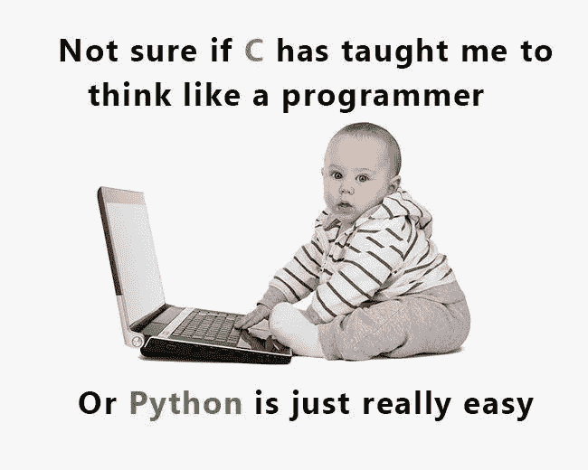

# Python:实例和类属性如何工作

> 原文：<https://betterprogramming.pub/python-how-object-and-class-attributes-work-8edf4ed9caa4>

## 比较、对比和编码类和实例属性



到目前为止，我们只讨论了 Linux 和 C 编程问题。最近在霍尔伯顿学校，我们开始学习 **Python** 。这种编程语言由 **Guido Van Rossum** 创造，于 1991 年发布，是当今最流行和使用的语言之一。开发者喜欢它的众多原因之一是它的范例之一是 **OOP** 。OOP 代表**“面向对象编程”**。在 OOP 中，数据在**对象**(或者 Python 中的**类**)中进行组织和重组，这些对象包含字段，也称为**属性**，以及**方法**，类似于函数。这使得我们有更多的可读性，可移植性和模块化的代码。

当 Guido Van Rossum 创建 Python 时，他希望它是“一流的一切”，这意味着一切都将是平等地位的对象。所以 Python 中的一切(或者几乎)都是一个**类**。一个类本质上由一个缩进的语句块组成，其中包含属性、方法、特性和其他我们在这里不讨论的东西。例如，列表(类似于 C 数组)是一个类，有预定义的方法来构建和修改它们。但是我们也可以构建我们自己的类在我们的代码中使用。

今天，我们将重点讨论**属性。同一个类可以有几个**实例**，属性可以属于单个实例，也可以属于类本身。为了说明这一点，我们将构建一个名为 *Person* 的类。每个人都是类 *Person* 的不同实例。所有的人都有属性，就像头发或者眼睛的颜色，每个人的属性都和其他人的属性不一样。**

现在，让我们只放一个“pass”语句，使它成为一个空类。

```
class Person:
    pass
```

## 关于属性的一点背景知识

在进入我们的主题之前，让我们记住一些关于属性的事情。

属性定义了一个类的特性或特征。它们可以是**变量**，是字段，也可以是**方法**，是在类内部定义的函数，可以这样调用: *<类名>。<方法名【参数】>* 。

属性可以是公共的、受保护的或私有的。不必深入了解这三个属性级别的太多细节，重要的是要知道:

*   私有属性只能在类内部使用和修改。他们的名字前面有“__”
*   受保护的属性可以在类之外使用，但仅在特定条件下。他们的名字以“_”开头。
*   公共属性可以被类内外的任何人使用和修改。

在本文中，为了简单起见，我们将主要使用公共属性。

# 什么是类属性？

类属性是属于类本身的属性。它由该类的所有实例共享，它对任何实例都有相同的值。让我们看一个例子:

如果我们执行这些行，我们将看到以下输出:

```
I am a class attribute
I am a class attribute
I am a class attribute
```

是的，所有三个 print 语句都打印相同的内容，因为 *Person* 和 *Person* 的*实例*本身都有 class 属性 *class_attr* 。

# 什么是实例属性？

实例属性是属于类的一个实例的属性，并且只能在该实例的范围内访问。让我们用我们的*人*类来说明这一点:

这将产生以下输出:

```
I am a new class attribute of the Person class
I am an instance attribute belonging to person_1
```

这里我们改变了类属性 *class_attr* ，所以我们会认为打印同一个类的一个实例的同一个属性会打印这个改变后的字符串，但实际上， *person_1* 仍然是我们在改变类属性之前创建的**实例，所以它的 *class_attr* 是一个只有 *person_1* 可以访问的实例属性。**

# 类和实例属性之间有什么区别

正如我们在例子中看到的，类和实例属性是不同的。类的所有实例都可以访问类属性，而实例属性只能由该类的特定实例访问。我们可以通过实例或类名来访问类属性，而实例属性只能通过它所属的实例来访问。

# 我们怎样才能创造它们，什么是 Pythonic 式的方法？

正如我们前面看到的，我们创建了**类属性**，方法是在类内部，在该类的方法外部声明它们并给它们赋值**。传统上，它是在班级的顶端完成的，在其他任何事情之前。**

我们还创建了**实例属性**，方法是在类的之外声明它们并给它们赋值**。还有一种方法，使用 **__init__** 方法。它是一个**构造函数**方法，在创建了一个类的实例后自动调用。它通常是类中定义的第一个方法。这是一种更 pythonic 化的方式。让我们使用我们的示例，并为*人员*添加一个*名称*属性:**

注意 *self* 关键字。它引用该类的当前实例或对象。现在我们可以这样创建一个 *Person* 的新实例:

```
person_1 = Person('Laura')
```

将调用 *__init__* 方法，并将实例属性名设置为‘Laura’。基本上就像生下一个人，叫他们劳拉！*名字*是一个实例属性，因为劳拉这个名字并不被地球上的所有其他人共享(也被称为*人物*类的其他实例)。

请注意，我们的类属性 *class_attr* 仍然存在，并且仍然可以通过以下方式访问:

```
person_1.class_attr
```

此外，我们可以定义 **getter** 和 **setter 方法**，它们将分别检索和设置 **private** 实例属性的值。还记得我们说过私有属性只能从类内部访问吗？这就是如何为一个类的实例设置和检索它们。__init__ 方法将依次调用 setter 方法或属性来设置属性的值。这些 getters 和 setters 是**数据封装**原则的一部分，这意味着类内部的细节对用户是隐藏的。在 Python 中，最好将它们作为**属性**而不是方法使用，所以我们在这里只讨论属性。让我们来看看怎么做:

哇，我们加了这么多东西！首先，@前面的行是**装饰符**。它们允许类知道当他们需要**检索**或者**设置**一个属性的值的时候去哪里看。然后，我们使用单词 *self* 来引用当前实例并访问其属性。然后我们可以看到属性和 setter 方法都有**相同的名字**，但是**不同的实参**。这是因为当我们创建一个 *Person* 的新实例时，我们可以这样做:

```
person_1 = Person('Laura')
print(person_1.name)
```

第一行将调用 *__init__* 方法，该方法又调用 setter，setter 将检查传递给它的参数的类型是否为 string，然后将 instance 属性设置为‘Laura’。第二行将知道通过调用 *name()* 属性来打印私有 *name* 属性的值。

另一种知道我们是在处理类属性还是实例属性的方法是使用 *<类名>。<属性>或*自我。<属性> 。这意味着在我们的例子中，如果我们在类中编写 *Person.class_attr* ，我们将访问类属性。但是如果我们要写 *self.class_attr* ，我们将仍然访问 class 属性，但是作为一个实例属性。它只是为这个实例创建一个实例属性，这个实例由 *self* 表示，但是与 class 属性同名。

# 类和实例属性的优缺点是什么？

类别属性的优点:

*   类的所有实例都从类继承它们。
*   它们存储与所有实例相关的数据。例如，我们可以有一个*计数器*类属性，它在我们每次创建一个新实例时递增，在我们每次删除一个实例时递减。这样我们就可以一直跟踪我们创建的同一个类有多少个实例。

类属性的缺点:

*   当您创建一个 class 属性值不同于 class 属性值的实例，然后试图通过另一个实例检索它时，这可能会变得很混乱。这种行为很快变得出乎意料。
*   不可能有两个具有不同值的实例。所以你不能用它们在不同的物体上做不同的事情。如果 *Person* 类只有类属性，我们将无法创建一个包含不同人的联系人列表。

实例属性的优点:

*   它们是特定于一个对象的，由于有了属性，它们很容易设置和获取。
*   一旦实例被删除，它们就被丢弃了，所以它们和与之相关联的实例一起消亡，这样事情就更清楚了。

实例属性的缺点:

*   它们不允许跟踪实例之间的值。
*   它们的值在删除时会丢失，这一事实在某些情况下也是一个缺点，例如，您希望保留值的历史记录。

# Python 如何使用`Dictionary?`处理实例和类属性

所有实例都有一个 *__dict__* 字典，用来存储它们的属性和相应的值。让我们举个例子:

输出:

```
{'_Person__name': 'Laura', 'class_attr': 'This is a changed class attribute'}
{'_Person__name': 'Bob'}
{'__doc__': None, 'class_attr': 'I am a class attribute', '__init__': <function Person.__init__ at 0x7f687cb7b950>, '__module__': '__main__', 'name': <property object at 0x7f687cadb6d8>, '__weakref__': <attribute '__weakref__' of 'Person' objects>, '__dict__': <attribute '__dict__' of 'Person' objects>}
```

*__dict__* 只会显示实例属性！但是 *class_attr* 不是类属性吗？它在那里做什么？嗯，我们之前说过，通过给实例 *person_1* 的 *class_attr* 赋值，使其成为与类属性*同名的实例属性，*和 *__dict__* 会优先列出实例类。同样， *person_2* 上的 *__dict__* 只会列出它知道的 *person_2* 的实例属性，而不会列出 *Person* 其他实例的属性。最后，我们可以看到，在 *Person* 类上应用 *__dict__* 也可以打印一个带有属性的字典。是的，因为即使 *Person* 是一个类，它在技术上也是一个对象，并且具有可以列出的属性。我们可以注意到*‘class _ attr’:‘我是一个类属性’*，这是我们的类属性， *name* 属性没有值，因为它的值在类的每个实例化中都给定了。

# 结论

总之，我们可以说类是 OOP 的一个强大的工具，它们可以以多种方式使用，它们的属性也是如此。选择使用类属性还是实例属性取决于我们想要创建什么样的类，在使用它们时，我们应该确保理解这两者。

# 来源

[](https://en.wikipedia.org/wiki/Python_%28programming_language%29) [## Python(编程语言)-维基百科

### Python 是一种解释型高级通用编程语言。由吉多·范·罗苏姆和第一…

en.wikipedia.org](https://en.wikipedia.org/wiki/Python_%28programming_language%29) [](https://en.wikipedia.org/wiki/Object-oriented_programming) [## 面向对象编程-维基百科

### 编辑描述

en.wikipedia.org](https://en.wikipedia.org/wiki/Object-oriented_programming) [](https://www.python-course.eu/python3_object_oriented_programming.php) [## Python 教程:面向对象编程

### 面向对象编程的一般介绍及其在 Python 中的使用方式

www.python-course.eu](https://www.python-course.eu/python3_object_oriented_programming.php)  [## 9.类- Python 2.7.16 文档

### 与其他编程语言相比，Python 的类机制用最少的新语法和…

docs.python.org](https://docs.python.org/2/tutorial/classes.html) [](https://www.python-course.eu/python3_class_and_instance_attributes.php) [## Python 教程:类与实例属性

### Python 中的面向对象编程:实例属性与类属性及其正确使用。

www.python-course.eu](https://www.python-course.eu/python3_class_and_instance_attributes.php) [](https://dzone.com/articles/python-class-attributes-vs-instance-attributes) [## Python 中的类属性与实例属性:你可能错过了什么

### 讨论 Python 编程语言面向对象的一个方面，类属性和实例…

dzone.com](https://dzone.com/articles/python-class-attributes-vs-instance-attributes)