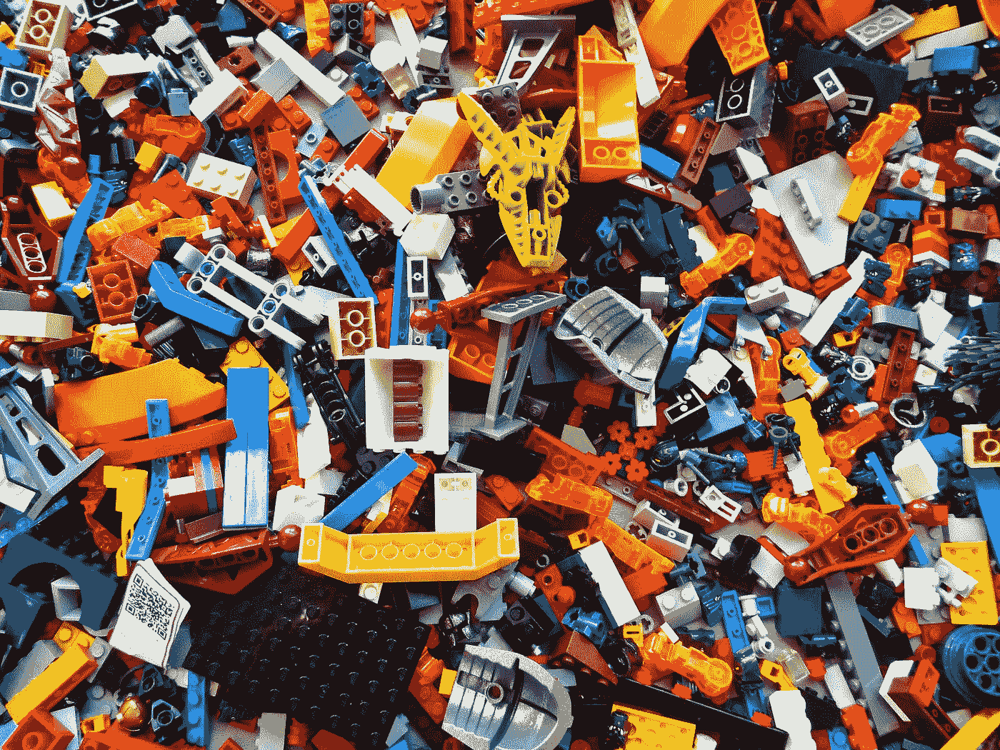

# Python 缩进:有那么糟糕吗？

> 原文：<https://betterprogramming.pub/python-indentation-is-it-that-bad-a-thing-5c9c8defb8c>

## 是不是让 Python 的语法变得很难，容易出错？

有或没有缩进，如在视觉顺序或视觉混乱？里克·梅森在 [Unsplash](https://unsplash.com?utm_source=medium&utm_medium=referral) 上的照片

许多批评 Python 的作者，甚至在 Medium 上，都指出 Python 最大的问题之一是它严格的缩进规则。让我们考虑一下是否确实如此。

Python 确实要求你实现一种特殊的缩进样式，而且这一点非常严格。如果你不这样做，你就有得到`IndentationError`或者更糟的是，错误代码的风险。批评者喜欢列举其他语言，如 Java、C#或 R，这些语言允许你按照自己的意愿缩进代码，他们强调他们多么怀念 Python 的这种自由。

缩进自由会带来更好的 Python 代码吗？缩进真的有那么糟糕吗？你真的怀念那种缩进自由吗？为了回答这些问题，让我们来看一些例子。

# 例子

考虑以下代码:

这是一个应用程序模型的代码，而不是一个实际的应用程序，但这并不重要。我不要求你详细阅读代码。而是看一下，注意缩进和花括号的使用。注意你是否喜欢语法的风格。

没错，就是 Python！但这是一条不同的蟒蛇。来自不同世界的巨蟒；一个给你缩进自由的 Python 你想怎么缩进就怎么缩进，没问题。但是当然，我们不能简单地放弃缩进。我们需要别的东西来组织代码。所以，上面的代码使用了花括号。这个解决方案似乎是个好主意。这些其他不使用缩进的语言使用花括号，因此我们的 please-remove-indentation-from-Python Python 也使用它们。

当然，这并不意味着在我们的新 Python 中不能使用缩进。想干嘛干嘛！您想使用常规的 Python 缩进样式吗？动手吧。你想打断它的流程吗？动手吧。做你想做的，但是在这样做的时候，不要忘记使用花括号。缩进自由，我们来了！

我们可以使用函数`dict()`而不是字典文字、`{}`或字典/集合理解，这是多么令人欣慰啊！我不确定解析使用花括号作为字典并将*和*设置为缩进替换器的 Python 代码是否容易。幸运的是，对我们来说没问题。如果有人决定真正实现这个新的 Python，让其他人去担心吧。

既然我们有空，我们可以用不同的风格。它看起来是这样的:

这是常规 Python 的实际应用:

这最后一个代码工作，你可以检查它。当然，该应用程序并不符合一个真实的模型，只是一些人工模型。

你怎么想呢?你喜欢花括号 Python 提供的自由吗？或者你更喜欢有缩进的 Python？

# 我的压痕故事

我来 Python 的时候，已经用了 16 年左右的 R 了。十六年！十六年的自由和花括号！我自由了。没有人让我使用空格或制表符，我可以使用制表符和空格以及我想要的任何东西——甚至什么都不用，只是花括号。

那么，我怎么会决定用 Python 的严格规则来代替这种自由呢？

原因有很多，但其中一个重要的原因是我所说的 Python 的语法卫生。说真的，这是我想到 Python 语法的第一件事，也是缩进的第一件事。你必须在 Python 中使用缩进，它让代码变得干净！干净利落。

是的，没错。花括号使用了 16 年，使用了这么多不同风格的花括号，我认为 Python 的缩进是卫生的。这意味着语法是干净的；代码清晰易读；额外的空白令人耳目一新，使代码看起来不那么杂乱，因此更整洁。

你不必同意我的观点，但是当我看到上面的三个代码片段时，我绝对认为常规 Python 是最好的。很卫生。很清楚。另外两个用 please-remove-indentation-from-Python Python 写的片段让我心烦。我不称这种缩进为自由；我称之为无政府状态。随便你怎么做，只要你记得正确使用花括号就好了。不，这对我不起作用。我不希望在 Python 代码中看到缩进无政府状态；我要看 Python 代码里的卫生！请保持 Python 的卫生！

# 结论

缩进有什么问题？我听说这很糟糕，因为复制代码有时会很困难。真的吗？在过去的四年里，当我复制粘贴代码时，我从来没有想过这真的是一个问题。声名狼藉的`IndentationError`？啊，是的，我记得，在交互会话中，我有时会在代码前加一个空格，只要去掉这个空格就可以了。

我还听说缩进是不好的，因为开发人员可以混合制表符和空格。但是为什么会有人把它们混在一起呢？然而，团队合作会导致这样的问题。但是无论你在团队中使用哪种语言，你都应该创建一个风格指南，并且所有人都应该遵循它。仅此一点就足以解决这个特殊的缩进问题。或者，您可以简单地使用`[black](https://github.com/psf/black)`或类似的工具。

坦白地说，我不理解这种对缩进的厌恶。对我来说，这是一件很棒的事情。它让 Python 代码变得如此卫生，如此干净，如此清晰。额外的空白让代码不那么混乱，更有条理。我确实记得当我使用 R 的花括号时，我不得不与之斗争。没有卫生，没有秩序，只是一片混乱，除非一个团队选择一种特定的风格并遵循它，但是所有那些花括号结束`if`——块，循环，函数，等等……非常感谢！我更喜欢四格。

让我重复一遍，我理解并接受你可以有不同的意见。你选择讨厌 Python 的缩进，我无所谓。但是请，[不要因为缩进而说 Python 不是最好的编程语言](https://nmk.world/why-is-python-the-worst-programming-language-for-gen-z-187848/):

> “需要注意的一点是，缩进在 Python 中不是可选的。这在使用条件时带来了一个问题。此外，缩进使得很难看到函数的结束位置。

真的吗？

我认为是时候给 indentation 一些信任了。我认为 Python 代码的简洁来自于各种原因，其中一个原因无非就是缩进本身。

谢谢你陪我度过这段时间。我很乐意了解你对这个令人惊讶的争议话题的看法，所以请在评论中分享你的想法。

你认为 Python 的缩进风格是有利还是不利？

你认为 Python 不使用它，而使用花括号会做得更好吗？或者，你有更好的办法来解决 Python 缩进的问题？

或许，你同意我说缩进是 Python 的优势，是它的强大之处，是什么让它的代码卫生？

# 资源

*   [https://nmk . world/why-is-python-the-worst-programming-language-for-gen-z-187848/](https://nmk.world/why-is-python-the-worst-programming-language-for-gen-z-187848/)

 [## 加入我的介绍链接媒体-马尔钦科萨克

### 阅读马尔钦·科萨克(以及媒体上成千上万的其他作家)的每一个故事。您的会员费直接支持…

medium.com](https://medium.com/@nyggus/membership)