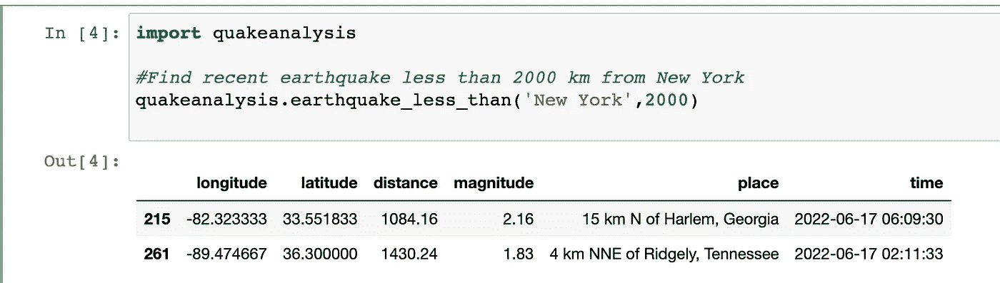
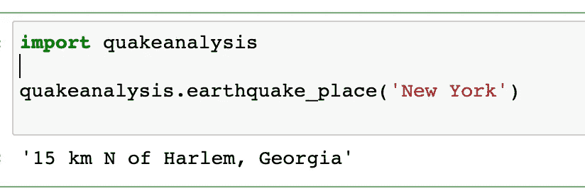
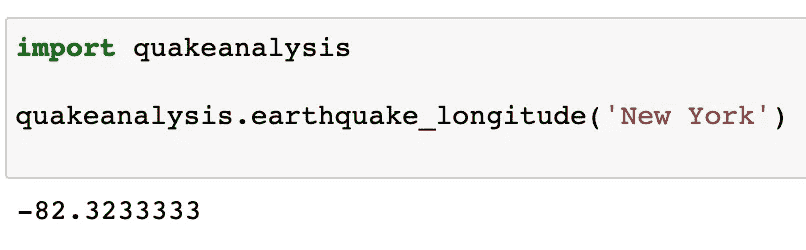
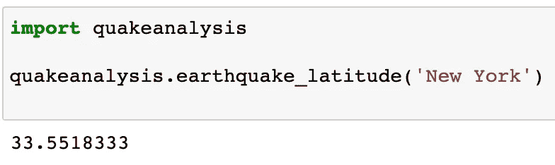
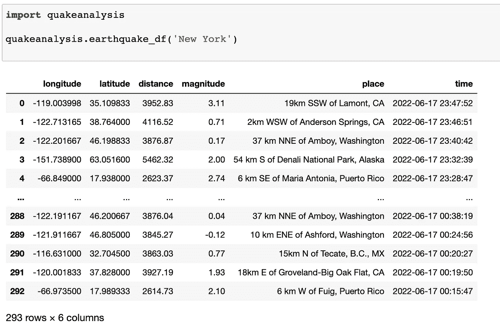

# 认识一下“地震分析”——一个用于查找最近地震数据的 Python 库

> 原文：<https://betterprogramming.pub/python-library-for-finding-nearest-earthquake-8c96f97c9ddb>

## 看看我的第一个 Python 库


pix abax:[https://pix abay . com/photos/地震-地震仪-地震波-3167693/](https://pixabay.com/photos/earthquake-seismograph-seismic-wave-3167693/)

您是否对分析地震数据感兴趣，并且需要以 Pandas dataframe 格式快速访问这些数据？你可能会发现这个图书馆很有帮助。

使用地名或邮政编码提取最近的地震数据和距离计算。

公里距离的计算是由哈弗森距离公式驱动的，你可以在这个[链接](https://towardsdatascience.com/heres-how-to-calculate-distance-between-2-geolocations-in-python-93ecab5bbba4)上了解到。

这个库由 Python 库`[geopy](https://pypi.org/project/geopy/)`提供支持，并以`[pandas](https://pypi.org/project/pandas/)` dataframe 格式返回数据。

当您安装此库时，它将导入以下内容:

```
import json 
import requests
from urllib.request import urlopen
import pandas as pd
import numpy as np
import datetime
from geopy.geocoders import Nominatim
from datetime import timedelta
from datetime import datetime
```

这是我第一次创建 Python 库，我设计它是为了让 Python 程序员，尤其是初级和中级 Python 程序员更容易获得来自 USGS 地震危险项目的公开数据。

# **仅用于原型项目**

该项目没有得到美国地质勘探局地震灾害项目的认可。该库仅用于原型制作。

对于这个库的工作来说，它依赖于美国地质调查局地震灾害项目保持他们的 API URLs 以相同的格式检索数据。

他们目前检索 JSON 格式数据的 API URL 格式是[这个](https://earthquake.usgs.gov/fdsnws/event/1/query?format=geojson&starttime=2022-05-05&endtime=2022-05-09)。

# Pip 安装地震分析

使用这个 Python 库返回离你最近的地震的数据帧列表。您将需要 pip 安装`quakeanalysis`。

```
pip install quakeanalysis
```

这个 python 库访问来自美国地质调查局地震灾害项目的地震数据。

这个 Python 库访问的数据也可以直接从他们的[网站](https://earthquake.usgs.gov/earthquakes/feed/v1.0/geojson.php)以 JSON 格式获得。

最新的数据通常是昨天(在编写本报告时)的数据。

# 导入地震分析

一旦您完成了 pip 安装并将`quakeanalysis`导入到您的 Python 项目中，您就可以开始了

```
import quakeanalysis
```

# 需要一份距离纽约不到 2000 英里的近期地震列表吗？

```
quakeanalysis.earthquake_less_than(‘New York’,2000)
```



# 找到离地震最近的地名

```
**#enter a place name to get place of nearest earthquake** 
quakeanalysis.earthquake_place(‘New York’)
```



# 找到最近地震的经度

```
 **#enter a place name to get longitude of nearest earthquake** 
quakeanalysis.earthquake_longitude(‘New York’)
```



# 找到最近地震的纬度

```
**#enter a place name to get latitude of nearest earthquake** 
quakeanalysis.earthquake_latitude(‘New York’)
```



# 找到最近地震的震级

```
**#get the magnitude of nearest earthquake** 
quakeanalysis.earthquake_magnitude(‘New York’)
```


# 获取最近所有地震的数据列表以及它们到地震发生地点的距离

```
**#To get dataframe list of all recent earthquakes and their distance from place** 
quakeanalysis.earthquake_df(‘New York’)
```

