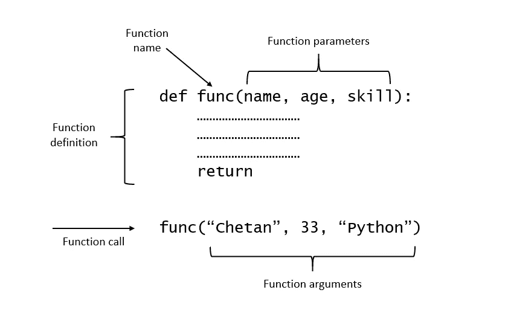
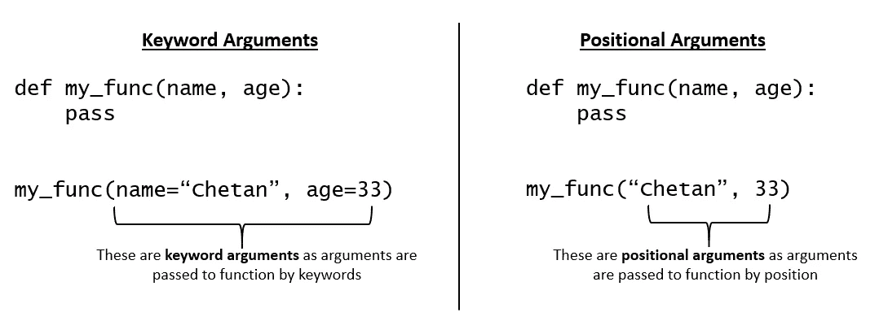
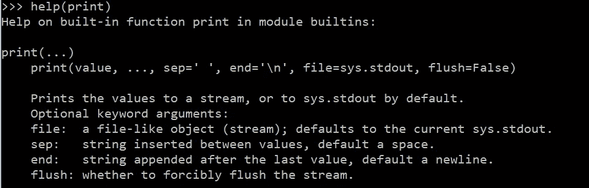
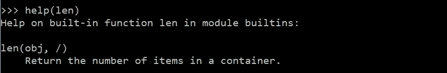
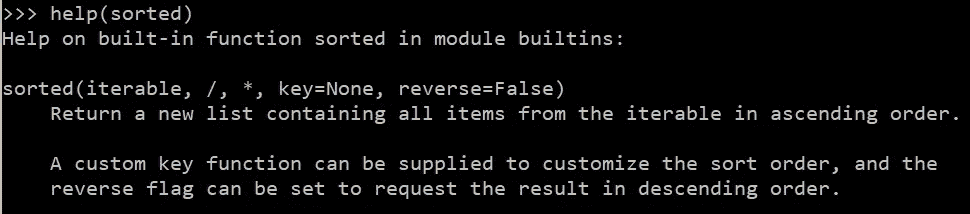
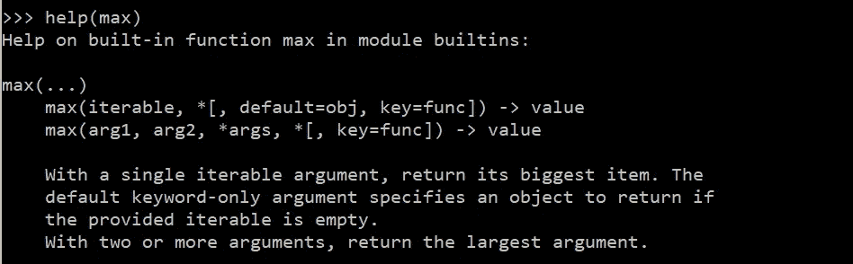
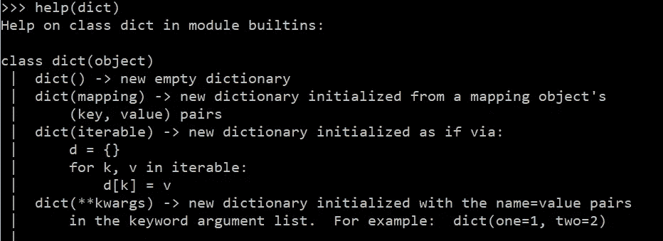
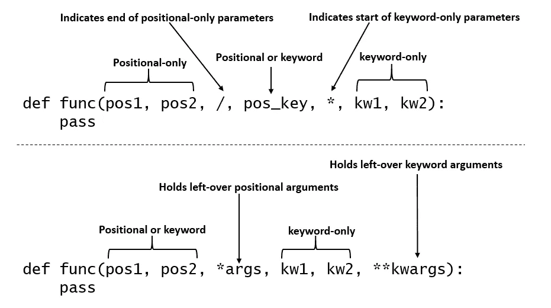

# Python 参数和自变量去神秘化

> 原文：<https://betterprogramming.pub/python-parameters-and-arguments-demystified-e4f77b6d002e>

## 关于 Python 中的参数、自变量及其类型，您需要了解的一切


来源: [Unsplash](https://unsplash.com/photos/npxXWgQ33ZQ)

什么是参数和实参？大多数时候我们会互换使用这两个术语，这没什么。然而，重要的是你要理解两者之间的区别。在本文中，我们将详细探讨它们。在这个过程中，您将了解到关于 Python 中的参数和自变量的所有知识。

***注意:*** *如果下面讨论的任何功能出现语法错误，请确保您使用的是最新版本的 Python——3.8 或 3.9。*

# 参数和自变量

## 因素

参数是出现在函数定义中的名称。在下面的例子中，`name`、`age`、`skill`、**、**是出现在函数定义中的参数**、*、*、**。

```
def my_func(**name, age, skill**):
    pass
```



作者图片

## 争论

参数是出现在函数调用中的名字。在下面的例子中，`‘Chetan’`、`33`和`‘Python’`是调用函数`my_fync`时出现的参数。

```
my_func(**'Chetan', 33, 'Python'**)
```

# 参数的类型

有两种类型的论点。在下一节中，您将看到这些参数是如何工作的，并附有示例，但是首先，让我们来探索一下语法。

## 关键字参数

在函数调用中，关键字 argusment 前面是**标识符/变量**。在上面的例子中，`"chetan"`和`33`是关键字参数。如您所见，它们前面有标识符`name`和`age`。关键字参数遵循`key=value`对语法。这些也称为命名参数。



作者图片

## **位置参数**

任何通过位置传递给函数的参数都称为位置参数。因此，位置参数前面没有标识符。在上面的例子中，`"chetan"`和`33`是位置参数，因为它们通过它们的位置传递给函数，并且它们前面没有任何标识符。

# 参数类型

有五种不同类型的参数。让我们探索语法并理解它们如何与示例一起工作。

## **位置或关键字**

指示可以通过位置或关键字传递给函数的参数。首先是位置参数，然后是关键字参数。在下面的语法中，`pos1` 是位置参数，`key1`是关键字参数。

```
def func(**pos1**, **key1=None**):
    pass
```

示例:

Python 的内置函数`print()` 利用了位置或关键字参数，从下面的函数定义可以看出。



作者图片

## **仅定位**

指示只能通过位置传递给函数的参数。您可以使用`**/**`符号创建仅位置参数。在`**/**`之前的所有参数都是*严格的位置专用参数*。

在下面的语法中，`pos_only1`和`pos_only2`是位置唯一的，这意味着在函数调用期间，我们不能像`pos_only1=10`等那样将它们用作关键字参数。函数调用想`func(10, 20, 30)`其中 10，20 对应于`pos_only1`和`pos_only2`，30 可以是位置参数也可以是关键字参数。

```
**def** func(**pos_only1, pos_only2**, /, positional_or_keyword):
    pass
```

示例:

Python 的内置函数`len()`使用了仅位置参数，正如您在下面的截图中看到的函数定义。



作者图片

## **仅关键字**

这表明参数只能通过关键字传递给函数。您可以使用`*`符号创建仅关键字参数。所有跟在`*`后面的参数都是严格的关键字参数。

在下面的语法中，`pos_only1`和`pos_only2`是位置参数，`key_only1`和`key_only2`是关键字专用参数。这意味着`key_only1`和`key_only2`都只能作为函数调用中的关键字参数。

```
def func(pos_only1, pos_only2, *, **key_only1, key_only2**): 
    pass
```

示例:

Python 的内置函数`sorted()`同时使用了仅关键字参数和仅位置参数，您可以在下面看到函数定义:



作者图片

## **可变位置**

当应用程序需要任意数量的位置参数时，此参数非常有用。这是通过在参数前添加`*`来实现的。`*args`保存任意数量的剩余位置参数。注意变量`args`的使用不是强制性的。您可以使用任何变量名，但 args 已经成为事实。`args`以元组的形式返回它的值。

```
def func(***args**): 
    pass
```

**示例**

Python 的内置函数`max()`利用了变量位置参数`(*args)`，从函数定义中可以看出。



作者图片

## ***Var-keyword***

当应用程序需要任意数量的关键字参数时，此参数非常有用。这是通过在参数前添加`**`来实现的。`**kwargs`保存任意数量的剩余关键字参数。与 args 类似，变量`kwargs`的名称也不是强制的。`**kwargs`返回一个包含参数及其自变量的字典。

```
def func(****kwargs**): 
    pass
```

示例:

Python 的内置函数`dict()`就是一个 Var-keyword 参数的例子。请参考下面的函数定义:



作者图片

下图中的两种语法很好地总结了我们到目前为止学到的关于参数的一切:



作者图片

*****亲小贴士 2:*** *了解*`*positional*`*`*positional-only*`*`*keyword*`*`*keyword-only*`*参数的区别非常仔细。如果一个参数是位置型的，这意味着它也可以通过位置或者作为函数调用中的关键字参数来传递。但是如果它是* `*positional-only*` *就意味着它是严格意义上的位置参数——它不能在函数调用中用作关键字参数。同样的解释也适用于* `*keyword*` *和* `*keyword-only*` *参数。******

# ****摘要****

*   ****参数出现在函数定义中，变量出现在函数调用中。****
*   ****有两种类型的参数(*位置和关键字参数*)和五种类型的参数(*位置或关键字、仅位置、仅关键字、变量位置和变量关键字*)。****
*   ****位置参数也可以有默认值，可以使用关键字来指定。****
*   ****函数定义中所有在`**/**`之前的参数都是严格位置的(仅限位置)。****
*   ****函数定义中所有跟在`*****`后面的参数都是严格的关键字(仅关键字)。****
*   ****`*args`保存任意数量的剩余位置参数。****
*   ****`**kwargs`保存任意数量的剩余关键字参数。****
*   ****在函数调用中，位置参数不能跟在关键字参数后面。****
*   ****在函数定义中，`**kwargs`之后没有参数。这是所有参数的结尾。****

****我希望你喜欢阅读这篇文章。如果你喜欢我的文章并想订阅 Medium，你可以在这里这样做:****

****[](https://chetanambi.medium.com) [## Chetan Ambi -介质

### 阅读 Chetan Ambi 在媒体上的文章。数据科学|机器学习| Python。参观 https://pythonsimplified.com/…

chetanambi.medium.com](https://chetanambi.medium.com)**** 

# ****参考****

1.  ****[https://docs . python . org/3/FAQ/programming . html # FAQ-argument-vs-parameter](https://docs.python.org/3/faq/programming.html#faq-argument-vs-parameter)****
2.  ****[https://www.python.org/dev/peps/pep-0570/](https://www.python.org/dev/peps/pep-0570/)****
3.  ****[https://www.python.org/dev/peps/pep-3102/](https://www.python.org/dev/peps/pep-3102/)****