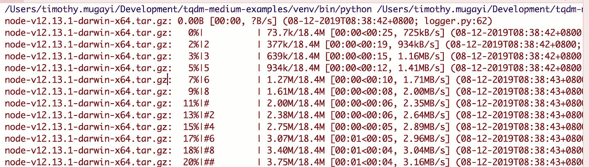
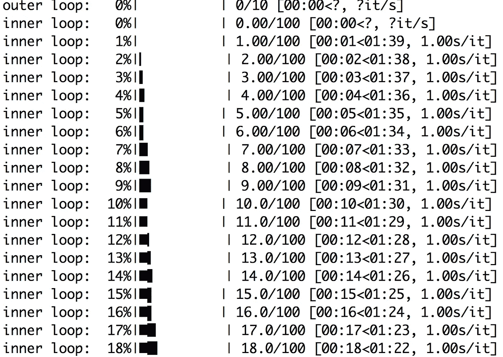
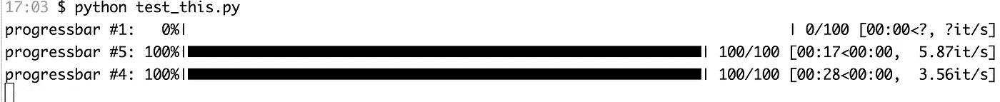
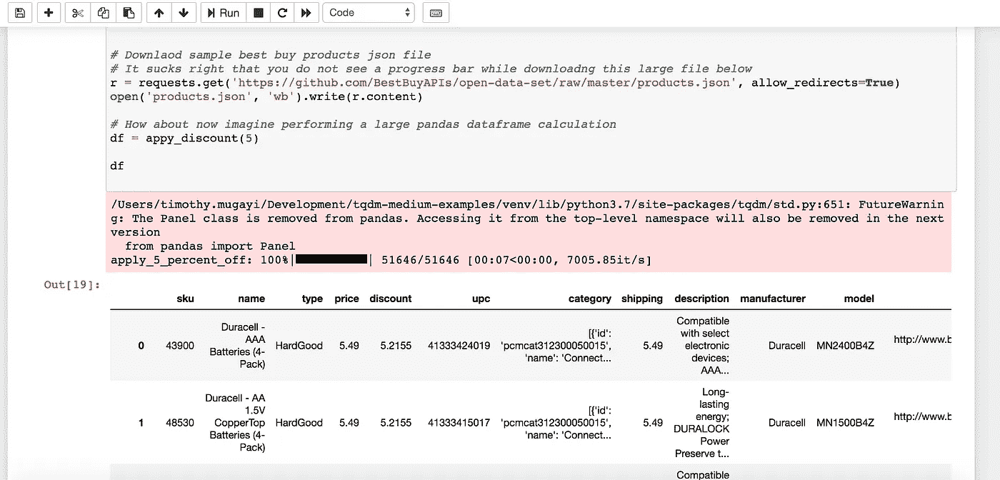
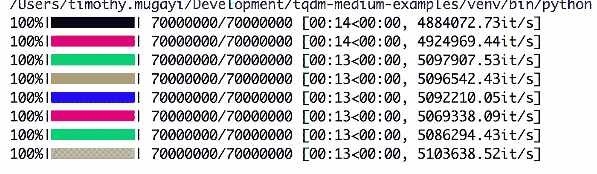
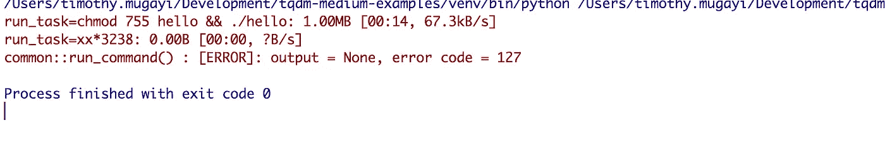

# 带有 Tqdm 的 Python 进度条示例

> 原文：<https://betterprogramming.pub/python-progress-bars-with-tqdm-by-example-ce98dbbc9697>

## *了解如何利用 Juypter 笔记本和 Python 应用程序中的进度条*


进度条可以设定期望值，给人一种活动的印象，并且可以镇定神经。我们已经拥有它们很多年了，有些令人兴奋，有些令人厌烦，有些只是没有很好的记录。

进度条本质上是根据完成任务的进度百分比来填充的。条形图的移动基于任务中的某些里程碑。这通常是通过预先计算要处理的输入项，然后用`number_of_items_processed`除以`total_input_items`来计算进度来实现的。当然，这是对问题的过度简化。还有其他因素需要考虑，例如网络速度、延迟，以及如果将数据保存到本地存储中以获得更准确的 ETA ( *估计到达时间*)，写入速度。

如果你正在阅读这篇文章，你可能和我一样，对网上有限的 tqdm 例子感到沮丧，这些例子没有很好地说明这个包在各种用例中是如何工作的。这些例子似乎假设您事先已经知道这个包是如何工作的。如果您不擅长清除 Git 问题，您可能无法在社区和开发人员之间的来回对话中找到您需要的示例。

在我们划分之前，让我们理解 tqdm 的实际含义。当我第一次开始了解 tqdm 时，这个名字让我迷惑不解。我完全不明白为什么这个包会被这样命名——这看起来完全不相关。那是因为我不懂阿拉伯语。Tqdm 在阿拉伯语中是 *taqadum 的简称，*意为**进步**。

Tqdm 包是 python 中较为全面的进度条包之一，对于那些希望构建脚本来让用户了解应用程序状态的情况来说非常方便。Tqdm 可以在任何平台(Linux、Windows、Mac、FreeBSD、NetBSD、Solaris/SunOS)上的任何控制台或 GUI 中工作，并且对 IPython/Jupyter 笔记本也很友好，我们将在 pandas 的一个示例中看到这一点。

请注意，tqdm 不能很好地配合 Python 的核心日志库。你可能不得不求助于黑客来获得同样的无缝进度条。由于 tqdm 生成的进度条利用回车符和换行符来控制字符，因此了解它们在不支持这一功能的环境中的使用情况非常重要。例如，在 Jenkins 日志记录终端或第三方日志记录框架(如 splunk、cloudwatch 和 Loggly 等)中，期望的输出可能不是您所期望的，例如，输出被流式传输到每一行，如下所示:



这个简短的教程将会给你一些例子来帮助你快速上手，而不会在这个过程中伤到你的背。这里的例子补充了 tqdm 已经在他们的 git 存储库上展示的内容，增加了对代码如何工作的理解。请随意在评论中添加示例，以便该资源可以作为其他开发人员的参考点。现在，让我们开始在您的本地机器上设置 tqdm。

# 先决条件

Python 3 必须安装在您的机器上。如果你在 Mac 上，你可以使用 Brew 或者按照 [Python 网站](https://www.python.org/downloads/)上的设置说明进行操作。如果您使用的是 Windows，Python MSI 应该为您跑腿，至少在配置路径变量和安装 Python 方面。

```
$ brew install python3
```

注意 Pip3 是和 Python3 捆绑在一起的。通过 pip 运行安装 virtualenv:

```
$ pip3 install virtualenv
```

确定您想要编写代码的目录，并创建一个[虚拟环境](https://docs.python.org/3/tutorial/venv.html):

```
$ virtualenv -p python3 <your-desired-path>
```

激活 virtualenv:

```
$ source <desired-path>/bin/activate
```

如果您希望停用 virtualenv，您可以执行以下命令:

```
$ deactivate
```

执行:

```
$ pip install tqdm
$ pip freeze > requirements.txt
```

创建一个运行 python 代码的虚拟环境是您应该遵循的最佳实践。Python 虚拟环境为 Python 项目创建了一个隔离的环境。这意味着每个项目都可以有自己的依赖项，而不管其他项目有什么依赖项。激活指示 pip 在被调用时将软件包安装到您创建的虚拟环境文件夹中。停用会关闭终端会话中到虚拟环境的链接。运行 pip freeze 可让您获取与您的应用程序一起工作的当前版本的包的快照。让我们浏览一些 tqdm 使用案例。

# 向 for 循环添加进度条

您可以轻松地添加一个进度条，而不是在 Python 循环的每次迭代中打印出索引或其他信息来查看进度，如下例所示。在循环中添加进度条可以让您在运行长脚本时随时了解情况。如果您在 Windows 机器上运行，您可能需要添加 colorama pip 包。

```
import time
import sys
from tqdm import trange

def do_something():
    time.sleep(1)

def do_another_something():
    time.sleep(1)

for i in trange(10, file=sys.stdout, desc='outer loop'):
    do_something()

    for j in trange(100,file=sys.stdout, leave=False, unit_scale=True, desc='inner loop'):
        do_another_something()
```

这给了我们一个漂亮的嵌套进度条。对于每个外部循环，迭代十次。默认情况下，tqdm 打印到 sys.stderr 输出流。要将其重新引导到标准输出流，可以使用下面的参数:`file=sys.stdout`



嵌套 for 循环中的 tqdm 嵌套进度条

# 进度条的预测性手动更新

它们是您需要控制并以一定的时间间隔手动更新进度条的实例。例如，当以块或流数据的形式下载多部分文件时。可以认为这是周期性的时间间隔更新或以特定的时间间隔脉动。Tqdm 包允许我们手动邀请更新进度条功能，如下例所示:

```
import time
import sys
from tqdm import tqdm

def do_something():
    time.sleep(1)

with tqdm(total=100, file=sys.stdout) as pbar:
    for i in range(10):
        do_something()
        # Manually update the progress bar, useful for streams such as reading files.
        pbar.update(10)
        # Updates in increments of 10 stops at 100
```

上面的 tqdm 类属性`total`是预期的迭代次数，在上面的代码中已经设置为 100。对函数 update 的调用在每次迭代中递增 10，直到达到 100%。
如果未指定总数，则尽可能使用`len` (iterable)。如果你忽略这个
，只显示基本的进度统计(没有 ETA，没有进度条)，这可能对你没有用，但仍然显示后台正在进行的工作。

# 用 Tqdm 进度条下载大文件

对于这个例子，您需要通过 pip 将一个[请求包](https://github.com/psf/requests)和[验证器](https://validators.readthedocs.io/en/latest/#installation)添加到您的 Python 站点包中。

```
$ pip install requests validators#  Copyright 2019 tiptapcode Authors. All Rights Reserved.
#
#  Licensed under the Apache License, Version 2.0 (the "License");
#  you may not use this file except in compliance with the License.
#  You may obtain a copy of the License at
#
#       http://www.apache.org/licenses/LICENSE-2.0
#
#  Unless required by applicable law or agreed to in writing, software
#  distributed under the License is distributed on an "AS IS" BASIS,
#  WITHOUT WARRANTIES OR CONDITIONS OF ANY KIND, either express or implied.
#  See the License for the specific language governing permissions and
#  limitations under the License.

# -*- coding: utf-8 -*-
import os
import sys
import tqdm
import requests
import validators

class FileDownloader(object):

    def get_url_filename(self, url):
        """
        Discover file name from HTTP URL, If none is discovered derive name from http redirect HTTP content header Location
        :param url: Url link to file to download
        :type url: str
        :return: Base filename
        :rtype: str
        """
        try:
            if not validators.url(url):
                raise ValueError('Invalid url')
            filename = os.path.basename(url)
            basename, ext = os.path.splitext(filename)
            if ext:
                return filename
            header = requests.head(url, allow_redirects=False).headers
            return os.path.basename(header.get('Location')) if 'Location' in header else filename
        except requests.exceptions.HTTPError as errh:
            print("Http Error:", errh)
            raise errh
        except requests.exceptions.ConnectionError as errc:
            print("Error Connecting:", errc)
            raise errc
        except requests.exceptions.Timeout as errt:
            print("Timeout Error:", errt)
            raise errt
        except requests.exceptions.RequestException as err:
            print("OOps: Something Else", err)
            raise err

    def download_file(self, url, filename=None, target_dir=None):
        """
        Stream downloads files via HTTP
        :param url: Url link to file to download
        :type url: str
        :param filename: filename overrides filename defined in Url param
        :type filename: str
        :param target_dir: target destination directory to download file to
        :type target_dir: str
        :return: Absolute path to target destination where file has been downloaded to
        :rtype: str
        """
        if target_dir and not os.path.isdir(target_dir):
            raise ValueError('Invalid target_dir={} specified'.format(target_dir))
        local_filename = self.get_url_filename(url) if not filename else filename

        req = requests.get(url, stream=True)
        file_size = int(req.headers['Content-Length'])
        chunk_size = 1024  # 1 MB
        num_bars = int(file_size / chunk_size)

        base_path = os.path.abspath(os.path.dirname(__file__))
        target_dest_dir = os.path.join(base_path, local_filename) if not target_dir else os.path.join(target_dir, local_filename)
        with open(target_dest_dir, 'wb') as fp:
            for chunk in tqdm.tqdm(req.iter_content(chunk_size=chunk_size), total=num_bars, unit='KB', desc=local_filename, leave=True, file=sys.stdout):
                fp.write(chunk)

        return target_dest_dir

if __name__== "__main__":

    links = ['https://nodejs.org/dist/v12.13.1/node-v12.13.1.pkg', 'https://aka.ms/windev_VM_virtualbox']

    downloader = FileDownloader()

    for url in links:
        downloader.download_file(url)
```

# 螺纹进度条

在这个例子中，我们可以看到如何将 tqdm 包包装到 Python 线程中。这里的线程不应该与进程混淆。如果您想充分利用计算机上的内核总数，那么多处理是一个不错的选择。tqdm **position** 参数允许我们指定打印该条的行偏移量(从 0 开始)。如果没有指定，它将默认为自动。对于我们的例子，指定这个值来一次管理多个条是很重要的(例如，来自线程)。如果省略此参数，您的条将被不同的线程覆盖



```
import time

from random import randrange
from multiprocessing.pool import ThreadPool

from tqdm import tqdm

def func_call(position, total):
    text = 'progressbar #{position}'.format(position=position)
    with  tqdm(total=total, position=position, desc=text) as progress:
        for _ in range(0, total, 5):
            progress.update(5)
            time.sleep(randrange(3))

pool = ThreadPool(10)
tasks = range(5)
for i, url in enumerate(tasks, 1):
    pool.apply_async(func_call, args=(i, 100))
pool.close()
pool.join()
```

# 如何在熊猫数据框架中应用 Tqdm

Tqdm 扩展了 pandas apply 和 map 并生成了一个 tqdm 进度条，现在你可以用`progress_apply`代替`apply`，用`progress_map` 代替`map`，如下例所示。在每个 pandas 行单元项迭代中，tqdm 更新挂钩已基于数据帧中的全部数据被调用——因此，可以导出 ETA



要运行此程序，请确保您安装了 requests、tqdm 和 pandas:

```
pip install requests tqdm pandasimport time
import pandas as pd
import requests

from tqdm import tqdm

def percent_off(product_price, discount):
    try:
        discount = float(discount)
        if discount < 0  and discount > 100:
            raise ValueError('discout amount should be between 1 and 100%')
        value = (product_price - (product_price * (discount / 100.0)))
        time.sleep(0.0001)
        return value
    except ValueError as e:
        print('invalid product_price or discount amount', e)
        raise e

def appy_discount(perentage):

    df = pd.DataFrame(pd.read_json('products.json'))

    df.insert(4, 'discount', 0)

    tqdm.pandas(desc='apply_{}_percent_off'.format(perentage))

    df['discount'] = df['price'].progress_apply(lambda x: percent_off(x, perentage))

    return df

# Downlaod sample best buy products json file
# It sucks right that you do not see a progress bar while downloadng this large file below
r = requests.get('https://github.com/BestBuyAPIs/open-data-set/raw/master/products.json', allow_redirects=True)
open('products.json', 'wb').write(r.content)

# How about now imagine performing a large pandas dataframe calculation
df = appy_discount(5)

df # use this to a nice html output in jupyter notebooks else print to sysout
```

要在 Juypter 笔记本中运行该程序，您需要安装带有 pip 的 juy pter 笔记本:

```
python3 -m pip install jupyter
```

要运行笔记本，请在终端(Mac/Linux)或命令提示符(Windows)下运行以下命令。这将打开您的浏览器，Jupyter 运行在默认端口:

```
jupyter notebook
```

# 如何给你的 Tqdm 进度条添加颜色

如果你不觉得给进度条添加颜色会分散注意力，那么这个例子可能适合你。tqdm 可以与 [colorama](https://github.com/tartley/colorama) 协同工作，colorama 是 Python 中一种简单的跨平台彩色终端文本。彩色文本的跨平台打印可以使用 colorama 的 ANSI 转义序列的常量速记来完成:Colorama 的例子和源代码可以在这里找到[。](https://github.com/tartley/colorama/tree/master/demos)

```
from tqdm import trange
from colorama import Fore

# Cross-platform colored terminal text.
color_bars = [Fore.BLACK,
    Fore.RED,
    Fore.GREEN,
    Fore.YELLOW,
    Fore.BLUE,
    Fore.MAGENTA,
    Fore.CYAN,
    Fore.WHITE]

for color in color_bars:
    for i in trange(int(7e7),
                    bar_format="{l_bar}%s{bar}%s{r_bar}" % (color, Fore.RESET)):
        pass
```



# 如何将 Python Logger 与 Tqdm 结合使用

以下示例说明了如何登录 Python 日志记录框架。这个想法是创建一个定制的日志记录器，它从 StringIO 和 channel 继承记录的数据。使用 StringIO 之类的缓冲模块有助于我们像操作普通文件一样操作数据，以便进一步处理。

```
#  Copyright 2019 tiptapcode Authors. All Rights Reserved.
#
#  Licensed under the Apache License, Version 2.0 (the "License");
#  you may not use this file except in compliance with the License.
#  You may obtain a copy of the License at
#
#       http://www.apache.org/licenses/LICENSE-2.0
#
#  Unless required by applicable law or agreed to in writing, software
#  distributed under the License is distributed on an "AS IS" BASIS,
#  WITHOUT WARRANTIES OR CONDITIONS OF ANY KIND, either express or implied.
#  See the License for the specific language governing permissions and
#  limitations under the License.

import io
import os
import sys
import logging
import validators

from urllib import request
from tqdm import tqdm

class ProgressBar(tqdm):

    def update_progress(self, block_num=1, block_size=1, total_size=None):
        if total_size is not None:
            self.total = total_size
        self.update(block_num * block_size - self.n)  # will also set self.n = b * bsize

class DownloadFileHandler(object):

    @staticmethod
    def download_file_by_url(url, download_dir=None):
        if not validators.url(url):
           raise ValueError('Invalid url := {}'.format(url))
        if download_dir is not None and not os.path.isdir(download_dir):
            raise FileNotFoundError('Directory specified := {} does not exist'.format(download_dir))
        else:
            download_dir = os.path.abspath(os.path.dirname(__file__))
        filename = os.path.basename(url)
        download_destination = os.path.join(download_dir, filename)

        #The magic happens here in order to log to python logger we need to create
        # A custom logger that channels the output stream to the log stream
        with ProgressBar(
                file=TqdmSystemLogger(logger, suppress_new_line=False),
                unit='B',
                unit_scale=True,
                miniters=1,
                desc=filename
        ) as progressBar:
            # request.urlretrieve has an internal callback function that get invoked reporthook
            # The reporthook argument should be
            #     a callable that accepts a block number, a read size, and the
            #     total file size of the URL target. The data argument should be
            #     valid URL encoded data.
            #     tqdm uses this data to derive a progress bar as we know the total file size we can estimate ETA
            request.urlretrieve(url, filename=download_destination, reporthook=progressBar.update_progress, data=None)

        return download_destination

class SystemLogger(object):

    def __init__(self):
        pass

    @staticmethod
    def get_logger(name, level=None):

        root_logger = logging.getLogger(name)
        root_logger.setLevel(level if level else logging.INFO)

        # An attempt to replace logger output as to print on same line may not work on some terminals
        # only applicable to logging to sys.stdout
        # formatter = logging.Formatter('\x1b[80D\x1b[1A\x1b[K%(message)s')

        formatter = logging.Formatter(fmt='%(levelname)s:%(name)s: %(message)s (%(asctime)s; %(filename)s:%(lineno)d)', datefmt="%d-%m-%YT%H:%M:%S%z")

        handler_stdout = logging.StreamHandler(sys.stdout)
        handler_stdout.setFormatter(formatter)
        handler_stdout.setLevel(logging.WARNING)
        handler_stdout.addFilter(type('', (logging.Filter,), {'filter': staticmethod(lambda r: r.levelno <= logging.INFO)}))

        handler_stdout.flush = sys.stdout.flush

        root_logger.addHandler(handler_stdout)

        handler_stderr = logging.StreamHandler(sys.stderr)
        handler_stderr.setFormatter(formatter)
        handler_stderr.setLevel(logging.WARNING)

        handler_stderr.flush = sys.stderr.flush

        root_logger.addHandler(handler_stderr)

        return root_logger

class TqdmSystemLogger(io.StringIO):

    def __init__(self, logger, suppress_new_line=True):
        super(TqdmSystemLogger, self).__init__()
        self.logger = logger
        self.buf = ''
        # only tested and works inside pycharm terminal logging to sys.stdout
        # by replacing default terminator newline we force logger to override the output on screen
        # thus giving us a progress depiction in a single line instead of multiple lines
        if suppress_new_line:
            for handler in self.logger.handlers:
                if isinstance(handler, logging.StreamHandler):
                    handler.terminator = ""

    def write(self, buf):
        self.buf = buf.strip('\r\n\t ')

    def flush(self):
        self.logger.log(self.logger.level, '\r' + self.buf)

try:
    logger = SystemLogger.get_logger('DownloadFileHandler', level=logging.WARNING)
    # Download a file to this scripts relative directory and log output to python logger sysout
    DownloadFileHandler.download_file_by_url('https://nodejs.org/dist/v12.13.1/node-v12.13.1-darwin-x64.tar.gz')
except Exception as e:
    print(str(e))
```

# 向 python 子流程添加 Tqdm

Python 子进程用于并且应该用于访问系统命令，例如，如果您在基于 Unix 的系统上运行，则在您的终端上执行 windows 终端命令或 bash 命令。子流程模块允许我们生成流程，连接到它们的输入/输出/错误管道，并获得它们的返回代码。

```
**import** sys
**import** subprocess

**from** tqdm **import** tqdm

**def** create_test_bash_script():
    *"""
    Create a bash script that generates numbers 1 to 1000000
    This is just for illustration purpose to simulate a long running bash command
    """* **with** open(**'hello'**, **'w'**) **as** bash_file:
        bash_file.write(**'''\
    #!/bin/bash
    # Tested using bash version 4.1.5
    for ((i=1;i<=1000000;i++));
    do
        # your-unix-command-here
        echo $i
    done
    '''**)

**def** run_task(cmd):

    **try**:
        *# create a default tqdm progress bar object, unit='B' definnes a String that will be used to define the unit of each iteration in our case bytes* **with** tqdm(unit=**'B'**, unit_scale=**True**, miniters=1, desc=**"run_task={}"**.format(cmd)) **as** t:
            *# subprocess.PIPE gets the output of the child process* process = subprocess.Popen(cmd, shell=**True**, bufsize=1, universal_newlines=**True**, stdout=subprocess.PIPE,
                                       stderr=subprocess.PIPE)

            *# print subprocess output line-by-line as soon as its stdout buffer is flushed in Python 3:* **for** line **in** process.stdout:
                *# Update the progress, since we do not have a predefined iterator
                # tqdm doesnt know before hand when to end and cant generate a progress bar
                # hence elapsed time will be shown, this is good enough as we know
                # something is in progress* t.update()
                *# forces stdout to "flush" the buffer* sys.stdout.flush()

            *# We explicitly close stdout* process.stdout.close()

            *# wait for the return code* return_code = process.wait()

            *# if return code is not 0 this means our script errored out* **if** return_code != 0:
                **raise** subprocess.CalledProcessError(return_code, cmd)

    **except** subprocess.CalledProcessError **as** e:
        sys.stderr.write(
            **"common::run_command() : [ERROR]: output = {}, error code = {}\n"**.format(e.output, e.returncode))

create_test_bash_script()

*# run your terminal command using below* run_task(**'chmod 755 hello && ./hello'**)

run_task(**'xx*3238'**) *# this will fail not a valid command*
```

在上面的例子中，我们迭代地传输由您执行的命令生成的输出，并使用它来更新 tqdm 进度条。因为你没有一个明确的具有预定义长度的迭代器，我们不能预测迭代的结束，因此 tqdm 将默认使用运行时间作为输出。



没有进度条时 tqdm 运行时间

在您不希望终端中有详细输出的情况下，可能需要经过的时间。

需要注意的是，官方 Python 文档对使用 **shell=True 参数**提出了警告。

> "使用 shell=True 调用系统外壳程序，如果与不受信任的输入结合使用，可能会有安全隐患"

# 最后的想法

我希望这些例子在你的日常工作中有用。敬请关注更多内容！