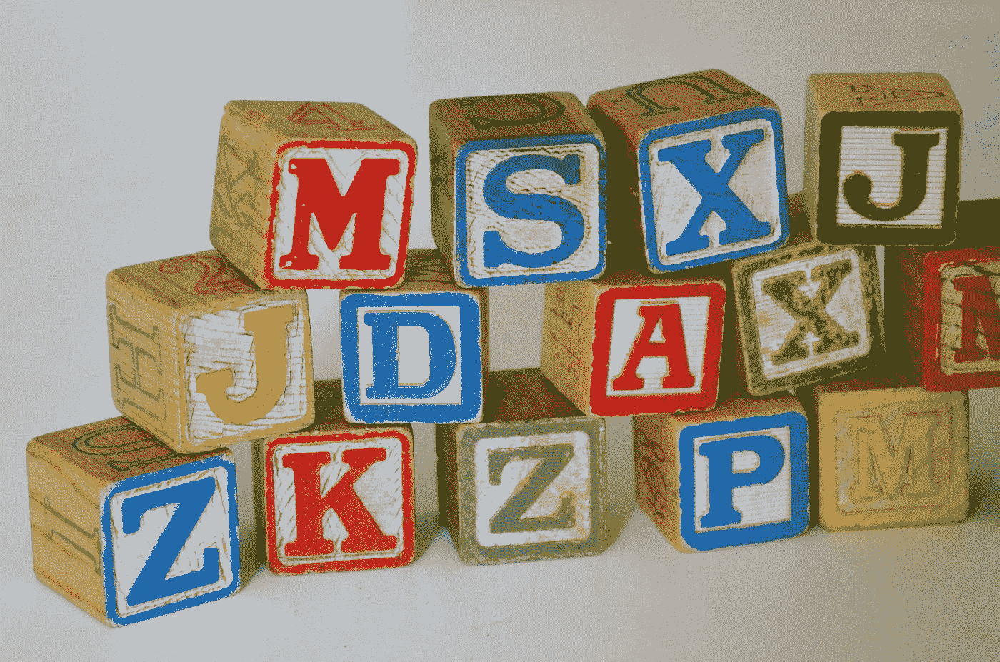
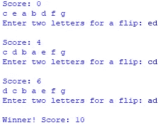

# 蟒蛇短裤— Alphaflip 游戏

> 原文：<https://betterprogramming.pub/python-shorts-alphaflip-game-68cd0fb531dc>

## *这是一个简单的基于 Python 文本的游戏，玩起来很有趣，也很有挑战性。*



苏珊·霍尔特·辛普森在 [Unsplash](https://unsplash.com?utm_source=medium&utm_medium=referral) 上的照片

如果有人记得老式的 TRS-80 电脑，以及你可以从磁带上下载的 CLOAD 杂志程序，你可能会在很久很久以前，在一个遥远的星系里，玩一个我发明的游戏。嗯，我感觉是这样的。使用非常粗糙的图形，我创造了一个小 UFO，它会在一排字母表字母上方快速移动，根据命令交换它们的顺序，直到字母表都恢复正常。

## ***但那是当时，这是现在。***

我决定用 Python 来恢复这个游戏，事实证明这样做很简单也很有趣。让我们看看这个游戏的完整代码清单，然后我会解释它的一些有用的部分，并展示一个游戏的例子。

## alphaflip.py 源代码

```
from random import *game_size = 7
alpha = [chr(c + 97) for c in range(game_size)]
goal = alpha.copy()shuffle(alpha)
score = 0while alpha != goal:
    print(f"\nScore: {score}\n{' '.join(alpha)}")
    two_chars = input("Enter two letters for a flip: ")
    two_chars = two_chars.strip().lower()
    i = alpha.index(two_chars[0])
    j = alpha.index(two_chars[1])
    if i > j:
        i, j = j, i
    score += j - i + 1
    while i < j:
        alpha[i], alpha[j] = alpha[j], alpha[i]
        i += 1
        j -= 1print(f"\nWinner! Score: {score}")
```

## 你准备迎接多大的挑战？

如图所示，`game_size`被设置为 7，因此`alpha`列表由字母表的前 7 个字符“a”到“g”组成。这是一个有趣且合理的游戏，但是如果你敢的话，你可以将`game_size`设为 26。

## 一些代码注释

大多数 Python 游戏都引入了 random 模块来保持游戏之间的混洗或随机化。这解释了第一行。

根据`game_size`，名为`alpha`的列表由字母表的前几个字母填充。列表理解使得建立这个列表非常简洁和容易。

名为`alpha`的列表被复制到名为`goal`的第二个列表中。复制 Python 列表和其他对象时要小心。例如，如果列表包含其他列表或对象，您可能无法获得完整的副本。`copy()`操作在这里工作得很好，但是总是要考虑`deepcopy()`是否更安全。如果你只是简单地设置`goal = alpha`，两个列表都会引用内存中相同的条目，这会立刻导致问题。

索引变量`i`和`j`通过查找用户输入的两个字符在列表中的位置来设置。列表方法`index()`找到这些位置。

## While 循环

所有剩下的代码行，除了最后一行，都会导致程序打印到目前为止的分数，然后要求一系列字母颠倒顺序。重复这个过程，直到所有的字母都按正确的顺序排列，这时最后一行代码让你知道你是赢家，并显示你的最终得分。分数越小，你吹牛的权利就越大。

## 洗牌，F 弦，和交换，哦，我的天！

使用 random 模块的`shuffle()`方法，可以将一个列表随机打乱。我的程序在开始时调用 `shuffle()`,在名为`alpha`的列表中打乱字母顺序。

这两个`print`命令使用 f 字符串作为高效、强大、易读的代码来显示游戏进行过程中的中间和最终结果。我对 f 弦如此着迷，以至于我写了一整篇关于这个主题的文章。

Python 的一个很酷的特性是如何在一个命令中交换两个变量。例如，要交换两个变量的内容，只需将它们相互赋值，就像这样:`x,y = y,x`。这项技术在程序中使用了两次，将索引按顺序交换，并随着游戏的进行交换`alpha`中的字母对。

## 一种新的得分方式

在我最初的 TRS-80 游戏中，我计算翻转的次数来提供分数。但事实证明，给游戏打分的一个更好的方法是将翻转的角色总数相加。这就要求你提前做好计划，想出一个策略来有效地将这些信件分类，使它们井然有序。试试看，你会很快明白我的意思。

## 游戏示例

下面是一个示例游戏，游戏大小设置为 7。在这个例子中，我玩了几个游戏来把我的分数降到 10 分。我最常得分接近 21。你能打败 10 吗？



```
**Want to Connect?** John is the author of [Python for Numworks](https://amzn.to/3k4O39j) , [Python for OpenSCAD](https://amzn.to/3mHK0Br), [Python for the TI-Nspire CX II](https://read.amazon.com/kp/embed?asin=B09DJ7MRDX&preview=newtab&linkCode=kpe&ref_=cm_sw_r_kb_dp_Z6AHQNW2MQBZHCNKC38G&tag=solarproud-20), [Python for the TI-84 Plus CE Python calculator](https://read.amazon.com/kp/embed?asin=B09GJMBDMF&preview=newtab&linkCode=kpe&ref_=cm_sw_r_kb_dp_Z6AHQNW2MQBZHCNKC38G&tag=solarproud-20), [Python for CASIO Calculators](https://amzn.to/3mgX0js), and [many other titles](http://johnclarkcraig.com/).
```