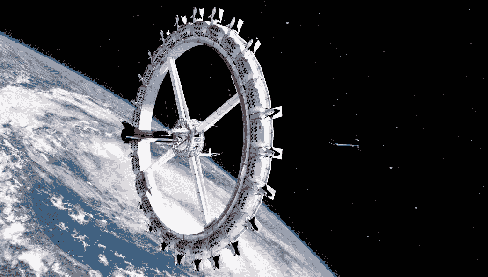
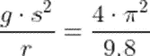
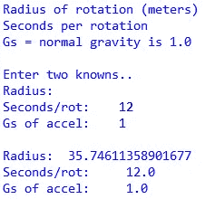
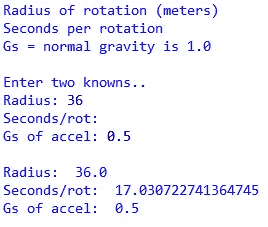
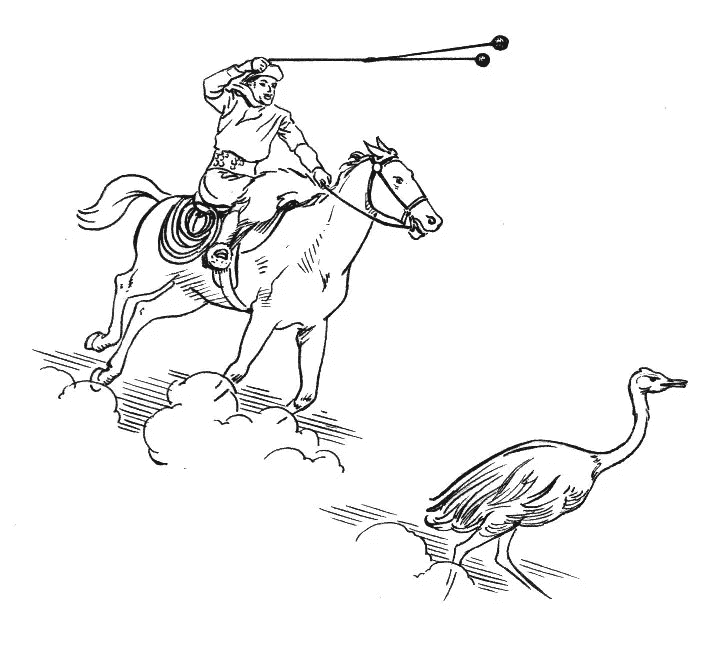
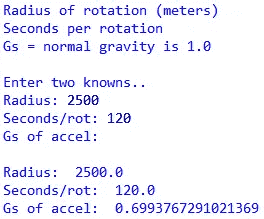

# 蟒蛇短裤——太空中的人造重力

> 原文：<https://betterprogramming.pub/python-shorts-artificial-gravity-in-space-3c2146eff150>

## Python 使得计算空间站需要旋转多快才能产生一个 1g 的人造重力变得简单。



旋转空间站创造人造重力——图片由轨道装配公司提供

在电影《星际穿越》中，马修·麦康纳(Mathew McConaughey)和他的船员们开始在太空中旋转他们的车轮形空间站，以便产生一个 G 的人造重力，或者与我们在地球上由于重力而经历的加速度相同。为了使向心力达到一个 g，它们旋转到一定的转速。


星际空间站在太空中旋转——由星际公司提供

那么他们需要多快来旋转这个相对较小的空间站呢？这三个因素是旋转速度、旋转半径和圆周上产生的重力。以下 Python 程序允许您输入其中任意两个，然后计算第三个。

在维基百科中搜索“人造重力”可以获得关于这一切的物理学原理的更深入的解释。如果 g 是相对于地球引力的 g 力的数量，r 是旋转半径，s 是一次完整旋转的秒数，那么这个等式将它们联系在一起:



插入任意两个已知的 g、s 和 r 值，剩下的未知数就可以解出。这里有一个简短的 Python 程序来完成这些计算…

```
from math import *print("\nRadius of rotation (meters)")
print("Seconds per rotation")
print("Gs = normal gravity is 1.0")
print("\nEnter two knowns..")
a = "Radius: "
b = "Seconds/rot: "
c = "Gs of accel: "
r = input(a)
r = float(r) if r else 0
s = input(b)
s = float(s) if s else 0
g = input(c)
g = float(g) if g else 0
if not r:
    r = 9.8 * g * s**2 / (4 * pi**2)
if not s:
    s = 2 * pi / (9.8 * g / r) ** 0.5
if not g:
    g = 4 * pi * pi * r / 9.8 / s**2
print()
print(a, r)
print(b, s)
print(c, g)
```

请注意，每次调用 input()后，都会检查分配的变量，以查看是否实际输入了值。如果不是，则赋值为零，防止以后出错。对于某些数据输入情况，这是一个方便的技巧。

## 示例计算

我用秒表记录了《星际穿越》中显示的空间站旋转的时间，在那一点上，他们说他们达到了整整 1 g。它每转一周大约旋转 12 秒。假设制作人试图用他们的物理现实，马修·麦康纳离旋转中心有多远？



35 米以上大约是 117 英尺，这一旋转半径似乎非常粗略地符合 CGI 对旋转站的描述。

## 较轻的重量计算

可能不需要整整 1 g 的人造重力来防止宇航员在长途旅行中出现健康问题，比如在不久的将来去火星。让我们再运行一次程序，假设旋转半径是 36 米，我们只需要相当于重力一半的力。每转需要多少秒？



17 秒就够了。

## 更长的计算

最后一个例子，考虑在 5 公里长的系绳两端各有一对可居住的吊舱，它们像一个双头流星锤一样绕着对方旋转:



礼貌皮尔逊·斯科特·福尔斯曼

好吧，去掉马，骑手，鸟，在靠近中间的地方剪断绳子，然后想象两个流星锤互相绕着对方跳舞。在太空中。顺利。有人在船上。我知道，有点夸张，但你应该明白。

如果空间站 Bolas 每两分钟或 120 秒缓慢旋转一次，那么两端的吊舱会产生多少重力？请注意，旋转半径是系绳长度的一半，即 2500 米…



大约 0.7 的重力将是非常合理的，并且旋转两分钟将最小化头晕和定向障碍。

当然，对于空间站 Bolas 来说，还有其他问题要解决，例如在接近火星时处理任何类型的加速，在吊舱之间移动设备和供应品，以某种方式对接空间站，等等。但是我们只是在玩 Python，所以我将把这部分讨论留给其他人去思考。

```
**Want to Connect?** John is the author of [Python for Numworks](https://amzn.to/3k4O39j) , [Python for OpenSCAD](https://amzn.to/3mHK0Br), [Python for the TI-Nspire CX II](https://read.amazon.com/kp/embed?asin=B09DJ7MRDX&preview=newtab&linkCode=kpe&ref_=cm_sw_r_kb_dp_Z6AHQNW2MQBZHCNKC38G&tag=solarproud-20), [Python for the TI-84 Plus CE Python calculator](https://read.amazon.com/kp/embed?asin=B09GJMBDMF&preview=newtab&linkCode=kpe&ref_=cm_sw_r_kb_dp_Z6AHQNW2MQBZHCNKC38G&tag=solarproud-20), [Python for CASIO Calculators](https://amzn.to/3mgX0js), and [many other titles](http://johnclarkcraig.com/).
```