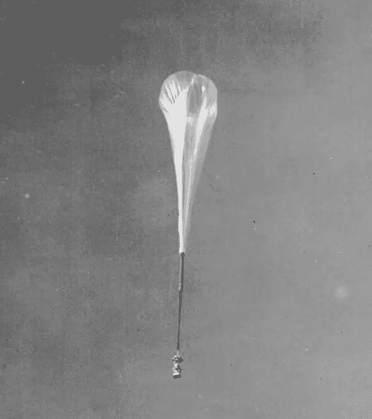
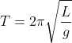
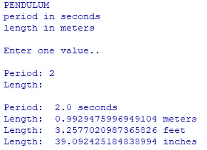

# 蟒蛇皮短裤——钟摆

> 原文：<https://betterprogramming.pub/python-shorts-pendulums-f2eefda4db5f>

## *钟摆是大自然的时钟，一个简短的 Python 程序让用它们计算一些迷人的东西变得很有趣。*



天勾气球——美国海军提供

透过我的大窗户向丹佛天际线上方深蓝色的天空望去，我看到了一些有趣的事情。大多数气球都是小型派对类型的，通常是某个粗心的年轻人不小心放飞的。但是有一天下午，一个高空倒置的泪珠状气球出现了，外观与几十年前的天勾气球非常相似，如上图所示。

# 它在摇摆

我不知道气球有多大，但我知道它在很高的高度。它几乎看不见的有效载荷悬挂在下方很远的地方，缓慢地来回摆动。

我突然意识到，我可以用一种非常独特的方式测量气球，即使是从那么远的地方。我照做了。我粗略但合理的计算显示，有效载荷悬挂在气球下方大约 70 英尺的地方，在一根长系绳的末端。

# 咖啡店吊灯

快进到昨天。我坐在一家咖啡店里，这家咖啡店坐落在丹佛市中心附近的一栋古老的老式消防大楼里。几盏枝形吊灯型的灯悬挂在非常高的天花板上，我注意到其中一盏轻轻地来回摆动。我用几年前测量气球的方法测量了灯的长度，结果是大约 12 英尺。(是的，我很无聊，但这确实让时间过得很优雅！)

# 钟摆和蟒蛇

当然，这两种计算都使用了钟摆摆动时间的简单公式。事实证明，细绳或细绳末端的质量有多大并不重要。它摆动的周期只取决于那根绳子的长度。如果你知道它的长度，你可以计算一个钟摆的周期，或者来回摆动一次所需的时间，或者如果你知道它的周期，你可以计算它的长度。

下面是总结这些计算的公式，其中 T 是一个钟摆完整摆动的时间，或周期，L 是弦或绳的长度。注意 g 是重力加速度，在地球上大概是 9.8 米每秒。



这是我的简短 Python 程序，它可以让你输入摆动的周期，或者摆动的长度，然后另一个就会被计算出来。

```
import mathprint("\nPENDULUM")
print("period in seconds")
print("length in meters")
print("\nEnter one value..\n")seconds = input(s := "Period: ")
seconds = float(seconds) if seconds else 0.0meters = input(m := "Length: ")
meters = float(meters) if meters else 0.0if seconds:
    meters = 9.8 * (seconds / math.pi / 2) ** 2
else:
    seconds = 2 * math.pi * (meters / 9.8) ** 0.5print()
print(s, seconds, "seconds")
print(m, meters, "meters")
print(m, meters * 100 / 30.48, "feet")
print(m, meters * 100 / 2.54, "inches")
```

## Python 谈话要点

看看用户输入秒的两行代码。walrus 操作符`:=`用于将名为`s`的变量设置为`"Period: "`，这样该字符串就可以在接近末尾的输出行中重用。

下一行代码将秒的值设置为用户输入的浮点值，如果没有输入任何内容，则设置为零。这是我在许多简单程序中使用的一个方便的小输入技巧。

如果输入秒，则计算出摆的米长度。否则，如果输入米的长度，则计算钟摆周期的秒数。

请注意，两行计算使用了双星号`**`来查找值的平方和平方根。将一个数提升到 0.5 的幂就等于求平方根。这样做不需要导入 math 模块，尽管在这个程序中我们需要导入 math 来访问 pi 的值。

# 树林中的小刀钟

作为一个工作示例，假设您有一些钓鱼线、一把小刀和一张 3×5 的笔记卡，并且您在树林中某处想要测量的非常高的悬崖底部。

在家里玩了这个程序之后，在你去树林之前，你回忆起一个 39 英寸的摆的周期是 2 秒。下面是使用上面的程序进行的示例计算的样子…



好吧，这是你测量悬崖高度的方法。

当你的朋友爬到悬崖顶上时，你把绳子系在小刀上，量出绳子的长度为 39 英寸(卡片的 7 倍长度，1 倍宽度，另 1/3 倍宽度)。

你的朋友扔了一块石头，你计算石头落地的秒数。变魔术，你有所有你需要的计算悬崖的高度！(我将把剩下的计算留给您去发现。)

## 一句警告

一定要小心观察你的朋友、钟摆和岩石。说够了。

```
**Want to Connect?** John is the author of [Python for Numworks](https://amzn.to/3k4O39j) , [Python for OpenSCAD](https://amzn.to/3mHK0Br), [Python for the TI-Nspire CX II](https://read.amazon.com/kp/embed?asin=B09DJ7MRDX&preview=newtab&linkCode=kpe&ref_=cm_sw_r_kb_dp_Z6AHQNW2MQBZHCNKC38G&tag=solarproud-20), [Python for the TI-84 Plus CE Python calculator](https://read.amazon.com/kp/embed?asin=B09GJMBDMF&preview=newtab&linkCode=kpe&ref_=cm_sw_r_kb_dp_Z6AHQNW2MQBZHCNKC38G&tag=solarproud-20), [Python for CASIO Calculators](https://amzn.to/3mgX0js), and [many other titles](http://johnclarkcraig.com/).
```