# Python 样条插值操作指南

> 原文：<https://betterprogramming.pub/python-spline-interpolation-how-to-ef059c214d28>

## SciPy 插值例程的简短演练

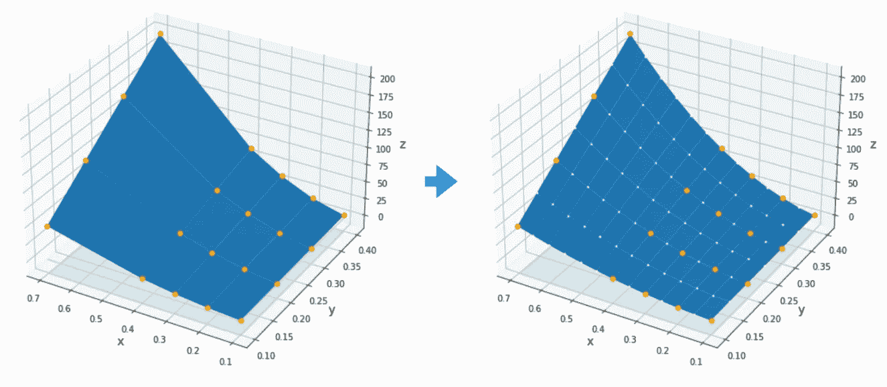

图片来源:自己的作品

如果你曾经在 Python 中插入过一个函数，你可能想知道为什么有这么多方法来做一件简单的事情。2D 插值方法尤其令人兴奋，因为它们使用了关于 x 轴和 y 轴顺序的不兼容约定。这里有一个简短的总结，什么时候使用哪个，什么参数遵循哪个约定。

# 一维

1D 的情况相对简单。每个插值函数都有自己独特的功能集:

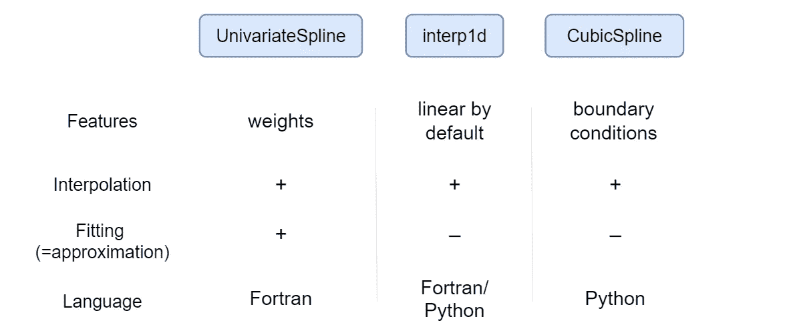

`[UnivariateSpline](https://docs.scipy.org/doc/scipy/reference/generated/scipy.interpolate.UnivariateSpline.html)`是唯一一个既能插值又能拟合的。它还接受节点的自定义权重。

`[interp1d](https://docs.scipy.org/doc/scipy/reference/generated/scipy.interpolate.interp1d.html)`借用了 MATLAB 的命名惯例。对于默认的线性情况，它使用 Python(如果可能的话，使用 NumPy)来表示二次和二次以上——Fortran。

`[CubicSpline](https://docs.scipy.org/doc/scipy/reference/generated/scipy.interpolate.CubicSpline.html)`与其他瘦 Fortran 包装的方法不同，它主要是用 Python 实现的(=不太隐晦的错误消息；可能会慢一点)并且只使用 Fortran 进行稀疏矩阵提升。只有三次样条提供了在各种边界条件之间进行选择的方法(其他的使用“不知道”条件)。

线性样条完全不需要任何边界条件(方程的个数与未知数的个数相同)。在三次样条中，数据点本身并不能唯一地定义一条样条；需要两个边界条件来匹配未知数的数量，如下所示:

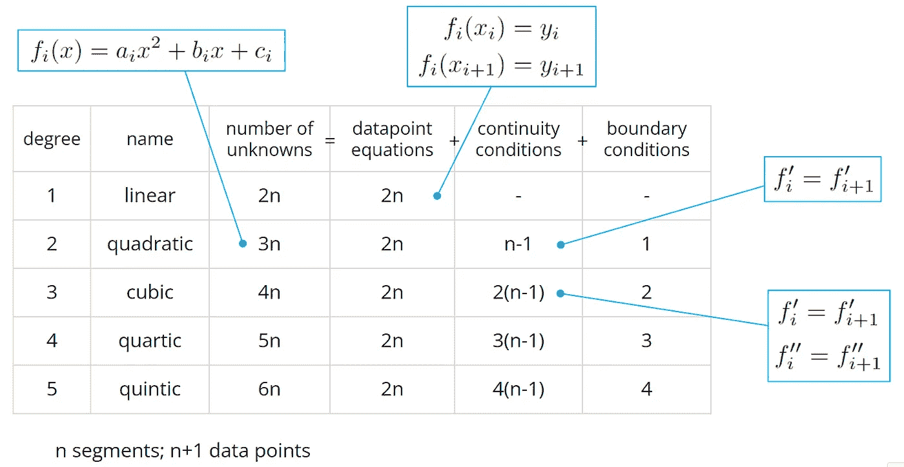

根据要插值的函数的特征，一种边界条件可能比其他边界条件给出更好的结果:

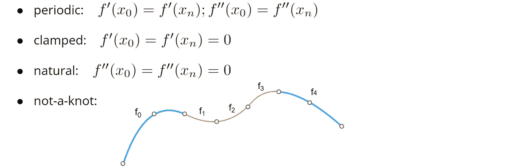

[文档中的详细信息](https://docs.scipy.org/doc/scipy/reference/generated/scipy.interpolate.CubicSpline.html)

这是一个交互式仪表板，演示了不同类型的边界条件在实践中是如何工作的:

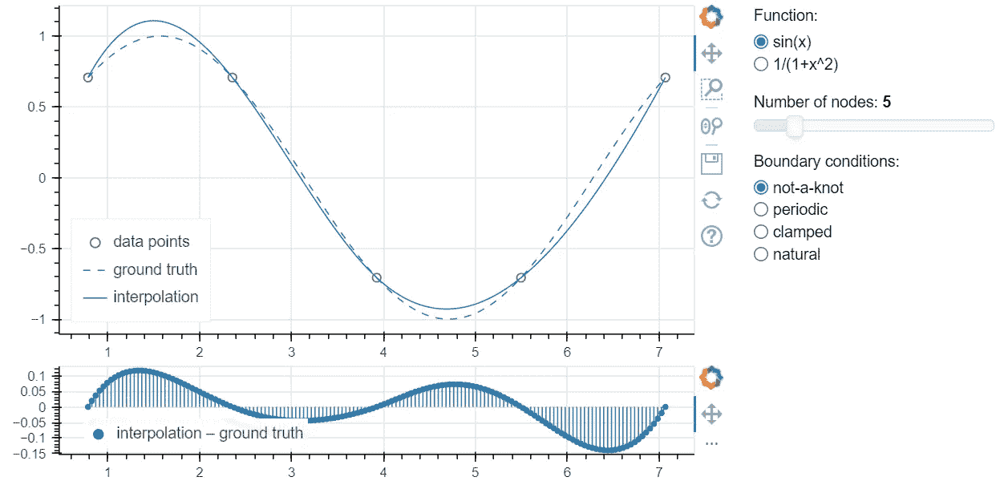

[网上试试](https://si1.alwaysdata.net/myapp)

对于`sin(x)`，最佳边界条件(不出所料)是“周期性的”猜猜哪个条件最适合`1/(1+x²)`。

简而言之，插值 1D 函数需要做的就是:

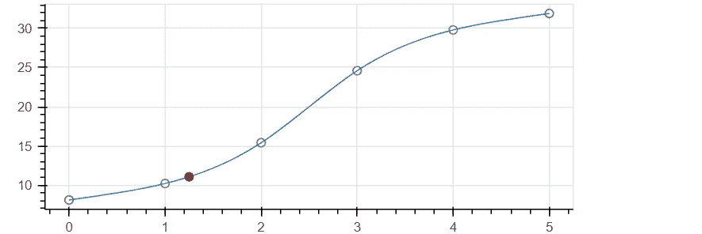

这里使用了默认的“非纽结”边界条件——如果您对要插值的数据一无所知，它们会发挥最大作用。

如果您在图上看到以下“特征”，您可以微调边界条件以获得更好的结果:
。一阶导数在边界处消失= > `bc_type=‘clamped’` 。二阶导数在边界处消失= > `bc_type='natural'` 。函数是周期性的= > `bc_type='periodic'`

# 二维

2D 的例子有时会违反直觉。有时候，你需要转置这个或那个；有时候不会。首先，一个图表:

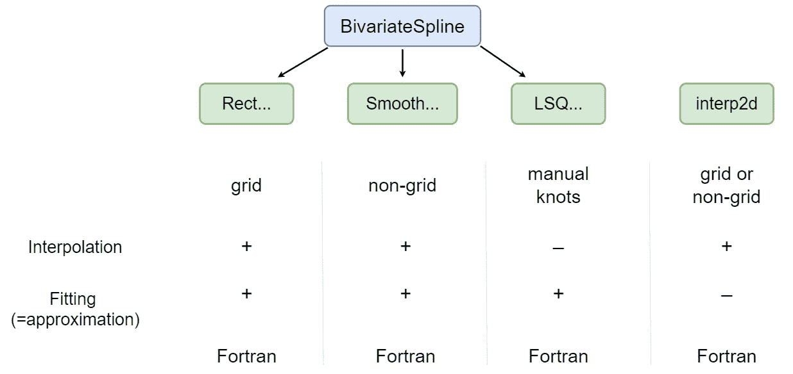

`[RectBivariateSpline](https://docs.scipy.org/doc/scipy/reference/generated/scipy.interpolate.RectBivariateSpline.html)`(或`[interp2d](https://docs.scipy.org/doc/scipy/reference/generated/scipy.interpolate.interp2d.html)`，看下面的区别)是你最可能想使用的函数，如果你只有一个 2D 数组，你想插值(或重采样，或近似)。它期望节点位于规则(=等距)网格或直线(非等距)网格上:

直线网格允许我们使用对数轴或在最“困难”的区域集中数据点。

`[SmoothBivariateSpline](https://docs.scipy.org/doc/scipy/reference/generated/scipy.interpolate.SmoothBivariateSpline.html)`对任意分布的点进行操作。它会自动建立一个直线网格，并尽力将点映射到这个网格。然而，这并不是插值这些数据的唯一方法。非直线网格(如 scipy . interpole .[grid data](https://docs.scipy.org/doc/scipy/reference/generated/scipy.interpolate.griddata.html))可能会给出更好的结果:

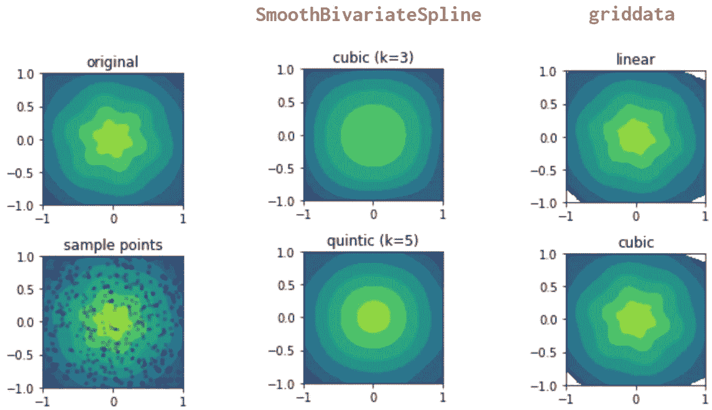

`[LSQBivariateSpline](https://docs.scipy.org/doc/scipy/reference/generated/scipy.interpolate.LSQBivariateSpline.html)`做同样的事情，但允许你手动选择样条节点的位置。

现在，`[interp2d](https://docs.scipy.org/doc/scipy/reference/generated/scipy.interpolate.interp2d.html)`可以作为`RectBivariateSpline`或者`SmoothBivariateSpline`，这取决于你输入的数据类型。两个主要的干扰是:
–它使用的轴命名惯例与`RectBivariateSpline`完全相反(详见下文)。
–要获得三次样条，你需要编写`kind='cubic'`，因为默认情况下它是线性的，所以总的来说，击键次数与`RectBivariateSpline`:)中的大致相同

早在 2013 年就有关于贬低 interp2d 的讨论，但我认为这不太可能很快发生。

此外，确保提供足够的数据点:最小数量是`(k+1)²`，其中`k=1`表示线性，`k=3`表示三次，`k=5`表示五次插值，因此三次样条至少需要一个 4x4 的网格(否则，您将得到一个看起来很奇怪的[错误](https://scicomp.stackexchange.com/questions/31306/problems-with-pythons-interp-2d))。

# interp2d vs RectBilinearRect

关于 SciPy 中的 2D 插值，最有问题的一点就是理解哪个轴是 x，哪个轴是 y，在 NumPy 中，维度是通过索引引用的，而不是名字；在 [xarray](https://docs.xarray.dev/en/stable/) 中，它们被自定义名称引用。这样做是有原因的:你可以自由地将第 n 维与你心目中的任何轴相关联。在`scipy.interpolate`中，这个映射是硬编码的；而且`interp2d`和`RectBivariateSpline`之间硬编码不一致。

根据您正在操作的数据，您可能会发现一种方法是直观和自然的，而另一种方法是非理性和模糊的。两者背后都有逻辑；只是略有不同。需要特别注意的是最后一个论点，`z`:

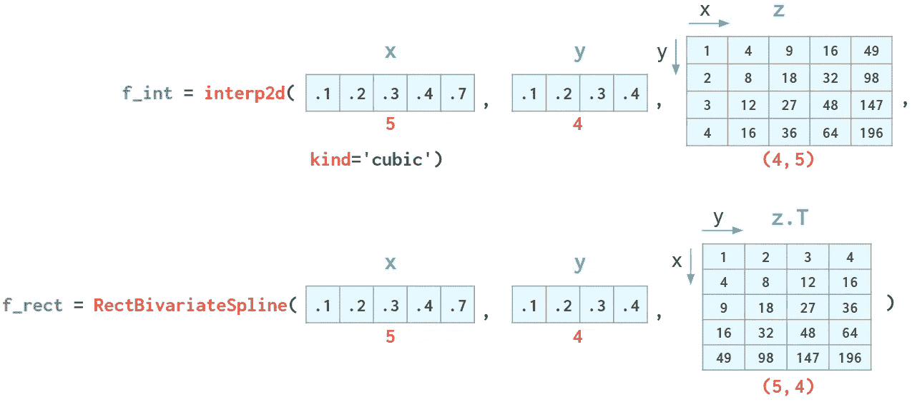

函数`f`返回的值也受到约定的影响:

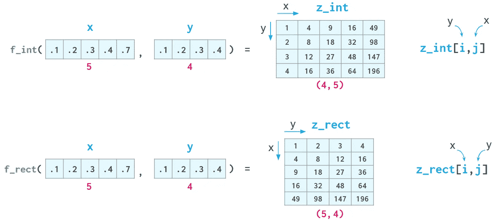

根据您的需要，您可能更喜欢这两种方法中的一种。在内部，它们都调用完全相同的 Fortran 例程，所以就精度和速度而言，选择哪一个都没有区别。

在上面的示例中，计算函数的格网与输入格网相同。通常，您会想要计算不同网格上的值。以下是 3D 效果图:

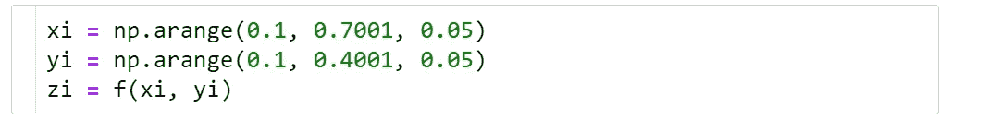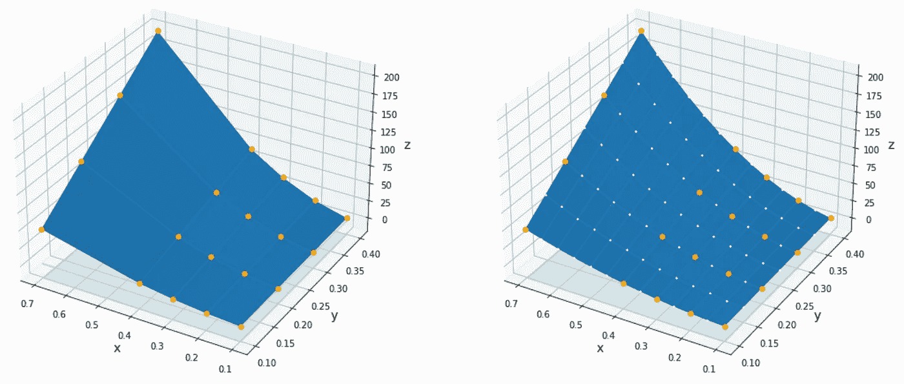

左:z，原始数据。右:子，插值数据。

在 3D 中绘制结果的一个基本细节是如何创建 meshgrid。`interp2d`对应默认的`xy`分度模式，而`RectBivariateSpline` —对应`ij`模式:

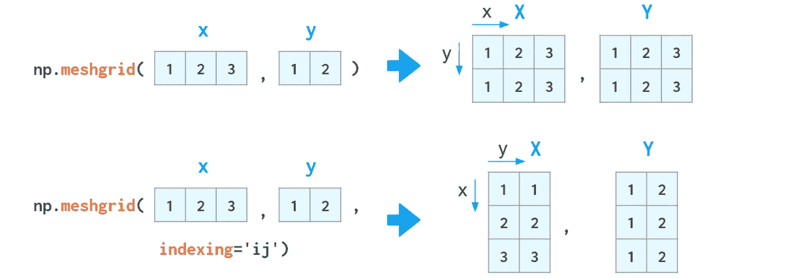

# 3D 绘图库

在 Matplotlib 中(如[轮廓](https://matplotlib.org/stable/api/_as_gen/matplotlib.pyplot.contour.html)、 [plot_surface](https://matplotlib.org/stable/tutorials/toolkits/mplot3d.html?highlight=plot_surface#mpl_toolkits.mplot3d.Axes3D.plot_surface) )，X 和 Y 是二维的，所以一般来说，只要`X`、`Y`、`Z`形状相同，用哪种约定都无所谓。然而`plot_surface`(如果没有给出颜色图)对于带有`xy`和`ij`索引的网格会产生不同的结果:

为什么？带有`xy`索引的表面具有指向上方的法向量，因此它被解释为某个 3D 体积的顶面，并使其更亮。`ij`的表面指向下方，所以被解释为底面，渲染的比较暗。在绘制函数`f(x, y)`时，它看起来更像一个顶面，因此`xy`索引(由`interp2d`使用的那个)通常会给出更好的结果。参见 [#23570](https://github.com/matplotlib/matplotlib/issues/23570) 。

Plotly 期望`xy`为 3D 绘图(和一维`x`和`y`)建立索引； [Mayavi](https://docs.enthought.com/mayavi/mayavi/auto/mlab_helper_functions.html#surf) 偏好`ij`索引(以及一维或二维`x`和`y`)。

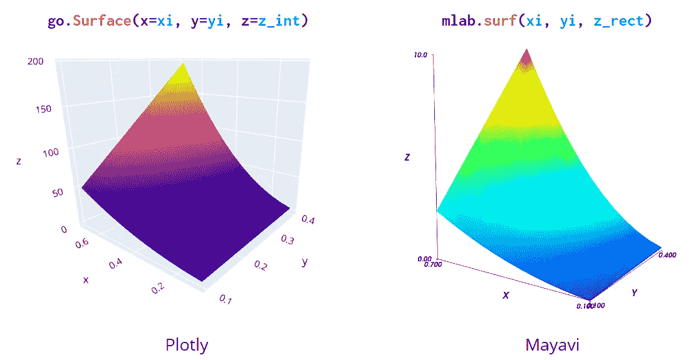

下一次你碰巧对数据进行插值或近似时，你希望花更少的时间去考虑哪种插值方法最适合你，哪种指数代表哪种维度。不然给我留个纸条:)。