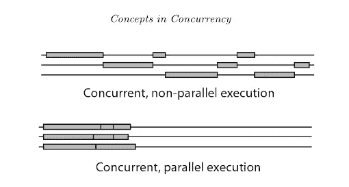

# Python、SQLAlchemy 和并发性

> 原文：<https://betterprogramming.pub/python-sqlalchemy-and-concurrency-c89ec9b5a628>

## Python 和 SQLAlchemy ORM 中现代异步特性的实用概述

克里斯里德在 [Unsplash](https://unsplash.com?utm_source=medium&utm_medium=referral) 上的照片

> 考虑到对提高性能的需求以及与其他语言/运行时的竞争，并发编程在 Python 中越来越受欢迎

Python 已经被誉为最通用、最广泛使用的现代编程语言之一。

从开发人员到数据科学家，每个人都使用它是有原因的。它易于阅读，用户友好，如果你知道你在用它做什么，你可以在短时间内写很多代码。

但是 Python 确实有一些明显的缺点。

***拿一个来说，就是慢。***

有时候这并不重要。对于大多数应用程序来说，几毫秒的处理时间差异并不重要。

然而，重要的是能够异步地**处理事件。在现代 web 编程中，应用程序大部分时间都在等待其他东西的响应。这可能是来自第三方 API 的 HTTP 响应、用户输入或数据库查询的结果。**

**总的来说，人们期望应用程序可以发出许多请求，并保持对用户的响应。**

**由于这个需求，现代 web 编程中使用的许多语言/运行时在其核心都包含了这种异步范例。**

**[比如 Golang](https://golang.org/doc/) ，默认是异步的。通过对 [goroutine](https://tour.golang.org/concurrency/1) 和其他语言特性的抽象，Golang 可以利用多线程并并行执行操作。**

**不幸的是，Python 最初并没有考虑到这种执行模型。**

**这是完全可以理解的，因为 Python 是在操作系统有线程概念之前创建的。部分由于这个原因，Python 实现了带 ***全局解释器锁*** (也称为*)。***

***GIL 的最终效果是一个 Python 进程中一次只能执行一个线程。***

***虽然这看起来像是一个基本的语言设计缺陷，但它确实有存在的理由。***

***用 Python 核心开发人员[拉里·黑斯廷斯](https://www.youtube.com/watch?v=KVKufdTphKs&t=731s)的话说:***

> ***“我想说，GIL 的设计决定是让 Python 像今天一样流行的原因之一。”— Larry Hastings，PyCon 2015***

***如果您有兴趣了解更多关于 GIL 以及它为什么对 Python 的成功至关重要的信息，请查看这篇[文章](https://realpython.com/python-gil/)。***

***尽管 Python 是单线程的，不能并行运行任务(至少在同一个进程中)，它仍然可以利用 [***并发***](https://en.wikipedia.org/wiki/Concurrency_(computer_science)) ***。******

**并发性与并行性非常相似，但有一个重要的区别。**

**它表明任务可以同时运行，但不一定必须同时运行。**

**并行性是并发性，但不是相反。**

**下面可以看到这个并发、非并行执行模型的一个有用的例子。**

****

**参考:[编程语言中的并发介绍](https://books.google.ie/books/about/Introduction_to_Concurrency_in_Programmi.html?id=J5-ckoCgc3IC&redir_esc=y)**

**运行在客户端和服务器端的 JavaScript(node . js 运行时)都是实现这一点的典型例子。尽管 JavaScript 是单线程的，但是[事件循环](https://developer.mozilla.org/en-US/docs/Web/JavaScript/EventLoop)、消息队列/任务队列和 web APIs 的组合允许它执行非阻塞的异步代码。**

**正如您所期望的，现代版本的 Python(3.4+版)可以通过标准库做类似的事情。让我们在下一节中更深入地了解这一点。**

# **应用 Python 并发**

**现代 Python 中支持并发代码的标准库部分是 [asyncio](https://docs.python.org/3/library/asyncio.html) 。**

**当然，这个库不是 Python 中并发的第一次迭代。[线程模块](https://docs.python.org/2.7/library/threading.html)已经存在了一段时间，并且在 Python 的遗留版本(2.7 等)中有提供。).**

**为了节省时间，我们将跳过这些旧的概念，只关注 asyncio(如果您感兴趣，请观看大卫·比兹利在 PyCon 2015 现场编码练习的[视频)。](https://www.youtube.com/watch?v=MCs5OvhV9S4)**

**我们现在将探讨如何用 Python 编写并发代码。以下所有代码示例均可在[Github repo](https://github.com/nmchenry01/medium-code-examples/tree/main/PythonSQLAlchemyAndConcurrency)获得。**

**我们要介绍的第一个对象是[协程](https://docs.python.org/3/library/asyncio-task.html#coroutines-and-tasks)。**

**如果你熟悉现代 JavaScript，那么*协程*很像*承诺*(或者 Scala 中的*未来*，C#中的*任务*，等等)。就本文的目的而言，我们将它视为一个将在未来某个时候产生结果的对象。**

**顺便提一下，协程实际上是 Python 中的一个[专用生成器函数](https://www.geeksforgeeks.org/coroutine-in-python/)。**

**我们将从简单地创建和打印协程开始:**

**如果您运行上面的代码，您会看到您得到了一个协程对象以及它的一些内部属性的打印输出。**

**这里的要点是，我们用 ***async*** 关键字表示的任何函数都将返回一个协程，即使实际上没有发生任何异步。**

**现在让我们尝试模拟一些异步操作:**

**同样，我们得到了与之前相同的协程对象。程序还会在 3 秒钟之前退出，这不是我们所期望的。**

**我们解决这个问题的方法是添加 ***await*** 关键字:**

**这里正在发生一些新的事情:**

*   **我们现在使用 asyncio 库**
*   **我们使用 ***await*** 来等待几个协程的结果(`asyncio.sleep()`也返回一个协程)**
*   **我们使用`asyncio.run()`来运行我们的顶级异步函数。这与运行事件循环接口，以确保我们的程序在所有异步工作完成之前不会退出**

**所以现在我们对 Python 的异步结构以及如何运行一些基本代码有了一个大致的了解。**

**让我们更进一步，尝试进行多个异步操作:**

**我们最终得到了我们想要的输出。所有三个操作的结果都打印到控制台。**

**然而，缺点是整个程序需要大约 3 秒的时间来运行(就像我们用传统的同步方式编写程序一样)。**

**我们需要能够*调度*操作并发运行，然后等待它们返回:**

**我们得到相同的预期输出，但是整个过程只需要 1 秒钟。**

**这里的要点是 Python 可以*调度*操作并发运行(尽管它仍然不能并行处理它们)。**

**你会注意到程序运行的时间比一秒多了几千分之一秒。这来自于程序其他部分的开销和事件循环运行的时间等。不管怎样，它仍然比同步版本的性能好得多。**

**正如您所料，asyncio 库包含的内容远不止这个简短演示所涵盖的内容。如果感兴趣的话，可以查看一下[文档](https://docs.python.org/3/library/asyncio.html),看看在 Python 中可以用并发性做的其他很酷的事情。**

# **SQLAlchemy 的并发性**

**既然我们已经理解了并发性，那么让我们来讨论它与 Python 最流行的 ORM 之一 [SQLAlchemy](https://www.sqlalchemy.org/) 的关系。**

**顺便说一下，原生协程和 async/await 语法在 Python 中仍然没有像在其他语言中那样被广泛采用。因此，并非所有第三方库都是 asyncio 兼容的。**

**SQLAlchemy 也不例外，直到 2021 年初的 [1.4.x 版本](https://pypi.org/project/SQLAlchemy/1.4.0/)才成为 asyncio 兼容的。即将到来的主要 [2.0 版本](https://docs.sqlalchemy.org/en/14/changelog/migration_20.html)无疑也将继续扩展 asyncio 支持。**

**现在，我们将看看这个新功能，并回顾一下这个库的基本示例用法。**

**在上面，我们做了几件事:**

*   **通过 SQLAlchemy ORM 创建一个基本的数据库模式，并创建一个 SQLite 内存数据库**
*   **创建一个我们用来与数据库交互的数据库引擎**
*   **添加一些测试数据**
*   **使用 [SQLAlchemy 会话 API](https://docs.sqlalchemy.org/en/14/orm/session_api.html) 执行 SQL select 语句**

**如果您以前使用过 SQLAlchemy，这应该非常简单。如果没有，查看他们的[文档](https://docs.sqlalchemy.org/en/14/intro.html)，因为 SQLAlchemy 是 Python 生态系统中一个必不可少的数据库工具。**

**上面执行的所有操作都是同步的。现在让我们看看我们需要做些什么来使它们异步。**

**上面首先要注意的是 [create_async_engine()](https://docs.sqlalchemy.org/en/14/orm/extensions/asyncio.html#sqlalchemy.ext.asyncio.create_async_engine) 函数的使用。这允许我们创建一个支持 asyncio 的数据库引擎。**

**我们还使用了 [aiosqlite](https://github.com/omnilib/aiosqlite) 库，并将其包含在传递给 create_async_engine()的第一个参数中。这是因为我们需要一个 asyncio 兼容的数据库驱动程序来创建/使用 SQLAlchemy 中的异步引擎。**

**从这里开始，语法相对类似于我们之前看到的同步版本。**

**主要的例外是，我们需要 ***等待*** 通过会话 API 对数据库的任何异步调用(包括数据库提交),我们用前面讨论的`asyncio.run()`方法调用我们的主函数。**

**尽管这个例子相对简单，但它非常强大，因为它打开了一个围绕 Python 中数据库交互的并行优化的世界。**

# **结束语和后续步骤**

**虽然并发是 Python 开发人员工具箱中的一个有价值的工具，但需要谨慎使用。**

**也就是说，异步代码并不总是比同步代码快。在某些情况下，它实际上可以相同或更慢。**

**通常，您编写的代码会受到应用程序无法控制的外部因素的限制。这可能包括数据库操作、第三方服务的处理时间或任何外部瓶颈。这就是为什么在尝试实施优化时，必须对系统性能进行基准测试并收集数据。**

**此外，并发性通常会导致应用程序复杂性的增加。**

**任何有经验的开发人员都知道，管理复杂性是编写好的、可维护的代码的重要部分。有时，并发带来的复杂性增加是不值得的。**

**记住所有这些，开始写代码做你需要它做的事情。如果需要，并发可以是一个很好的优化工具。你能做的最好的事情是进行实验，然后迭代结果。**

**希望这篇文章提供了丰富的信息，并简化了 Python 和 SQLAlchemy 中相对复杂的并发性主题。如果您想尝试上面提供的任何代码示例，请查看这个 repo 。**

**一如既往，我很乐意听到任何关于 Python/SQLAlchemy/异步编程的想法和反馈。**

**下次见，感谢阅读。**