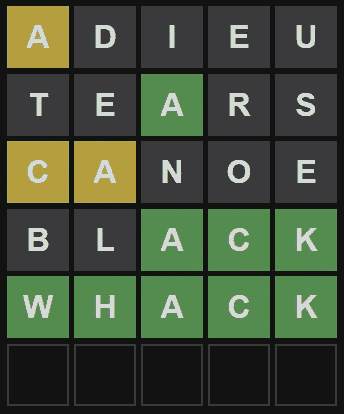

# 设计一个 Wordle Python 助手

> 原文：<https://betterprogramming.pub/python-wordle-helper-b81aa05680aa>

## 一点创造性的 Python 代码可以帮助你在游戏中减少 5 个字母的单词列表！



2022 年 1 月 26 日 Wordle 利用 Python 线索解决了

几乎一夜之间，互联网上就出现了病毒式的攻击。它很有趣，不会让你玩上几个小时(每天只有一个游戏)，而且会让你思考。我喜欢！

# 如何玩 Wordle

简而言之，你猜 5 个字母的单词，程序对结果进行颜色编码，让你知道你离找到正确的单词有多近。

深灰色背景标记出不会在目标单词中出现的字母。

黄色表示字母在单词中，但在错误的位置，绿色表示字母在正确的位置。

你有六次尝试的机会，如果你很小心，脑子里有一大堆 5 个字母的单词，你几乎总能找到答案！


照片由 [Towfiqu barbhuiya](https://unsplash.com/@towfiqu999999?utm_source=medium&utm_medium=referral) 在 [Unsplash](https://unsplash.com?utm_source=medium&utm_medium=referral) 上拍摄

# Python 也好玩！

我也喜欢有趣的 Python 编程挑战，所以当然，我决定创建一个程序来帮助找到有效的单词。我创建了`whelper.py`来对一长串 5 个字母的单词进行排序，以便在你输入单词猜测并获得每个猜测的颜色编码结果后，找到所有仍然可以合法地解决这个难题的单词。

下面是`whelper.py`的完整代码清单:

```
# whelper.pyimport randomuse_bigger_list = Falseguess_words = "adieu tears canoe black"   
hits_misses = "y.... ..g.. yy... ..ggg"# Load the list of words
if use_bigger_list:
    with open("word_list_bigger.txt") as f:
        words = f.read().strip().split()
else:
    with open("word_list.txt") as f:
        words = f.read().strip().split()# Process the guesses and scores into lists
guess = guess_words.lower().strip().split()
score = hits_misses.lower().strip().split()# Get a nogo list of letters not in the word
nogo = []
for g, s in zip(guess, score):
    for i in range(5):
        if s[i] == ".":
            add_to_nogo = True
            for j in range(5):
                if g[j] == g[i]:
                    if s[j] != ".":
                        add_to_nogo = False
            if add_to_nogo:
                nogo.append(g[i])# Remove all words with nogo letters
for n in nogo:
    for w in reversed(words):
        if n in w:
            words.remove(w)# Get a list of all exact (green) letters
green = ["-", "-", "-", "-", "-"]
for g, s in zip(guess, score):
    for i in range(5):
        if s[i] == "g":
            green[i] = g[i]# Remove all words missing green matches
for i, letter in enumerate(green):
    if letter != "-":
        for w in reversed(words):
            if letter != w[i]:
                words.remove(w)# Get a list of all non-exact (yellow) letters
for g, s in zip(guess, score):
    yellow = ["-", "-", "-", "-", "-"]
    for i in range(5):
        if s[i] == "y":
            yellow[i] = g[i]# Remove all words with exact match yellow letter
    for i, letter in enumerate(yellow):
        if letter != "-":
            for w in reversed(words):
                if letter == w[i]:
                    words.remove(w)# Remove all words missing nearby matches
    for i, letter in enumerate(yellow):
        if letter != "-":
            for w in reversed(words):
                if letter not in w:
                    words.remove(w)# Shuffle remaining list
random.shuffle(words)# Output words that can still work (max 100)
print()
for i in range(100):
    if i >= len(words):
        break
    if (i + 1) % 10:
        print(words[i], end=" ")
    else:
        print(words[i])
    if i == 99:
        print("...there are more than 100 words")
        break
print()
```

要使用这个程序，请将其加载到您最喜欢的 IDE 或编辑器中(IDLE 非常有用)。

我没有通过处理大量的输入行来膨胀代码，而是决定让您直接在代码中编辑猜测和结果，从而保持代码的简单性。

看一下前三行代码。将第一个变量设置为`True`,告诉程序使用更大的单词列表，而不是更小的，尽管在大多数情况下，更小的列表也能很好地工作。

接下来的两行是你输入你的猜测和 Wordle 网站提供的每一个猜测的结果。用空格分隔单词猜测，如图所示扩展字符串以包括最多 5 个猜测。

在每个单词的正下方编辑`hits_misses`字符串，添加每个猜测的结果。为灰色背景字母输入句点，为黄色输入`y`，为绿色输入`g`。运行这个程序，一个仍然可以尝试的单词列表就会输出到你的屏幕上。如果可能的单词列表很长，那么只输出前 100 个单词，但是这应该给你很多选择来尝试下一个单词。

上述代码的各个“段落”处理猜测和评分结果，以从列表中删除所有无用的单词。

例如，没有一个深灰色的字母出现在目标单词中，因此删除所有包含这些字母的单词可以快速缩短列表。处理黄色和绿色的“命中”也有效地减少了列表。


照片由 [Adi Goldstein](https://unsplash.com/@adigold1?utm_source=medium&utm_medium=referral) 在 [Unsplash](https://unsplash.com?utm_source=medium&utm_medium=referral) 上拍摄

# Zip、Enumerate 和其他很酷的 Python 东西

我使用了几个非常独特但功能强大的 Python 函数来帮助筛选单词列表。

如果`zip()`、`enumerate()`，或者其他什么功能在你看来很神秘，我建议用谷歌搜索解释。这是一种增强 Python 知识的好方法，通过探索工作代码来解释它是如何工作的。

我确实遇到了一个值得在这里解释的编码挑战。当列表中的一个单词要被删除时，`remove()`功能可以很容易地将每个单词从列表中划掉。

但是我遇到了一个问题，因为从列表中删除条目会打乱缩短列表中剩余部分的迭代。每个被消除的单词后面的单词被跳过！解决这个复杂问题的一个简单方法是从最后到第一个遍历列表，而不是通常的从第一个到最后一个。在几个地方寻找`reversed()`函数，导致单词列表被逆序检查。

这里有一个简单的例子来演示这个问题及其解决方案。注意，第二个单词`two`只有在单词列表以相反的顺序搜索时才会被删除。被注释掉的代码显示了当列表没有颠倒时发生的问题。

```
words = ["one", "two", "two", "three"]# for x in words:
#     if x == "two":
#         words.remove(x)
# print(words)  # ['one', 'two', 'three']for x in reversed(words):
    if x == "two":
        words.remove(x)
print(words)  # ['one', 'three']
```

# 一大串单词

经过一些数据搜集和处理(当然是使用 Python)，我得到了两个由 5 个字母组成的单词列表。

较短的列表包含大约 2500 个相当常见的单词，而较大的列表包含更多的单词，其中许多不太为人所知。我建议坚持使用较短的列表，只有在必要时才使用较大的列表。

例如，较短的列表中没有单词“重击”(现在有了)，所以我求助于较大的列表来帮助解决 2022 年 1 月 26 日的 Wordle 游戏。


我开始在本文中包括这些单词列表，但是它们确实很长。相反，你可以很容易地从我建的这两个网页上下载… [单词列表](https://craigware.com/word_list)和[单词列表 _ 更大](https://craigware.com/word_list_bigger)。

这些列表中的每一个都应该被复制到它自己的文本文件中，第一个名为`word_list.txt`，第二个名为`word_list_bigger.txt`。将这些文件放在与程序相同的文件夹中。

使用较短的列表，编辑到上面代码中的猜测和结果将列表筛选为单词“重击”，而较长的单词列表提供了两个合法的选择，“kyack”和“重击”。我不知道第一个单词是什么意思，所以选择第二个作为更可能的解决方案是显而易见的。如果在处理完你的猜测后没有任何单词出现，用更大的列表再试一次。

# 大脑锻炼


感谢[杰西·马丁尼](https://unsplash.com/@jessemartini?utm_source=medium&utm_medium=referral)在 [Unsplash](https://unsplash.com?utm_source=medium&utm_medium=referral)

玩单词游戏对你的大脑有好处。依我拙见，用 Python 编程来帮助你，对你同样有益，同样有趣。只是提供了不一样的满足感和刺激感。

玩得开心！

```
**Want to Connect?**John’s passion and mission is sharing Python code to help demystify life’s challenges and to have fun. John is the author of [Python for Numworks](https://amzn.to/3k4O39j) , [Python for OpenSCAD](https://amzn.to/3mHK0Br), [Python for the TI-Nspire CX II](https://read.amazon.com/kp/embed?asin=B09DJ7MRDX&preview=newtab&linkCode=kpe&ref_=cm_sw_r_kb_dp_Z6AHQNW2MQBZHCNKC38G&tag=solarproud-20), [Python for the TI-84 Plus CE Python calculator](https://read.amazon.com/kp/embed?asin=B09GJMBDMF&preview=newtab&linkCode=kpe&ref_=cm_sw_r_kb_dp_Z6AHQNW2MQBZHCNKC38G&tag=solarproud-20) , and [many other titles](http://johnclarkcraig.com/).
```