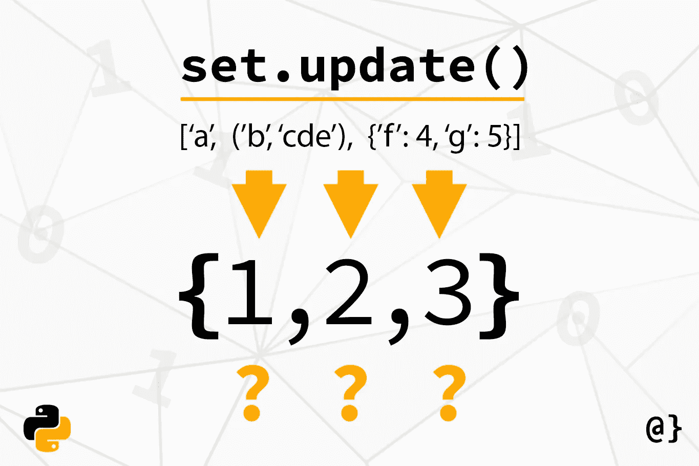

# 使用 Python 的 set.update()方法以获得乐趣和利润

> 原文：<https://betterprogramming.pub/pythons-set-update-method-53a8fbadb204>

## Python 的 set 是一种强大的集合数据类型，在某些情况下，它提供了优于 list 对象的几个性能优势

图像由[过度编码](https://www.overcoded.net)

Python 是世界上最流行的编程语言之一，这是有充分理由的——它提供了强大的内置数据类型来处理常见问题。`set` 数据类型可用于需要唯一性的性能集合。Python `sets`在查找时比`lists`性能更好，但是在迭代元素时性能稍差。

# Python 集合数据类型快速介绍

Python 集合提供了几种添加、移除或检索元素的方法。最简单的(ish)方法是`set.add()`方法。官方 Python 文档以如下方式描述集合( [R](https://docs.python.org/dev/tutorial/datastructures.html#sets) ):

> 集合是没有重复元素的无序集合。基本用途包括成员资格测试和消除重复条目。集合对象还支持数学运算，如并、交、差和对称差。

一些值得注意的要点是没有重复元素、成员测试和奇特的数学运算。这些被认为是 Python 的`set` 数据类型的定义特征。

# Python 的 set.update 方法

要真正理解 Python 的`set.update`方法，需要将其与`set.add`方法进行比较。这种比较将对应该选择`set.update`的用例和底层功能进行分层。因此，我们将重点放在`set.update`上，但我会在此过程中包括一些比较示例。

# 添加单一元素

下面是通过`set.add`方法创建集合和添加元素的快速示例。注意第二个例子的错误表明*只有单个项目*可以这样添加。这是应该考虑更新方法的标志。否则，必须迭代循环中要添加的所有元素(最后一个例子)。见下文:

**注意**:我已经用文字符号而不是`set()`符号创建了一个集合。此语法不能用于创建空集，因为它将创建一个空的字典对象。

# 添加多个元素

向一个`set`添加多个元素就是`set.update()`方法的用武之地。它的用法很简单，但是在一些值得注意的情况下必须小心。

## 字典对象

注意这里的`set.update`方法需要多个 iterable 项。限定结构包括`Lists`、`Tuples`，甚至`Dictonary`对象。另外，注意`set.update()`方法将只使用来自`Dictionary`对象的键。例如:

Python 还允许使用多个键创建 dictionary 对象，尽管重复的值将被忽略。这可能会造成一些混乱，值得记住，尤其是在使用字典对象和集合对象时。例如:

## 元组对象

元组是另一种需要小心的情况。虽然元组是使用`add()`方法整体添加的，但是更新添加了单个元素。如果元组的成员关系很重要，那么`add()`方法更合适。例如:

在最后一个示例中，请注意，作为 iterable 成员添加的元组是完整添加的。这说明`set.update()`方法*不是递归的*。

## 字符串对象

向集合中添加字符串还会带来一些需要注意的边缘情况——最值得注意的是，可能会将字符串解释为`character` iterables。记住`update()`方法接受一个 iterable 作为它的参数 add 方法接受一个单独的项目。当向 update 方法传递一个包含多个字符的字符串时，它将被解释为 iterable，并被视为 iterable。考虑下面的例子:

# 最后的想法

很明显，Python 的`set.update()`方法有一些首选用例。通常，当需要向一个集合对象添加多个项目时，这是首选。集合提供了高得多的性能成员测试——特别是对于大型数据集——尽管性能的可迭代性稍差。

请记住，这里列出的使用*和*边缘案例有助于更好地评估与列表等其他集合数据类型相比，集合的性能收益何时超过损失。此外，几乎可以肯定的是，记住`set.update()`方法的用例、动态和边缘情况关注点将证明在任何项目中争论数据时是有益的。

*文章“* [利用 Python 的 set.update 方法取乐&获利](https://www.overcoded.net/python-set-update-method-044711/)”*原载于* [*过度编码*](https://www.overcoded.net) *网站，经允许在此转载。*