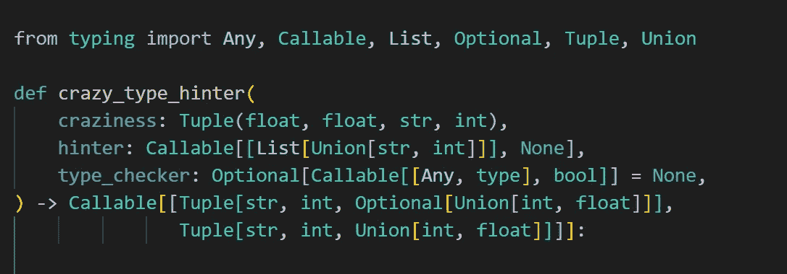

# Python 的类型暗示:朋友，敌人，还是只是头痛？

> 原文：<https://betterprogramming.pub/pythons-type-hinting-friend-foe-or-just-a-headache-73c7849039c7>

## 类型提示在 Python 社区越来越受欢迎。这将把我们引向何方？我们能做些什么来正确使用它？

Python:使用类型提示进行提示真的有帮助吗？照片由[艾米丽·莫特](https://unsplash.com/@emilymorter?utm_source=medium&utm_medium=referral)在 [Unsplash](https://unsplash.com?utm_source=medium&utm_medium=referral) 拍摄

所有的 Python 爱好者都知道，几年来，Python 的类型提示迅速流行起来。它始于 Python 3.5，从那以后，这个功能有了更多的类型和函数，在 Python 3.10 中，甚至有了一个新的操作符`|`。不管幸运与否，这个运算符与用于集合的同一个运算符有相似的含义。

我听到了关于类型暗示的不同观点，从愤怒和仇恨到爱和奉献。大多数用 Python 编写类型提示的作者认为它们很有帮助，可以增加代码的可读性，尤其是在代码库很大的情况下。然而，当这样做时，它们通常显示非常简单的类型提示示例。

尽管类型提示使人们能够使用静态类型检查器，但我们不会在本文中讨论这个主题。我不得不承认，这种静态检查确实是一种有用的工具。在这里，我们将讨论一个更有争议的话题，即类型提示是否有帮助。有些人认为这是理所当然的，但我不这样认为。我想看证据。就像几乎所有事情一样，一件好事做得太多也可能是坏事。Python 类型暗示也是如此吗？

类型提示有很多拥护者。有些人只说这是一个非常有用的工具。其他人声称您需要使用类型提示，因为没有它们 Python 代码很难阅读，如果不是不可理解的话。

为了便于讨论，我想请你保持开放的心态。目前，不要想当然地认为类型提示有优势。相反，让我们试着分析它们，以便找到它们的利弊。

现在，打开我们的思路，让我们进入关于在 Python 中使用类型提示的讨论，集中在以下问题上:它们是否像我们一直听到的那样有帮助？或者，事实上，它们会降低代码的可读性吗？如果是这样的话，我们是否可以改进类型提示，使结果代码更具可读性？

# 代替对类型提示的介绍

我不会解释类型提示，因为这会使这篇文章太长。此外，它们已经在各种来源中描述过，这里也在介质上描述过(例如，这里的、这里的或这里的)。在《流畅的 Python》第二版中，卢西亚诺·拉马尔霍给出了相当详细的介绍。你可以在许多书中看到类型提示的作用。比如在 Steven F. Lott 的*函数式 Python 编程*(也是第二版)。

类型提示有三个主要目的:它使您能够在代码上运行静态检查器；它可以帮助你理解函数签名(参数类型，返回类型)；并且可以增加代码的可读性。让我们考虑几个例子。只分析函数的签名就足够了，这也是包含类型提示的地方。

在继续之前，请阅读下面的代码片段，并尽可能多地从函数的签名中寻找答案。

现在，让我们来谈谈这些功能:

*   `parse_text()`:它接受一个文本(作为一个字符串),在以某种方式解析它之后，它返回一个解析过的字符串。当然，我们不知道这个解析在这里意味着什么，但是从函数体来看应该很容易理解。这个签名很容易理解。
*   `gdu()`:嗯……不知道。这个签名简直是噩梦。
*   `report_bug()`:显然，这个函数的目的是报告一个 bug。bug 作为字符串传递。`reporter`可能是报告错误的人/事，以字符串形式给出，默认值由全局变量`DEFAULT_REPORTER`提供。`report_to`是要报告 bug 的位置，也以字符串形式给出，也带有由全局变量(`DEFAULT_REPORT_TO`)提供的默认值。
    该函数返回一个布尔值；它可能会告知错误是否被成功报告。尽管比`parse_text()`类型的提示更复杂，但它们也很简单。
*   `measure_distance()`:我们知道函数测量距离，并以浮点形式返回。然而，我们不知道这个 float 代表哪个单元。距离是从一个位置到另一个位置，由于它们是以两个浮点数的元组的形式提供的，所以它们很可能是地理坐标。这个签名暗示了这个函数做了什么，但是它可以更具可读性。

当然，我们很少能仅仅通过阅读函数的签名来了解函数的所有功能。但是如果签名是好的，我们甚至不用查看函数体就可以学到很多东西。但是当情况像`gdu()`中这样混乱的时候，打字提示不仅没有帮助，甚至会成为额外的障碍，只会增加我们的麻烦。

当然，在`gdu()`中，问题不仅仅在于复杂的类型提示；它还在于——如果不是主要的话——糟糕的命名，这一点帮助都没有。

有一些方法可以提高可读性。再看一眼`measure_distance()`。它的签名没有传达两件事:度量单位是什么(公里、米、英里或其他公制单位)；以及这两个元组是否表示地理坐标。为了给用户提供这两条信息，我们能改进类型提示吗？

事实上，我们可以。这就是类型别名(我有时称之为自定义类型)能有很大帮助的地方:

这个签名确实说明了我们之前遗漏了什么，这要归功于类型别名`Km`和`Coordinates`:位置是地理坐标，距离以千米为单位。

通常，使用实际的数据结构比使用类型别名更好:

这里，`Coordinates`是一个`namedtuple`数据结构，不是类型别名。您应该使用哪种方法？看情况。因为两者都很容易理解，所以根据您是否将数据结构用于不同的目的来决定。在这里，它将被用作实际位置的容器；在这种情况下，使用自定义数据结构。否则，使用类型别名。

请记住:

> 创建类型别名时，命名至关重要。使用有意义的名称，就像创建自定义数据结构一样。

# 那么，键入提示有多大帮助呢？

类型提示可以帮助增加可读性，正如函数`parse_text()`、`report_bug()`和`measure_distance()`所示。有时，带有信息性类型提示的签名足以让读者理解该函数的作用。

抱歉，你说什么？啊，我明白了…我忘了提`gdu()`功能，它完全没有任何有意义的东西。你把它作为反例指出来是对的。让我们回忆一下`gdu()`的签名，在没有类型提示的情况下重写它:

两个版本都同样不可读，原因只有一个:函数本身及其参数的无意义的名称。这些类型提示无助于解释函数做什么，但是它们会增加麻烦。

> 在极少数情况下，当命名不好时，类型提示可以增加函数签名的可读性。然而，在考虑使用类型提示来提高可读性之前，请重新考虑命名。使用清晰和信息丰富的名称，然后使用类型提示来进一步增加函数的可读性。

正如你所看到的，类型本身，没有其他任何东西，通常也是没有意义的。我们知道`zizi`是一个接受字符串并返回字符串的可调用函数，但这并不意味着什么。因此，我们的第一个重要结论是:

> 类型提示仅适用于良好的命名。没有好的命名，任何东西都不会有助于提高代码的可读性，包括类型提示。

一些开发人员对 Python 类型提示着迷。作者图片。

即使使用了良好的命名，类型提示也会使函数的签名难以阅读和理解。看下面这个例子([来源](https://skeptric.com/python-maybe-monad/)):

免责声明:这是 Python 中类型提示的一个例子，它不违反规则。我并不想批评这段代码，而是想说明我不喜欢类型暗示的某些用法。

现在，让我们完全删除类型提示:

因为我们没有`f`的类型提示，我把它的名字改成了`func`，使它更有意义。`maybe_fmap()`是`[Maybe](https://en.wikibooks.org/wiki/Haskell/Understanding_monads/Maybe)`[单子](https://en.wikibooks.org/wiki/Haskell/Understanding_monads/Maybe)的简单实现。比较带注释和不带注释的代码。你认为前者比后者更容易阅读和理解吗？我没有；我觉得他们的可读性差不多。

如果没有类型提示，很容易看到`maybe_fmap()`将一个可调用对象作为参数；有人看不出`func`代表一个 callable 吗？我看到函数返回`lambda`，确实是可调用的；很难看到吗？

我同意初学 Python 的用户可能很难看到这一切。但是你认为类型提示会帮助他们看到这一切吗？我没有；我认为，尽管理解`maybe_fmap()`的上述方面有问题，他们在理解下面的签名方面会有更大的问题:`maybe_fmap(f: Callable[a, b]) -> Callable[Optional[a], Optional[b]]`。

通过这个例子，我想指出的是，有时类型提示会使代码变得不必要的复杂。因此，大多数时候，我更喜欢一种介于两者之间的解决方案，一种以合理的(可理解的)方式提供类型提示的解决方案。这意味着避免过于复杂的类型提示。

当然，这是一个偏好的问题，但是我害怕使用充满了长而复杂的类型提示的代码。我使用类型提示，但是我更喜欢简单的，就像上面例子中的那些，比如`parse_text()`、`report_bug()`，最重要的是`measure_distance()`。

困难的类型提示不会使代码更容易理解；事实上，他们使它更不可读。这就是为什么我不相信类型提示会增加 Python 代码的可读性。我同意可理解的类型提示增加了代码的可读性。然而，在实践中，我看到的许多类型提示都很难理解。

> 我猜想编写清晰代码的程序员可能会使用类型提示来改进它。同样，那些编写不清楚代码的人手中的类型提示甚至会降低代码的可读性。

这表明使用有效类型提示的最佳方式是学习如何编写干净的代码。这些技能将使你有能力使用有效和可读的类型提示。

在我结束之前，我想强调我喜欢静态类型。我在 C 和 Go 中用过，在 Cython 中也用过。在所有这三种情况下，我都喜欢使用静态类型，并且认为它很有用。但是我们不能忘记，类型提示不是静态类型；这是两个完全不同的东西，不应该混淆。

# **结论**

Python 的类型暗示不再是一个新概念，但它仍在发展中。我个人的观点是，虽然不是必须的，但是类型提示是有帮助的，有时非常有帮助。但是我害怕将要发生的事情。恐怕我将不得不写`*args: Any, **kwargs: Any`而不是`*args, **kwargs,`，尽管根据定义，`*args, **kwargs`意味着它们可以是任何东西。而且我很害怕，因为我看到越来越多无法理解的类型提示。

多年来，Python 因其易于理解的语法而被认为是一门伟大的语言。还配得上这个意见吗？你以为初学者会欣赏 Python 类型提示的可读性；比如上面一些例子中的那些？我担心人们很快会注意到 Python 不再那么容易了，这完全是由于类型提示，对于初学者来说，这通常是一种障碍而不是支持。

以下是我用来让类型提示变得可理解的一些规则:

1.  使用原始类型提示——也就是说，在签名中直接定义它们——当它们简单且真正易于理解时。当一个参数有一个非常复杂的类型时，你可以(I)简化它的类型提示(例如，`Callable`而不是`Callable[Tuple[str, str, int | float], Tuple[str, str]]` ), (ii)使用类型别名提示，或者(iii)创建一个你可以用作类型提示的自定义数据结构。(关于(二)和(三)，见下文第 2 和第 3 点。)。)
2.  当您可以使用数据结构(例如，命名的元组、数据类或类)而不是相应的类型提示时，就这样做。这可以归结为您可以在代码中实际使用这种数据结构的情况。
3.  每当您需要复杂类型提示但不需要相应的数据结构时，请定义相应的类型别名(自定义类型)。在函数/方法签名之外进行，并使用有意义的名称。当一个模块或包包含许多类型别名时，你可以把它们放在一个专用的模块中(例如`custom_types.py`)。
4.  遵循以上规则会让`mypy`不开心。不管这听起来有多有争议，我都不在乎。对我来说，代码可读性比让`mypy`开心更重要。

一切都在我们的掌握之中。Python 的声誉岌岌可危。我们可以让类型提示成为一种有用的功能，使 Python 代码更具可读性。但是如果我们不够小心，如果我们遵循疯狂的多类型提示！-更多类型提示！概念，Python 有可能会缓慢但稳步地恶化。十年后(也许早一点或晚一点)，它将成为一种晦涩的编程语言，由于其笨拙的语法，没有人想使用它。

不过，现在还不算太晚。我们都可以为此做些什么。我们能做的最简单的事情就是明智地使用类型提示。如果你同意我的观点，从现在开始，仔细检查 Python 代码中的所有类型提示，并修改所有看起来不清楚或不明确的内容。

感谢你和我一起参加这个充满争议的讨论。我相信你们很多人不同意我的观点。同时，我希望你们中的一些人同意我的观点，而且，谁知道呢，也许我已经成功地说服了你们中的一些人，我们在使用类型提示时应该小心？我将很高兴听到你的想法，所以请用评论来分享你的想法，不管你同意还是不同意我的观点。

# **资源**

*   拉马尔霍湖(2022 年)。流利的 Python。清晰、简洁、有效的编程。第二。版本。奥赖利。
*   洛特，S.F. (2018)。函数式 Python 编程。第二版。包装出版公司。
*   [https://medium . com/@ prozeth/don ' t-be-fear-of-python-s-type-hints-C3 fcb 7 CD a4 d 9](https://medium.com/@prozeth/dont-be-afraid-of-python-s-type-hints-c3fcb7cda4d9)
*   [https://medium . com/forward-data-science/exploring-python-type-hints-6520 f 478 b6a](https://medium.com/towards-data-science/exploring-python-type-hints-6520f478b6a)
*   [https://medium . com/forward-data-science/type-hints-in-python-everything-you-need-to-know-in-5 分钟-24e0bad06d0b](https://medium.com/towards-data-science/type-hints-in-python-everything-you-need-to-know-in-5-minutes-24e0bad06d0b)
*   【https://skeptric.com/python-maybe-monad/ 
*   [https://en . wiki books . org/wiki/Haskell/Understanding _ monads/Maybe](https://en.wikibooks.org/wiki/Haskell/Understanding_monads/Maybe)

 [## 加入我的介绍链接媒体-马尔钦科萨克

### 阅读马尔钦·科萨克(以及媒体上成千上万的其他作家)的每一个故事。您的会员费直接支持…

medium.com](https://medium.com/@nyggus/membership)