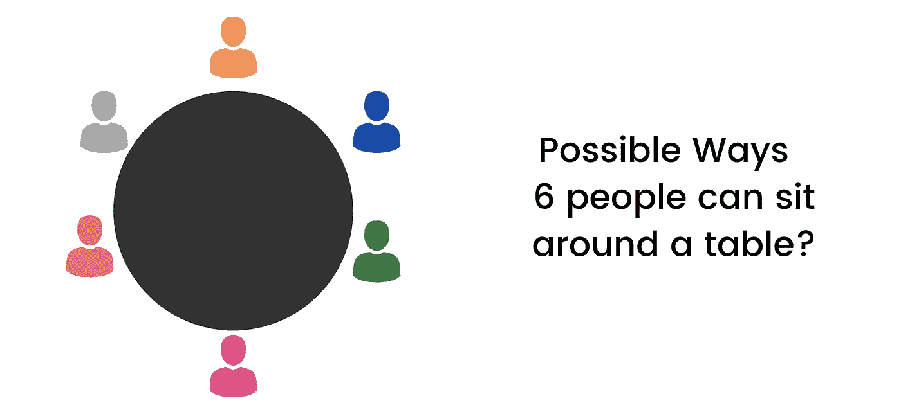

# 量子计算很酷

> 原文：<https://betterprogramming.pub/quantum-computing-is-cool-80a4184cdc6a>

## 快速进入量子计算的奇妙世界

在 [Unsplash](https://unsplash.com?utm_source=medium&utm_medium=referral) 上由 [Boitumelo Phetla](https://unsplash.com/@writecodenow?utm_source=medium&utm_medium=referral) 拍摄的照片

让我们从两个基本事实开始:

*   经典计算机使我们能够做出令人惊叹的东西。最好的例子就是互联网。
*   还是有经典计算做不到的事情。最常见的例子是优化— *在众多解决方案中寻找最佳解决方案的过程。*

让我们试着理解最优化的问题:

图片来源:作者

让我们看看上面这张桌子的图片，这张桌子可以坐 6 个人。

但是每个人可以用多少种不同的方式坐在餐桌旁呢？答案是六。有多少种座位安排？答案是六阶乘，即 720。

因此，人们可以有 720 种不同的方式坐在六人桌前。再加一个人现在有 5040 个座位安排。随着越来越多的人加入到这个问题中，这个数字会呈指数增长。

这是经典计算机的问题。每当你添加更多的因素，解决问题所需的计算能力就会成倍增加，这使得在现实的时间长度内解决问题几乎是不可能的。

经典计算机的失败点是当存在指数级扩展时。

指数缩放的经典例子是一个人向国王展示一套象棋的故事。国王被这个游戏打动了，就问这个人想要什么作为回报。他们回答说:

> “游戏有 64 个方块，所以请给我一粒米，然后第二天加倍，并按照这一惯例进行 64 天”

第一天，他只得到一粒米，第二天得到两粒米，以此类推。到了周末，他有了一茶匙大米，但到了月底，他得到了一个小国的大米产量，64 天后，他得到了相当于珠穆朗玛峰大小的大米。

发生这种情况是因为金额不断翻倍。国王需要付给这个人的净米量是 2⁶⁴，等于 1.8446744 e+19——一个非常大的数字！

# 量子计算有什么不同？

量子计算是不同的，因为它的计算方式非常不同。不像传统的计算机，它不需要做所有的计算。

这里涉及两个关键原则:

*   **叠加**:量子系统在被测量之前同时处于多个状态的能力。
*   **量子纠缠**:一种量子力学现象，其中两个或更多物体的量子状态必须参照彼此来描述，即使单个物体可能在空间上是分离的。这导致了系统的可观测物理属性之间的相关性——意味着这两个物体之间存在可观测的相似性。

# 什么是量子计算？

将这两个概念结合起来使用，我们能够用比传统计算机少得多的步骤实现所需要的东西。

经典计算机以 0 和 1 的比特工作。量子计算机使用量子位，也称为量子位。

单个量子位可以保存两条信息，两个量子位的信息可以保存四条不同的信息，三个量子位可以保存八条，以此类推。

在经典计算中，一位只能保存一条信息，两位一次可以保存两条数据，依此类推。

所以，随着我们继续下去，我们会发现 n 个量子比特包含的经典信息量等同于 2^N 经典比特。

当然，指数的力量意味着当我们达到某个数字时，比方说你有 300 个量子比特处于所谓的完全纠缠态，然后你会有一个非常疯狂的状态，所有 300 个粒子以某种方式叠加在一起，等等。那么你就有了价值 2 个⁰⁰经典比特的信息，这相当于宇宙中的粒子数！

> **超级酷！**

但是这里有一个问题:它们存在于所有的状态中，但是当记录时，它们必须进入一个基本状态——0 或 1 和*,所有其他的信息才会丢失。*

我们一般不希望计算的最终运算处于复杂的叠加态——因为我们无法测量一个叠加态，只能测量基本态。

所以你要设计逻辑运算，使得最终的计算，只是一个唯一的状态。

这个叠加的概念可以用薛定谔著名的思想实验来更容易地解释，这个实验本质上告诉我们，在被观察到之前，实验的所有可能结果都是可能的:

> 在实验中，他把一只猫放在一个装有毒药的纸箱里，这只猫有 50%的几率会接触到那种毒药而死亡。现在，在我们打开并检查纸板箱之前——这只猫是死是活的几率是相等的。猫的叠加状态是，在我们检查之前，它既是活的**又是死的**。

这只是一个案例。现在，不仅包括一个变量(一只猫)，还包括许多其他变量。可以想象，最终的函数非常复杂。我们想要的是所有变量相互作用并达到最佳结果的结果。

> 量子计算并没有更快地完成这些步骤，而是减少了达到预期结果所需的步骤数量。

我希望在读完我的文章后，你有一点动力去学习更多关于量子计算的知识。

感谢阅读！