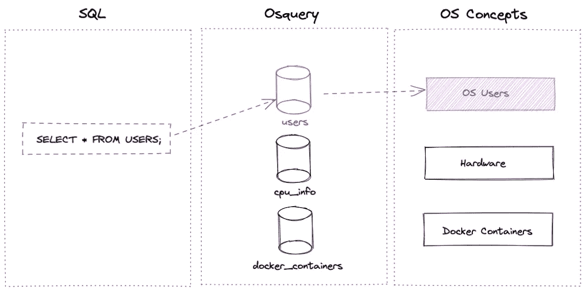
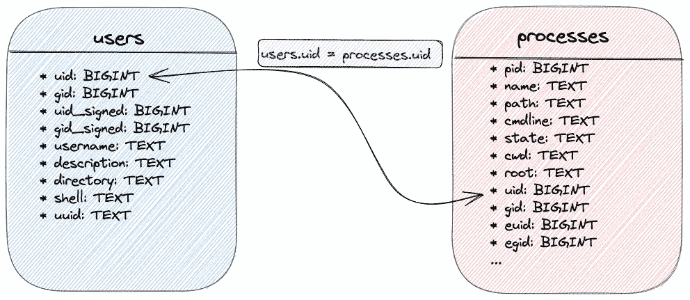

# 使用“osquery”将您的设备作为关系数据库进行查询

> 原文：<https://betterprogramming.pub/query-your-device-as-a-relational-database-with-osquery-b55f66af8b96>

## 停止链接命令；开始进行 SQL 查询以获取操作系统信息


照片由[麦斯威尔·尼尔森](https://unsplash.com/@maxcodes?utm_source=medium&utm_medium=referral)在 [Unsplash](https://unsplash.com?utm_source=medium&utm_medium=referral) 上拍摄

作为开发人员或运营人员，我们每天都要与不同的操作系统(OS)打交道。命令行允许我们检索关于系统当前状态的信息。最后，操作系统可以被粗略地简化为一个数据库，而命令行可以被简化为一个用来访问我们想要的东西的查询。

这是 osquery 项目通过提供一个可用于系统分析或监控的低级且强大的端点来推动的概念


osquery 项目徽标

Osquery 将操作系统公开为高性能的关系数据库。表格代表 OS 抽象概念，例如用户或进程。之后，您可以使用 SQL 查询从它们那里检索信息。Osquery 执行对操作系统的实时调用来为您提供数据，如下所示:



osquery 中的查询是如何工作的？作者图片

在本文中，我们将探索 osquery 的可能性。安装后，我们将开始进行一些从简单到复杂的查询。然后，我们将使用`osqueryd`守护进程计算出预定的查询。进行系统审计并在日志中记录事件是很有用的。日志可以被转发到集中式日志记录系统。

通信接口不仅限于解释器。我们将使用 Golang 以编程方式执行查询。此外，我们将通过在端点中添加一个新表来扩展 osquery 信息。

# 安装 Osquery

可以在许多操作系统上安装 osquery，例如 Windows、MacOS、Linux 和 FreeBSD:


Osquery 支持的操作系统。作者图片

根据您使用的操作系统，您可以获得额外的信息。下面详细的安装是针对 MacOSX 的，但是你可以在这里找到另一个安装指南[。首先，使用以下命令安装 osquery:](https://osquery.io/downloads/official/5.0.1)

```
$ brew install --cask osquery
```

需要复制示例配置文件，如下所示:

```
$ sudo cp -p /var/osquery/osquery.example.conf /var/osquery/osquery.conf
```

然后让我们启动 osquery 守护进程:

```
$ sudo osqueryctl start
```

> *对于 Linux 系统，您可以使用 systemd:* `*sudo systemctl start osqueryd*`启动 osqueryd

# Osquery 解释器

Osquery 提供了一个带有`osqueryi`命令的 SQL 解释器:

```
$ osqueryi                                                               
Using a virtual database. Need help, type '.help'
osquery> .help
Welcome to the osquery shell. Please explore your OS!
You are connected to a transient 'in-memory' virtual database.

.all [TABLE]     Select all from a table
.bail ON|OFF     Stop after hitting an error
.connect PATH    Connect to an osquery extension socket
.disconnect      Disconnect from a connected extension socket
.echo ON|OFF     Turn command echo on or off
.exit            Exit this program
.features        List osquery's features and their statuses
.headers ON|OFF  Turn display of headers on or off
.help            Show this message
.mode MODE       Set output mode where MODE is one of:
                   csv      Comma-separated values
                   column   Left-aligned columns see .width
                   line     One value per line
                   list     Values delimited by .separator string
                   pretty   Pretty printed SQL results (default)
.nullvalue STR   Use STRING in place of NULL values
.print STR...    Print literal STRING
.quit            Exit this program
.schema [TABLE]  Show the CREATE statements
.separator STR   Change separator used by output mode
.socket          Show the local osquery extensions socket path
.show            Show the current values for various settings
.summary         Alias for the show meta command
.tables [TABLE]  List names of tables
.types [SQL]     Show result of getQueryColumns for the given query
.width [NUM1]+   Set column widths for "column" mode
.timer ON|OFF      Turn the CPU timer measurement on or off
osquery>
```

您可以使用`.help`命令或在文档中检索表格列表:

```
osquery> .tables
```

# 进行第一次查询

## 检索用户信息

我们将使用`users`表列出所有现有用户。可以获得表模式，如下所示:

```
osquery> .schema users
CREATE TABLE users(`uid` BIGINT, `gid` BIGINT, `uid_signed` BIGINT, `gid_signed` BIGINT, `username` TEXT, `description` TEXT, `directory` TEXT, `shell` TEXT, `uuid` TEXT, `type` TEXT HIDDEN, `is_hidden` INTEGER, `pid_with_namespace` INTEGER HIDDEN, PRIMARY KEY (`uid`, `username`, `uuid`, `pid_with_namespace`)) WITHOUT ROWID;osquery> select * from users where username = 'gvincent';
+-----+-----+------------+------------+----------+-------------------+-----------------+----------+--------------------------------------+-----------+
| uid | gid | uid_signed | gid_signed | username | description       | directory       | shell    | uuid                                 | is_hidden |
+-----+-----+------------+------------+----------+-------------------+-----------------+----------+--------------------------------------+-----------+
| 501 | 20  | 501        | 20         | gvincent | Guillaume Vincent | /Users/gvincent | /bin/zsh | 90EF833A-727A-4635-81E7-AEAA7DCF0981 | 0         |
+-----+-----+------------+------------+----------+-------------------+-----------------+----------+--------------------------------------+-----------+
```

默认情况下，当前打印为漂亮模式，但可以更改:

```
osquery> .mode line
osquery> select * from users where username = 'gvincent';
        uid = 501
        gid = 20
 uid_signed = 501
 gid_signed = 20
   username = gvincent
description = Guillaume Vincent
  directory = /Users/gvincent
      shell = /bin/zsh
       uuid = 90EF833A-727A-4635-81E7-AEAA7DCF0981
  is_hidden = 0
```

## 列出用户启动的进程

现在我们已经完成了第一个查询，我们可以进一步。我们希望列出特定用户拥有的进程。这是使用`uid`在`users`和`processes`表之间进行的联合查询:



用户和进程表之间的关系。作者图片

```
osquery> .mode pretty
osquery> select u.username, p.pid, p.start_time, p.name, p.path, p.state
...> from processes as p, users as u
...> where p.uid = u.uid and u.username = 'gvincent'
...> order by p.start_time;
```

> *可以使用 datetime 函数将 UNIX 时间戳格式化为人类可读的日期:* `*datetime(start_time, 'unixepoch')*`

# 发现预定查询

> *`*osqueryd*`*是主机监控守护程序，允许您* ***调度*** *查询并记录 OS 状态变化。该守护程序随时间聚合查询结果并生成日志，这些日志根据每个查询指示状态变化。该守护程序还使用操作系统事件 API 来记录受监控的文件和目录更改、硬件事件、网络事件等。”*[*https://osquery . readthedocs . io/en/1 . 8 . 2/introduction/using-osqueryd/#记录和报告*](https://osquery.readthedocs.io/en/1.8.2/introduction/using-osqueryd/#logging-and-reporting)*

*我们将为 USB 设备监控配置一个预定查询。USB 设备代表了数据泄露。它们可能用于泄漏敏感数据或包含危及网络和系统的恶意文件。*

*计划的查询被添加到`/var/osquery/osquery.conf`中的 osquery 配置文件中:*

```
*{
  "usb_devices": {
    "query": "select vendor, model from usb_devices",
    "interval": 60
  }
}*
```

*使用以下命令重新启动守护程序:*

```
*$ sudo osqueryctl restart*
```

*事件记录在`/var/log/osquery`中。*

# *以编程方式与 Golang 通信*

*用这个命令下载 Golang `osquery-go`包:*

```
*$ go get github.com/osquery/osquery-go*
```

*下面的`main.go`文件连接到本地`osquery`套接字，并列出一个用户的信息:*

```
*$ sudo go run main.go
Got results:
[map[description:Guillaume Vincent directory:/Users/gvincent gid:20 gid_signed:20 is_hidden:0 shell:/bin/zsh uid:501 uid_signed:501 username:gvincent uuid:90EF833A-727A-4635-81E7-AEAA7DCF0981]]*
```

# *通过添加新表来扩展 Osquery 的可能性*

*您可以在 osquery 中完成信息。下面的 Golang 代码显示了如何添加新表:*

*对于这里的例子，我们直接返回一个字符串映射。但是我们可以执行一个动作并返回它的结果。这将是新表中的一条记录。*

*为了测试这个新表，您必须用这样的标志启动`osqueryi`:*

```
*$ osqueryi --nodisable_extensions*
```

*同时，您必须指定 UNIX 套接字作为程序的参数，如下所示:*

```
*$ go run ./my_table_plugin.go --socket /Users/gvincent/.osquery/shell.em*
```

*回到解释器，执行以下操作:*

```
*Using a virtual database. Need help, type '.help'
osquery> select * from foobar;
+-----+-----+
| foo | baz |
+-----+-----+
| bar | baz |
| bar | baz |
+-----+-----+*
```

# *结论*

*在浏览了`osquery`之后，我们看到它提供了一个兼容多种操作系统的端点。您只需要在 SQL 查询中进行连接，而不是链接命令。这允许更好的可维护性，并且可以进行高级的信息提取。*

*计划查询允许自动执行查询并记录系统上的事件。只记录状态的变化。进行审计，尤其是验证系统的完整性，是很有趣的。当然，其他用途也是可能的，想象力是极限。*

*它也是一个使用编程语言的可扩展工具。我们已经看到了如何使用 Golang 执行查询，以及如何添加一个新表来丰富端点。*

# *资源*

 *[## Osquery

### 编辑描述

osquery.io](https://osquery.io/)* *[](https://github.com/osquery/osquery-go) [## GitHub-osquery/osquery-go:osquery 的 Go 绑定

### osquery 将操作系统公开为高性能的关系数据库。这允许您编写基于 SQL 的…

github.com](https://github.com/osquery/osquery-go)*