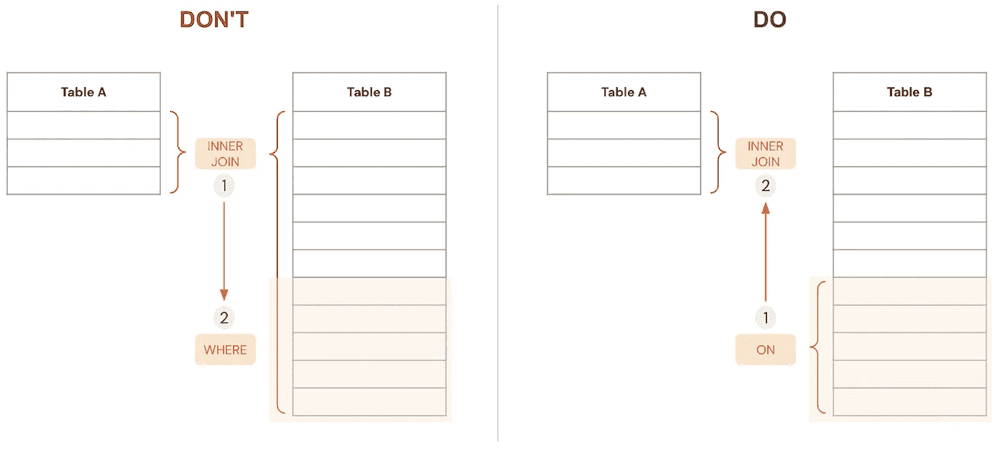

# 用 5 个原则来查询数据库

> 原文：<https://betterprogramming.pub/querying-databases-5-principles-to-rule-them-all-afa61403b77d>

## 不管数据库类型如何，编写优化查询的准则

图片来自 [Unsplash](https://unsplash.com/photos/diGdJKdr9n0)

您曾经遭受过沉重的仪表板或超时查询的困扰吗？问题可能不是来自您的可视化工具或数据仓库，而是来自您的 SQL 查询本身。

作为一名大量使用数据的人，我在过去的工作中花费了大量时间查询数千万亿字节的分析数据，以做出正确的决策。复杂的查询需要精心构建。无论是与数据仓库、数据湖还是流服务交互，都要应用相同的原则来确保执行中的性能。‍

以下是我多年来收集的一些技巧，并归纳为 5 个主要原则:

# 1.不是越多越好

为了避免调动不必要的系统资源，从确定用例所需数据的范围开始，并利用所有 SLQ 技巧来达到目的:

*   在查询中总是使用`WHERE`语句来过滤掉不相关的数据
*   在大型表存储为多个文件和目录的基础设施中，利用`WHERE`子句中的分区键
*   避免使用`SELECT *`,而是指定您需要的列名
*   在可能的情况下，使用`LIMIT`对输出中的查询结果进行采样
    ‍

# 2.文字是免费的，但你如何使用它们可能会让你付出代价

尽管有明显的重叠，但每个 SQL 函数都是为特定的需求而设计的，使用正确的函数对于防止效率低下至关重要。下面列出了一些提示，即使是很小的调整也会对性能产生重大影响:

*   除非需要与 GROUP BY 一起使用，否则不要用`HAVING`代替`WHERE`。
*   默认情况下，不要对数据进行重复数据删除，`DISTINCT`是一项非常昂贵的操作。
*   不要滥用通配符，在输入的末尾使用通配符(' xxx **%** ')来减少搜索的可能结果。

# 3.让你的加入和你一起工作，而不是和你作对

组合不同表中的列是非常常见的。在某些情况下，您正在将第一个表中的每一行连接到第二个表中的每一行，查询甚至可能没有完成。明智地:

*   根据您的需求选择[正确的连接类型](https://www.metabase.com/learn/sql-questions/sql-join-types)。
*   在 on 表达式中而不是在 WHERE 条件中插入连接条件，以缩小连接的行数，因为这是一个开销非常大的操作。

来源: [Sifflet](https://www.siffletapp.com/)

# 4.分而治之，又名使用通用表格表达式(CTE)

公用表表达式是一个临时表，可以在同一个查询中定义一次并多次使用。cte 非常有助于提高代码的可读性，降低代码的复杂性，优化代码的执行资源。

cte 可以在查询开始时用指令`WITH table_name AS`定义

# 5.健康身体中的健康思想

关心你的查询格式是必要的。这些简单的最佳实践可以使您的查询可读性强、易于调试和共享:

*   大写 SQL 关键字
*   对表和列的名称和别名使用 snake case
*   缩进和空格

# **结论**

随着新技术塑造现代数据堆栈，无论用户的专业技术水平如何，他们都越来越容易访问数据。

数据民主化固然很好，但确保数据平台的运行效率和健康却是一个真正的挑战。尽管没有神奇的手册或放之四海而皆准的方法，但实施一些最佳实践(如本文中所述)可以在确保数据操作的可持续性方面发挥不可或缺的作用。

I‍f:你喜欢讨论数据话题，请点击这里[联系我们](https://www.linkedin.com/in/wissem-fathallah-6058b578/)。