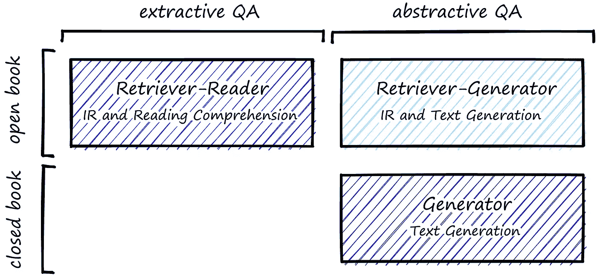
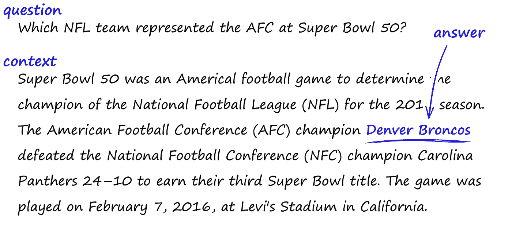
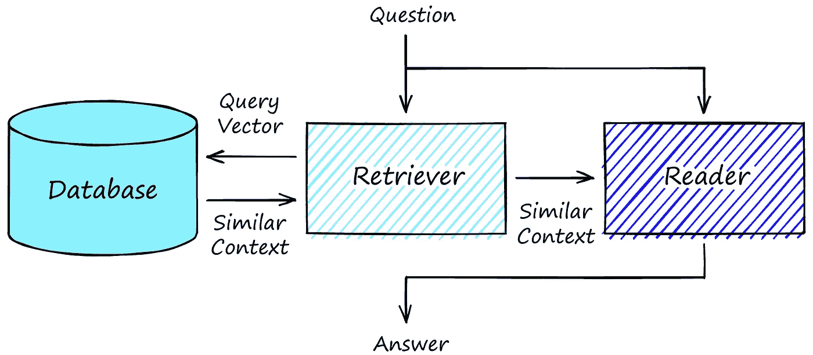
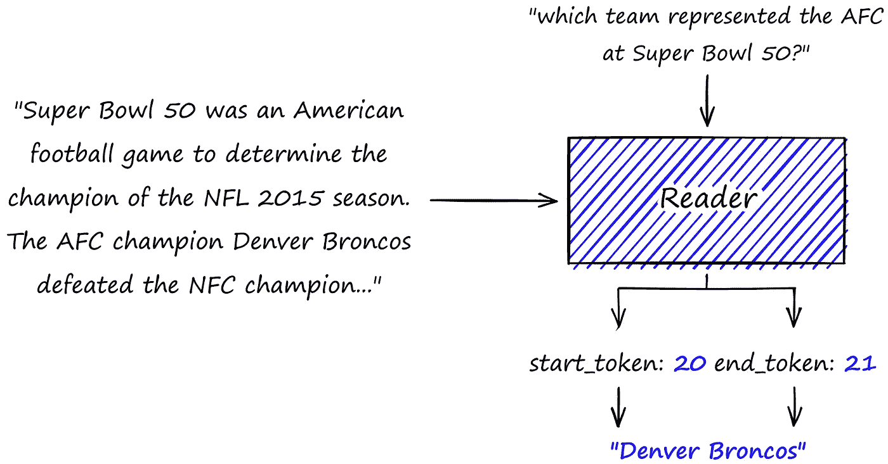
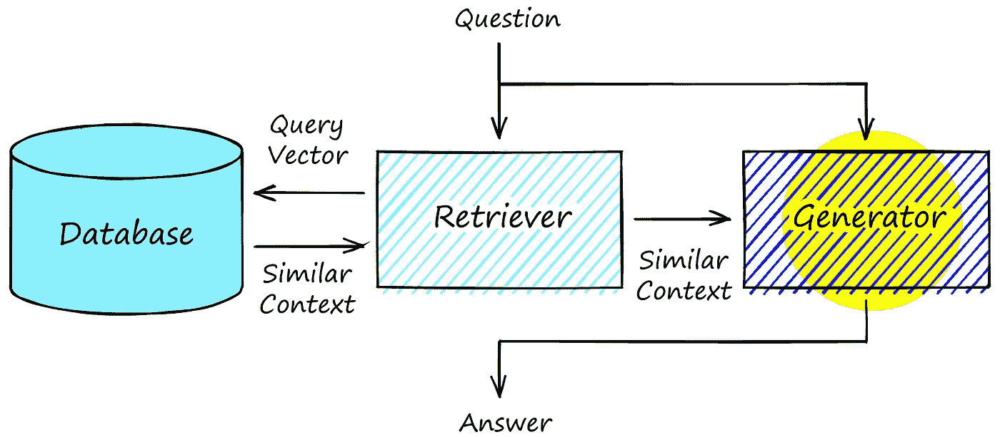
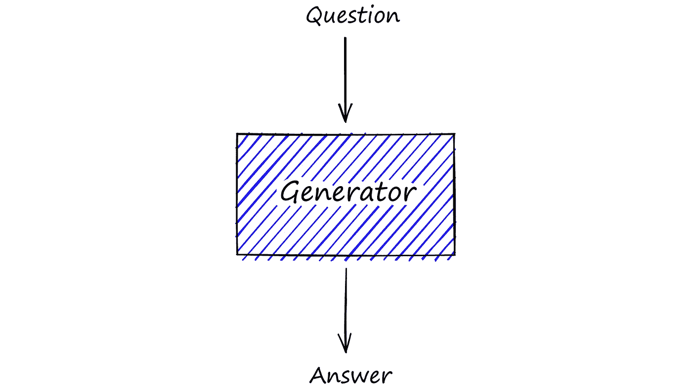

# 开放领域问答简介

> 原文：<https://betterprogramming.pub/question-answering-46b4dec54e4>

## 利用深度学习打开非结构化数据的宝库


图片由作者提供，文章最初发布在 [Pinecone.io](https://www.pinecone.io/learn/question-answering/)

搜索是全球许多应用程序和公司的重要功能。无论是在制造业、金融业、医疗保健业，还是*几乎*任何其他行业，组织都拥有庞大的内部信息和文档库。

不幸的是，许多公司的数据规模意味着信息的组织和可访问性会变得非常低效。对于基于语言的信息，这个问题更加严重。

语言是人们交流抽象思想和概念的工具。自然地，想法和概念对于计算机来说更难理解并以有意义的方式存储。

大多数组织依靠托管在各种*【内部门户】*上的一组基于关键词的搜索界面来处理语言数据。如果做得好，这可以满足某些数据的业务需求。

如果一个人知道他们在找什么，以及他们需要的信息的关键词和术语，基于关键词的搜索是理想的。当答案的关键词和术语未知时，关键词搜索是不充分的。人们在庞大的文档库中寻找未知的答案是对生产力的一种消耗。

我们如何最小化这个问题？答案在于*语义搜索*，特别是语义搜索的问答(QA)风格。

语义搜索允许我们基于概念和想法而不是关键词进行搜索。给定一个短语，语义搜索工具从存储库中返回语义最相似的*短语。*

问答通过使用自然语言问题进行搜索并返回相关文档和特定答案，进一步发展了这一思想。QA 旨在尽可能模仿自然语言。

如果我们问一个店员，*“那些美味的、新鲜出炉的、不是饼干但看起来像饼干的东西在哪里？”我们会期待带我们去那些地方的方向。这种自然的对话形式正是 QA 想要复制的。*

本文将介绍不同形式的 QA，这些*‘QA 栈’*的组成部分，以及我们可能在哪里使用它们。

# 问题解答一览

在我们深入细节之前，让我们先描绘一下 QA 的高层次图景。

首先，我们的重点是*开放域* QA (ODQA)。ODQA 系统处理跨广泛主题的问题，不能依赖于代码中的特定规则。

*开放域*的替代方案是*封闭域*，它专注于有限的域/范围，而*可以*经常依赖于显式逻辑。我们将**而不是**涵盖*封闭领域* QA。

在本文的剩余部分，我将交替使用 ODQA 和 QA。ODQA 模型可以分成几个子类。



有几种回答问题的方法。

最常见的问答形式是**开卷摘录问答**(上图左上角)。这里我们结合了信息检索(IR)步骤和阅读理解(RC)步骤。

任何*开卷* QA 都需要一个 IR 步骤来*从“开卷”中检索*相关信息。

就像开卷考试一样，学生可以在考试中参考书本获取信息，该模型可以参考外部信息源。该信息来源可能是公司内部文档、维基百科、Reddit 或任何其他与模型本身无关的信息来源。

IR 步骤检索相关文档，并将它们传递给 RC (reader)步骤。RC 包括*从一个句子或段落中提取*一个简洁的答案，通常被称为*文档*或*上下文*。



一个*问题*、相关*上下文*和一个*答案*的示例。

其他两种类型的问答依赖于*生成*答案，而不是*提取*答案。OpenAI 的 GPT 模型是众所周知的生成变压器模型。

在*开卷*抽象 QA 中，第一个 IR 步骤与提取 QA 相同；从外部来源检索相关上下文*。这些上下文被传递给文本生成模型(如 GPT ),并用于*生成*(不是提取)答案。*

*或者，我们可以使用*闭卷*抽象问答。这里只有文本生成模型和*没有* IR 步骤。生成器模型将基于其自身内部学习到的世界表示来生成答案。它*不能*引用任何外部信息源，因此得名*闭卷*。*

*让我们深入研究每一种方法，并了解每种方法的适用范围。*

# *提取质量保证*

*提取式问答可以说是最广泛适用的问答形式。它允许我们提出一个问题，然后*从一篇短文中提取*一个答案。例如，我们有文本(或*上下文*):*

```
*Super Bowl 50 was an American football game to determine the
champion of the National Football League (NFL) for the 2015 season.
The American Football Conference (AFC) champion Denver Broncos
defeated the National Football Conference (NFC) champion Carolina
Panthers 24–10 to earn their third Super Bowl title. The game was
played on February 7, 2016, at Levi's Stadium in the San Francisco
Bay Area at Santa Clara, California.*
```

*我们可以问这个问题，`"which team represented the AFC at Super Bowl 50?"`，我们应该期望返回`"Denver Broncos"`。*

*我们给出一个*上下文*并提取答案的例子是阅读理解(RC)。*

*单独来看，RC 并不是特别有用，但是我们可以将它与外部数据源结合起来，并通过*许多上下文*进行搜索，而不仅仅是一个。我们称之为“开卷抽取式质量保证”。更普遍的说法是仅仅指*提取 QA* 。它不是一个单一的型号，而是实际上由三个部件组成:*

*   *索引数据(文档存储/矢量数据库)*
*   *检索器模型*
*   *读者模型*

*在提问之前，开卷 QA 需要索引我们的检索器模型以后可以访问的数据。通常这将是句子到段落大小的文本块。*

**

*开卷抽取 QA 栈包括“开卷”数据库、检索器模型和读者模型。*

*让我们看一个例子。首先，我们需要数据。一个流行的问答数据集是斯坦福问答数据集(SQuAD)。我们可以使用拥抱脸的`datasets`库下载这个数据集，如下所示:*

*这里我们有*上下文*特性。正是这些上下文应该在我们的数据库中被索引。*

*数据库类型的选项因检索器型号而异。传统的检索器使用 TF-IDF 或 BM25 的*稀疏向量*检索。*

*这些模型基于*上下文*和*问题*之间匹配单词的频率返回*上下文*。更多的单词匹配等同于更高的相关性。Elasticsearch 是最受欢迎的数据库解决方案，因为它具有可伸缩性和强大的关键字搜索能力。*

*另一种选择是使用*密集向量*检索由[变压器模型](https://www.pinecone.io/learn/transformers/)构建的句子向量，如 [BERT](https://en.wikipedia.org/wiki/BERT_(language_model)) 。密集向量的优势在于能够通过语义进行搜索。根据*“美味、新鲜出炉的东西”*示例中描述的问题的含义进行搜索。为此，需要一个像[松果](https://www.pinecone.io/)这样的矢量数据库或者像 [Faiss](https://www.pinecone.io/learn/faiss/) 这样的独立矢量索引。*

*我们将尝试*密集矢量*方法。首先，我们用一个 QA 模型对我们的*上下文*进行编码，就像句子转换器中的`multi-qa-MiniLM-L6-cos-v1`一样。我们用以下内容初始化模型:*

*使用该模型，我们对数据集对象`qa`中的上下文进行编码，以创建要在向量数据库中索引的句子向量表示。*

*现在我们可以将这些存储在向量数据库中。在这个例子中，我们将使用 Pinecone(它确实需要一个[免费 API 密匙](https://app.pinecone.io/))。首先，我们初始化一个到松果的连接，创建一个新的索引，并连接到它。*

*从那里开始，我们需要做的就是`upsert` ( *up* load，并在 *sert* 中将我们的向量插入松果索引。我们分批进行，每个样本是一个`(id, vector)`的元组。*

*一旦在数据库中对上下文进行了索引，我们就可以继续 QA 流程了。*

*给定一个问题/查询，*检索器*创建一个稀疏/密集向量表示，称为*查询向量*。将该查询向量与数据库中所有已经索引的*上下文向量*进行比较。返回最相似的 n 个。*

*这些最相似的上下文与原始问题一起被传递给*读者*模型(一次一个)。给定一个问题和上下文，读者预测答案的开始和结束位置。*

**

*读者模型预测给定问题和包含答案的上下文的答案的开始和结束位置。*

*我们将使用拥抱脸`transformers`中的`deepest/electra-base-squad2`模型作为我们的读者模型。我们所做的就是建立一个`'question-answering'`管道，并把我们的*查询*和*上下文*逐个传递给它。*

*对每个上下文重复读者预测。如果愿意，我们可以从这里使用检索器和/或阅读器模型输出的分数来排序“答案”。*

*我们可以看到，模型返回的是`'Denver Broncos'`的正确答案，得分为 0.99。大多数其他答案只返回很小的分数，这表明我们的读者模型很容易区分好答案和坏答案。*

# *抽象问答*

*正如我们之前看到的，抽象问答可以分为两种类型:开卷和闭卷。我们将从*开卷*开始，作为之前提取 QA 管道的自然延续。*

## *打开的书*

*作为**开卷** *抽象* QA，我们可以使用用于*提取 QA* 的相同数据库和检索器组件。这些组件以相同的方式工作，并向我们的*生成器*模型提供一组*上下文*，它取代了来自 extract QA 的*阅读器*。*

**

*打开抽象 QA 管道，注意与提取 QA 栈相比，*阅读器*模型已经被一个*生成器*模型(突出显示)所取代。*

*与*提取*答案不同，上下文被用作生成序列对序列(seq2seq)模型的输入(与问题一起)。该模型使用问题和上下文来*生成*答案。*

*大型变压器模型在其参数中存储知识的“表示”。通过将相关的上下文和问题传递到模型中，我们*希望*模型将使用上下文及其“存储的知识”来回答更多的*抽象*问题。*

*使用的 seq2seq 模型通常基于 BART 或 T5。我们将继续使用 BART 模型初始化 seq2seq 管道，该模型针对抽象 QA — `yjernite/bart_eli5`进行了优化。*

*我们之前问的问题很具体。我们在寻找`Denver Broncos`的一个简洁明了的答案。抽象问答不适合这些类型的问题:*

*相反，抽象问答的好处来自于更“抽象”的问题，比如`"Do NFL teams only care about playing at the Super Bowl?"`在这里，我们几乎是在征求意见。不太可能有*确切的*答案。我们来看看抽象的 QA 方法对此是怎么看的。*

*这些答案看起来比我们的“特定”问题好得多。返回的上下文不包括球队是否关心超级碗的直接信息。相反，它们包含具体的 NFL/超级碗细节片段。*

*seq2seq 模型结合了这些细节及其自身的内部“知识”,以产生一些关于该问题的深刻想法:*

*   **“不，因为这是职业足球的巅峰”* —指出超级碗中的球队(无论他们是否获胜)已经知道他们处于顶端；在某种程度上，他们已经*【已经赢了】*。*
*   *“他们不在乎输球，他们只在乎是否有一大群人来为他们欢呼”——球员们很高兴能娱乐他们的球迷；也就是超级碗不那么重要了。*
*   **“他们拿了很多钱去参加超级碗比赛”*——指出了一个更明显的问题“谁不想要一大笔钱呢？”。*

*有很多矛盾和观点，但这通常是更抽象的问题，尤其是我们提出的问题。*

*尽管这些结果很有趣，但并不完美。我们可以调整诸如`temperature`这样的参数来增加/减少答案的随机性，但是抽象的 QA 在一致性方面会受到限制。*

## *一无所知的东西*

*我们要看的最后一个架构是*闭卷*抽象 QA。实际上，这只不过是一个生成模型，它接受一个问题，除了依赖自己的内部知识之外，什么都不依赖。没有**没有**检索步骤。*

**

*闭卷架构就简单多了。无非是一个*发电机*的型号。*

*尽管我们放弃了检索器模型，但这并不意味着我们坚持使用相同的阅读器模型。正如我们之前看到的,`yjernite/bart_eli5`模型需要如下输入:*

```
*question: <our question> context: <a (hopefully) relevant context>*
```

*如果没有上下文输入，以前的模型不会执行得很好。这是可以预料的。当给定问题*和*上下文时，seq2seq 模型被优化以产生一致的答案。如果我们的输入是一种新的、意想不到的格式，性能会受到影响:*

*模型不知道答案，翻转了提问的方向。不幸的是，这并不是我们真正想要的。然而，我们可以尝试许多替代模型。OpenAI 的 GPT 模型是众所周知的生成变压器的例子，可以产生良好的结果。*

*OpenAI 的最新 GPT GPT-3 被锁定在一个 API 后面，但也有开源的替代品，如 Eleuther AI 的 GPT-尼奥。让我们试试较小的 GPT-尼奥模型。*

*这里我们使用的是`'text-generation'`管道。我们在这里所做的就是在一个问题之后生成文本。我们得到了一个有趣的、真实的答案，但它不一定回答了问题。我们可以多试几个问题。*

*我们可以调整参数来减少重复的可能性。*

*我们确实得到了一些有趣的结果，尽管很明显*闭卷*抽象 QA 是一项具有挑战性的任务。更大的模型存储更多的内部知识；因此，闭卷性能与模型大小密切相关。*

*使用更大的模型，我们可以得到更好的结果，但对于一致的答案，开卷的替代方法往往优于闭卷的方法。*

*这就是我们关于开放领域问答(ODQA)的文章。我们已经研究了语义相似性背后的思想及其在 QA 模型中的应用。*

*我们探索了产生这些“QA 栈”的各种组件，如[向量数据库](https://www.pinecone.io/learn/vector-database/)，检索器、阅读器和生成器。我们还学习了如何使用不同的工具和模型实现这些不同的堆栈。*

*所有这些都应该为进一步探索 ODQA 的世界和机会提供一个坚实的基础。*

# *进一步阅读*

*长度翁，[如何建立一个开放领域的问答系统？](https://lilianweng.github.io/lil-log/2020/10/29/open-domain-question-answering.html)，GitHub 博客*

*D.Khashabi 等人， [UnifiedQA:通过单一 QA 系统跨越格式界限](https://arxiv.org/pdf/2005.00700.pdf) (2020)，EMNLP*

*[摘抄问题回答](https://huggingface.co/transformers/usage.html#extractive-question-answering)，拥抱脸文档*

***除非另有说明，所有图片均出自作者之手**