# iOS 中的队列和并发

> 原文：<https://betterprogramming.pub/queues-and-concurrency-in-ios-for-dummies-4089da2365f8>

## 串行、并发队列等等

由 [Ethan Hu](https://unsplash.com/@ethanhjy?utm_source=medium&utm_medium=referral) 在 [Unsplash](https://unsplash.com?utm_source=medium&utm_medium=referral) 上拍摄的照片。

并发性是指同时执行多项任务的能力。这有助于我们的应用程序更快地运行和响应，并提供流畅的用户体验。在本系列中，我将详细解释与并发性、队列和线程相关的一切。在本文中，我们将讨论队列和任务(同步和异步)以及它们如何协同工作。我将提供许多真实世界的例子和类比来使这些概念变得清晰。让我们开始骑马吧。

为什么我们首先需要并发性？假设您正在构建一个照片应用程序，它从服务器获取图像并在集合视图中显示它们。当获取图像时，如果用户决定切换标签并点击底部标签栏上的个人资料标签，应用程序会做出响应吗？

如果没有并发，它将不会响应，因为你的应用程序的唯一线程正忙于获取图像。我们如何让它做出反应？使用并发性，将获取图像的任务委托给其他线程，而主线程可以监听屏幕上的触摸事件。

# 基础

在我们深入探讨之前，让我们先搞清楚一些基本情况。

## 串行队列

串行队列一次执行一个任务，并按照任务被添加到队列的顺序执行。

## 并发队列

并发队列可以一次执行多个任务。这些任务按照它们被添加到队列的顺序启动，并且可以按照任何顺序完成。只要有足够的线程可用，所有添加的任务都将并行运行。

## 同步任务

同步任务将在调用线程上执行，调用线程将被阻塞，直到任务完成。

## 异步任务

异步任务不会在调用线程上执行。调用线程将任务委托给不同的线程，它可以自由地执行其他任务。

## 调度队列

调度队列是 FIFO 队列，您的应用程序可以以块对象的形式向其提交任务。

如果你现在有点困惑，不要担心。天气会变晴的。我们来做一些类比，看一些代码，以便更好的理解。

排队就像杂货店的收银台。想象一下，我们在商店注册时必须排队。凯蒂负责这个队列，她的儿子今天在店里帮助她。

# ***串行队列同步任务***

Katie(调用线程)调用第一个人并开始注册他们。注册用户时，Katie 不和任何人说话，即使注册需要很长时间。Katie 的唯一目标是完成这个人的注册，然后接受下一个任务(如果有的话)。即使凯蒂有一些重要的任务要做，她也只能在当前在柜台的人被服务后才能做。

让我们来看一些代码:

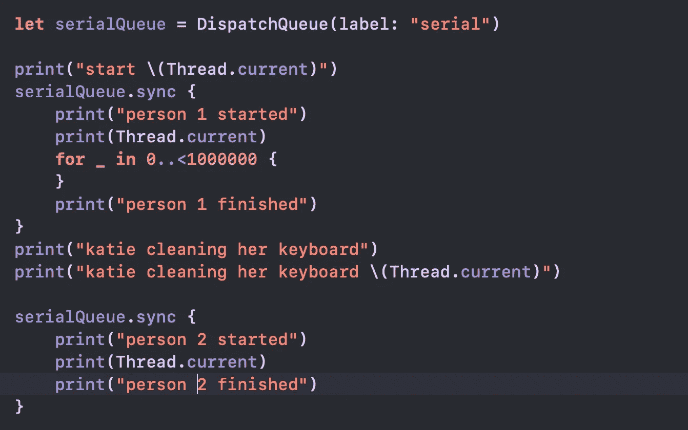

串行队列同步任务

花点时间猜测输出，并记下来。一旦有了答案，向下滚动查看解释:

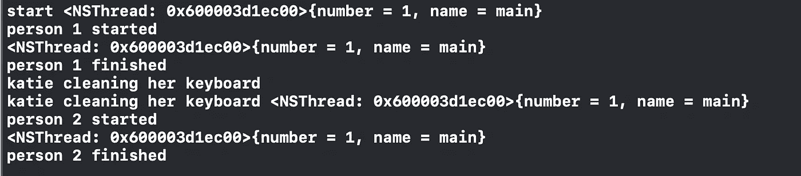

串行队列同步任务输出

Katie 是我们这里的主线程，由于是同步任务，Katie(调用线程)必须自己完成工作。她为第一个人服务，清理她的键盘，然后为第二个人服务。

# ***串行队列异步任务***

凯蒂意识到她可以从儿子杰夫那里得到帮助。因此，每当有人来时，凯蒂就让她的儿子给他们登记，凯蒂就做自己的事情(比如清洁键盘)。Katie(调用线程)是给 Jeff 分配任务的人。

代码时间。耶！

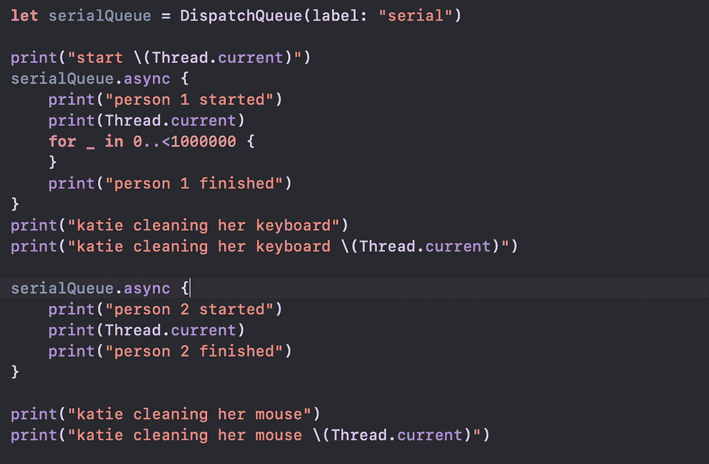

你知道规矩的！记下输出并向下滚动:

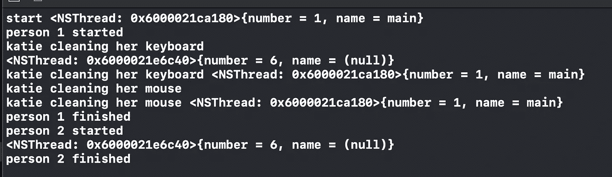

Katie(调用线程)将任务`person 1 registration`分配给 Jeff(线程 4 ),并继续清理她的键盘。当第二个人到达时，凯蒂将它们分配给杰夫，并继续清洁她的鼠标。尽管人员 2 被分配给了 Jeff，但他只有在人员 1 的注册完成后才会接受该任务。

太好了，登记完成了，是时候给我们的杂货结账了。梅西站在注册柜台的尽头，引导用户前往计费柜台。

# ***并发队列同步任务***

梅西(呼叫线程)将第一个人从登记结束带到结算柜台，并开始为杂货结算。梅西被阻止做任何其他任务，直到当前任务完成。

代码时间！

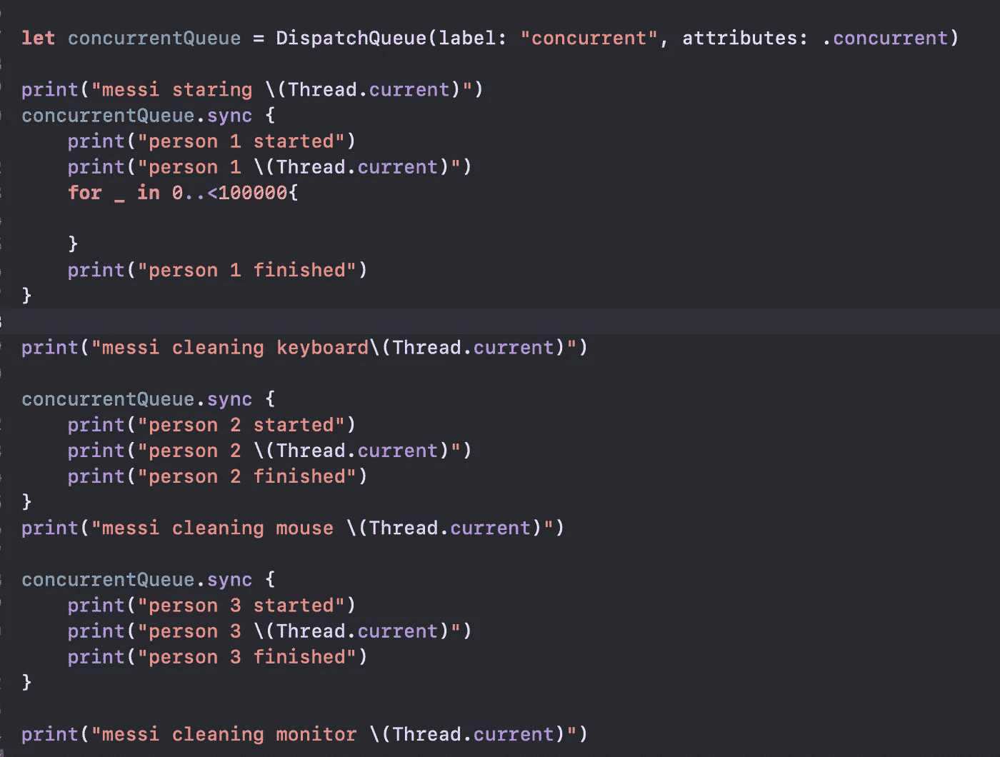

并发队列同步任务

是时候记下你的答案了:

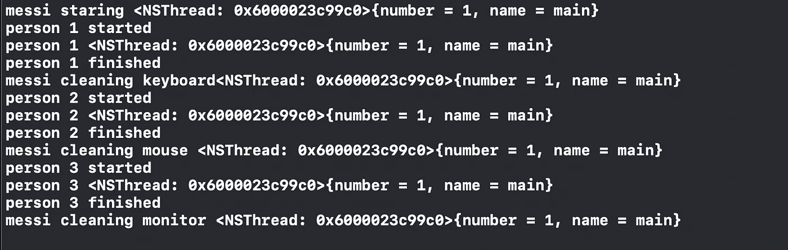

并发队列同步任务输出

Messi 是调用线程，既然是同步任务，就运行在调用线程上。所以，梅西拿起第一个任务，完整地执行它，然后进入下一个任务。

# ***并发队列异步任务***

Messi(调用线程)负责计费队列，这是一个并发队列。梅西将每个人发送到一个准备工作的计费计数器(线程),一旦这个人被分配到一个特定的队列，梅西就可以自由地做自己的任务。

让我们来看一些代码:

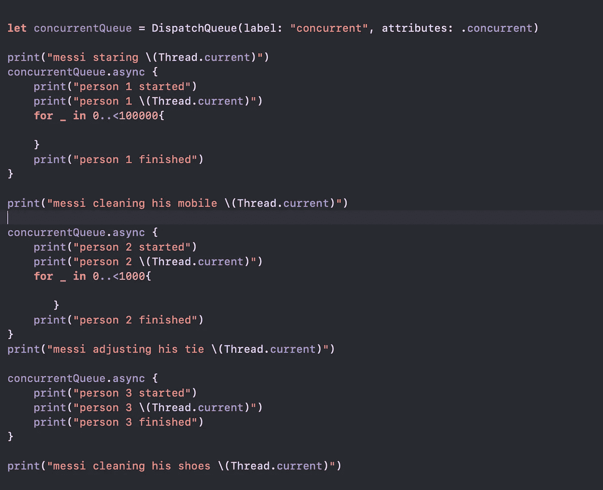

并发队列异步任务

回答时间…

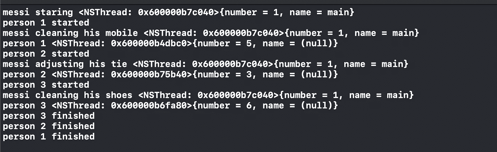

并发队列异步任务输出

梅西站在队列的最开始，把第一个人送到 counter (thread) 5。然后他清理他的手机。第二个人来了，梅西把他们送到柜台(线程)3。梅西开始擦鞋……..，线程完成它们的任务，用户离开。

3 号柜台也可以很快完成任务。在这种情况下，梅西会将人 3 分配给计数器 3，因为计数器 3 已经处于工作状态，初始化新的计数器将需要一些时间和资源。

消除其中一个计数器中浪费时间的循环:

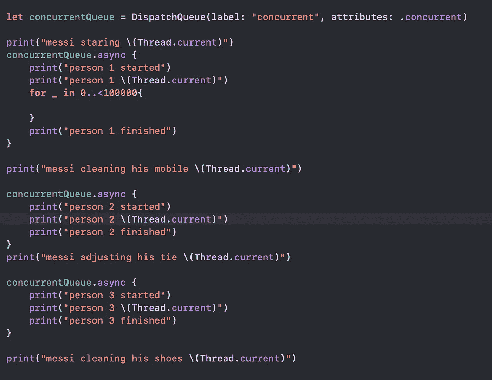

线程 4 被重用:

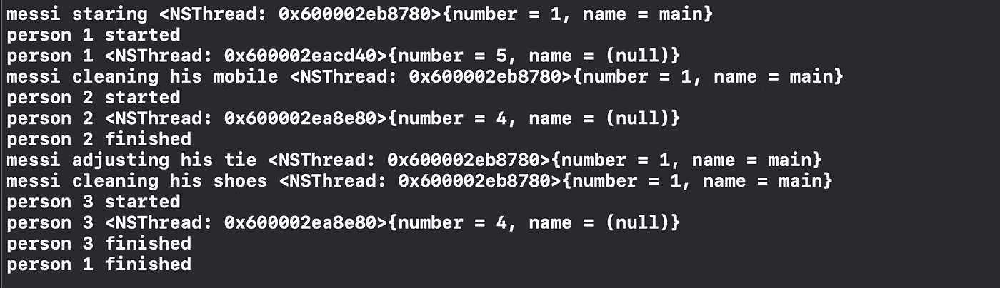

线程重用

好了，有很多信息需要消化。我希望您现在对队列和任务感到满意。

让我们举一个真实世界的例子来测试你的知识。在我们的大多数应用中，我们在后台线程中执行服务调用，并在主线程中更新 UI。看看下面这个从服务器获取数据并更新表视图的例子:

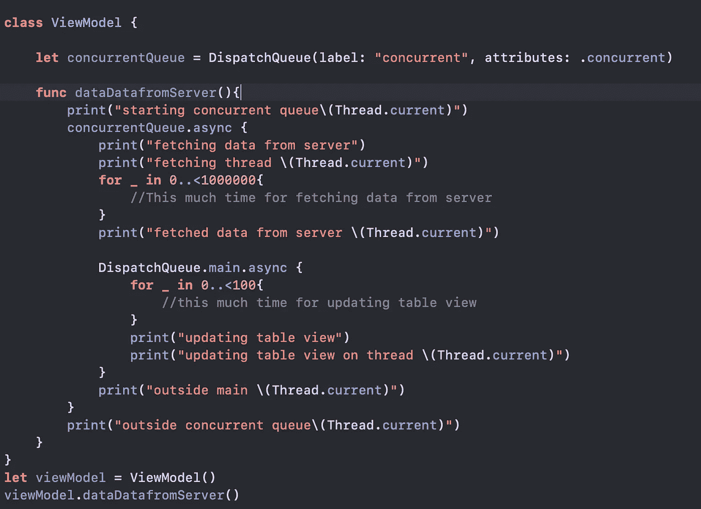

记下您的输出并放在一边:

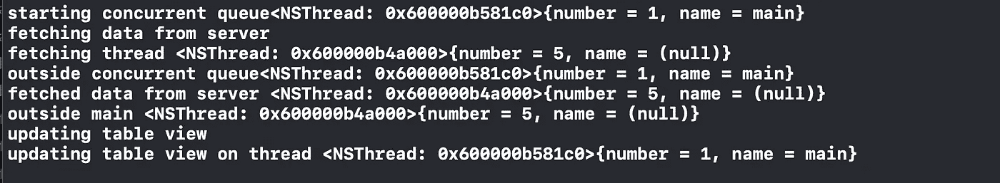

最初，我们在主线程上。然后，主线程将异步任务分配给其中一个线程(线程 5)，并返回执行其他任务。现在主线程和线程 5 同时执行任务。主线程正在打印输出`outside concurrent view`，线程 5 正在获取数据。获取数据后，线程 5 将异步任务委托给主线程并返回。现在线程 5 和主线程再次同时工作，分别打印`outside main`和更新表格视图。

# 结论

这就是我这篇文章的全部内容。在下一篇文章中，我将讨论 swift 中的调度信号量。你可以在这里找到[。在](https://medium.com/@kiransep21/semaphores-in-swift-e493ac853072)[推特](https://twitter.com/_kiran_44)上关注我，了解更多更新。提供一些掌声，如果你喜欢这个帖子，因为这将鼓励我写更多(你可以放弃 50)

P.S .完全不用担心迂腐。如果你认为我可以在文章中做些改进，请告诉我。