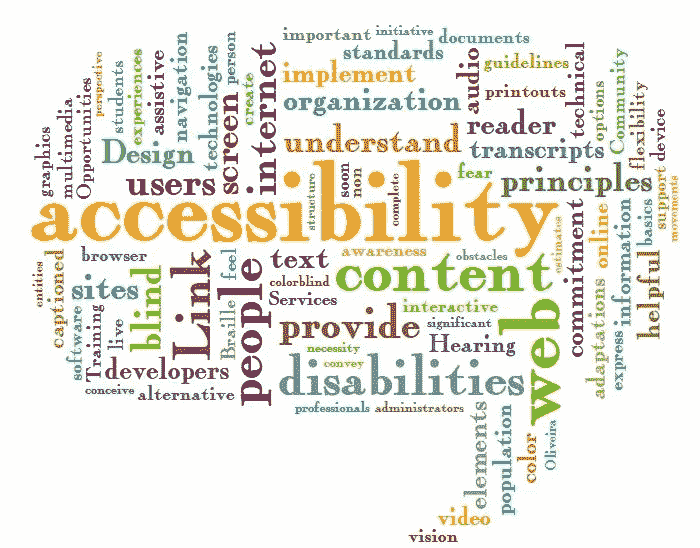
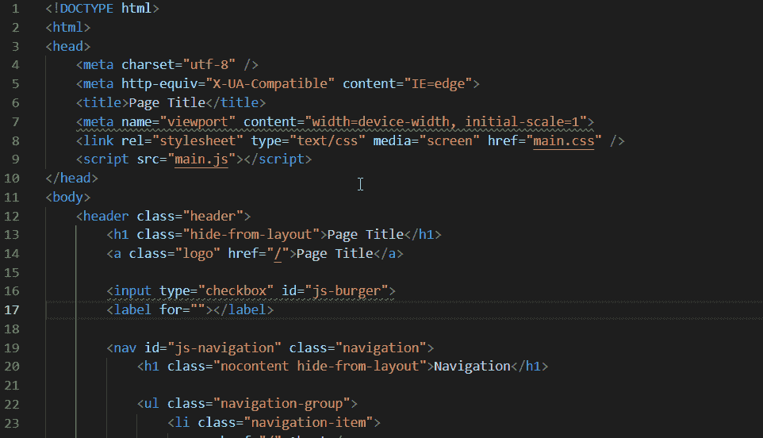

# 您的移动和网络应用程序的可访问性速赢

> 原文：<https://betterprogramming.pub/quick-accessibility-wins-for-your-mobile-and-web-apps-3b4a41d5562>

## 让辅助功能成为您工作流程的一部分

图片由[吉尔·莱特](https://www.flickr.com/photos/sunraven0/)在 [Flickr](https://www.flickr.com/photos/sunraven0/5451897212) 上发布

软件可访问性是一个你可以投入数小时、数天甚至数周工作的话题，乍一看，用户可能甚至没有意识到这一点。也许这就是为什么易访问性经常是事后才想到的，而不是常规开发工作流的一部分。

为什么我们需要网站或应用程序的可访问性？

*   不关注可访问性，你会失去很多不能使用你的网站或应用的人
*   一些公司，尤其是大型企业，在可访问性方面有相当严格的期望(这是一件好事)
*   编写可访问的 HTML 有助于您编写更好的代码——因为它迫使您更加关注 HTML 的结构

以下是一些关于如何确保应用程序可访问性的重要提示:

*   尽可能使用语义 HTML 元素
*   使用林挺尽早发现问题
*   编写检查可访问性的测试
*   使可访问性成为您开发工作流程的一部分

让我们仔细看看这些方面。在这篇文章中，我想重点谈谈网站。由于移动平台上的挑战和解决方案非常相似，因此 web 可访问性的相同原则可以应用于 Android 和 iOS 上的移动应用程序。

# 尽可能使用语义 HTML 元素

除了`div`和`span`之外，还有很多 HTML 标签可用。HTML5 带来了一些额外的语义元素，看起来和普通的`div`没什么不同。然而，它们更容易理解，因为它们传达了一些上下文。此外，HTML5 为我们提供了一些基本的通用元素，例如可以用来创建表单。

在选择正确的 HTML 元素时，您可以遵循以下一些规则:

*   如果一个元素有一个到另一个网页的链接(无论是内部的，外部的，还是单页应用程序中的一个路径)，它应该是一个`[a](https://developer.mozilla.org/en-US/docs/Web/HTML/Element/a)`元素。这确保你的链接可以被搜索引擎优化抓取，并且可以使用鼠标和键盘访问。
*   如果你需要某种类型的输入字段，你应该使用`[input](https://developer.mozilla.org/en-US/docs/Web/HTML/Element/button)`(或者对于多行文本使用`[textarea](https://developer.mozilla.org/en-US/docs/Web/HTML/Element/textarea)`)。您可以指定输入的`type`(例如数字)，这不仅有助于验证，而且使您的输入更易于使用，特别是对于移动用户(例如，通过在数字输入上自动显示数字)。
*   如果你需要一个可点击的元素，在大多数情况下你应该使用一个[按钮](https://developer.mozilla.org/en-US/docs/Web/HTML/Element/button)。一个按钮有不同状态的样式(如`hover`、`focus`)，它们可以与鼠标和键盘一起使用。例子:流行的 CSS 框架 [Bootstrap](https://getbootstrap.com/docs/4.4/components/buttons/) 有很多按钮样式，包括一个链接样式的按钮。
*   如果你想显示一个图像，你应该使用一个`[img](https://developer.mozilla.org/en-US/docs/Web/HTML/Element/img)`元素。这确保你的图片可以被搜索引擎抓取。您应该进一步添加`alt`属性。屏幕阅读器把这个描述读给用户听，这样他们就知道图像的意思了。
*   如果您想描述某种列表，最好使用一个`[ul](https://developer.mozilla.org/en-US/docs/Web/HTML/Element/ul)`或`[ol](https://developer.mozilla.org/en-US/docs/Web/HTML/Element/ol)`作为父元素，使用`[li](https://developer.mozilla.org/en-US/docs/Web/HTML/Element/li)`元素作为直接子元素。传统的`[table](https://developer.mozilla.org/en-US/docs/Web/HTML/Element/table)`也是一种有效的方法，但是用 CSS 来设计样式会更困难。
*   像`span`、`div`或`i`(常用于 FontAwesome 等网页字体)这样的元素很少需要直接交互——因为有很多更容易访问的元素通常更合适。如果您确实需要它们是可直接交互的，那么您需要确保它们可以用于鼠标和键盘(例如，通过使用`[tabindex](https://developer.mozilla.org/en-US/docs/Web/HTML/Global_attributes/tabindex)`属性)。
*   一些用例可能需要使用 JavaScript。JavaScript 可以帮助我们确保动态内容的可访问性。例如:定制工具提示([参见这里的例子](https://getbootstrap.com/docs/4.4/components/tooltips/))通常需要 JavaScript 才能工作。

让我们来看一个例子，看看语义 HTML 如何更具可读性。

我们先来看一个不好的例子:

在此代码中可以发现多个问题:

*   没有`alt`属性的图像
*   页面的结构很难理解，因为大多数元素都是普通的`div`元素
*   有些类似列表的结构没有使用合适的 HTML 标签，比如`ul`
*   标题层次结构错误
*   使用`div`代替更合适的元素，如`p`来呈现大量文本
*   使用`button`而不是`a`标签来导航到另一个页面

现在，让我们看看当我们试图编写更多的语义代码时，我们可以如何改进:

*   图像具有可以被屏幕阅读器读取的`alt`属性
*   页面的结构更加清晰——我们有一个标题、一个导航区域、两个内容部分和一个页脚
*   我们使用适当的 HTML 标签来显示列表
*   标题层次结构有效
*   使用段落来呈现大量文本
*   使用`a`标签显示另一个页面的链接

以下是给你的开发伙伴而不是网站实际用户的建议:你也应该尽可能清晰地命名组件。当创建一个组件时(例如，使用 Web 组件或 JavaScript 框架，如 Angular 或 React)，您需要为这个组件指定选择器。`<user-single-select>`是一个很好的选择器，因为它告诉我们开发人员这个组件可以做什么:允许我们选择单个用户。

# 使用林挺和其他工具及早发现问题

我们可以使用一些工具和库来提高网站或应用程序的可访问性。一般来说，这些工具或库应该成为您常规开发工作流程的一部分，以便尽早发现问题。

*   静态代码分析工具，比如 [HTMLHint，](https://github.com/htmlhint/HTMLHint)可以扫描你的 HTML，看是否有违反可访问性的情况。这些 linters 可以在开发期间和 CI 服务器(例如 Jenkins、GitLab CI)上执行，以便在新代码引入可访问性问题时通知开发人员。
*   一些 IDE，如 [IntelliJ IDEA，](https://www.jetbrains.com/webstorm/)包含了静态代码分析功能，这可以让你在 IDE 中编写代码时直接知道问题。此外，还有免费的 IDE 插件/扩展，如 [Web Accessibility、](https://marketplace.visualstudio.com/items?itemName=MaxvanderSchee.web-accessibility)可以帮助你编写更好、更有语义的代码。
*   在使用 [Git 钩子](https://github.com/typicode/husky)提交变更之前，可以自动运行这些检查或审计工具。这样，您可以立即修复这些工具检测到的问题，而不是等待 CI 作业或其他开发人员来检查。
*   有一些审计工具和网络服务，如 [Lighthouse](https://developers.google.com/web/tools/lighthouse) (内置于 Chrome)，可以在您的浏览器和 CI 服务器上运行可访问性检查
*   一个没有被积极使用的伟大工具是没有任何用处的，所以你应该合理使用你拥有的工具

Visual Studio 代码的 Web 可访问性扩展突出了可访问性问题

我推荐使用的一些可访问性林挺规则:

*   检查一个`label`组件是否与一个表单元素相关联(比如`input`和`select`)
*   检查图像元素是否有可选文本
*   检查带有事件的元素，如`click`是否也可以使用键盘进行交互
*   检查 HTML 结构是否有效(例如，`h2`元素不应该出现在`h1`之前，`li`不应该是`div`元素的直接子元素，等等)。)

# 使可访问性成为您开发工作流程的一部分

让可访问性不再是事后的想法，你会让你和你同事的生活变得更轻松。相反，您应该致力于使可访问性成为您开发工作流程的一部分。

假设你的产品(例如，一个网络应用)已经存在了几年。直到现在。您和其他开发人员并不真正关心可访问性。产品管理人员找到你说，“我们现在必须实现可访问性，以满足一些客户的需求。”

通常，在变更管理方面有两种方法:

*   大爆炸方法:投入大量时间和资源使你的应用程序易于访问
*   增量方法:当编写新代码或改进现有代码时，确保包含可访问性

显然，在我看来，增量方法的伸缩性要好得多，是首选方法。这种产品管理方法比大爆炸方法更容易推广。然而，您可能需要帮助产品管理人员理解软件可访问性的相关性。

# 让可访问性成为你产品的一个特征

产品团队，包括工程和产品管理，需要将易访问性作为产品的一个特性。如果只有一方在争取可及性，这往往是不够的。

*   如果产品管理不为可访问性而战:开发人员不会这么做，因为他们无法证明将这种努力投入到产品管理没有优先考虑的事情中是合理的
*   如果工程不为可访问性而战:产品将会增长并变得更加难以维护。越晚需要将可访问性整合到产品中，就越难做到。由于不是每个公司都充分考虑了可访问性，对于一些开发人员来说可能会有一些学习曲线。

# 结论

感谢您阅读这篇关于在软件可访问性方面快速取胜的短文。这个话题有很多可说的。你如何在你的软件产品中实现易访问性？