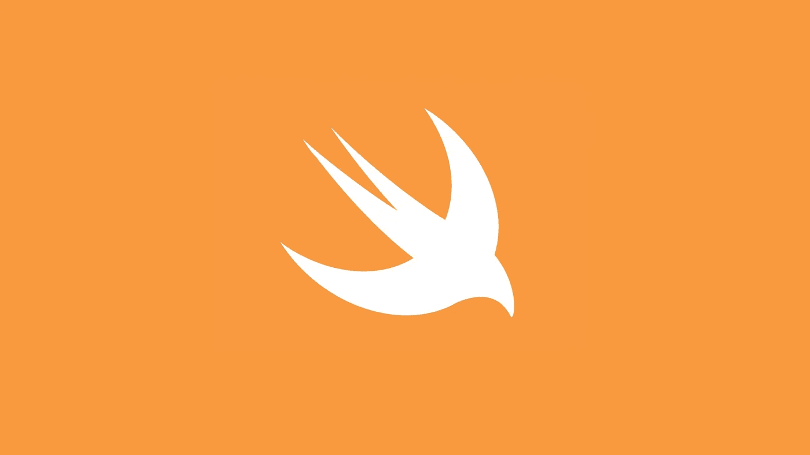
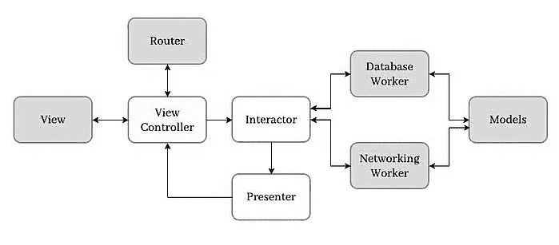
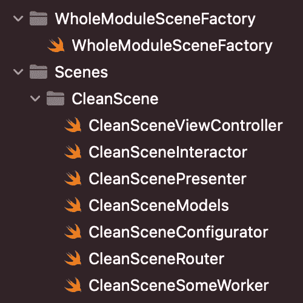

# 通过学习干净的架构来编写快速干净的 Swift

> 原文：<https://betterprogramming.pub/quick-clean-swift-4955d8ac6788>

## 在短时间内学习清晰的 Swift 架构基础知识。

还记得我们这些 iOS 开发人员花费大量时间学习 MVVM 的那些日子吗？现在我相信迟早有一天，我们会到处去学习和掌握清洁建筑。那么我们为什么不从今天开始呢？

在这篇文章中，我将告诉你什么是干净的架构，这样你可以很快地学习到很多东西。

所以…

# 关于干净的 Swift 架构

Clean Swift(简称 VIP)是 Bob 大叔适配 iOS 和 macOS 项目的 Clean 架构。用于编写干净 Swift 代码的 VIP 架构是由 Raymond Law 引入的。
你可能知道，VIP 代表视图—交互者—演示者。

这种架构中的项目结构是围绕场景构建的。场景应该包含以下组件:

*   视图控制器
*   互动者
*   提出者
*   工人
*   模型
*   路由器
*   配置器(可选)

换句话说，我们将为每个场景准备一套组件，用于我们的控制器。

干净的 Swift 架构周期

# VIP 周期

1.  视图控制器接受一个用户事件，构造一个请求对象，并将其发送给交互器。
2.  交互器使用 workers 对请求进行一些处理，构造一个响应对象，并将其发送给表示器。
3.  演示者格式化响应中的数据，构造视图模型对象，并将其发送给视图控制器。
4.  视图控制器向用户显示视图模型中包含的结果。

现在让我们更深入地看看每个组件:

# 视图控制器

与互动者交流，并从演示者那里获得反馈。

*   包含视图。
*   保存交互器和路由器的实例。
*   将动作从视图传递给交互器(业务逻辑),并将演示者的动作作为输入。

清洁 Swift ViewController

# 互动者

工人和主持人之间的调解人。

*   包含场景的业务逻辑。
*   保留对演示者的引用。
*   基于输入(来自视图控制器)对工人运行操作，触发并将结果传递给演示者。
*   交互器不应该导入 UIKit。
*   交互器也包含两种类型的协议，就像路由器一样:
    1。业务逻辑协议 *—* 在这个协议中声明所有的 Interactor 方法，因此它们可以在 ViewController 中使用。
    2。数据存储协议—应该保持其当前状态的所有属性都在此处声明。该协议主要用于路由器的控制器之间传递数据。

清洁 Swift 互动器

# 提出者

将交互器的结果格式化为视图模型，并将结果传递回视图控制器。

*   保留对视图控制器的弱引用，该视图控制器是演示者的输出。
*   在交互器产生一些结果后，它将响应传递给表示器。接下来，展示者将响应整理成适合于显示的视图模型，然后将视图模型传递回视图控制器以显示给用户。

清洁 Swift 演示者

# 工人

处理所有 API/数据库请求和响应。

*   一个处理不同底层操作的抽象，比如从核心数据中提取用户，下载个人资料照片，允许用户喜欢和关注，等等。
*   应遵循单一责任原则(一个交互者可能包含许多具有不同责任的工作者)。

干净利落的工人

# 模型

存储所有数据模型。

*   解耦的数据抽象。
*   包含`Request`、`Response`和`ViewModel`数据模型。
*   请求有时可以是一个空结构(比如当我们没有任何 post 参数或 DB 查询时)。
*   每个数据模型都要在特定的组件中创建和使用:
    `Request`:在视图控制器中创建，在交互器中使用。
    `Response`:在交互器中创建，在演示器中使用。
    `ViewModel`:在 presenter 中创建，在 view controller 中使用。

干净的 Swift 模型

# 路由器

负责视图控制器之间的转换和传递数据。

*   从视图控制器中提取导航逻辑。
*   保持对视图控制器的弱引用。
*   声明了两个协议:
    1。路由逻辑协议 *—* 所有用于路由的方法都遵循该协议。
    2。数据传递协议—包含需要传递到目的控制器的数据的协议。

清洁 Swift 路由器

# 配置程序

获取原始视图控制器并返回已配置的视图控制器。

*   一个可选组件，负责通过封装所有实例的创建并在需要的地方分配它们来配置 VIP 周期。

干净的 Swift 配置器

如果您阅读了本文中的示例代码，您可能已经注意到我们有另一个名为`SceneFactory`的对象。
`SceneFactory`不过是一个保存场景配置器实例并使用它们制作场景的类。

清洁快速场景工厂

最后，对于您项目的文件结构，您可以遵循以下方案:

这些是干净的 Swift 架构的基础。目前，我正在做一个有 3 个视图的示例 clean 项目，它几乎涵盖了所有的架构挑战，比如 clean+coordinator 和 delegates。
如果你想获得关于 clean architecture 的未来帖子的通知，包括提到的示例项目和高级 Xcode clean architecture 模板，可以关注我。

感谢阅读。我希望你喜欢！