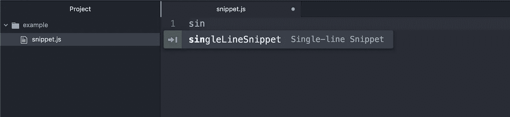
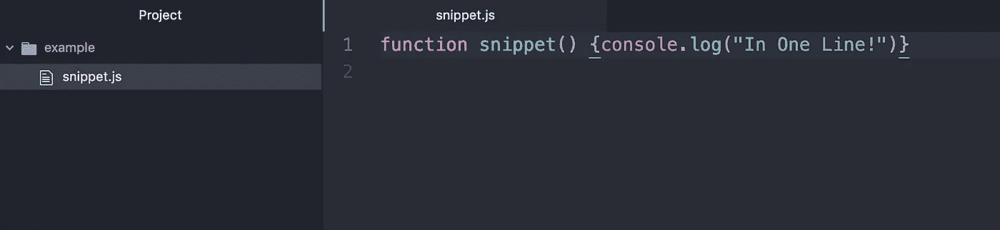
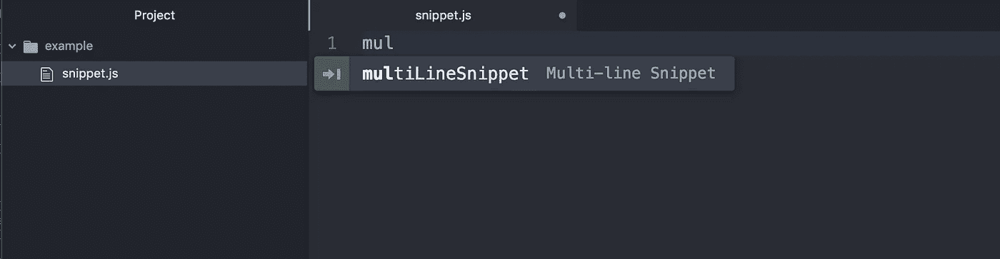
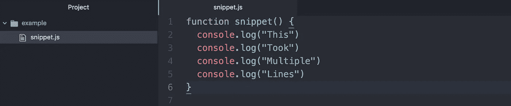

# 为 Atom 创建快速、定制的代码片段

> 原文：<https://betterprogramming.pub/quick-code-snippets-in-atom-3a0b7db99d31>

## 快速自定义代码片段指南


Atom 主页上的 Octocat

首先，你需要安装 Atom:

1.  在你的终端键入`cd ~/.atom`
2.  输入`atom .`在 Atom 编辑器中打开您的`.atom`文件
3.  在编辑器中打开`snippets.cson`文件视图:


4.使用以下结构创建您的自定义代码段:

。source ':
' name ':
' prefix ':' typed text '
' body ':' snippet output '

# **单行截图示例** ( *JavaScript* )

```
'.source.js':
  'Single-line Snippet':
    'prefix': 'singleLineSnippet'
    'body': 'function snippet() {console.log("In One Line!")}'
```

当您在一个 JavaScript 文件中开始键入`singleLineSnippet`并点击`enter`时，这将生成`function snippet() {console.log("In One Line!")}`。

在`enter`之前:



在`enter`之后:



# **多行截图示例** ( *JavaScript* )

```
'.source.js':
  'Multi-line Snippet':
    'prefix': 'multiLineSnippet'
    'body': """
      function snippet() {
        console.log("This")
        console.log("Took")
        console.log("Multiple")
        console.log("Lines")
      }
      """
```

这里的主要区别是`"""`或“三重引号”用于打开和关闭代码片段的主体。

在`enter`之前:



在`enter`之后:



如果你想在一种语言(比如 JavaScript)的作用域中保留多个代码片段，你只需要声明一次作用域。

如果我们要保留这两个示例片段，它们需要按照以下方式进行组织:

```
'.source.js':
  'Single-line Snippet':
    'prefix': 'singleLineSnippet'
    'body': 'function snippet() {console.log("In One Line!")}' 'Multi-line Snippet':
    'prefix': 'multiLineSnippet'
    'body': """
      function snippet() {
        console.log("This")
        console.log("Took")
        console.log("Multiple")
        console.log("Lines")
      }
      """
```

由于您可能希望使用除了`.js`或 JavaScript 之外的语言和文件类型的代码片段，下面是一个文件类型特定的列表，适用于通用语言:

*   JavaScript: `'.source.js'`
*   Python: `'.source.python'`
*   Java: `'.source.java'`
*   丙:`'.source.c'`
*   C#: `'.source.cs'`
*   去:`'.source.go'`
*   红宝石:`'.source.ruby'`
*   打字稿:`'.source.ts'`

DSL:

*   JSX: `'.source.js.jsx'`
*   Vue: `'.text.html.vue'`

如果您在语法或缩进方面有困难，可以将示例块直接复制到您的编辑器中并进行定制。

[推特](https://twitter.com/sean_watters)——[github](https://github.com/seanwatters)——[网站](https://seanwatters.io/)