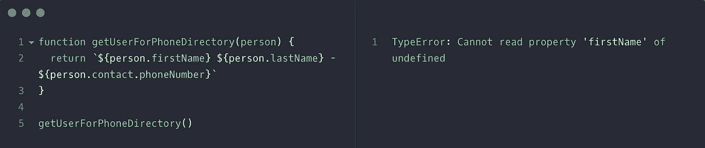

# JavaScript 建议:可选链接

> 原文：<https://betterprogramming.pub/quick-glance-js-optional-chaining-2a6d301dac>

## 我最感兴趣的 TC39 提案

让我们检查一下我最感兴趣的 TC39 提案之一。

可选链接并不是最耀眼的新提议，但它代表了 Javascript 开发人员生活质量的显著提高。有多少次你不得不搜索传入对象的树状结构，以检查是否存在任何中间节点？

例如:

现在，这显然是一个有点复杂的例子——没有理由不进行这些单独的输入。但是获得一组值，并在对它们执行操作之前频繁地测试每个链接的属性是否存在是很常见的。

如果你不小心的话，这在选择器和归约器中经常发生。如果你不做这种检查，传递的变量是未定义的，我们会得到一个非常经典的错误:

在 Javascript 社区中，最标准的解决方案是使用一个 util 库，比如拉姆达的 [path](https://ramdajs.com/docs/#path) 或洛达什的 [get](https://lodash.com/docs/4.17.11#get) 。这些工作很好，对于一些深层嵌套，我认为它们仍然有可能被使用。但是我一直想有一种本地的方式来处理可选链接，因为一个同事用 Ruby 为我演示了它。如果你感兴趣的话，这里有一个快速的纲要。

嗯，[可选链接](https://github.com/tc39/proposal-optional-chaining)已经进入 TC39 提案的第二阶段。如果您对阅读这些提议不感兴趣，第 2 阶段表明 TC39 委员会希望开发该特性并最终将其包含在语言标准中。那会是什么样子呢？让我们举个例子。

当然，从那里开始，这些必须被每个浏览器采用，每个浏览器都需要满足规范，然后我们仍然必须照顾遗留的浏览器，等等。但是，[通天塔](https://babeljs.io/docs/en/)来救援了！将来我会写更多关于 babel 的文章，但是我们现在可以用它来添加未来的语言特性，这样开发者就可以使用它，让 Babel 在运行时将它编译成遗留兼容代码。

# 我今天如何使用它？

让我们快速设置一个小的项目演示来进行测试。首先，我们将创建一个工作目录并创建一个包文件。

初始化软件包后，使用默认值填写详细信息。现在，让我们安装 babel，及其 CLI，以及我们需要编译可选链接的新 babel 插件。你可以在这里阅读更多的细节。

很好，现在让我们将下面的代码示例放入项目目录中一个名为 index.js 的新文件中。

**index.js**

项目现在已经设置好了，我们可以试着在我们的代码上运行 babel 和插件。

你会看到编译好的代码。

所以 babel 把我们的代码编译成了类似于我们之前的条件检查。如您所见，新的可选链接只是这种样式之上的一个语法糖🍭。

要将它添加到 Webpack 项目中，我们可以像上面那样添加 babel 插件，在我们的`. babelrc 中，我们添加

**。babelrc**

# 结束语

就是这样！语法非常类似于 CoffeeScript [存在运算符](https://coffeescript.org/#existential-operator)(再见了，最后一批到达这里的人)。我从未使用过 CoffeeScript，但这是 Javascript 中缺少的一个特性，我知道很多人对此感兴趣。注意，它不包括可选的属性赋值。

今天这里使用的所有代码[都可以在 Github](https://github.com/DennyScott/optional-chaining-example) 上获得。干杯！

## 参考资料和进一步阅读

[https://github.com/tc39/proposals](https://github.com/tc39/proposals)

[https://github.com/tc39/proposal-optional-chaining](https://github.com/tc39/proposal-optional-chaining)

[https://babel js . io/docs/en/babel-plugin-proposal-optional-chaining](https://babeljs.io/docs/en/babel-plugin-proposal-optional-chaining)

[https://coffeescript.org/#existential-operator](https://coffeescript.org/#existential-operator)

[https://ramdajs.com/docs/#path](https://ramdajs.com/docs/#path)

[https://lodash.com/docs/4.17.11#get](https://lodash.com/docs/4.17.11#get)

[https://babeljs.io/docs/en/](https://babeljs.io/docs/en/)