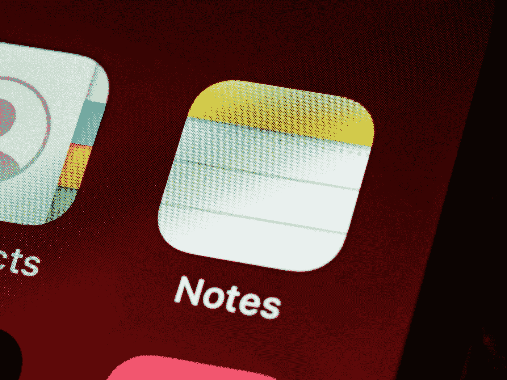
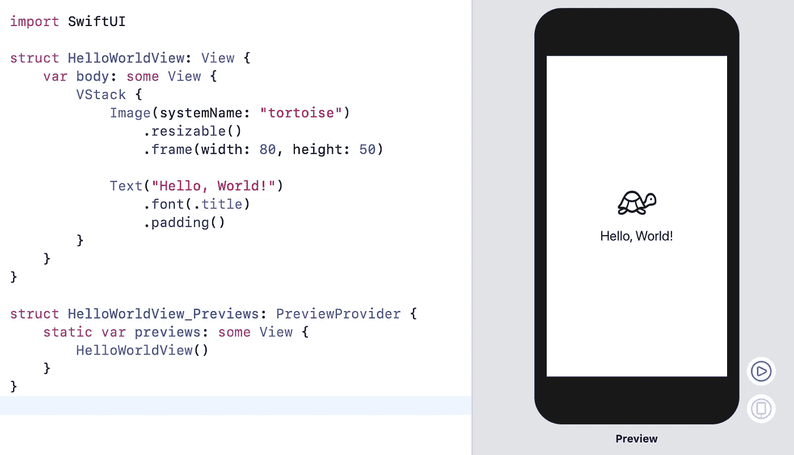
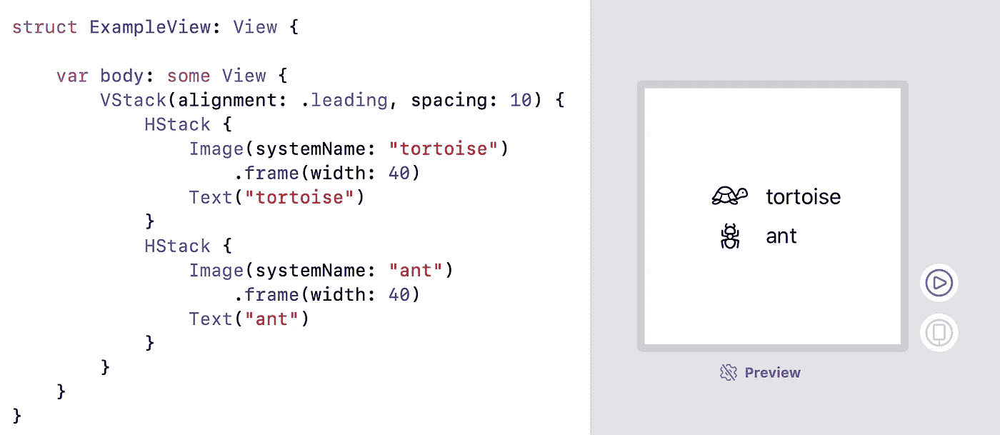
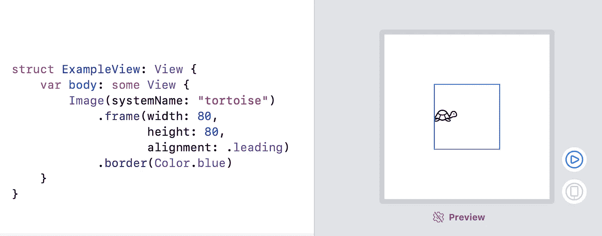
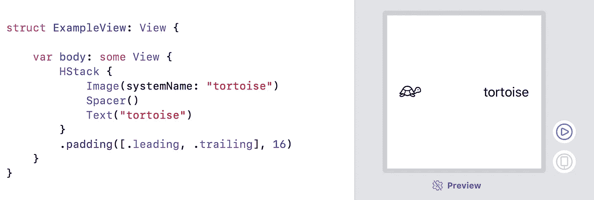
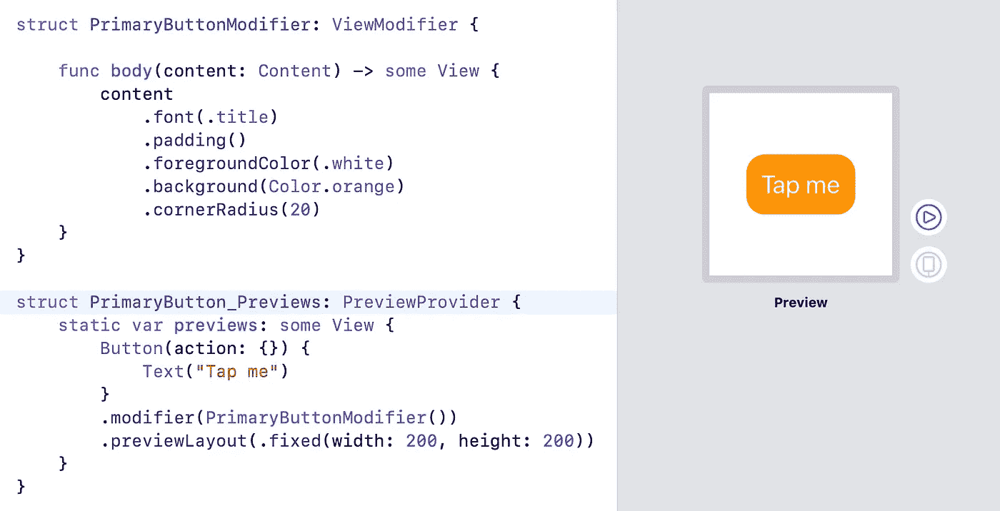
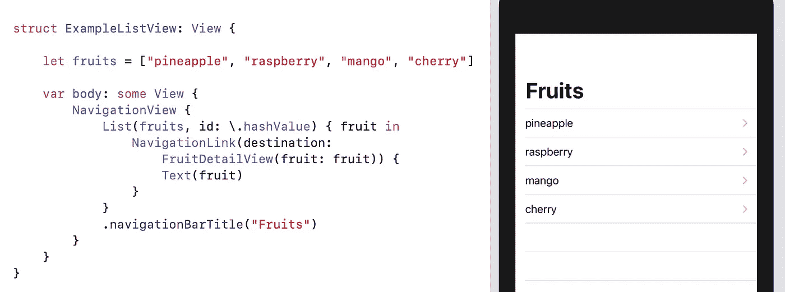

# SwiftUI 基础知识快速指南

> 原文：<https://betterprogramming.pub/quick-guide-on-swiftui-essentials-8ba8fe007bcd>

## 视图创建和状态管理的基本 SwiftUI 概念和术语



照片由[布雷特·乔丹](https://unsplash.com/@brett_jordan?utm_source=medium&utm_medium=referral)在 [Unsplash](https://unsplash.com?utm_source=medium&utm_medium=referral) 上拍摄

在 WWDC 2019 上听到苹果公司名为 SwiftUI 的新框架真是令人兴奋。本文是 SwiftUI 的快速入门指南。

首先，我们将看看 SwiftUI 中的视图是如何创建、布局和呈现的。然后，我们将研究如何使用 SwiftUI 管理状态。最后，我们将看看 SwiftUI 和 UIKit 是如何配合使用的。


*这个世界太精彩了！*

# SwiftUI 中的视图

使用 UIKit，我们有不同的方法来构建用户界面。关于是通过编程还是使用界面构建器来构建 ui，人们进行了很多讨论。有了 SwiftUI，这些问题都没有了。我们终于有了一种用代码编写 UI 的声明式方法——并且可以和代码一起预览。

## 基本 SwiftUI 视图

SwiftUI 视图只是一个普通的具有两种结构的`.swift`文件。



*基本 SwiftUI 视图示例*

## 对齐视图

当实现 SwiftUI 视图时，我们不必像使用 UIKit 视图那样设置约束。相反，SwiftUI 会计算出每个视图的固有大小，并在默认情况下将其放置在其父视图的中心，而不会调整其大小。

SwiftUI 中对齐视图的核心概念是使用堆栈，使用`VStack`进行垂直对齐，使用`HStack`进行水平对齐。



*使用 HStack 和 VStack 对齐视图*

如示例所示，我们可以嵌套不同的堆栈来实现所需的结果，这个概念非常直观。

此外，我们可以在每个视图上使用不同的修改器来对齐和定位它们。例如，`frame(width:height:alignment:)`将视图包装到一个给定大小的容器中，并在这个容器中对齐视图。



*使用框架修改器对齐视图*

像`position(x:y:)`和`offset(x:y:)`这样的其他修改器也可以用来在父对象的坐标空间中定位子对象。

此外，我们可以使用`Spacer`来对齐视图。这是一个灵活的空间，只要有空间就会扩展。



*使用“垫片”对齐视图*

正如我们所见，`Spacer`帮助我们将文本移动到父视图的右侧。

## 视图修改器

视图的外观可以通过使用所谓的*修改器来修改。SwiftUI 提供的大多数修饰符都是不言自明的。我们已经在上面的例子中看到了其中的一些，比如`font()`、`background()`、`padding()`等等。*

也可以创建我们自己的修改器，例如，如果我们想要重用样式。



*自定义视图修改器示例*

在上面的例子中，我们定义了一个名为`PrimaryButtonModifier`的自定义修饰符，我们现在可以用它来设计我们的按钮。如预览图所示，要将自定义修改器应用于视图，我们可以使用`.modifier()`修改器。

## 列表

创建视图列表是构建应用程序时的一项常见任务。在 SwiftUI 中使用`List`视图非常简单。


*“列表”视图示例*

我们只需要将数据和 ID 传递到`List`视图中，然后用这些数据配置行。

## 在视图间导航

视图之间的导航是另一项常见任务，使用 SwiftUI 也很容易实现。



*导航视图示例*

# 处理状态

与 UIKit 相比，SwiftUI 的一个重大变化是状态的处理方式。状态表示与视图相关联的数据。使用 SwiftUI，当状态属性改变时，视图会自动更新。

让我们看看下面的视图，它显示了一些文本和一个文本字段。我们希望`Text`视图总是显示来自`TextField`视图的当前输入。

```
struct ExampleView: View { @State private var username: String = "" // 1 var body: some View {
        VStack {
            Text(username) // 2
            TextField("username", text: $username) // 3
        }

    }
}
```

为了实现这一目标，我们:

1.  创建一个名为`username`的`State`包装属性。
2.  用这个属性初始化我们的`Text`视图。从现在开始，每次`username`发生变化，`Text`视图都会自动更新。
3.  将`username`属性绑定到文本字段。我们通过属性带有前缀`$`的事实来识别绑定。从现在开始，每次文本字段的输入发生变化时，我们的`username`属性也会更新。

最后一步中的绑定是可能的，因为`TextField`的`text`属性具有类型`Binding<String>`。也就是说它内部包裹了`Binding`。

`Binding`和`State`的区别在于`State`用于视图的私有状态，而`Binding`在视图和视图之外定义的状态属性之间创建双向连接。

## `'StateObject’`和`'ObservedObject'`

当`State`和`Binding`用于值类型时，`StateObject`和`ObservedObject`可以用于引用类型。参考类型需要符合`ObservableObject`。

让我们看一个例子。

```
class User: ObservableObject { // 1
    @Published var firstName: String = "" // 2
    @Published var lastName: String = ""
}struct ExampleView: View {

    @ObservedObject var user: User // 3
    ...
}
```

为了建立对象和视图之间的绑定，我们:

1.  让`User`对象符合`ObservableObject`协议。
2.  使用`@Published`修改时，包装应引起观察通知的属性。
3.  用`StateObject`或`@ObservedObject`包装我们视图中的`user`属性。

`StateObject`和`ObservedObject`的区别与`State`和`Binding`的区别相同。当`StateObject`用于视图的私有状态时，`ObservedObject`在视图和视图之外定义的状态属性之间创建一个双向连接。视图不应该自己创建`ObservedObject`的实例。

## `'EnvironmentObject'`

`EnvironmentObject`在与`ObservedObject`相同的情况下使用，不同之处在于我们不需要通过整个视图层次传递它。

这对于复杂的视图层次很有用，在到达需要它的视图之前，我们必须通过几个视图的初始化器传递`ObservableObject`。使用`EnvironmentObject`，我们只需要在一个视图的父视图中提供环境对象。SwiftUI 会处理剩下的事情。

```
struct ExampleView: View {
    @EnvironmentObject var user: User
}SomeParentViewOfExampleView()
    .environmentObject(user)
```

我们甚至可以通过将`EnvironmentObject`传递到应用程序的根视图中，使其在整个应用程序中可用。

# 结合 SwiftUI 和 UIKit

在 SwiftUI 问世之前，UIKit 是 iOS 中构建视图的方式。所以现在，当我们开始在现有项目中使用 SwiftUI 时，我们需要一种方法来结合这两个世界。好消息是，苹果提供了在 SwiftUI 视图中放置 UIKit 视图和视图控制器的工具，反之亦然。

## 在 SwiftUI 视图中使用 UIKit 视图

为了在 SwiftUI 视图中使用 UIKit 视图，我们将 UIKit 视图包装在符合`UIViewRepresentable`协议的 SwiftUI 视图中。

```
struct Label: UIViewRepresentable {
    @Binding var title: String func makeUIView(context: Context) -> UILabel {
        let label = UILabel()
        return label
    } func updateUIView(_ label: UILabel, context: Context) {
        label.text = title
    }
}
```

在实现`UIViewRepresentable`协议时，我们需要实现两个方法`makeUIView`和`updateUIView`。在`makeUIView`方法中，我们可以创建并返回我们的 UIKit 视图。每次有状态变化时，SwiftUI 都会调用`updateUIView`，因此我们可以手动更新 UIKit 视图。

在 SwiftUI 中，没有视图控制器的概念——一切都是视图。因此，我们可以使用与上面相同的方法在 SwiftUI 视图中使用 UIKit 视图控制器。只是这一次 SwiftUI 视图需要符合`UIViewControllerRepresentable`协议，该协议具有与`UIViewRepresentable`协议等效的方法。

## 在 UIKit 视图中使用 SwiftUI 视图

为了在 UIKit 内部使用 SwiftUI 视图，Apple 提供了一个名为`UIHostingViewController`的类。我们简单地用 SwiftUI 视图初始化一个`UIHostingController`，然后像使用标准视图控制器一样使用它。

```
let vc = UIHostingController(rootView: Text("Hi"))
```

# 结论

就像当年 Swift 的引入一样，SwiftUI 为 iOS 开发带来了一个全新的激动人心的世界。起初，这可能看起来势不可挡，但最终，SwiftUI 通过利用 Swift 的全部功能，提供了一种构建用户界面的创新而简单的方法。