# 反应钩子的快速介绍

> 原文：<https://betterprogramming.pub/quick-intro-to-react-hooks-6e8a44ae4aa6>

## 使用 React 挂钩向功能性 React 组件添加类组件特性，如状态管理

Dan Abramov 介绍 React Hooks API @ React Conf

自从去年 10 月 React Conf 期间，[脸书团队发布重大公告](https://www.youtube.com/watch?v=dpw9EHDh2bM&t=2s)以来，术语*挂钩*已经成为 React 社区的热门词汇。我们将永远反思我们在 React 中构建组件的方式。

但是让我们倒回去一点。

React 背后的理论是用户界面的一部分(一个组件)将对状态变化做出“反应”。目前的表达方式是使用 ES6 类。

总的来说，React 使得在具有非常严格的单向数据流的大型应用程序中实施清晰的组织和层次结构变得非常容易，这导致了对状态的更好控制。简单吧？

但是这些类组件有时意味着许多代码和实现不可重用，所以我们可能最终会有许多重复的逻辑——甚至更糟，庞大的组件很难浏览。

才华横溢的 React 社区已经想出了不同的方法来解决这个问题，并使我们代码的某些部分在 React 组件中更具可重用性，如[高阶组件](https://reactjs.org/docs/higher-order-components.html)或[渲染道具](https://reactjs.org/docs/render-props.html#___gatsby)。但是这两种模式都有它们的缺陷，特别是复杂性，因为它们意味着更多的嵌套组件——这是通向组件地狱的直接通道。

但是钩子是来救我们的！或者至少，改变我们用代码创建组件的方式。它们不会是解决所有问题的灵丹妙药，但让我们仔细看看。

# 什么是 React 钩子？

简而言之，React 挂钩是一种特殊的函数，用于向功能性 React 组件添加类组件特性，如状态管理。这使我们能够将逻辑封装在非常小且可重用的代码中。

从 16.8 版本开始，钩子在 React 中正式可用。

值得注意的是，React 团队不打算移除类组件，这不是替代，只是一种使管理状态更容易的方法。

这些变化没有被打破，它们是完全选择加入和 100%向后兼容的。

## React 挂钩与 React 类

以前，我们会为非常简单的可重用 UI 创建一个功能组件。问题出现在触及生命周期事件或状态的需求之后，这意味着创建一个类组件。

一个简单的类组件如下所示:

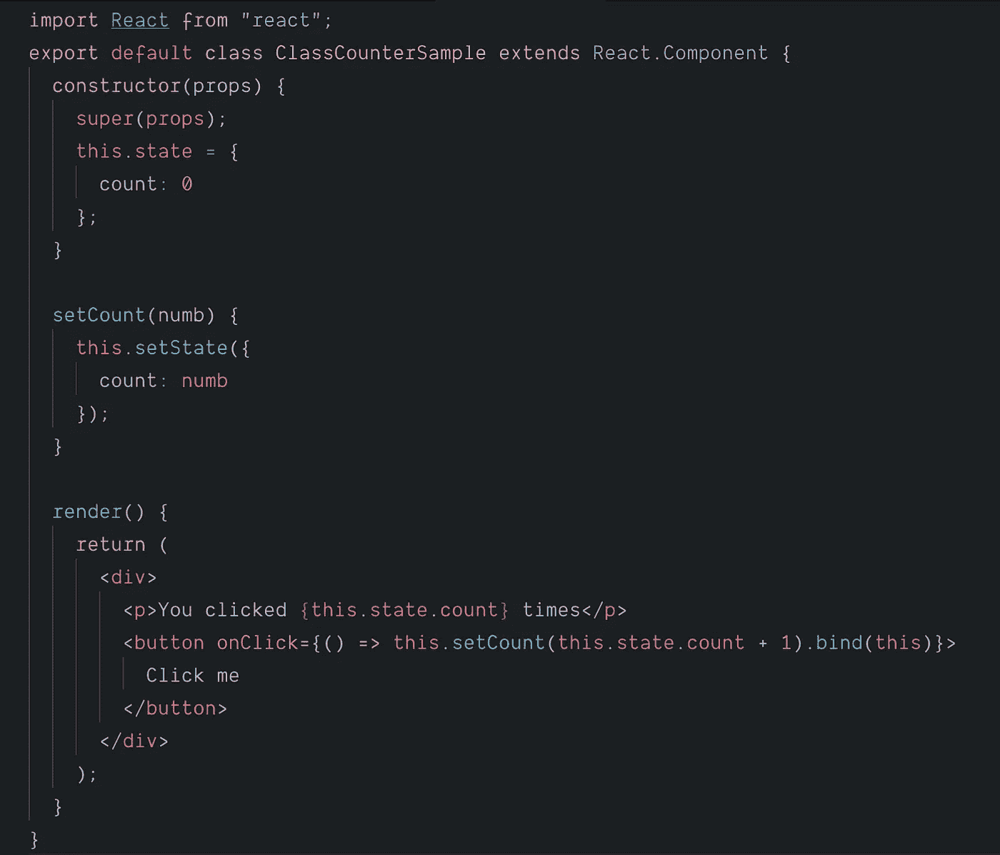

有了钩子，我们可以简化为:

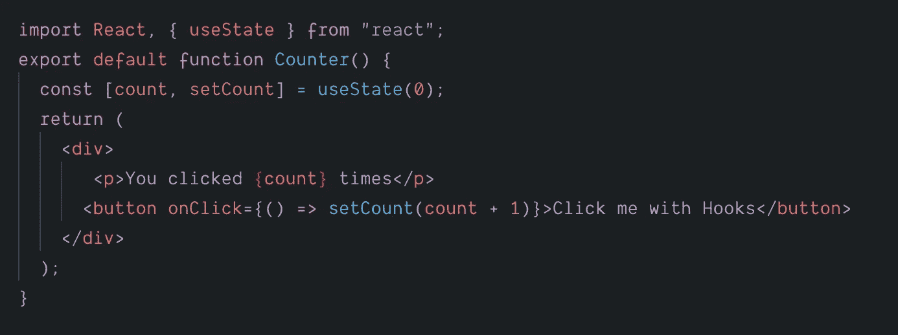

更简单，对吗？现在，将这种抽象带到一个代码库，这个代码库有几十个 UI 组件，这些组件之间共享代码。神奇的✨

# 钩子的规则

*   不要在循环、条件或嵌套函数中调用钩子。
*   永远不要从常规函数中调用钩子。
*   仅调用函数组件内部的挂钩或自定义挂钩。
*   钩子应该位于组件的开头。

# 开箱即用的反应挂钩

React 为我们提供了一些基本的 React 钩子，其他实现的钩子基本上都是这些原语的变体:

*   *useState:* 状态挂钩，用于在功能组件中设置状态
*   *useEffect* :副作用挂钩，用于数据获取、DOM 更改(以避免对生命周期事件的需求)。
*   *useContext* :这个是要和 React 的[上下文 API](https://reactjs.org/docs/context.html) 一起使用；触发器使用最新的上下文值呈现。
*   *useReducer* :替代 *useState* ，用于复杂状态逻辑/Redux。
*   *useRef* :这个钩子就像一个类内部的实例变量，通常用来访问子 DOM 属性。

## 状态挂钩

进入*使用状态。*该挂钩保持状态。它是在类组件中使用的 *this.state* 和 *this.setState* 的同义词。不同之处在于，它允许您将状态存储在一个更小的功能组件中。

要管理这种状态，没有必要使用对象。可以使用简单类型的数据，如字符串、整型、布尔型等。

初始状态用一个初始参数调用，并返回一个包含两个元素的数组:当前状态值和 setter 函数。

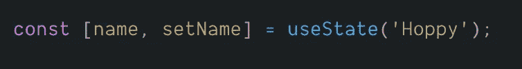

使用状态为的简单功能组件示例:

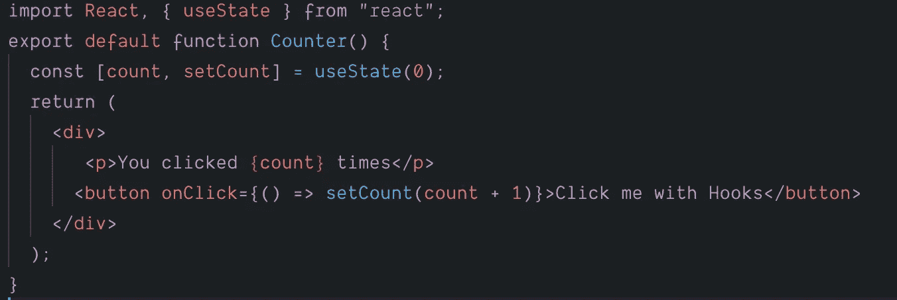

## 效果挂钩

每当我们愉快地用常规类组件编码时，我们通常依赖一些组件生命周期方法(如*componentdimount()*和 *componentWillUnmount()* )来设置一个副作用，并根据状态变化的方式使用 *componentDidUpdate()* 进行一些其他更改。

使用 *useEffect()* 钩子，我们可以用一个简单的单一 API 来完成这个任务。

该函数在组件首次渲染时运行，然后在随后的每次重新渲染/更新时运行。

React 首先更新 DOM 并调用传递给 *useEffect()* 的函数，而不会阻塞 UI。

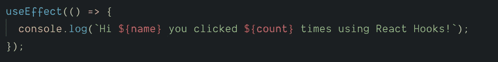

通过从第一个参数返回一个函数，可以实现与使用 *componentWillUnmount()* 相同的功能:

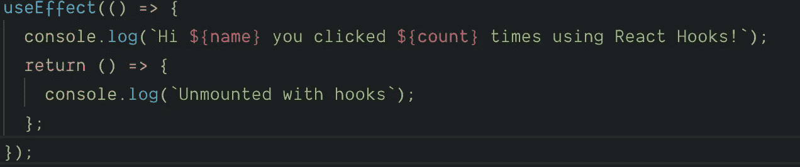

你也可以得到关于你想要更新的状态变量的超级细节，并且只为那些变量运行“useEffect ”(耶，性能！):

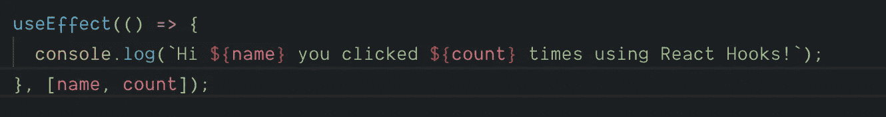

如果第二个参数是一个空数组，这个效果将只在挂载时运行:

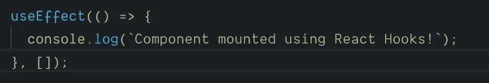

## 变径钩

当我们在应用程序中使用复杂的状态逻辑时，我们通常可以依赖状态管理库，如 [Redux](https://redux.js.org/) 或 [Flux pattern](https://facebook.github.io/flux/) ，这也意味着依赖 reducers 来触发我们视图中的动作。

简而言之，缩减器是一个接受两个值并返回一个值的函数。例如，如果你有一个数组，你想把它们组合成一个值，最好的方法是使用一个 reducer 函数。

例如，对于多个值，您可以像这样减少总和:

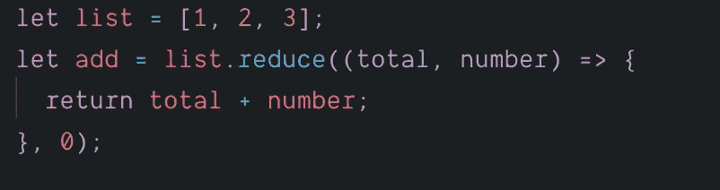

这将调用每个元素上的函数，传递总和并将其加到下一个元素上。

*useReducer* 背后的逻辑本质上是一样的:我们传递一个 Reducer 函数和一个初始状态，reducer 接收当前状态并返回一个新状态。

*useReducer* 也被析构为两个自定义元素的数组，就像 *useState* 一样。参数 1 是当前状态，参数 2 是调度功能:

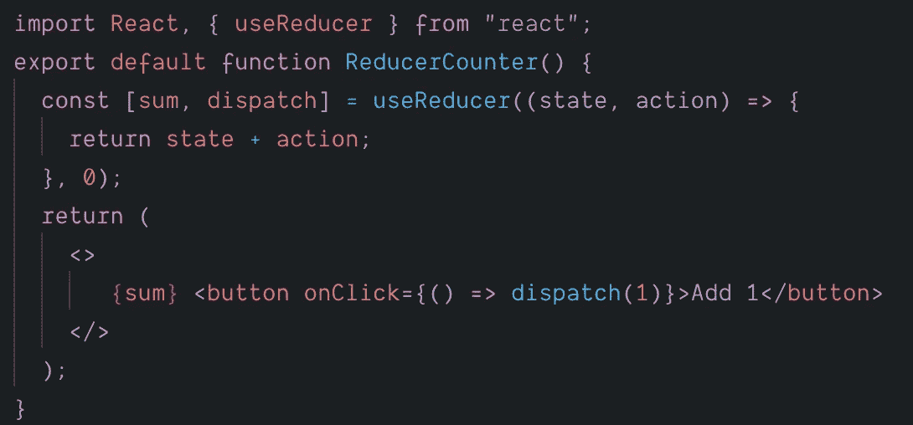

## 参考钩

这个钩子通常用于存储 ref，并通过它的 ref 属性将其传递给 DOM 元素。与 DOM 交互非常有用，因为它会在每次渲染时给你相同的 ref 对象。

一个典型的例子是访问 *<输入>* 元素。

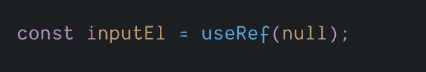

*useRef* 钩子给了我们一个地方来保存它的*中的可变值。当前*属性变异时不会导致重新渲染。您可以使用它来保存应用程序或组件中的任何可变值。

## 定制挂钩

这就是钩子最强大的地方:可以编写我们自己的钩子来使我们的代码变得枯燥无味！

这主要是为了在组件之间共享状态和逻辑有一个额外的选项。

在学习了 *useState* 和 *useEffect* 的基础知识之后，我们可以通过创建定制钩子来使代码更加紧凑。

自定义钩子有助于避免组件之间共享的重复和冗余的有状态逻辑，因为可以导出/导入这些功能，甚至可以将它们制作成 NPM 包或 GitHub 库供社区使用。

自定义钩子是普通的 JS 函数，以前缀“use”命名，可以在其中使用钩子，并包含一个公共的有状态逻辑，可以在其他组件中重用。

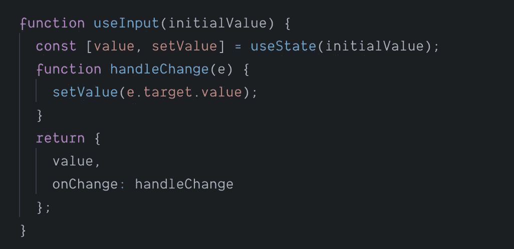

## 展望未来

虽然钩子对于 React 来说仍然是一种非常新的模式，可能需要一些时间来适应，但它们肯定是框架中最有前途的特性之一，就像 React 一样广受欢迎，因为它们允许我们以更轻松的方式创建组件，因此，使软件工程更容易，并为构建令人惊叹的东西留下更多的时间和空间。

前端开发不就是这样吗？

React 的前景是光明的。

(个人注释:是的，我确实认为 React 是一个框架。)

## 资源

*   [今明两天反应，90%的清洁剂用钩子反应](https://www.youtube.com/watch?v=dpw9EHDh2bM&t=2s)
*   [和丹·阿布拉莫夫第一次尝试 React 钩子](https://www.youtube.com/watch?v=G-aO5hzo1aw)
*   [介绍如何将 React 应用重构为 React 挂钩](https://egghead.io/lessons/react-introduction-to-refactoring-a-react-application-to-react-hooks](https://egghead.io/lessons/react-introduction-to-refactoring-a-react-application-to-react-hooks)
*   [酷炫定制 React 挂钩列表](https://blog.bitsrc.io/10-react-custom-hooks-you-should-have-in-your-toolbox-aa27d3f5564d)
*   React Podcast 第 31 集， [Hooks 与 Ryan Florence 混搭](https://reactpodcast.com/31)