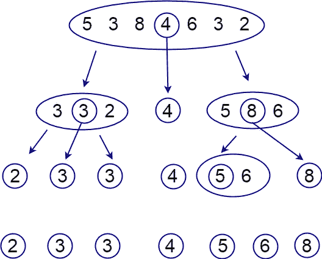
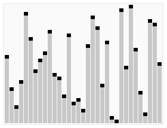
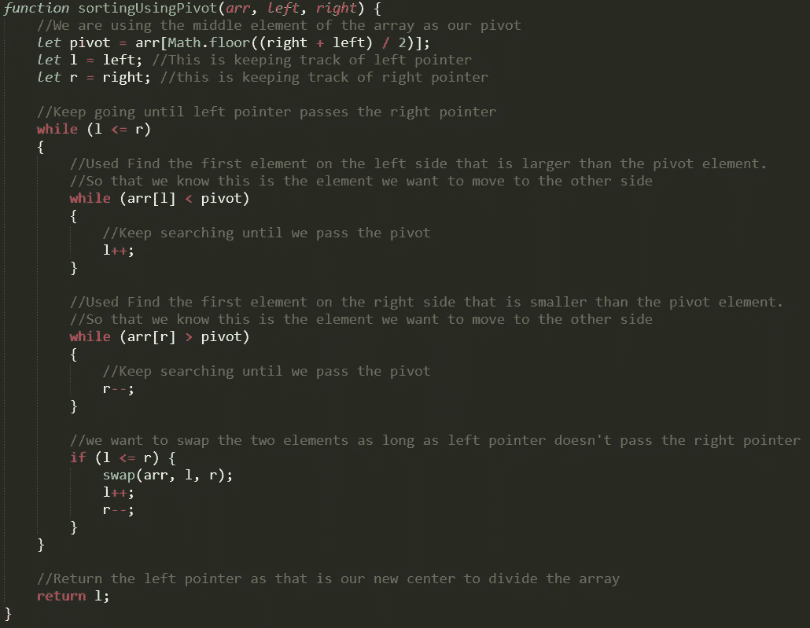
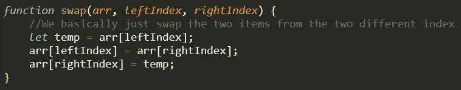
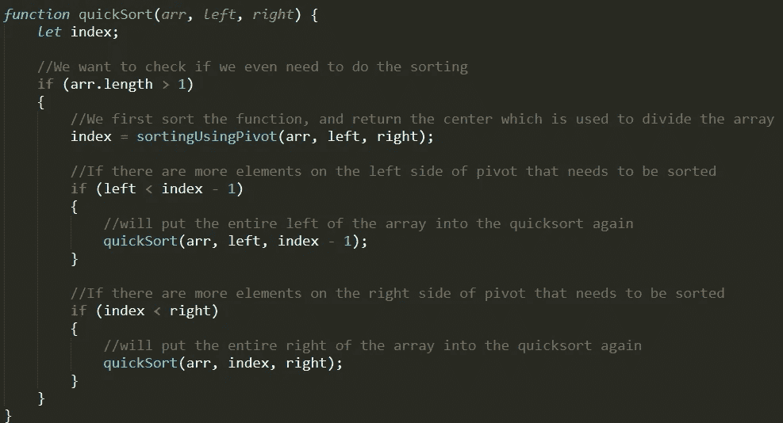
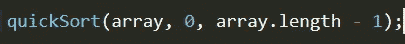

# JavaScript 中的快速排序

> 原文：<https://betterprogramming.pub/quick-sort-in-javascript-5a13cc6c2ed4>

## 如何在您的代码库中实现快速排序

由[edu·格兰德](https://unsplash.com/@edgr?utm_source=medium&utm_medium=referral)在 [Unsplash](https://unsplash.com?utm_source=medium&utm_medium=referral) 上拍摄的照片。

只想要密码？向下滚动到代码的两个版本:

1.  不带注释(即插即用)。
2.  通过注释来更好地理解代码。

# 什么是快速排序？

快速排序是一种排序算法，它将一个问题分解成两个或更多类似的子问题，直到最初的问题变得足够简单，可以直接解决。它遵循分而治之的方法。

快速排序是任何编程语言中最流行和最常用的算法之一。编码中的许多内置排序方法都使用了 Quicksort 的变体。

快速排序的工作方式是首先找到一个元素作为主元素，然后从数组的两端(左右两侧)与主元素进行比较。接下来，它对它们进行排列，使小于枢轴元素的元素位于左侧，而大于枢轴的元素位于右侧。

*注意:如果你想让数组从最大到最小排序，你可以反向操作。*

图片来自 [QnA 加](https://qnaplus.com/implement-quick-sort-c/)。

# 使用快速排序的步骤

实现快速排序需要某种形式的递归。

1.  找到枢纽元素。
2.  对数组重新排序，使所有小于 pivot 元素的数字位于左侧，所有大于 pivot 元素的数字位于右侧。
3.  对 pivot 元素左侧和右侧的所有元素重复步骤 1 和 2。

GIF 来自[维基百科](https://en.wikipedia.org/wiki/File:Sorting_quicksort_anim.gif)。

# JavaScript 中的快速排序

在开始之前，我们需要注意 Quicksort 是一个破坏性函数，因为它会修改您放入其中的数组。如果您不想修改原始数组，请确保在注入这个排序算法之前使用 spread 操作符创建一个新变量。

让我们从函数的排序部分开始。这部分将找到 pivot 元素并对数组进行排序，使较小的数字在左边，较大的数字在右边:

我们传入数组本身——这部分排序开始的左索引和这部分结束的右索引。

首先，找到 pivot 元素。找到这个元素可能非常棘手，因为有些人喜欢使用最后一个元素作为枢纽，而有些人喜欢使用第一个元素。我更喜欢使用数组中间的元素。这样，在大部分排序或已经排序的数组中，函数需要运行的步骤更少。

从左右指针开始，分别作为数组的第一个和最后一个元素。然后，我们将左边指针上的元素与 pivot 元素进行比较。我们这样做，直到我们找到一个比支点大的数。接下来，我们对右指针做同样的事情，找到一个比主指针小的数字。

一旦我们找到了两个数字，我们就可以互相交换值，并将两个指针都移动一步。继续这样做，直到两个指针相遇，我们将其中一个指针返回，作为递归发生的新中心(支点)。

我创建了一个小函数来交换这两个元素。你不需要在一个单独的函数中写这个。我这样做只是为了更好地组织我的代码。

既然我们已经知道了如何将数组排列在左边和右边，我们现在需要找到如何将它放入一个递归中，这样它将继续划分数组，并在那部分上执行快速排序。

首先，检查它的长度，看它是否只有一个元素。如果是这样，我们就忽略这个数组，因为没有什么要做的了。

否则，我们将首先使用轴心点对数组进行排序，然后返回轴心索引，这样我们就知道在哪里划分数组。

最后，把数组分成左右两边，把它们放回函数中，因为这是我们的递归操作。

当调用快速排序算法时，我们希望传递数组、左边的索引以及快速排序要执行的最后一个索引。

# 就为了密码吗？

## 版本 1:只有函数，没有任何注释

## 版本 2:带注释