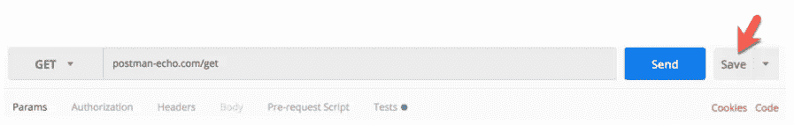
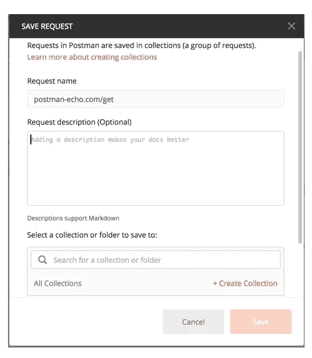
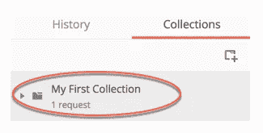
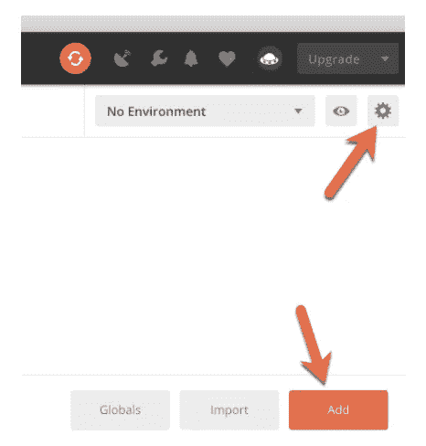

# 巧妙使用邮递员的快速提示

> 原文：<https://betterprogramming.pub/quick-tips-to-use-postman-smartly-a95ca1bc67cf>

## 如何在你的发展中充分利用 Postman


Postman 是最流行的 API 开发环境之一，不需要向 API 开发人员介绍。但奇怪的是，许多 API 开发者经常忽略它的许多关键特性，使他们的工作变得不必要的困难。在本文中，我们将讨论每个 API 开发人员应该了解的关键特性。

# 1.创建一个帐户并保持登录状态

这将保存你的历史和收藏。

# 2.使用收藏

将您的请求保存在[集合](https://www.getpostman.com/docs/v6/postman/collections/managing_collections)中，以便可以重用和共享。在收藏中创建文件夹，以便更好地组织。

在“请求生成器”中输入请求，然后单击“保存”按钮打开“保存请求”模式。



将此请求保存到现有集合，或通过输入集合名称创建新集合。然后，单击保存按钮。



恭喜你！您可以在左侧边栏的“收藏”标签下看到您的所有收藏，如下图所示:



# 3.使用环境

Postman 允许我们创建和使用[环境](https://www.getpostman.com/docs/v6/postman/environments_and_globals/intro_to_environments_and_globals)。例如，假设您有一个运行在三种环境中的 API:

*   **生产:** `[https://prod.example.com](https://prod.example.com/)`
*   **测试:** `[http://test.example.com](http://test.example.com/)`
*   **当地:**



所以你可以创建三个邮递员环境——比如说`ExampleProd`、`ExampleTest`和`ExampleLocal`。然后，在使用 Postman 时，您可以将当前环境设置为其中之一。

*“但是，有什么好处呢？”*

Postman 允许您在环境中存储变量，并且您可以在请求中使用这些变量。例如，您可以在`ExampleProd`、`ExampleTest`和`ExampleLocal`环境中定义一个`baseUrl`变量，分别具有值`[https://prod.example.com](https://prod.example.com/)`、`[http://test.example.com](http://test.example.com/)`和`[http://localhost:8080](http://localhost:8080)`。

然后，如果您有一个请求的 URL 为`{{baseUrl}}/users/5`，那么在执行请求时，Postman 将用当前环境中的值替换`{{baseUrl}}`。这样，只需改变 Postman 中的当前环境，就可以在多个环境中重用相同的请求。

# 4.使用变量链接请求

假设您想顺序发送两个请求:

*   **登录:**这将给你一个授权令牌
*   **更新配置文件:**您将在此使用上述令牌

您如何将授权令牌从第一个请求传递到第二个请求？

许多开发人员会手动复制令牌并将其粘贴到第二个请求中。但是 Postman 提供了一种更好的方法——您可以将令牌存储为环境变量，然后在后续请求中使用它。例如，要将令牌存储在变量中，您可以在第一个请求的 Tests 选项卡中使用如下脚本:

```
if (responseCode.code === 200)postman.setEnvironmentVariable("authHeader", postman.getResponseHeader("Token"));
```

上面将把`Token`响应头的值存储在一个`authHeader`变量中。然后，正如我们在上面的步骤 3 中讨论的，您可以在后续请求中使用`{{authHeader}}`。

请求链接是一个强大的特性，可以用来运行自动化测试。例如，您可以使用它对您的生产部署进行冒烟测试。

# 5.使用动态变量生成唯一值

假设您有一个注册请求，每次都需要一个唯一的新电子邮件 ID。那么，每次使用请求时，您会一直手动提供新的电子邮件 ID 吗？

Postman 提供了一个更好的方法——你可以使用一个动态变量。Postman 附带了三个动态变量，您可以在请求中使用:

*   `{{$guid}}`:v4 样式的 guid
*   `{{$timestamp}}`:当前时间戳
*   `{{$randomInt}}`:0-1000 之间的随机整数

所以在注册的情况下，只需使用`{{$guid}}@example.com`作为唯一的电子邮件。

# 6.使用预请求脚本生成可重用的唯一变量

在上面生成唯一电子邮件 ID 的例子中，如果您需要在后续请求中重用同一个 ID，就会出现问题。例如，如果您想在注册后使用相同的电子邮件 ID 登录，该怎么办？

解决方案是使用一个*预请求脚本*，而不是动态变量，来生成电子邮件。例如，在注册请求中，您可以在“请求前脚本”选项卡中添加以下脚本:

```
pm.environment.set("registeredEmail", Math.floor(Math.random() * 10000000) + "@example.com");
```

这将生成一个随机的电子邮件 ID，并将其存储在一个`registeredEmail`环境变量中。然后，您可以在同一个请求以及后续请求中使用`{{registeredEmail}}`。

# 7.将 Postman 用于 API 文档

Postman 允许你从你的收藏中生成漂亮的 API 文档。[这里有一个](https://documenter.getpostman.com/view/305915/RVu2mqEH)的例子。

因此，虽然 Swagger 在记录 API 方面似乎更受欢迎，但为什么不用 Postman 来代替呢，至少在内部是这样的。假设您无论如何都要使用邮递员集合，这将减少您的工作量。当然也有像 Springfox 这样的从源代码生成 API 文档的框架，但是好像没有 Postman 那么强大。无论如何，为什么要重复自己？

# 结论

综上所述，Postman 提供了许多聪明的方法来高效地使用它。我在这篇文章中提到了一些基础知识，但是它也提供了许多高级特性——例如，[集合级和文件夹级的变量和脚本](http://blog.getpostman.com/2017/12/13/keep-it-dry-with-collection-and-folder-elements/)，您可以使用它们来简化您的工作。

我希望你能从这本指南中学到一些东西。

感谢您的阅读，祝您编码愉快！