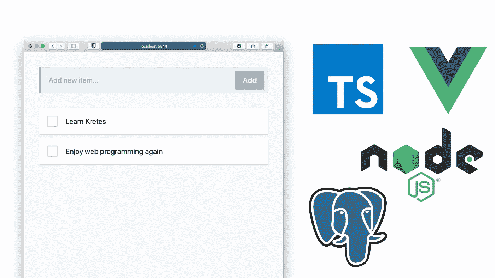
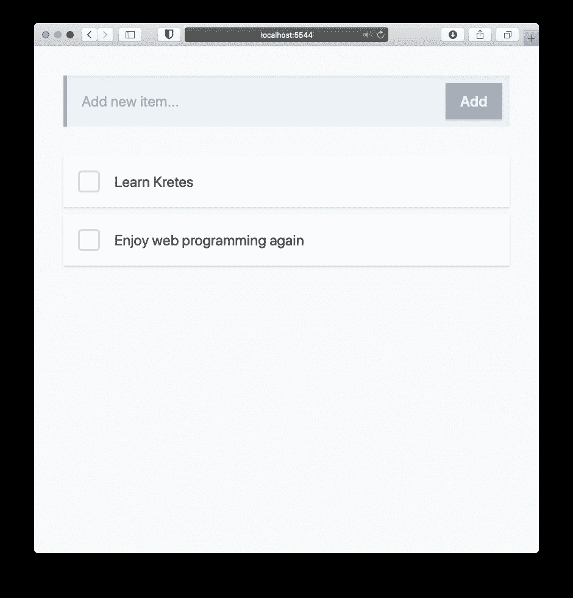
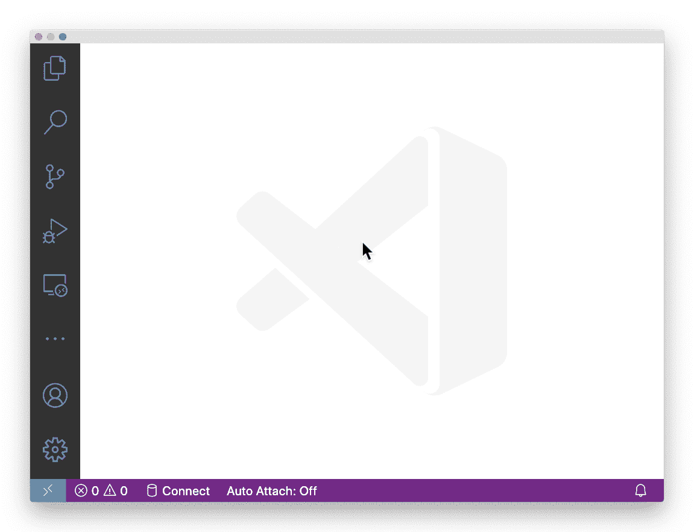
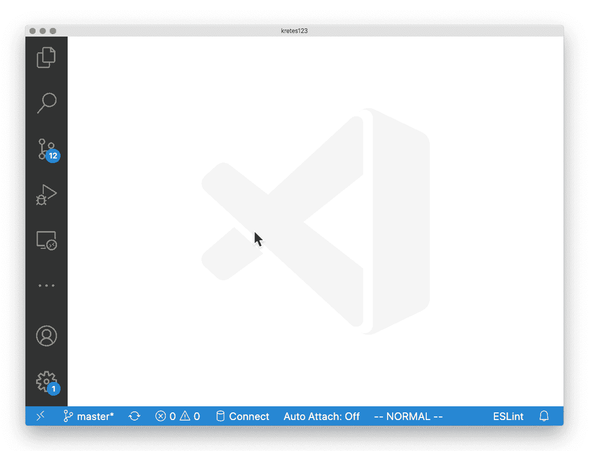
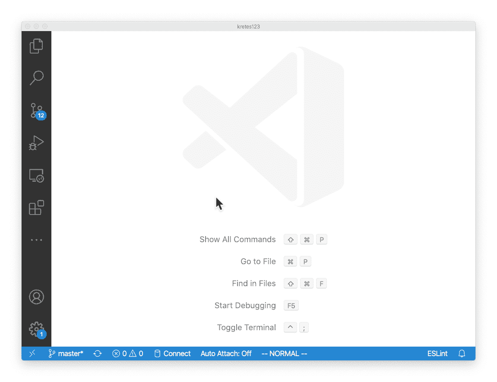
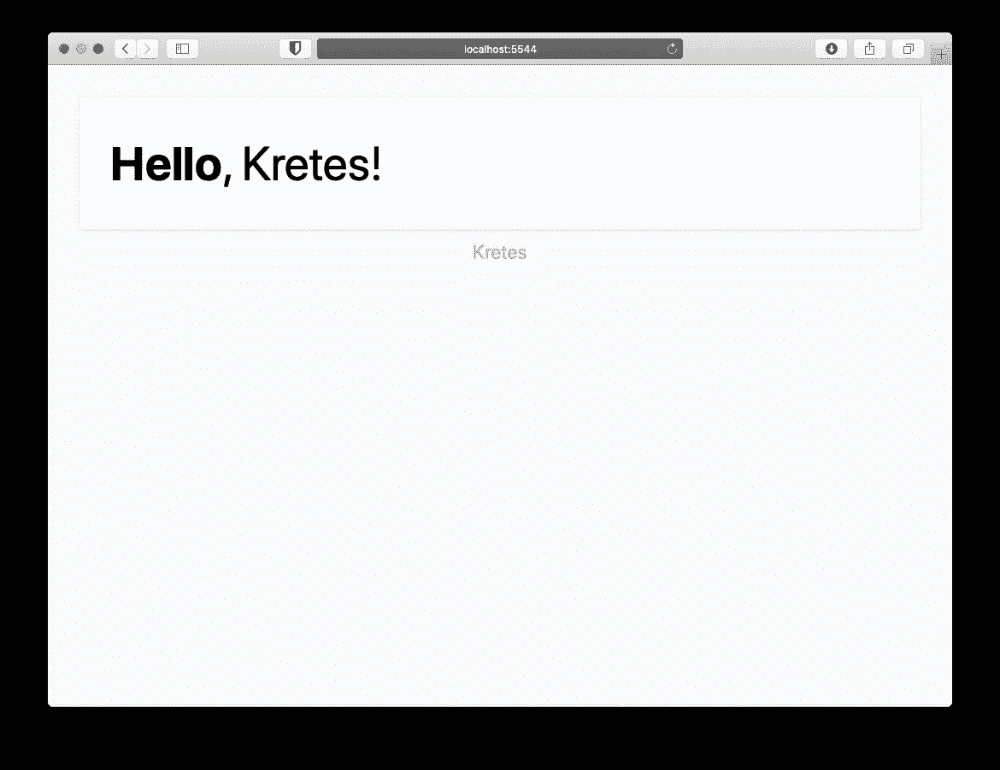
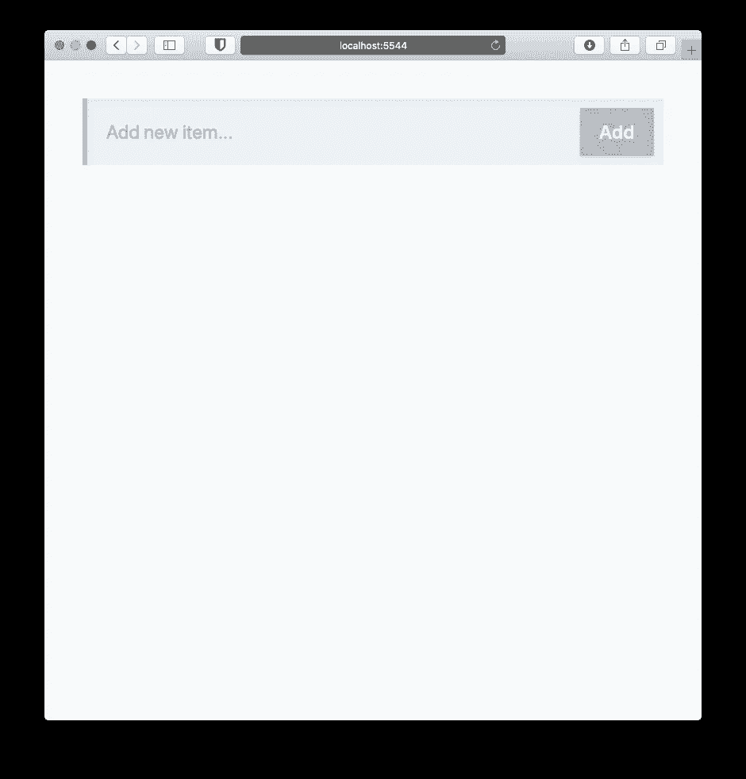
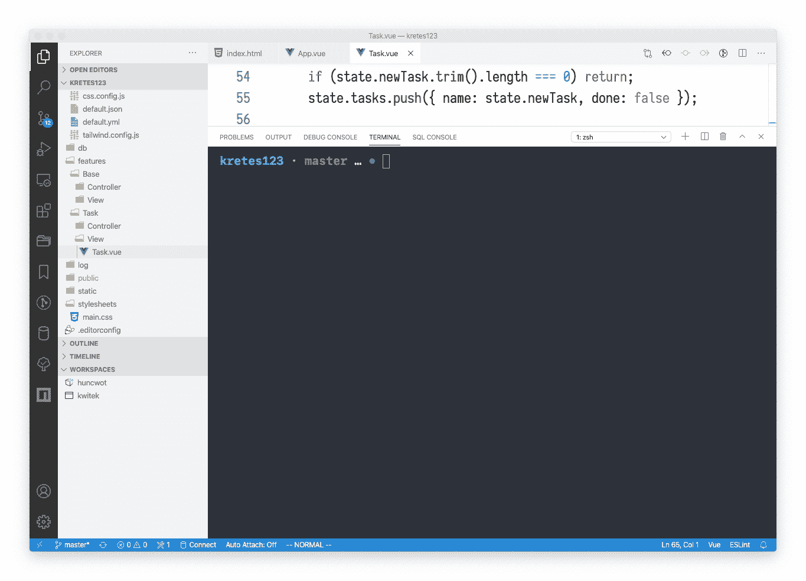
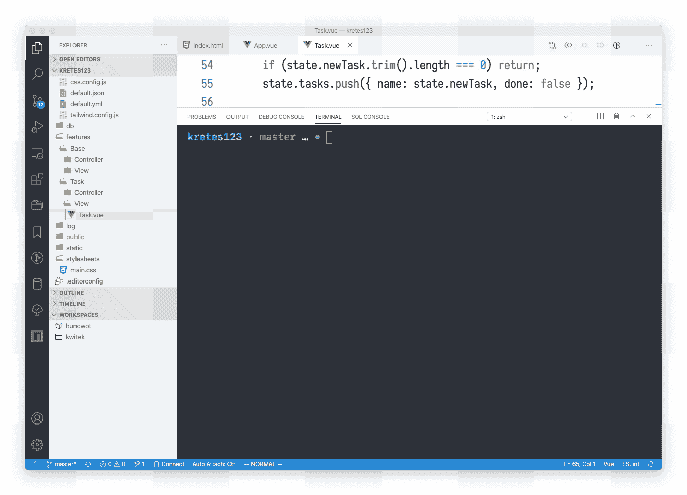
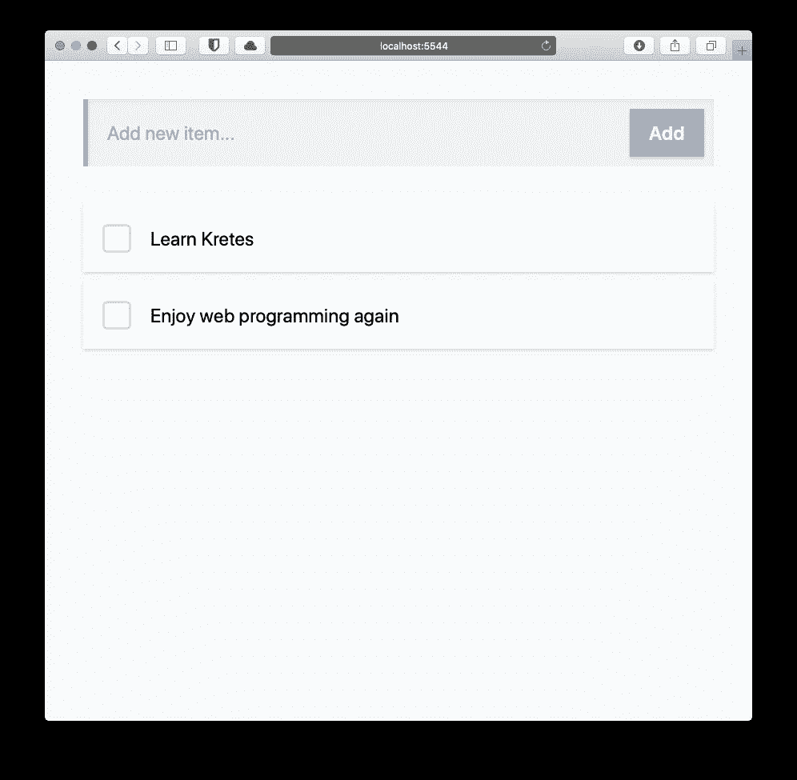

# 在 TypeScript 中快速创建全栈 Web 应用程序

> 原文：<https://betterprogramming.pub/quickly-create-a-full-stack-web-app-in-typescript-9188f011748b>

## 使用 Vue.js 3、Node.js 和 PostgreSQL



作者照片。

在本文中，我们将使用 Vue.js 3、Node.js 和 PostgreSQL 使用 Kretes 在 TypeScript 中构建一个简单的任务管理应用程序。这是最终的结果:



用 Kretes 编写的一个简单的任务管理应用程序。

[Kretes](https://kretes.dev/) 是一个内置电池的编程环境，用于使用 TypeScript 构建现代化的全功能 web 应用程序。它将框架(类似于 Rails 或 Laravel)与基于 Visual Studio 代码的集成编辑器相结合。

Kretes 对整个应用程序只使用一种编程语言(TypeScript)。换句话说，你在前端和后端写打字稿。通过全面使用 TypeScript，只需要管理一个生态系统和一个工具，并且需要学习的概念更少。这样，一切都更简单，也更统一。

Kretes 背后最重要的思想是，您不需要担心依赖性或配置。大部分工作都已完成，因此您可以专注于解决应用程序的实际需求。

与其给你一个定义，不如让我向你展示如何用 TypeScript 构建一个具有前端、后端和数据库集成的 web 应用程序——全部只需 10 分钟。

# 先决条件

按照[官方文档](https://kretes.dev/docs/quick-start/installing/)在你的机器上安装 Kretes。您需要三个元素: [Nix 包管理器](https://nixos.org)、VS 代码的 [Kretes 扩展](https://marketplace.visualstudio.com/items?itemName=kretes.kretes)和 [pgcli](https://www.pgcli.com) (一个 PostgreSQL 命令行实用程序)。

或者，如果您想通过命令行或其他编辑器来使用 NPM，您可以使用它来安装 Kretes。

# 初始化应用程序

Kretes 中几乎所有的事情都是直接在 VS 代码中完成的。一旦安装了 Kretes 扩展，您就可以通过使用命令面板中的`Kretes: New Project`来初始化一个新项目。为您的应用程序选择一个名称(如`kretes123`)以及放置它的文件夹:



这将创建您的应用程序以及组成初始结构的几个目录和文件。四处看看！`features/`和`config/`是目前最重要的目录。

# 安装依赖项

要为您的应用程序安装依赖项，请使用`Kretes: Install`任务。默认情况下，Kretes 使用 [pnpm](http://Fast, disk space efficient package manager) 包管理器，因为它比`npm`快得多，而且节省磁盘空间。



# 启动您的应用程序

要启动您的应用程序，使用`Kretes: Start`任务。您可以在 VS 代码中使用[命令面板](https://code.visualstudio.com/docs/getstarted/userinterface#_command-palette)中的`Tasks: Run Task`命令来触发它:



让我们导航到`localhost:5544`，在那里我们的应用程序用`Hello, Kretes`消息欢迎我们:



# 构建全栈单页面应用程序(SPA)

好的，但这只是一个简单的 HTML 页面。让我们做点更新奇的事情。我们将构建一个具有前端、后端和数据库集成的任务管理应用程序——全部在大约 10 分钟左右完成。你认为这可能吗？

为了前端简单起见，我们将使用 Vue.js 版本 3 及其组合 API 和 Tailwind CSS。打开 VS Code 的终端，使用 [pnpm](https://pnpm.js.org/) 安装 Vue.js 3:

```
pnpm add vue@3.0.0-beta.22
```

注意:你需要明确指定 Vue.js 的版本，因为它目前仍处于测试阶段。

在`config/client/index.html`中，我们需要使用`createApp`函数创建一个 Vue.js 实例，然后用`app`标识符将其附加(或挂载)到`div`元素:

组件`App`还不存在。让我们继续在`features/Base/View`中将它创建为`App.vue`。我们需要`<template>`部分和`<script>`部分:

由于这是一个全栈 app，所以前端和后端之间需要异步通信。在模板部分，我们将使用`suspense`功能。将有两种情况:

1.  默认显示任务列表。
2.  显示加载消息的回退。

我们的脚本部分很简单。我们只引用另一个组件来保持职责的良好分离。任务是我们应用程序的一个特性，所以让我们在`features/Task/View`目录中创建`Task.vue`:

我们将有一个用于输入新任务的文本字段和一个容器中的任务列表，所以它放置得很好。让我们添加输入文本字段和按钮:

接下来，让我们来处理任务列表。我们将有一个带有一个`label`的`task-item`和一个定制的复选框以及一个特定任务的名称:

还是省吧。变化马上就体现出来了！很酷，是吧？



你有没有注意到我们*没有*安装任何类似 Webpack 或 rollup 的捆绑软件？它开箱即用，无需任何配置。您不再需要浪费无数的时间来找出配置不工作的原因。克雷斯会支持你的！

# RESTful API

这还只是前端部分。让我们将任务保存在数据库中，并使用 RESTful API 通过网络获取它。这样，我们将看到如何将前端连接到后端，以及如何与这个数据库进行交互。

首先，我们需要一个 REST API，它有一个返回任务集合的端点。幸运的是，只要遵循一个简单的约定，RESTful 端点就会在 Kretes 中自动创建:您需要在给定特性的`Controller`中放置一个特定的处理函数。

就这么办吧。我们的特性是`Task`，我们在`features/Task/`和一个名为`browse.ts`的文件中创建了`Controller`目录，该文件将保存一个使用`GET` HTTP 方法触发的处理程序:

现在，让我们将任务集合作为一个变量放在内存中:

因为这是`Task`特性，所以它被转换为`/task`路径。让我们用一个 HTTP `GET`请求来触发这个端点。我们将使用[HTTP pie](https://httpie.org)，这是一个命令行 HTTP 实用程序:

```
http :5544/task
```

*注:您也可以在浏览器中打开* `*localhost:5544/task*` *来查看结果。*

它工作了。你有没有注意到我们没有重启我们的应用？我们可以只关注应用程序的业务逻辑。

# 数据库集成

让我们将这些任务从内存转移到数据库中。我们还没有真正谈到数据库，但这不是问题。在`config/default.yml`中，你会看到 Kretes 期望一个以项目命名的数据库。在我们的例子中，数据库被命名为`kretes123`。

我们还没有创建这个数据库。我们还没有安装任何数据库引擎，比如 PostgreSQL 或 MySQL。但是不管怎样，让我们继续连接到这个数据库。我们将使用 [pgcli](https://www.pgcli.com/) ，这是一个命令行 PostgreSQL 实用程序。在 VS 代码中打开终端，并键入以下命令:

```
pgcli kretes123
```

成功了——我们连接了一个数据库。在幕后，Kretes 安装了 PostgreSQL，启动了数据库引擎，并为您创建了一个具有正确名称和权限的数据库。这样，您就可以专注于创建应用程序，而不是在配置上浪费时间。那很酷，不是吗？

让我们快速创建一个表并插入数据。仍然在终端中，在 pgcli 连接内，键入以下 SQL 语句:

完成后，您可以使用`\q`退出 pgcli 并关闭终端窗口。



使用 pgcli 在数据库中创建一个表，并插入一些数据。

最后，让我们查询数据库，并通过我们之前创建的 RESTful 端点直接从我们的存储解决方案返回任务集合。我们需要导入`database`名称空间。为了方便起见，我们将其别名为`db`。然后，在我们的处理函数中，我们请求一分钟前刚刚创建的`task`表中的所有行:

让我们在命令行上测试它，再次使用 [httpie](https://httpie.org/) (或者您可以在浏览器中打开`localhost:5544/task`):

```
http :5544/task
```



使用`/task`上的 httpie 来测试从数据库中获取数据。

它工作了。同样，我们没有重启应用程序，更改会立即反映出来。这是一个很好的编程流程，不是吗？

我们现在可以将这个 RESTful 端点连接到我们的 Vue.js 组件。因为我们到处都在使用 TypeScript，所以我们可以使用 TypeScript 的接口来定义数据的形状和应用程序状态:

我们需要初始化组件状态:

现在，我们可以像在命令行上一样，直接从 Vue.js 组件获取任务集合。为此，我将使用 ky 库。让我们先用`pnpm`安装它:

```
pnpm add ky
```

让我们直接从 Vue.js 组件触发对`/task`路径的`GET`请求:

最后，让我们迭代 Vue.js 组件中的任务集合:

保存后，应该可以立即在浏览器中看到。尝试将任务添加到列表中:



最终申请。

仅此而已。更少的重新启动和所有的依赖关系都为您管理。你可以专注于编程的乐趣。

我希望你觉得 Kretes 有用。

欢迎在下面的评论区提出任何问题。

如果你是一个视觉学习者，看看下面的视频，一步一步的教程:

如何使用 Kretes 和 Vue.js、Node.js、PostgreSQL 构建全栈 TypeScript 应用的分步教程。

# 额外收获:连接添加按钮

您是否想了解如何在我们的任务管理应用程序中连接`Add`按钮，以便每个新任务也保存在数据库中？请在评论区告诉我，我会写这篇文章的后续文章。

# 资源

*   [HTTP ie](https://httpie.org/)—API 时代的用户友好的命令行 HTTP 客户端。
*   [ky](https://github.com/sindresorhus/ky) —基于 window.fetch 的小巧优雅的 HTTP 客户端
*   [Kretes](https://kretes.dev/)—TypeScript&node . js 的编程环境
*   [pnpm](https://pnpm.js.org/) —快速、节省磁盘空间的软件包管理器
*   PGC Li—PostgreSQL 的命令行实用程序