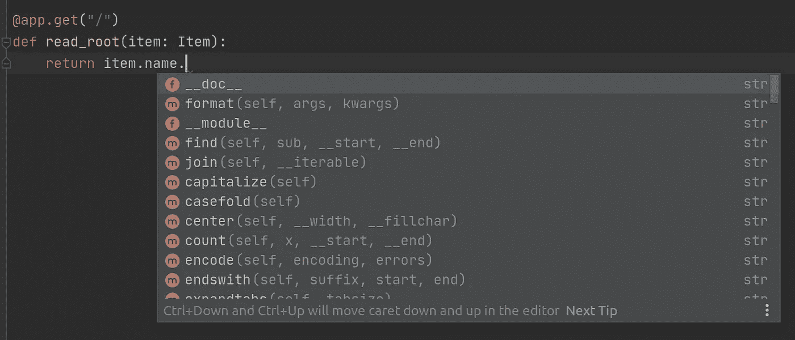
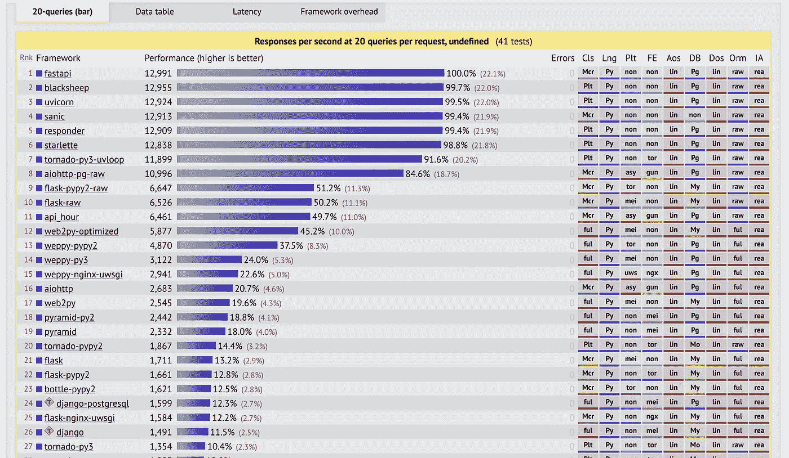

# 使用 FastAPI 和 Python 快速开发高性能 API

> 原文：<https://betterprogramming.pub/quickly-develop-highly-performant-apis-with-fastapi-and-python-4ac1f252c935>

## 以及为什么您应该在下一个 API 项目中考虑 FastAPI


Marc Sendra Martorell 在 [Unsplash](https://unsplash.com?utm_source=medium&utm_medium=referral) 上拍摄的照片。

如果你读过我以前的一些 Python 文章，你就会知道我是一个[烧瓶](https://livecodestream.dev/post/2020-05-21-python-flask-api-starter-kit-and-project-layout/)迷。它是我在 Python 中构建 API 的首选。然而，最近我开始听到很多关于 Python 的一个新的 API 框架，叫做 [FastAPI](https://github.com/tiangolo/fastapi) 。用它构建了一些 API 之后，我可以说它很神奇！

这个项目是由 [Sebastian Ramírez](https://twitter.com/tiangolo) 创建的，在撰写本文时，它已经积累了差不多 20K 颗星星。像微软、优步、网飞和其他一些大公司已经用它开发了 API。

但是为什么这个新库如此受欢迎，它与 Flask 或 Django 相比如何？

# 特征

FastAPI 是一个相当简约的框架。然而，这并没有减少它的功能。FastAPI 是使用现代 Python 概念构建的，并且基于 Python 3.6 类型声明。让我们看看这个库的一些特性。

## 自动文档

任何 API 都必须有关于端点和类型的文档。解决这个问题的一个常见方法是使用 [OpenAPI](https://github.com/OAI/OpenAPI-Specification) 和类似 [Swagger UI](https://github.com/swagger-api/swagger-ui) 或 [ReDoc](https://github.com/Redocly/redoc) 的工具来呈现信息。这些都是 FastAPI 自动打包的，允许您将更多的精力放在代码上，而不是设置工具。

## 类型化 Python

这是一个*大*的例子:FastAPI 使用了 Python 3.6 类型声明(感谢 Pydantic)。这意味着它使用 Python 特性，允许您指定变量的类型。这个框架广泛利用了它，为您提供了强大的编辑器支持。自动完成惊人地有效。

下面是一些使用类型化声明的示例代码:

我们刚刚从:

```
name
```

收件人:

```
name: str
```

就是这样！结果是:



使用 PyCharm 在 FastAPI 中自动完成

漂亮！

## 确认

由于 [Pydantic](https://pydantic-docs.helpmanual.io/) ，验证已经集成到这个框架中。您可以验证标准 Python 类型以及一些自定义字段验证。这里有几个例子:

*   JSON 对象(`dict`)
*   JSON 数组(`list`)
*   具有最小和最大长度的字符串(`str`)
*   带有最小值和最大值的数字(`int`、`float`)
*   统一资源定位器
*   电子邮件
*   UUID
*   还有更多…

## 安全性和身份验证

这是任何 API 的关键部分，它是我们经常重复的代码，所以为什么不把它集成到框架中呢？FastAPI 正是这样做的。

该库支持以下内容:

*   HTTP 基本
*   OAuth2 (JWT 代币)
*   头、查询参数或 cookies 中的 API 键。

## 证明文件

这也许不完全是框架的特性，但是值得一提。该项目的文档简直令人惊叹。它非常清晰，涵盖了带有示例和解释的主题。

# 表演

FastAPI 快！它不仅编码速度快，而且处理请求的速度也非常快！您可以使用 [TechEmpower 基准工具](https://www.techempower.com/benchmarks/#section=test&runid=7464e520-0dc2-473d-bd34-dbdfd7e85911&hw=cl&test=composite&l=zijzen-7&a=2)检查多个框架的基准。以下是我得到的 Python 框架的结果。Flask 和 Django 在列表中远远落后，FastAPI 是第一个，因此是性能最好的:



TechEmpower 基准测试结果

# 天生异步

让我们来看看下面的代码:

```
@app.post("/item/", response_model=Item)
async def create_item(item: Item):
    result = await some_code_running_in_background(item)
    return result
```

那是 JavaScript 吗？我向你保证这不是。不过，看起来很眼熟，对吧？这个片段实际上是使用异步方法的 Python。

默认情况下，FastAPI 支持异步端点，这可以简化并提高代码效率。这是 Flask 的一个巨大优势。Django 已经做了一些异步支持工作，但是它不像在 FastAPI 中那样集成。

# 结论

FastAPI 是一个相对较新的框架，它遵循 Flask 的极简方法，但增加了一些重要的特性，使它更容易使用，性能惊人。对于您的下一个 API 项目来说，这是一个很好的选择，随着我在我的 API 上越来越多地使用它，我将会写更多关于它的内容。

感谢阅读！