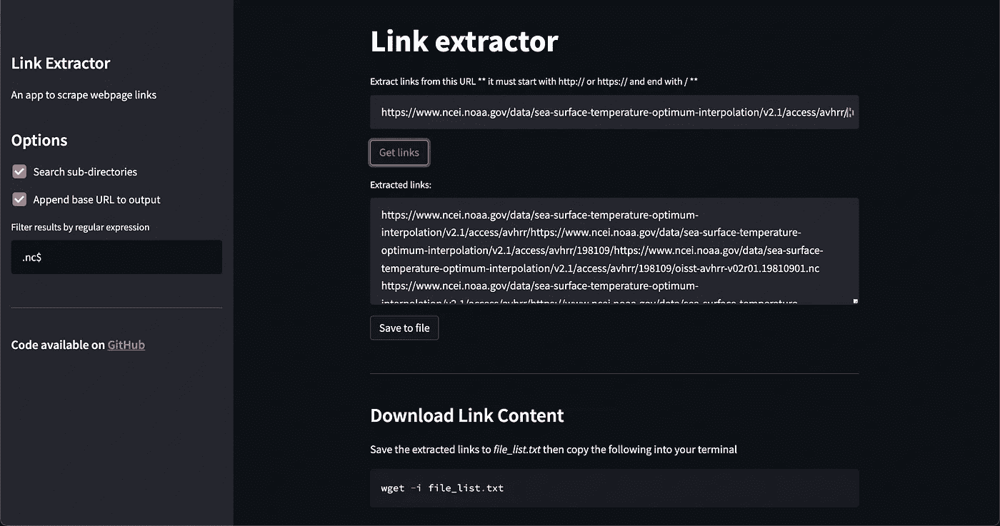

# 使用这个 Streamlit 应用程序从网页中快速提取链接

> 原文：<https://betterprogramming.pub/quickly-extract-links-from-a-webpage-with-this-streamlit-app-fcb5a548c58>

## 使用 Python 异步函数


照片由[贝琳达·费因斯](https://unsplash.com/@bel2000a?utm_source=medium&utm_medium=referral)在 [Unsplash](https://unsplash.com?utm_source=medium&utm_medium=referral) 上拍摄

TL；DR:提取链接的 app 这里是[这里是](https://streamlit-file-extractor.herokuapp.com/)

用`wget`和一个输入文件下载文件干净而直观:

```
wget -i file-list.txt
```

在本例中，`file-list.txt`包含要下载的 URL 列表

然而，当我们拥有的只是一个包含子目录链接的网页时，创建这个列表并不明显(例如 [this](https://www.ncei.noaa.gov/data/sea-surface-temperature-optimum-interpolation/v2.1/access/avhrr/) ，网页)。

在这篇文章中，我将解释如何使用 Python 和异步函数创建一个快速的链接提取器。为了方便使用，我将这段代码转换成部署在 [Heroku](https://heroku.com/) 上的网络应用。此处有 app[。](https://streamlit-file-extractor.herokuapp.com/)



在[https://streamlit-file-extractor.herokuapp.com/](https://streamlit-file-extractor.herokuapp.com/)可用的链接提取器应用截图(图片由作者提供)

# 程序如何工作

下面是程序的伪代码。

1.  创建一个空列表来存储所有链接
2.  从网页获取 HTML
3.  解析 HTML 中的`<a>`标签并提取`href`属性
4.  如果链接包含正则表达式，则将链接追加到空的
5.  如果`href`指向子目录，则重复步骤 2-4

为了显著提高速度，一些功能通过`asyncio`和`aiohttp`封装实现异步。加快程序运行速度的原因是，当我们在步骤 2 中等待从网页获取 HTML 时，我们可以继续做一些工作。当搜索子目录时，可以实现显著的加速。

一旦我们接收到 HTML，`BeautifulSoup`和`lxml`就会帮助解析它。正则表达式用于通过`regex`过滤结果，内置`itertools`库中的`chain`用于将列表“链接”在一起。

这里是完整的进口清单(不包括`Streamlit`)。

```
from bs4 import BeautifulSoup
from itertools import chain
import asyncio
import aiohttp
import lxml
import re
```

# 这些功能

为了保持代码简洁，我把它分成了五个函数:`format_base_url()`、`get_html_async()`、`get_links()`、`get_sub_dirs()`和`get_files()`

这些函数然后被串在一起创建最终的`main()`程序。在这里，我将讨论每个函数是如何工作的。

## 格式 _ 基本 _url()

这个函数只是确保用户输入的 URL 以`http://`或`https://`开头，以“/”结尾，然后返回重新格式化的 URL。

## get_html_async()

`aiohttp`允许我们进行异步 HTTP 请求。为此，我们首先通过上下文管理器打开一个`.ClientSession()`，然后发出一个`get`请求。通过`.text()`访问响应(或本例中的 HTML)。但是，为了确保我们正在访问的 URL 确实存在，我检查了状态代码“OK”([状态代码 200](https://developer.mozilla.org/en-US/docs/Web/HTTP/Status) )。如果后者被确认，那么 HTML 将被返回。

我不打算详细介绍异步编程，只是说在`def`告诉 Python 这个函数是一个协程之前`async`和`await`告诉 Python 我们需要等待结果。

## get_links()

检索到的 HTML 被传递给`get_links`函数进行解析。我们首先使用`lxml`解析器创建一个`BeautifulSoup()`对象，它应该比 `[html.parser](https://medium.com/geekculture/how-to-make-webscraping-with-beautiful-soup-5x-faster-d3dcf0427837)`快[。使用这个对象，我们找到所有的`<a>`标签，然后在里面得到`href` 。](https://medium.com/geekculture/how-to-make-webscraping-with-beautiful-soup-5x-faster-d3dcf0427837)

在这种情况下，正则表达式查找任何内容或末尾的“/”。

我们将返回 HTML 中的所有链接。现在我们需要将文件从子目录中分离出来。

## 获取 _ 订阅 _ 目录()

从提取的链接中，我们将简单地通过搜索末尾的“/”来分离出子目录，并使用列表理解来存储它们。

## 获取文件()

为了获取文件，我们将保留所有符合指定正则表达式的链接。如果没有指定正则表达式，则程序会查找没有结尾“/”的链接。

正则表达式允许您非常具体地指定想要返回的文件类型。如果你需要复习，我强烈推荐科里·斯查费在 YouTube 上的视频。

## 主()

`main()`函数只是按照逻辑顺序将所有函数串在一起。

很清楚上半部分在做什么。这将获取在基本 URL 中找到的文件，并将它们添加到主文件列表中。

接下来的代码处理子目录，这是`asyncio`的亮点。

我们首先通过将`sub_dirs`中的每个子目录传递给`main()`函数来创建一个协程列表。

```
coros = [main(sub) for sub in sub_dirs]
```

然后，我们通过将这些函数传递给`asyncio.gather()`来同时运行所有这些函数*。这很快，因为我们不必等待每个任务完成后再开始下一个任务。这将返回`new_files`，这是一个列表列表。*

```
*new_files = await asyncio.gather(*coros)*
```

*然而，我们想要的是一个单一的列表，这就是`chain`派上用场的地方。该链表然后被添加到主`files`列表中。*

```
*files.extend(chain(*new_files))*
```

*最后，您可能希望在每个文件前面加上`base_url`。这是通过列表理解来实现的。*

```
*if prepend_base_url:
    files = [base_url + file for file in files]*
```

## *运行程序*

*`main()`程序实际上是一个协同程序，注意开头的异步。要运行协程，我们需要使用`asyncio.run()`*

```
*base_url='https://example.com/
files = asyncio.run(main(base_url, regex='.'))*
```

*厉害！我们有一个从网页中提取链接的程序！*

*让我们用 Streamlit 给它增加一点趣味，给它一个闪亮的用户界面。*

# *创建 Streamlit 应用程序*

*Streamlit 是一个库，允许你快速地将你的代码转换成一个网络应用。我们只需要添加几行代码，将一些输入连接到 UI 小部件。首先，您需要导入 streamlit。*

```
*import streamlit as st*
```

*下面是制作 web 应用程序的代码。请记住，您需要包含`format_base_url()`、`get_html()`、`get_links()`、`get_sub_dirs()`、`get_files()`和 `main()`的代码，这样代码才会起作用。*

*对这段代码的完整描述超出了本文的范围。将链接提取器变成 web 应用程序的秘密是将主函数中的每个输入链接到一个[输入小部件](https://docs.streamlit.io/library/api-reference/widgets)。*

```
*search_subs = st.checkbox('Search sub-directories', value=False)       
prepend_base = st.checkbox('Append base URL', value=True)
custom_regex = st.text_input('Filter results by regex', '.')
base_url = st.text_input(label='Extract links from URL')*
```

*无论用户选择什么，都会传递给 main 函数，生成的文件会显示在屏幕上。*

```
*asyncio.run(main(base_url=base_url, 
                 search_subs=search_subs,
                 prepend_base_url=prepend_base,
                 regex=custom_regex))*
```

*Streamlit 应用程序的完整代码可从[这里](https://github.com/lgloege/streamlit-link-extractor)获得*

# *结论*

*这个应用证明了我从网页中收集链接的努力，特别是那些有多个子目录的网页，如 [NOAA-OI SSTv2 高分辨率数据集](https://psl.noaa.gov/data/gridded/data.noaa.oisst.v2.highres.html)。*

*我希望这篇文章能让你对自己的项目有所启发。如果你觉得链接提取有用，请让我知道。可能已经有这样的应用了，但是我自己也学到了很多。它迫使我深入到像异步编程和简化会话状态这样的高级主题中。我惊讶地发现，仅仅通过将代码改为异步就节省了时间。*

*感谢您的阅读。*