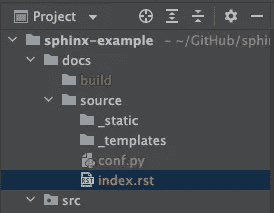
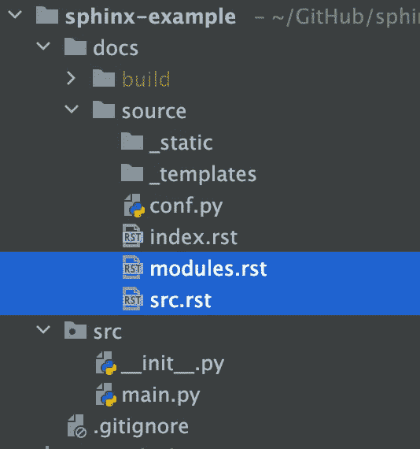

# 使用 Sphinx CLI 工具快速生成文档

> 原文：<https://betterprogramming.pub/quickly-generate-documentation-with-sphinx-cli-tools-99db0cb5994c>

## 生成文档并将其集成到 CI 管道中的脚本


使用 Sphinx CLI 工具生成文档！

Sphinx 是一个强大的工具，可以用不同的输出格式(HTML、LaTeX 等)生成好看的文档。).默认情况下，Sphinx 使用 [reStructuredText](https://docutils.sourceforge.io/rst.html) 标记语言，并提供更多功能，例如附加的[指令](https://www.sphinx-doc.org/en/master/usage/restructuredtext/directives.html)和丰富的[扩展](https://www.sphinx-doc.org/en/master/usage/extensions/index.html)。因此，您可以使用它来构建复杂的文档。但这也意味着，由于它的复杂性，理解它的大部分功能需要时间。

因此，Sphinx 提供了一些有用的 CLI 工具来快速生成文档。

*   [斯芬克斯-快速入门](https://www.sphinx-doc.org/en/master/man/sphinx-quickstart.html)
*   [斯芬克斯-阿皮多克](https://www.sphinx-doc.org/en/master/man/sphinx-apidoc.html)
*   [狮身人面像建造](https://www.sphinx-doc.org/en/master/man/sphinx-build.html)

在本文中，我将创建一个脚本，使用这些工具为一个简单的 Python 项目生成漂亮的文档。此外，我将把这个脚本集成到一个 CI 管道中(一个 [GitHub 工作流](https://docs.github.com/en/actions/using-workflows/about-workflows)，当合并到`main`分支时，文档将自动生成(更新)。

# 创建源目录和 conf.py

源目录是放置源文件(*。rst)和配置文件`conf.py`，在这里可以配置 Sphinx 如何读取源文件(*。rst)并生成您的文档。

`sphinx-quickstart`可以帮助你快速创建以上资源。让我们在您的项目下创建一个`docs`目录，并在您的终端中的`docs`下运行以下命令，文档将在`docs`下生成。

```
sphinx-quickstart --no-makefile --sep --no-use-make-mode --no-batchfile
```

*   `--no-makefile`、`--no-use-make-mode`、`--no-batchfile`:我会用`sphinx-build`生成文档，所以你不需要在这里制作或批处理文件。
*   `--sep`:我更喜欢把`source`和`build`目录分开。

然后，它会提示一个交互式控制台要求您输入项目元数据。

```
...
> Project name: Sphinx Example
> Author name(s): ukyen
> Project release []: 0.0.1
...
> Project language [en]: en
```

文件夹结构如下所示:



# 自定义配置文件

在这里，我们有三件事要做:

## 1.设置路径

在路径设置部分进行如下配置，因为我们的源代码是相对于`conf.py`的两个上层的。

```
import os  
import sys  
sys.path.insert(0, os.path.abspath('../../'))
```

## 2.设置扩展

向`extensions`变量添加以下扩展。

```
extensions = [  
    "sphinx.ext.autodoc",  
    "sphinx.ext.todo",  
    "sphinx.ext.viewcode",  
]
```

*   `sphinx.ext.autodoc`:为了从 docstrings 构建文档，我不需要两个文档位置。文档字符串是文档。
*   `sphinx.ext.viewcode`:我推荐它，因为你可以在浏览文档的同时直接查看源代码。
*   `sphinx.ext.todo`:(可选)。如果您喜欢将`TODO`添加到 docstring 中，这将非常有用。确保在`conf.py`中添加`todo_include_todos = True`以启用它。

# (可选)选择主题

默认主题是`alabaster`。你可以在这里找到其他内置主题。如果都不适合你，还可以查一下[第三方主题](https://sphinx-themes.org/)。

我比较喜欢`classic`主题，所以把`html_theme = 'classic'`设置在`conf.py`里。

这里可以找到完整的`conf.py` [。](https://github.com/Shawnice/sphinx-example/blob/main/docs/source/conf.py)

# 从源代码自动生成源文件

在上一节中我已经启用了`autodoc`扩展，所以我现在可以使用`sphinx-apidoc`来生成源文件(*。rst)从文档字符串。

```
sphinx-apidoc -f -o docs/source src
```

*   `-o`:指定生成源文件的输出路径。
*   `-f`:强制覆盖任何现有生成的源文件。
*   `src`:源代码所在的文件夹。



`modules.rst`和`src.rst`由`sphinx-apidoc`产生。它将文档(来自 docstrings)添加到源文件中。你可以在这里查看源文件和源代码[。](https://github.com/Shawnice/sphinx-example)

# 后处理根文档

`sphinx-quickstart`创建了`conf.py`和[根文件](https://www.sphinx-doc.org/en/master/glossary.html#term-root-document)、`index.rst`。

> *“根文档的主要功能是作为欢迎页面，包含“目录树”(或 toctree)的根。这是 Sphinx 添加到 reStructuredText 的主要内容之一，这是一种将多个文件连接到单个文档层次结构的方法。”据* [*斯芬克斯官网*](https://www.sphinx-doc.org/en/master/usage/quickstart.html#defining-document-structure) *。*

让我们给它添加源文件名`src`。

```
Welcome to Sphinx Example's documentation!  
==========================================  

.. toctree::  
   :maxdepth: 2  
   :caption: Contents:  

   src
```

但是，每当我有了新的模块名时，我不想改变内容。因此，我们可以将`index.rst`重命名为`index.tmpl.rst`，并使用下面的 shell 命令插入源文件名。`MODULE_NAME`是源文件名。

```
sed 's/Contents:/Contents:\n\n   $MODULE_NAME/g' docs/source/index.tmpl.rst > docs/source/index.rst
```

# 建立文档

现在，我们可以开始构建文档了。`sphinx-build`是从源目录生成并放入目标目录的工具。

```
sphinx-build -b html docs/source docs/build
```

*   `-b`:指定输出文件格式。
*   `docs/source`:源目录包含源文件。
*   `docs/build`:放置生成文档的地方。


由 Sphinx 生成的主题为“经典”的文档。

# 用于构建文档的脚本

让我们将上面的步骤合并到一个 shell 脚本中，这样我们就可以一键快速构建文档了！

下面是用法:

```
./docs_generator.sh src
Creating file docs/source/src.rst.
Creating file docs/source/modules.rst.
Running Sphinx v5.0.2
...
build succeeded, 2 warnings.The HTML pages are in docs/build.
```

酷！现在，我有了一个生成文档的脚本。

**注意:**这个脚本支持多个模块路径。例如，`./docs_generators.sh src src2`将生成包含这两个模块的文档。

# 整合到 CI 渠道中

我希望将脚本集成到我的 CI 管道(GitHub 工作流)中，这样每当合并到`main`分支时，我就可以自动生成(更新)文档。

我还有其他帖子展示了如何从头开始构建 GitHub 工作流。您可以查看[使用 GitHub 动作为 Python 项目](https://towardsdev.com/build-a-ci-pipeline-with-github-actions-for-python-project-cdc7852fbed3)构建 CI 管道，以及[使用 GitHub 动作“repository_dispatch”事件](https://towardsdev.com/update-submodule-automatically-with-github-actions-repository-dispatch-event-8e548ab1f517)自动更新子模块。我将跳过构建工作流的步骤，直接向您展示我的自动构建文档的工作流。

此工作流程的快速总结:

*   仅在将 Python 文件的更改推送到`main`分支时触发。
*   使用[环境变量](https://docs.github.com/en/actions/learn-github-actions/environment-variables)定义模块路径，例如`src src2`。
*   仅在`docs/build`中提交文件变更，这是放置生成的文档的地方。

# 结论

狮身人面像有更多的特征有待发现。然而，有了这些内置的 CLI 工具，我们已经可以构建令人惊叹的文档了。

1.  使用`sphinx-quickstart`创建包含`conf.py`和`index.rst`的源目录。
2.  接下来，我们可以使用`sphinx-apidoc`从 docstrings 生成源文件，
3.  然后使用`sphinx-build`从源文件中生成所需格式的文档。

然后，我们可以将所有这些放入一个脚本中，只需点击一下鼠标就可以生成文档！最后但同样重要的是，我们可以将脚本集成到我们的 CI 管道中。因此，当合并一个 pull 请求到`main`分支时，我们可以自动生成和更新文档。

您可以在这个[库](https://github.com/Shawnice/sphinx-example)中找到完整的示例。

如果您对如何托管生成的文档感兴趣。我有另一篇文章来讨论发布 Sphinx 文档的三种不同方式。

我希望这篇文章对你有所帮助。如果您有任何问题或想法，请随时留言。

# 参考

1.  [Sphinx 命令行工具](https://www.sphinx-doc.org/en/master/man/index.html)
2.  Sphinx reStructuredText(T1)