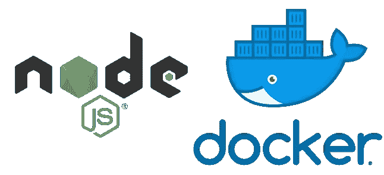

# 快速提升你的 Docker 和 Node。Js 容器

> 原文：<https://betterprogramming.pub/quickly-improve-your-docker-and-node-js-containers-b841858a0b38>

## 更好的容器



我们都知道如何为 Node.js app 做一个基本的`Dockerfile`，比如 Express。一个简单的单阶段构建将如下所示:

```
FROM node:12-alpineWORKDIR /app
COPY package.json /app/package.json
RUN npm install
COPY . /appEXPOSE 8080
CMD ["npm", "start"]
```

这真是再简单不过了。不幸的是，这个解决方案有几个缺陷。我们会修好它们的。

# 用户

默认情况下，Docker 以`root`用户的身份运行所有 Node.js，这可能会导致安全漏洞。在大多数情况下，我们希望`non-root`用户运行我们的容器。解决方案是在`Dockerfile`中使用不同的用户。Docker 的所有 Node.js 图像都有一个名为`node`的`non-root`用户。

用户可以通过`[USER](https://docs.docker.com/engine/reference/builder/#user)`语句添加到`Dockerfile`中:

```
FROM node:12-alpineWORKDIR /app
COPY package.json /app/package.json
RUN npm install
COPY . /appEXPOSE 8080## define user just at the end
USER node    

CMD ["npm", "start"]
```

或者，如果你正在使用 [Docker CLI](https://docs.docker.com/engine/reference/commandline/run/) 运行一个已经构建好的容器，你可以使用`--user, -u`标志。

```
docker run --user node my_image
```

# 煤矿管理局

有时我们使用`npm start`或`yarn start`作为 CMD 命令来启动 Docker 容器。我估计只是用 npm/yarn 工作时出于习惯。

这个解决方案有两个问题。首先，我们向容器中添加额外的进程，这是不必要的。其次，我们阻塞了 Docker 和 Node.js 之间的一些退出信号，如`[SIGTERM](https://docs.docker.com/engine/reference/commandline/stop/)`，因为它们被 npm/yarn 捕获。

解决方案非常简单。我们使用`node`作为启动命令:

```
FROM node:12-alpineWORKDIR /app
COPY package.json /app/package.json
RUN npm install
COPY . /appEXPOSE 8080
USER node## use node instead of npm/yarn
CMD ["node", "index.js"]
```

如果在`npm start`命令中有一些`env`变量，你仍然可以用`[ENV](https://docs.docker.com/engine/reference/builder/#env)`将它们传递给你的容器。

# Bcrypt

Bcrypt 是一个流行的散列密码库，但是它不能在`node:alpine`容器上工作。有些人只是备份到完整的`node`或`node:slim`图像，但它们仍然比`alpine`重。

这是众所周知的问题。解决方案是在安装 npm 软件包之前安装额外的软件包和 Python。

```
FROM node:12-alpineWORKDIR /app
COPY package.json /app/package.json## install required packages before npm
RUN apk --no-cache add --virtual builds-deps build-base pythonRUN npm install
COPY . /appEXPOSE 8080
USER node   
CMD ["node", "index.js"] 
```

这是改进 Docker 工作的三个快速提示。但是不要就此打住，在 [Docker 和 Node.js 最佳实践](https://github.com/nodejs/docker-node/blob/master/docs/BestPractices.md)和 [Bcrypt Wiki](https://github.com/kelektiv/node.bcrypt.js/wiki/Installation-Instructions) 上多读一些。

感谢您花时间阅读本文。