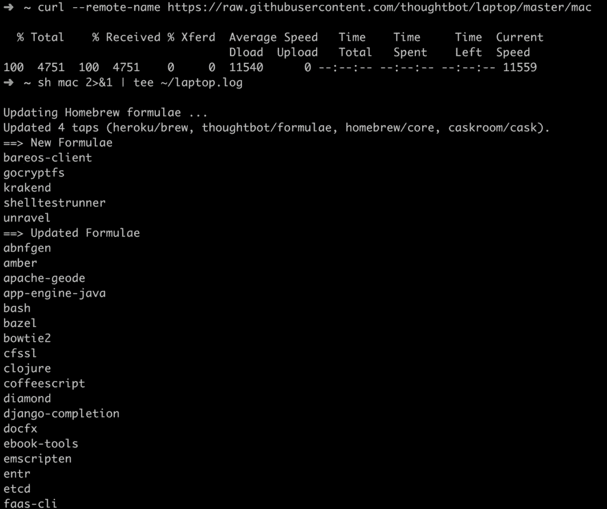

# 使用简单的脚本快速设置您的 Mac 开发环境

> 原文：<https://betterprogramming.pub/quickly-set-up-your-mac-development-environment-using-a-simple-script-276c6b3074b1>

## 笔记本电脑为您的工作 macOS 机器准备网络和移动开发


克里斯托夫·高尔在 [Unsplash](https://unsplash.com?utm_source=medium&utm_medium=referral) 上拍摄的照片

可能阻止我们改变甚至考虑改变我们的工作环境的事情之一是，我们必须执行所有的安装和配置，这些安装和配置是我们已经为软件开发设置好的。

幸运的是，这种痛苦是可以治愈的。 [*笔记本电脑*](https://github.com/thoughtbot/laptop) 是一个脚本，可以让你的 macOS 机器为网络和移动开发做好准备。



# 脚本设置

脚本设置由以下部分组成:

## macOS 工具

*   [用于管理操作系统库的自制软件](http://brew.sh/)。

## **Unix 工具**

*   [丰富的 Ctags](http://ctags.sourceforge.net/) 用于索引文件以完成 vim 标签。
*   [Git](https://git-scm.com/) 用于版本控制。
*   [用于传输层安全(TLS)的 OpenSSL](https://www.openssl.org/) 。
*   RCM 用于管理公司和个人的网络文件。
*   [银色搜索器](https://github.com/ggreer/the_silver_searcher)用于在文件中查找东西。
*   [Tmux](http://tmux.github.io/) 用于保存项目状态和在项目间切换。
*   用于监视文件系统事件的 Watchman。
*   [Zsh](http://www.zsh.org/) 作为你的外壳。

## **Heroku 工具**

*   用于与 Heroku API 交互的 [Heroku CLI](https://devcenter.heroku.com/articles/heroku-cli) 和[奇偶校验](https://github.com/thoughtbot/parity)。

## **GitHub 工具**

*   [Hub](http://hub.github.com/) 用于与 GitHub API 交互。

## **图像工具**

*   [ImageMagick](http://www.imagemagick.org/) 用于裁剪和调整图像大小。

## **测试工具**

*   [Qt 5](http://qt-project.org/) 通过 [Capybara Webkit](https://github.com/thoughtbot/capybara-webkit) 进行无头 JavaScript 测试。

## **编程语言、包管理器和配置**

*   [ASDF](https://github.com/asdf-vm/asdf) 用于管理编程语言版本。
*   用于管理 Ruby 库的 Bundler。
*   [Node.js](http://nodejs.org/) 和 [npm](https://www.npmjs.org/) ，用于运行应用和安装 JavaScript 包。
*   [Ruby](https://www.ruby-lang.org/en/) 稳定用于编写通用代码。
*   [Yarn](https://yarnpkg.com/en/) 用于管理 JavaScript 包。

## **数据库**

*   用于存储关系数据的 Postgres。
*   [Redis](http://redis.io/) 用于存储键值数据。

# 装置

安装非常简单，可以很快完成。

首先，您需要下载脚本:

```
curl --remote-name [https://raw.githubusercontent.com/thoughtbot/laptop/master/mac](https://raw.githubusercontent.com/thoughtbot/laptop/master/mac)
```

在运行之前，您可以查看并回顾一下:

```
less mac
```

然后，您可以执行它:

```
sh mac 2>&1 | tee ~/laptop.log
```

最后，您可以查看日志:

```
less ~/laptop.log
```

安装时间应该不到 15 分钟(取决于您的机器)。

撰写本文时支持的 macOS 版本有:

*   macOS Mavericks (10.9)
*   苹果公司约塞米蒂(10.10)
*   马科斯埃尔卡皮坦(10.11)
*   马科斯塞拉(10.12)
*   马科斯高塞拉(10.13)
*   马科斯莫哈韦(10.14)

根据笔记本电脑的描述，旧版本的 macOS 可能会工作，但不会定期测试。

Laptop 是一个开源项目，由 [Thoughtbot](https://thoughtbot.com/?utm_source=github) 发起和维护。您可以查看关于它和它的实现的更多信息，并有机会通过访问它的 GitHub [页面](https://github.com/thoughtbot/laptop)为它做出贡献。