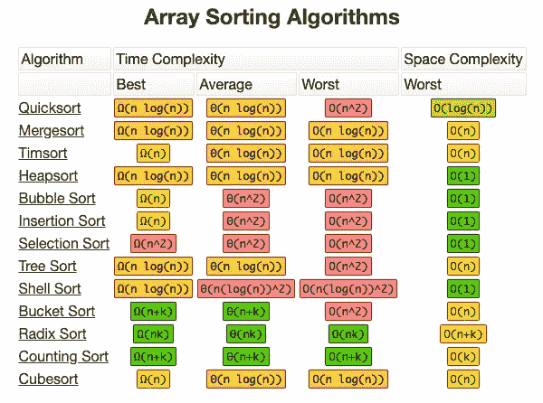
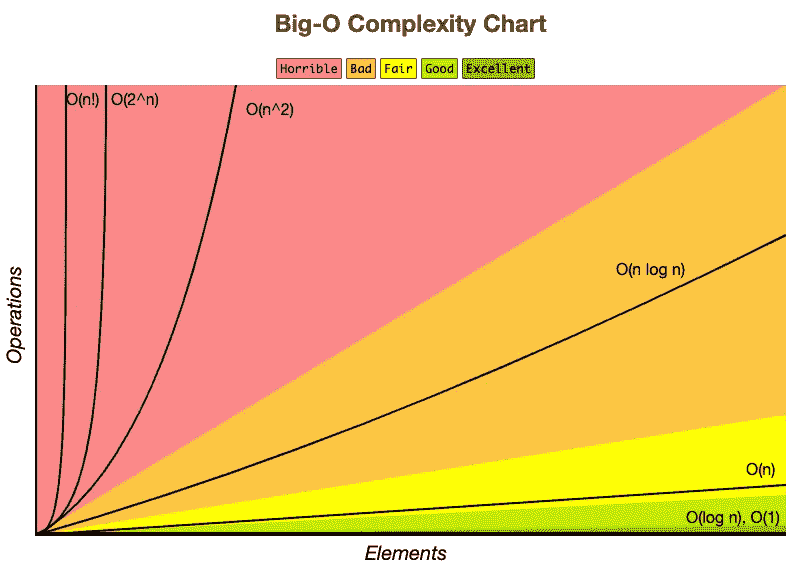

# 快速分类在 5 分钟内解释完毕

> 原文：<https://betterprogramming.pub/quicksort-explained-in-5-minutes-d32cf430a592>

## 最快的排序算法讲解，快

按[运动上瘾者](https://giphy.com/gifs/art-abstract-pattern-3oGRFHO6YQrxnnU5Ta)分类插图

在排序领域，快速排序是王道！

快速排序是一种递归的分治算法，在同类算法中速度最快。它的平均时间复杂度为 O (n log n)(用 big-o 表示)，与同类产品相比，这是相当快的。Big-O 符号是一种衡量算法随着处理的数据量增长而扩展或执行的方式。

下面是针对顶级排序算法的图表堆叠快速排序。如你所见，它排在第一位:

bigocheatsheet.com

O(n log n)在 Big-O 复杂度图上

这使得快速排序成为白板面试的最爱，也是任何有抱负的软件工程师的必备。在本文中，我们将使用 JavaScript 作为基础语言来解释它是如何工作的。

# **它是如何工作的？**

Quicksort 使用一个 pivot，这个值通常被指定为数组的中间或最后一个元素。该算法将数组的每个元素与轴心进行比较，重新排列每个元素，使其一侧(左侧)的值较小，另一侧(右侧)的值较大。然后，它对两边进行分区，并在每一边递归地运行相同的过程，直到数组被排序。

它有助于了解算法，然后理解其中发生的事情:

让我们以下面的数组为例:`originalArray = [4, 5, 1, 3, 2]`

*   我们可以将 pivot 设置为最后一个元素，`2: pivot = 2`。
*   接下来，我们将数组的第一个元素与轴心进行比较:`4 ≤ 2?`
*   请记住，我们希望将小于轴心的所有元素移动到它的左侧，并在右侧执行相反的操作。由于`4`大于`2`，我们将其推入一个名为`rightSide` : `rightSide = [4]`的新数组
*   我们用 5 做同样的事情:`5 ≤ 2?`不，所以:`rightSide=[4, 5]`
*   是的，因此我们把它移到一个名为`leftSide` : `leftSide = [1]`的数组中
*   `3 ≤ 2?`否= > `rightSide=[4, 5, 3]`
*   我们已经到达数组的末尾，所以我们停止循环。

到目前为止，我们已经:

`leftSide = [1], pivot = 2, and rightSide = [4, 5, 3]`

转向右侧，我们有:

*   我们的新支点现在是 3: `pivot = 3`
*   4 ≤ 3?不，=> `5 ≤ 3？否，=> `rightSide = [4, 5]`
*   `leftSide = []`(因为没有元素少于 3)

`leftSide = []`、`pivot = 3`、`rightSide = [4, 5]`

我们继续递归到右侧:

*   `pivot = 5`
*   `4 ≤ 5?`是的，=>
*   `rightSide = []`

`leftSide = [4]`、`pivot = 5`、`rightSide = []`

我们现在递归地尝试对左侧进行排序:

*   由于`leftSide`数组只有一个元素，没有什么可排序的，所以我们返回它。

# **从递归返回**

假定已经到达了`rightSide`数组的基本情况，函数将通过每次递归返回。在每次递归中，将按顺序使用`leftSide`、pivot 和`rightSide`的返回值形成一个新数组(`newArray`)。

因此，我们得到以下结果:

*   第三层递归:记住递归发生在`rightSide`数组中。因此，我们有:`return newArray([1], 2, [4, 5])`
*   递归的第二个深度:`return newArray([1], 2, [3, 4, 5])`
*   第一个递归深度:`return newArray([1, 2, 3 , 4, 5])`

我们可以用伪代码将算法总结如下:

*   将透视设置为数组中的最后一个元素。
*   将最左边的元素与 pivot 进行比较——如果它大于 pivot，则将它推入一个名为`right`的新数组。对左侧做相反的动作。
*   递归迭代左右数组，直到到达最后一个元素，在这种情况下，它的长度将是`1`。然后返回该值。
*   该函数将在两端展开递归，对过程中的每一端进行排序，以便最后一个返回值将成为完全排序的数组。

这里是我能找到的关于快速排序算法的两个最简短但最好的解释。我强烈推荐观看这些视频:

我们在本文中讨论的算法可以说是 quicksort 中最简单、最直观的算法之一。然而，有许多快速排序的方法可以在 big-O 复杂度图上产生不同的性能。如果您想探索这些资源，可以查看下面的资源:

 [## 快速分类-极客搜索

### 像合并排序一样，快速排序是一种分治算法。它选择一个元素作为支点，并划分给定的…

www.geeksforgeeks.org](https://www.geeksforgeeks.org/quick-sort/)  [## 数据结构和算法-快速排序

### 快速排序是一种高效的排序算法，它基于将数据数组划分为更小的数组。一个…

www.tutorialspoint.com](https://www.tutorialspoint.com/data_structures_algorithms/quick_sort_algorithm.htm)  [## 快速排序算法- InterviewBit

### 快速排序是最有效的排序算法之一，它基于将一个数组分割成更小的数组…

www.interviewbit.com](https://www.interviewbit.com/tutorial/quicksort-algorithm/)