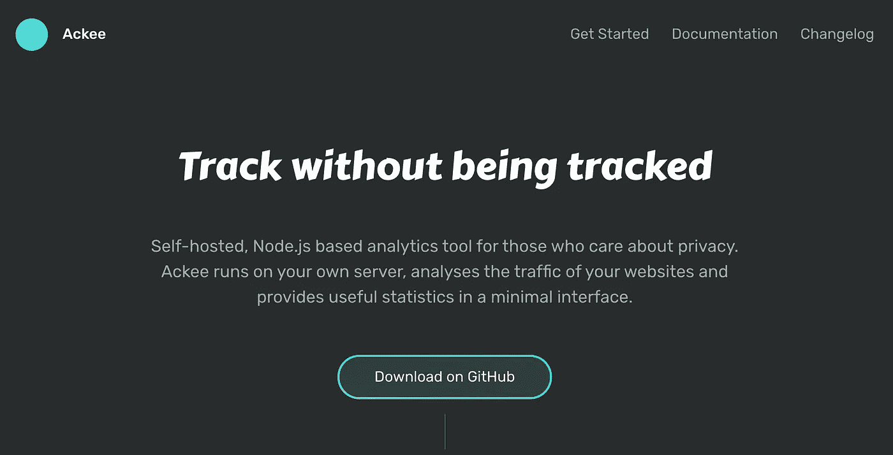
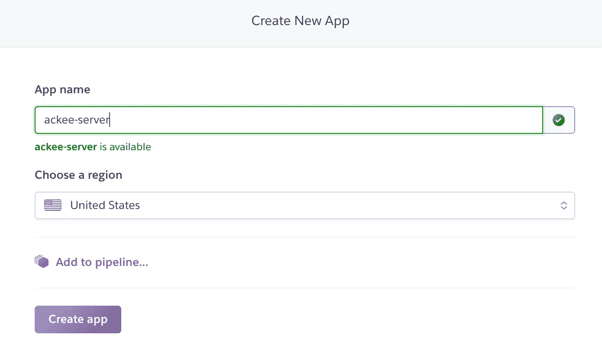
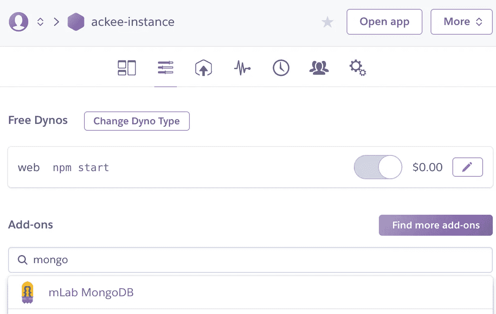
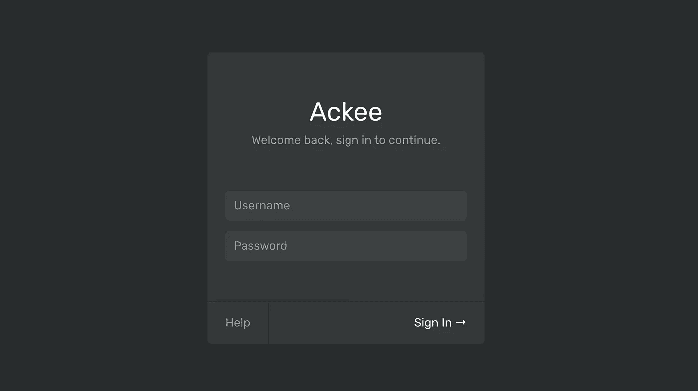
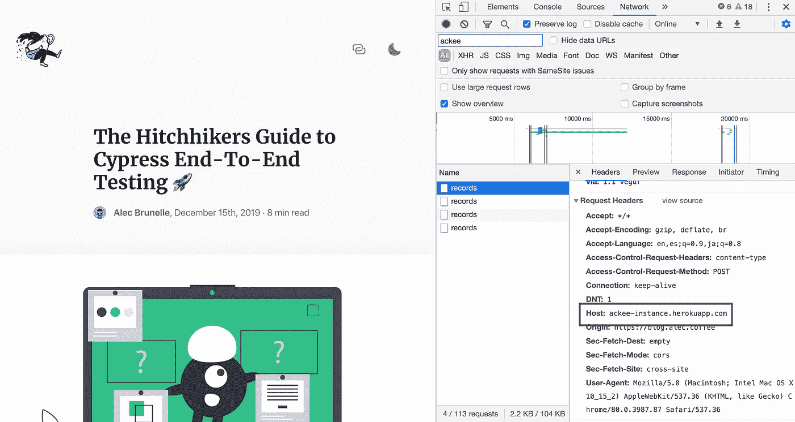
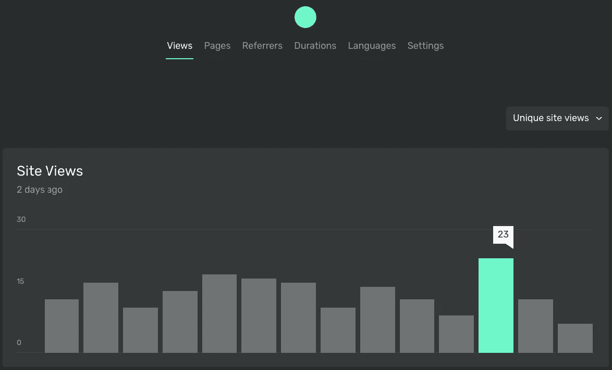
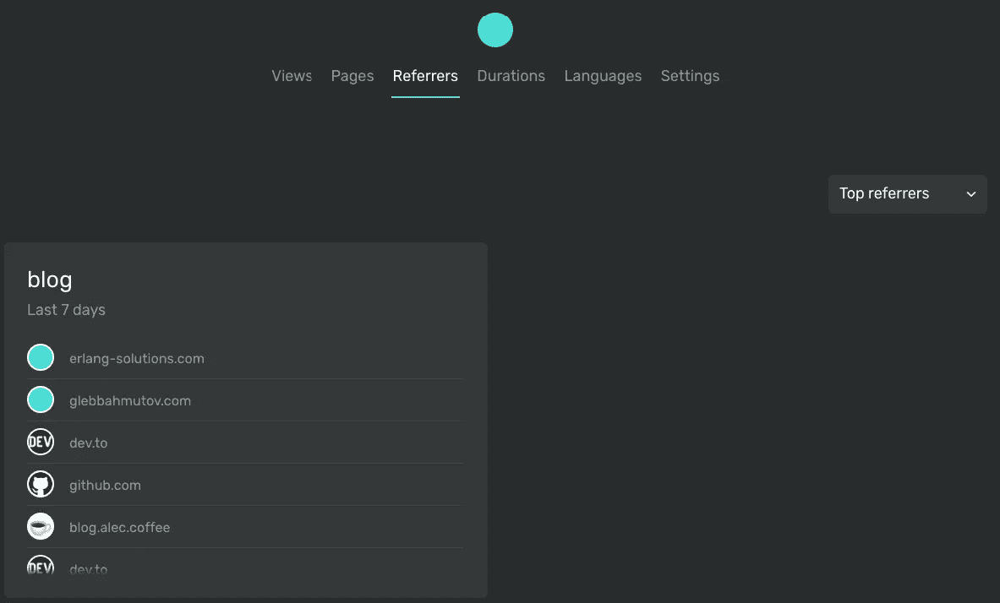
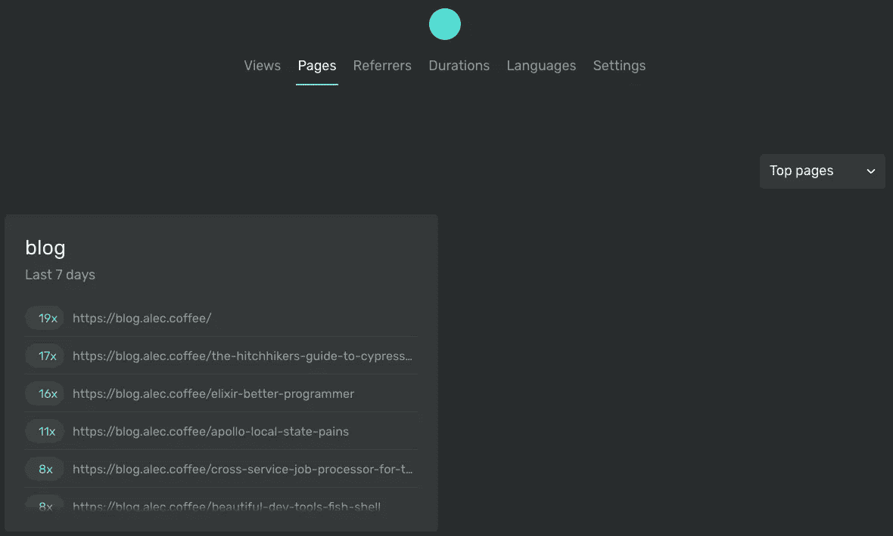

# 退出谷歌分析和使用 Ackee 自主盖茨比统计

> 原文：<https://betterprogramming.pub/quit-google-analytics-self-hosted-gatsby-statistics-with-ackee-846a2b4be634>

哈尔·盖特伍德在 [Unsplash](https://unsplash.com/s/photos/web?utm_source=unsplash&utm_medium=referral&utm_content=creditCopyText) 上拍摄的照片

拥有自己的网站或博客有很多不同的目标。对我来说，这意味着只要有一个地方，我拥有我的文字内容，并可以根据我的喜好定制。说到分析，我的需求并不多——我的大多数观众都是通过像 [dev.to](http://dev.to) 或 Medium 这样的平台阅读我的内容的。我只需要知道有多少人访问我的网站，哪些帖子做得很好，用户来自哪里(推荐链接)。

鉴于我最近痴迷于消除生活中的所有跟踪和广告，我选择停止支持谷歌，并从谷歌分析转向自我托管。这不是一个容易使用的产品，而且大部分功能对我来说都没有用，因为我不在博客上卖任何东西。这样，我就拥有了数据，而不是把它提供给一个可能会恶意使用它的公司。

我开始为我的博客寻找一个新的跟踪工具。我选择新产品的标准是:

*   简单点。
*   有我将使用的功能。
*   注重隐私。
*   用我知道的编程语言构建，所以修改很容易。
*   能够在 Heroku 这样的平台即服务上轻松托管
*   有能力很容易被添加到盖茨比的博客
*   可以选择不收集独特的用户数据，如操作系统、浏览器信息、设备和屏幕尺寸

## 见见 Ackee

很美，不是吗

我偶然发现了一个自托管的分析工具 Ackee，发现它几乎完全符合我的要求。它是使用 Node.js 构建的，我对此有经验，它专注于匿名化它收集的数据。点击阅读关于 Ackee 如何匿名化数据[的更多信息。](https://github.com/electerious/Ackee/blob/master/docs/Anonymization.md)

开始用 Ackee 收集统计数据需要采取的步骤是在服务器上运行它，在我的例子中是 Heroku，将 Javascript tracker 添加到您的 Gatsby 站点，并测试数据是否正确流动。

*这是我如何着手将它部署到 Heroku 的详细指南。之后，* [*我贡献了一个 Deploy-to-Heroku*](https://github.com/electerious/Ackee/pull/77) *按钮，一键部署。* [*在这里找到按钮*](https://github.com/electerious/Ackee/blob/master/docs/Get%20started.md#with-heroku) *。*

## 在 Heroku 上运行

首先，你必须开始运行服务器，它将从你的网站接收跟踪数据。

创建新的 Heroku 应用程序实例:

使用`[heroku-cli](https://devcenter.heroku.com/articles/heroku-cli)`上传代码:

配置一个 MongoDB 附加组件—这是存储数据的地方:

[配置环境变量](https://devcenter.heroku.com/articles/config-vars#using-the-heroku-cli):

瞧，你完成了！那很容易，不是吗？

打开 Heroku 自动为你配置的网页——应该是[https://ackee-server.herokuapp.com/](https://ackee-instance.herokuapp.com/)——你应该会看到这个:

登录页面！

## 添加跟踪器

现在我们需要将数据从网站发送到我们现在运行在 Heroku 上的服务器。如果你用的是 Gatsby，这个插件非常简单。

*   安装跟踪器:

`npm install gatsby-plugin-ackee-tracker`

*   在 Ackee 上创建一个域并获取域 id。在 Ackee 实例的设置标签中找到这个选项。
*   将其添加到您的 Gatsby 配置中。

*   在本地运行网站:

`gatsby develop`

## 测试，以确保它的工作

在`http://localhost:8000`打开你的网站，转到一个新的网址。

观察您的站点发送的网络请求。您会注意到它现在向您的 Heroku 实例发送请求。

勇敢的开发工具

我们现在有服务器运行 Ackee 和我们的盖茨比发送分析！

## 你得到了什么

让我们探索一下 Ackee。

网站总浏览量主页

推荐人列表

每页查看次数

# 可供选择的事物

以下是我在考虑博客分析时考虑的一些替代方法。

## **没有跟踪**

再加上越来越多的人一起屏蔽追踪器(Firefox、Brave 和 Chrome 广告屏蔽扩展)，基于 JavaScript 的追踪变得越来越没有价值。大多数分析很容易成为对你的博客感到虚荣的一种方式，你可能会养成总是检查它们的坏习惯(与产生实际内容相比，这是浪费时间)。如今，决定完全不跟踪任何分析并不是一个糟糕的决定。

## **服务器端分析**

在你的网站上收集分析的最私人和快速的方法可能是在服务器级别收集分析。

这意味着不使用 JavaScript 跟踪器(可能会被浏览器阻止)，而是在服务器发送 HTML 时收集统计数据。这里需要与您的静态主机提供商或 DNS 提供商集成。这种方法的主要缺点是数据是由第三方服务收集的，而且通常不是免费的。 [Cloudflare](https://www.cloudflare.com/en-ca/analytics/) 与 [Netlify](https://www.netlify.com/products/analytics/) 一起提供这些类型的分析。一个巨大的好处是易于设置——通常，提供商只需打开他们那边的开关，不需要您进行任何设置。