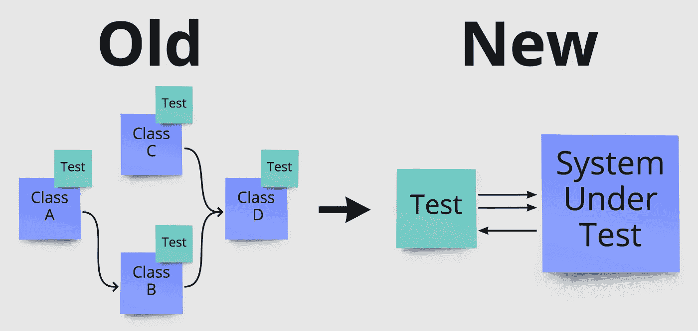
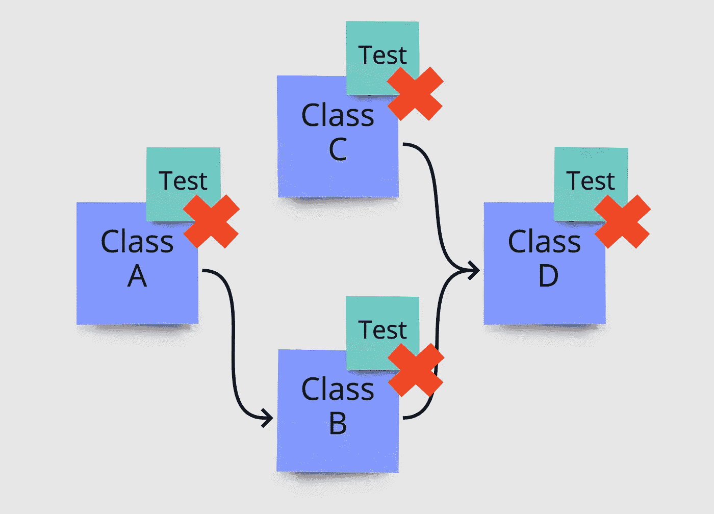
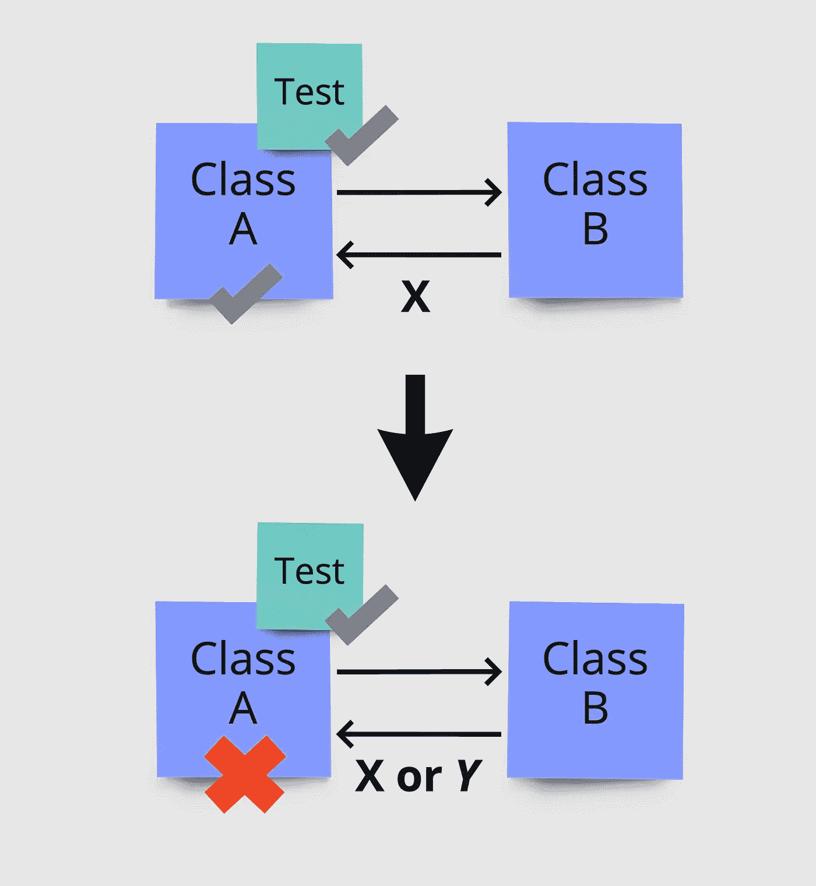
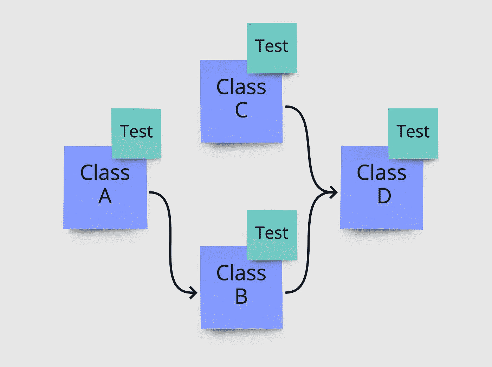
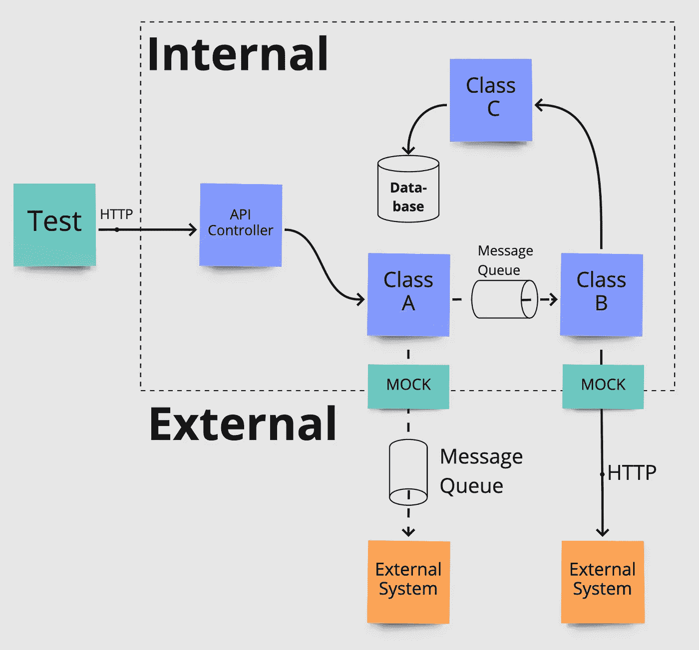
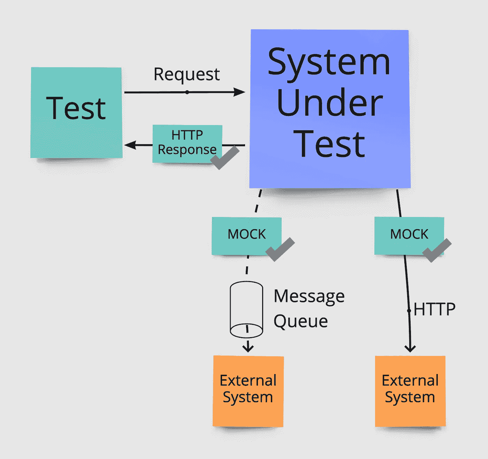

# 为什么我们退出单元测试课程来关注行为方法

> 原文：<https://betterprogramming.pub/quit-unit-testing-classes-and-use-a-behavior-oriented-approach-306a667f9a31>

## 为什么您应该考虑避免类级别的测试，而支持面向行为的方法



测试整个系统的行为，而不是孤立地测试每个类的行为。图片来源:作者。

我最近[写了一篇文章，解释了](/avoiding-premature-software-abstractions-8ba2e990930a)我们如何通过避免过早的软件抽象删除了 80%的代码，以及这如何极大地提高了开发效率并减少了错误。

我在那篇文章中忽略的一点是，我们决定完全停止为单个类编写单元测试。我并不是说你必须为你的系统只选择一种类型的测试，而是简单地说，这种孤立地关注单个类的测试有很多问题，这使得我们完全避免了这些问题。在这篇文章中，我将基于类级测试的以下主要问题，阐述我们做出这一选择的原因，以及我们的替代方法。

1.  类测试使改变变得痛苦
2.  类测试不验证实际行为
3.  类测试很难理解

让我们更详细地研究一下其中的每一个。

# 1.类测试使改变变得痛苦

类级别的单元测试锁定了我们代码库中的每一个类，以特定的方式工作，并以特定的方式使用其他类。尽管类级单元测试不应该测试类的实现，但从系统整体的角度来看，类本身，包括它的方法和接口，是一个实现细节。

当对我们的代码进行修改时，这成为一个问题，因为每一个小的修改都会破坏测试。由于对代码库的典型更改会影响多个类，我们将不得不经常更新我们接触的每个类的测试。不仅如此，我们可能还需要更新模拟任何已更改类的其他测试。这变得很乏味，并且增加了一个额外的障碍来改变哪怕是最微小的细节。



典型的变更会导致多个测试中断。图片来源:作者。

即使我们只是修改内部实现细节，我们的测试也会中断，需要更新。假设我们想将一个类重构为两个，这样我们就可以在其他地方重用部分逻辑。这将立即中断测试，要求我们删除并更新原始类的测试用例，并为添加的类创建一组新的测试用例。我们甚至没有改变系统的任何外部行为。

相反，我们更希望测试只在外部行为改变时中断。这将使我们可以自由地对我们的代码库进行任何内部重构，而无需对我们的测试进行任何更改。此外，我们希望对同一个流程中的多个类进行更改——比如微服务的一个端点——只需要更新一组测试，而不是对每个涉及的类都进行一次更新。

# 2.类测试不验证实际行为

类级测试关注的是孤立的单个类。因此，我们测试的是实现细节，而不是代码的整体行为。一个主要的缺点是，无论何时测试失败，它都不会告诉我们代码的外部行为是否已经改变，因为测试可能只是因为实现细节的改变而失败。

当所有的测试在一个变更之后仍然是绿色的时候，这甚至是一个问题——通常向开发人员表明一切都很好，可以安全部署。然而，这通常不是这种测试的情况，因为我们依赖于模仿其他类。每当一个类被模仿的时候，一个关于这个类如何工作的假设就会产生，当这个类本身发生变化并且我们忘记更新模仿时，这个假设很快就会过时。

例如，假设当类`B`返回结果`X`时，类`A`进行处理，通过模仿`B`以这种方式**进行测试。**如果我们稍后将类`B` 改为在某些场景中开始返回结果`Y`，那么即使`A`不处理这个新的情况，它的所有测试仍然是绿色的，因为`B` 的每个模拟仍然设置为总是返回`X`。除非开发人员在更改`B`时记住类`A`，否则我们将会在全绿色测试中出现代码中断。



类测试依赖于很快过时的假设。图片来源:作者。

这意味着，即使在一次更改之后，类测试仍然是绿色的，我们也不能确定代码作为一个整体实际上行为正确。相反，我们更希望测试通过或失败仅仅与我们代码库的外部行为联系在一起。如果测试失败，行为已经改变，如果测试通过，那么代码的行为是一样的。

# 3.类测试很难理解

我们刚刚提到，孤立地测试类并不能说明我们代码的外部行为。因此，要真正知道一个流程在做出更改后是否工作，我们需要理解流程中涉及的每一个类，以及它们相应的测试是否覆盖了所有需要的案例和它们模拟的类的所有可能的结果。

然后，我们必须在我们的头脑中把这些拼凑在一起，以断定各个类是否会共同导致流的正确外部行为。这既困难又容易出错，尤其是当变更是由不熟悉代码库每个角落的人做出的时候。

更复杂的是，由于类测试关注于实现细节，导致许多测试经常因为许多不同的原因而中断。这使得开发人员需要不断地更新测试，每次都需要对流程中涉及的类、它们的测试以及它们在变化后如何相互影响有一个全面的理解。

让我们看一下下面的例子，它显示了四个类互相使用，如箭头所示。

如果类`D`改变了，我们不仅要理解并更新`D`的测试，我们还需要理解它对依赖于`D`的所有类及其相应测试的影响。

在这个例子中，这将是类`B`和`C`。此外，由于`B` 可能由于`D`的改变而表现不同，我们也需要理解`A`和那个类的测试。



从类测试中推断行为是复杂的。图片来源:作者。

尽管理解一个单独的类测试可能并不困难，但是当我们需要从这些测试中推断任何类型的外部行为时，它就变得非常复杂了。

相反，我们更希望一个单独的测试用例就足以推断出我们代码库的实际外部行为的一部分。

# 单元测试类的替代方案

我们选择完全避免类级单元测试，正因为如此，我们自然需要自动化测试的替代方法。我们主要将这些概念应用于测试单个微服务，但它们也可以应用于许多其他类型的系统，如本地和 web 应用程序，甚至是库。

## 概念

我们最终的结果依赖于这样一个基本概念:将我们的运行系统视为一个只关注外部行为的黑匣子。这意味着，作为测试的一部分，我们启动系统，并在它运行时在其上执行每个测试。我们的目标是尽可能地把它当作一个黑盒，因为这自动地使测试独立于实现细节，并集中于行为。本质上，我们不是将单元测试类，而是将我们的整个系统，例如微服务，视为被测试的单元或系统。

这已经成为我们最细化的测试类型，并且仍然只关注单个系统或代码库的行为。可能需要其他类型的测试来确保跨多个系统的端到端的正确行为。然而，我不会在这篇文章中讨论这些。

## 模仿外部依赖

当把我们的系统当作一个黑盒时，我们不再想要模仿、存根、复制或伪造代码库的任何内部部分，因为测试不应该关心这些。

我们确实想模仿外部依赖，因为这允许我们孤立地测试我们的系统。对于什么是外部的，什么不是外部的，这个定义会随着项目的不同而不同。

例如，在测试我们的微服务时，数据库被视为内部的，因此不会被嘲笑。时间被当作一个外部组件而被嘲讽，系统与其他外部系统之间的 HTTP 通信也是如此。在我们的微服务使用消息队列的情况下，它可以是两者。

微服务本身发布和使用的消息不会被嘲笑，但是，当向其他系统发布或从其他系统接收任何消息时，这些消息将被嘲笑并被视为外部消息。下图显示了这一点。



内部与外部。图片来源:作者。

## 整理测试数据

当将正在运行的系统视为一个黑盒时，我们希望安排测试数据并提供输入，就像在真实环境中运行时会发生的那样。

对于微服务，这可以通过调用它所公开的端点，或者在服务所使用的外部队列上发布消息来实现。

对于前端，这可以通过实际按下按钮和导航用户界面来实现，类似于用户所做的。

使用这种方法，我们可以确保所有的测试都基于真实的应用程序状态，就像它们在生产中出现的一样。此外，由于一切都是通过允许的系统输入来调用的，我们将永远不会花时间测试现实中不可能发生的情况，这是一个额外的好处。


通过调用外部公开的端点来安排测试数据。图片来源:作者。

为了使测试易于编写和维护，创建可重用的方法来安排常用的测试数据通常是非常值得的。一个例子是在数据库中安排用户。不要在每个单独的测试中发出创建用户的 HTTP 请求，而是将它转移到每个测试用例都可以调用的可重用方法中。

## 断言结果

安排好测试数据后，我们就可以在我们的系统上执行一个动作并断言结果了。由于我们仍然将我们的系统视为一个黑盒，我们的目标是只断言我们的行为所导致的外部结果。

如果我们的动作是 HTTP 请求，那么外部结果的例子可以是 HTTP 响应。此外，外部结果还可能是系统发出的传出 HTTP 调用和外部消息队列上发布的消息。



断言行动的外部结果。复选标记代表断言点。图片来源:作者。

当设置 mock 来断言我们系统的正确外部行为时，考虑在[严格模式](https://stackoverflow.com/questions/3134108/what-are-strict-and-non-strict-mocks)中使用 mock。它们应该是严格的，因为它们会导致测试失败，无论何时调用任何没有专门设置来处理的输入。这将确保我们的系统不仅做正确的事情，而且没有意外的行为发生。我们不希望在不应该的时候进行 HTTP 调用和向其他系统发送消息。

## 执行时间

当用行为系统测试替换经典的类级单元测试时，我们需要确保我们的测试仍然快速执行。这是类级单元测试的好处之一，因为它们不依赖于除类本身之外的任何东西，这使得*通常*它们非常快。当测试突然涉及 HTTP 调用和数据库查询时，这变得更加困难。

根据您使用的技术，解决这个问题的方案会有所不同。在我们的具体例子中，使用 ASP.NET 测试服务器的[足以使 HTTP 调用更快，并且在本地运行测试时用我们的数据库替换内存中的变体有助于提高查询速度。](https://docs.microsoft.com/en-us/aspnet/core/test/integration-tests?view=aspnetcore-6.0)

但是，在合并拉请求之前，所有的测试都是用真实的数据库运行的，因为内存中的变量的行为永远不会完全相同。在执行时间和使用尽可能真实的内部依赖之间找到一个好的平衡是很重要的。

# 结论

就是这样，我们现在已经完全摆脱了类级别的单元测试。我们的新方法完全集中在行为上，因此，当测试通过时，我们知道同样的情况也适用于系统的实际用户。

我们不再需要在每次实现细节改变时更新测试，这使得我们可以自由地无缝地进行任何内部重构。

最后，不再需要在开发人员的头脑中拼凑多个不同的类和测试来推断行为——阅读一个单独的测试用例就足以理解和验证系统的行为。

我很想在评论区听到你关于行为测试的经历！你喜欢什么类型的测试，为什么？

```
**Want to Connect With the Author?**[Join my email list for more helpful insights on simplified software!](https://jonastulstrup.medium.com/subscribe)
```